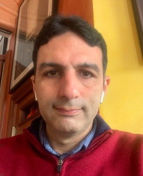

:::{.hero}
:::{.hero-copy}

Deep Learning · Academic Year 2026–2027

# Learn the ideas. Build the <em>systems.</em>

A visual, mathematical, and practical journey through modern deep learning.

:::{.button-row}
[Explore the schedule](schedule.qmd){.course-button .primary}
[Read the notes](notes.qmd){.course-button}
[Join ED Discussion](https://edstem.org/us/courses/102787/){.course-button .discussion}
:::
:::

:::{.hero-art}
{.course-thumbnail fig-alt="Seven colored learning paths pass through a neural network and converge into one output."}
:::
:::

## The learning journey

Seven thematic parts create a visible progression from learning fundamentals to generative models.

:::{.journey-strip}
<b>01</b> Foundations
<b>02</b> From scratch
<b>03</b> Optimization
<b>04</b> PyTorch
<b>05</b> Vision
<b>06</b> Sequences
<b>07</b> Generative
:::

[View the complete 14-week roadmap →](schedule.qmd){.journey-link}

## Course structure

Each week connects explanation, experimentation, and sustained project work.

:::{.card-grid}
:::{.course-card}
01 · UNDERSTAND

### Concepts

Visual explanations supported by precise mathematics.
:::

:::{.course-card}
02 · IMPLEMENT

### Practice

Small experiments that expose how the machinery works.
:::

:::{.course-card}
03 · CREATE

### Projects

Open-ended work connecting foundations to modern systems.
:::
:::

## Stay connected

:::{.home-discussion}
:::{.home-discussion-mark aria-hidden="true"}
ED
:::
:::{.home-discussion-copy}
### Questions become shared learning

Use ED Discussion for course announcements, technical questions, useful resources, and explanations that can help the whole class. Meaningful, regular contributions form **10% of the course grade**.

[Open ED Discussion →](https://edstem.org/us/courses/102787/){.home-discussion-link}
:::
:::

## Course staff

One instructor, currently wearing all the course hats.

:::{.staff-card}
:::{.staff-photo}
{fig-alt="Portrait photograph of Dr. Anass Belcaid, the course instructor."}
:::
:::{.staff-copy}
INSTRUCTOR · COURSE RESPONSIBLE

### Dr. Anass Belcaid

Lectures, notes, laboratories, projects, assessment, and course communication. For the time being, there is no separate teaching-assistant or supervision team—so yes, one person is wearing all the hats.

[Personal webpage](https://anassbelcaid.github.io/) · [Ask on ED](https://edstem.org/us/courses/102787/)
:::
:::
