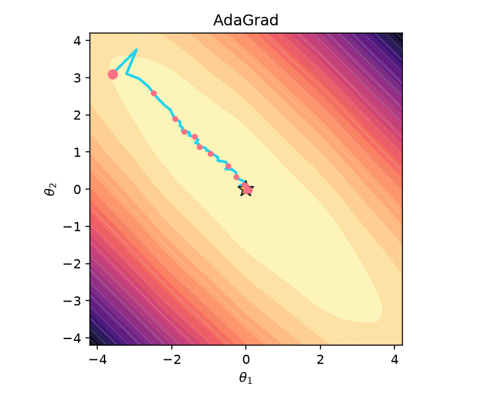

:::{.project-brief}
<strong>Duration:</strong> One session × 1h30
<strong>Mode:</strong> Individual or pairs
<strong>Format:</strong> Guided Jupyter notebook
<strong>Deliverable:</strong> Passing checks, animations, and exit ticket
:::

## The central experiment

You will implement each classical optimizer and immediately watch its parameters move across the same two-dimensional loss landscape. The notebook supplies the objective, gradients, minibatch stream, contour plot, animation system, experiment runner, and public checks. **Your code changes only the optimizer.**

<a class="btn btn-primary" href="starter/optimizers_from_scratch.html">View notebook</a>
<a class="btn btn-secondary" href="/labs/04-optimization/starter/optimizers_from_scratch.ipynb?download=1" download="optimizers_from_scratch.ipynb">Download notebook</a>

## What you implement

1. Gradient descent, then compare full-batch, stochastic, and minibatch gradient estimates.
2. Momentum and its persistent direction state.
3. Nesterov's look-ahead gradient query.
4. AdaGrad's cumulative coordinate-wise scaling.
5. RMSProp's decaying scale memory.
6. Adam's first and second moments with bias correction.

Each implementation is followed by a small numerical check and its own convergence animation. The final section runs every method as a race from one initial point using the same minibatches and update budget.

## Expected trajectory gallery

These static previews show the kind of evidence produced after each implementation. In the notebook, the same paths are animated step by step.

::: {layout-ncol="3"}
{fig-alt="Gradient descent trajectory oscillating through a narrow contoured ravine."}

{fig-alt="Momentum trajectory descending a narrow contoured ravine."}

{fig-alt="Nesterov trajectory descending a narrow contoured ravine."}

{fig-alt="AdaGrad trajectory descending a narrow contoured ravine."}

{fig-alt="RMSProp trajectory descending a narrow contoured ravine."}

{fig-alt="Adam trajectory descending a narrow contoured ravine."}
:::

:::{.callout-note}
The race is a controlled experiment, not a universal optimizer ranking. Methods scale gradients differently, so their stated learning rates are intentionally tuned separately. Students must interpret both the path and the loss curve.
:::

## The important distinction

Full batch, minibatch, and SGD determine **which data estimate the gradient**. Momentum, Nesterov, AdaGrad, RMSProp, and Adam determine **how the current gradient and stored optimizer state become an update**. The notebook keeps these two decisions separate in code.

## Submission

Restart the kernel and run every cell. Submit the completed notebook with all checks passing, all individual animations visible, the final race, and the five short exit-ticket answers.
