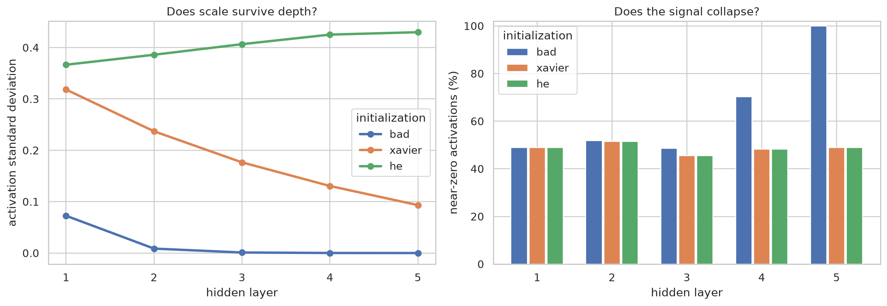
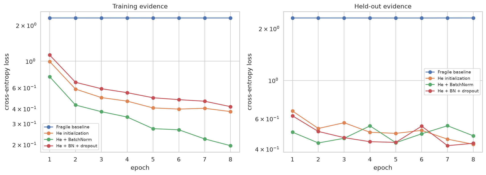
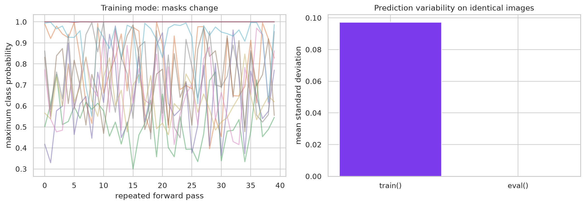
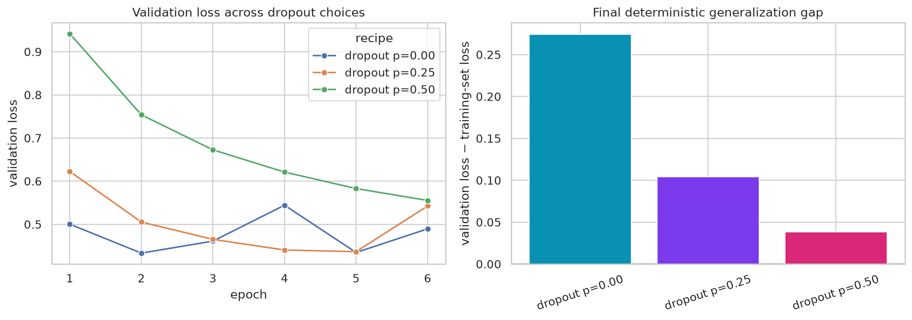
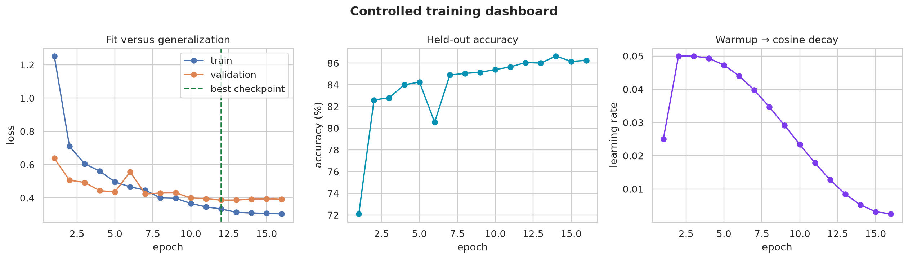

:::{.project-brief}
<strong>Duration:</strong> One session × 1h30
<strong>Mode:</strong> Individual or pairs
<strong>Format:</strong> Guided Jupyter notebook
<strong>Deliverable:</strong> Executed plots and evidence-based exit ticket
:::

## The training clinic

A six-layer ReLU image classifier is training badly. You will diagnose its initial signals, repair the training recipe one mechanism at a time, and select a checkpoint using validation evidence.

**PyTorch is provided infrastructure in this lab.** You will run the supplied training machinery and change only short configuration values such as an initialization name, a Boolean switch, or a dropout probability. The next chapter will explain the PyTorch syntax systematically.

<a class="btn btn-primary" href="starter/reliable_training_clinic.html">View notebook</a>
<a class="btn btn-secondary" href="/labs/05-reliable-training/starter/reliable_training_clinic.ipynb?download=1" download="reliable_training_clinic.ipynb">Download notebook</a>

## What you decide

1. Predict which initialization will preserve activation scale through five ReLU blocks.
2. Compare a fragile baseline with He initialization, BatchNorm, and dropout ablations.
3. Explain why the same dropout model is stochastic in training and deterministic in evaluation.
4. Select a dropout probability from held-out evidence rather than training loss alone.
5. Choose which checkpoint from the complete controlled recipe should be deployed.

## Expected evidence gallery

These are representative outputs from the supplied configuration. Your measurements may change if you change a decision—but every conclusion must point to a plot.

::: {layout-ncol="2"}
{fig-alt="Two plots comparing activation scale and signal collapse across five layers for three initialization rules."}

{fig-alt="Two loss-curve panels comparing four neural-network training recipes."}

{fig-alt="Repeated prediction traces and a bar chart comparing variability in training and evaluation modes."}

{fig-alt="Dropout probability sweep with validation-loss curves and final generalization gaps."}
:::

{fig-alt="Three-panel controlled training dashboard with loss, validation accuracy, and learning rate."}

:::{.callout-important}
## Success is a justified decision

The goal is not the largest accuracy number in the room. A successful submission changes one factor at a time, distinguishes optimization from generalization, respects training/evaluation modes, and cites visible evidence for the chosen recipe.
:::

## Before class

Use a Python environment containing `torch`, `torchvision`, `matplotlib`, `seaborn`, `pandas`, and Jupyter. The first run downloads Fashion-MNIST unless it is already cached.

Restart the kernel and run every cell before submission. Keep the plots visible and complete the six-question exit ticket.
