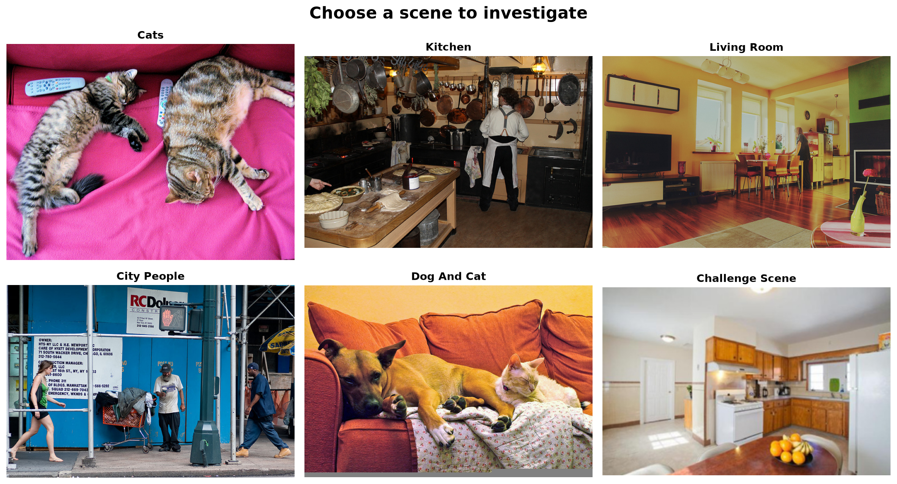
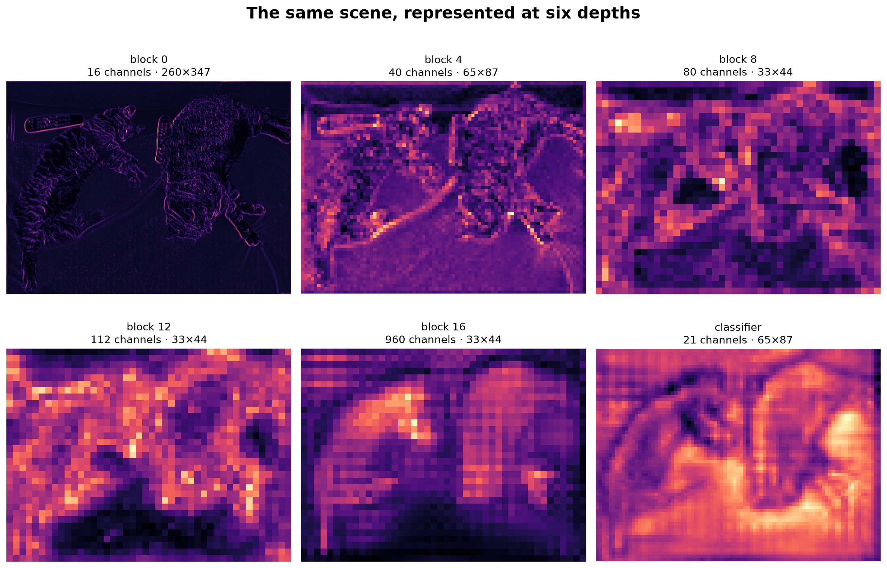
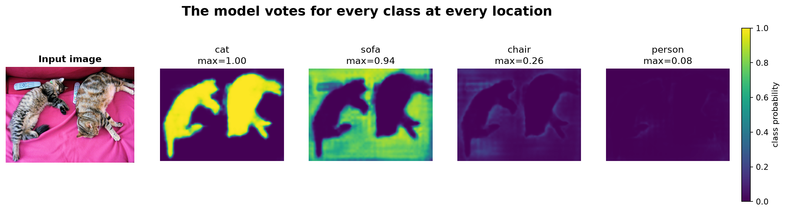
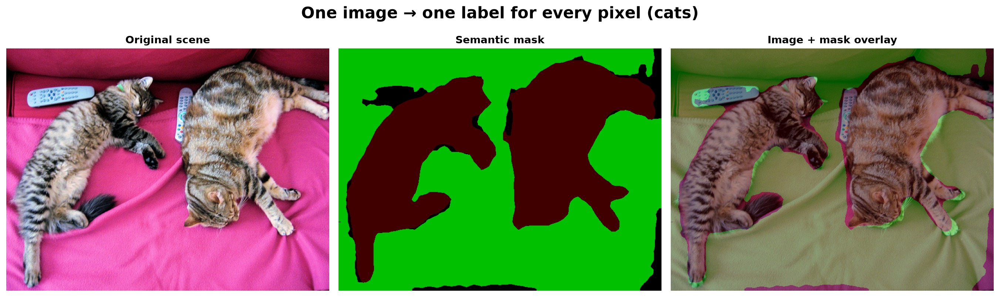
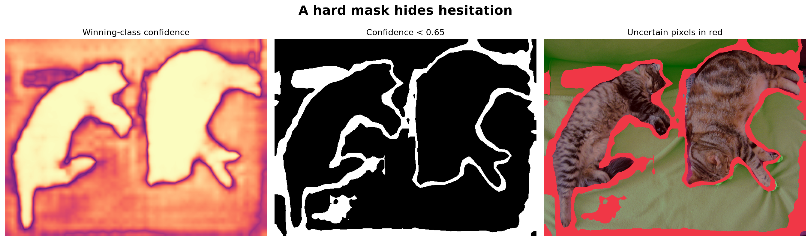
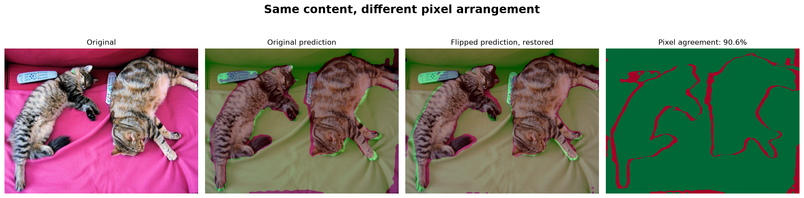
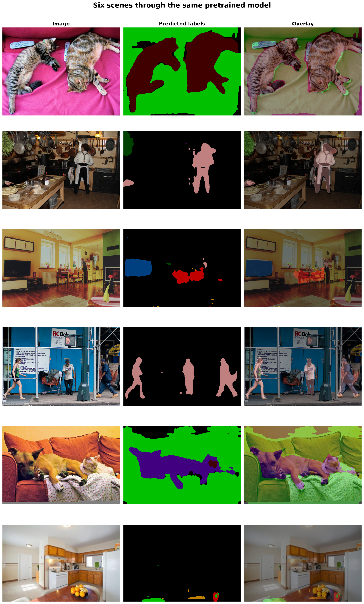

:::{.project-brief}
<strong>Duration:</strong> One session × 1h30
<strong>Mode:</strong> Individual or pairs
<strong>Format:</strong> Guided Jupyter notebook
<strong>Compute:</strong> CPU or GPU · inference only
<strong>Deliverable:</strong> Executed visual notebook and six-question exit ticket
:::

## One image, one decision at every pixel

This laboratory is an exploration, not a training exercise. You will load a lightweight pretrained LRASPP–MobileNetV3, choose real scenes, trace the spatial tensors inside its backbone, and turn its class-score maps into semantic masks and overlays.

All expensive and repetitive machinery is supplied. There is no dataset loader, optimizer, loss, backward pass, or training loop. Your job is to change images and visualization choices, inspect what happens, and explain the evidence.

<a class="btn btn-primary" href="starter/seeing_every_pixel.html">View notebook</a>
<a class="btn btn-secondary" href="/labs/09-semantic-segmentation/starter/seeing_every_pixel.ipynb?download=1" download="seeing_every_pixel.ipynb">Download notebook</a>

## What you will investigate

1. Interpret the image and output tensor contracts.
2. Locate the backbone, spatial feature stages, and pixel classifier.
3. Observe how resolution and channel depth change through the network.
4. Convert 21 class-score maps into one colored semantic mask.
5. Compare images, masks, overlays, and confidence maps.
6. Test whether the prediction remains stable after a horizontal flip.

## The visual destination

The notebook makes the desired output visible at every stage. These are representative results from the supplied model; your chosen scene may expose different successes and failures.

::: {layout-ncol="2"}
{fig-alt="A two-row gallery of six real photographs used to test the semantic segmentation model."}

{fig-alt="Six heat maps showing progressively deeper spatial feature representations inside the segmentation network."}

{fig-alt="An input photograph followed by four class probability heat maps predicted at every image location."}

{fig-alt="Three panels comparing a real photograph, its colored semantic segmentation, and the segmentation overlaid on the photograph."}

{fig-alt="Three panels showing prediction confidence, low-confidence pixels, and uncertain pixels highlighted over the segmentation."}

{fig-alt="Four panels comparing the original prediction with a restored prediction after horizontal flipping and a pixel agreement map."}
:::

{fig-alt="A large gallery comparing photographs, predicted semantic class colors, and transparent overlays for six different scenes."}

:::{.callout-important}
## Success is a visual explanation

A successful notebook does not report a mysterious accuracy number. It identifies what the model recognizes, points to a visible failure, connects that behavior to an internal tensor or confidence map, and explains what instance segmentation would add.
:::

## Before class

Use a Python environment containing `torch`, `torchvision`, `Pillow`, `matplotlib`, and Jupyter. The first run needs internet access to cache the TorchVision weights and sample images. After that, the laboratory performs inference locally and never trains the network.

The sample photographs come from the official COCO image server. The notebook retains the source information alongside the exercise.
