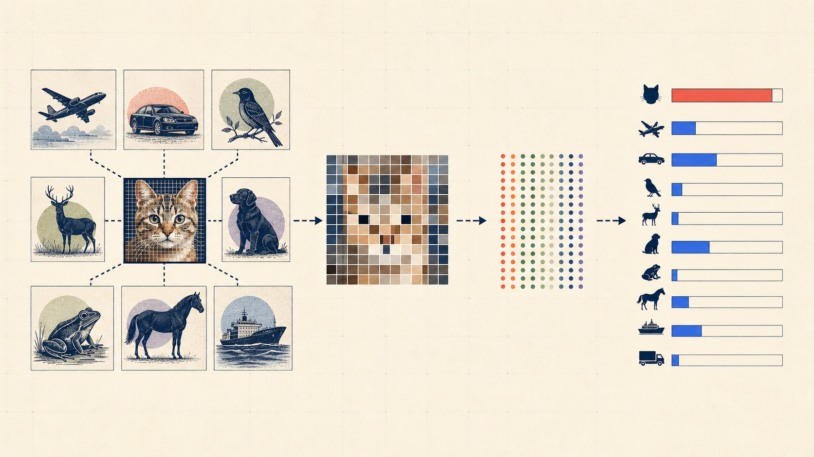
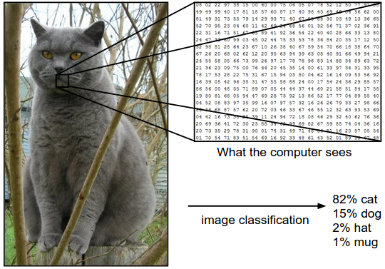
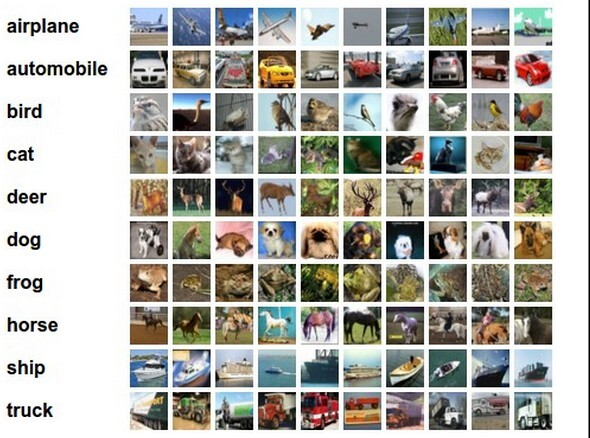
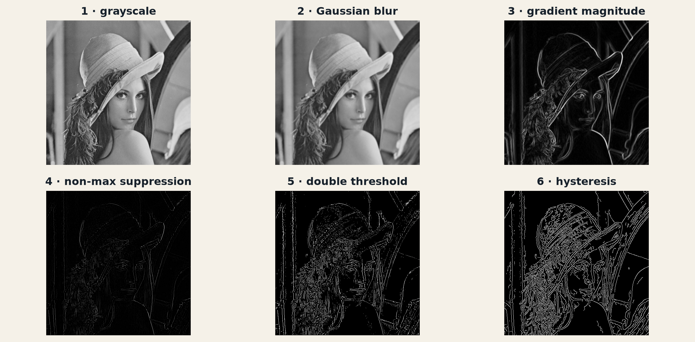
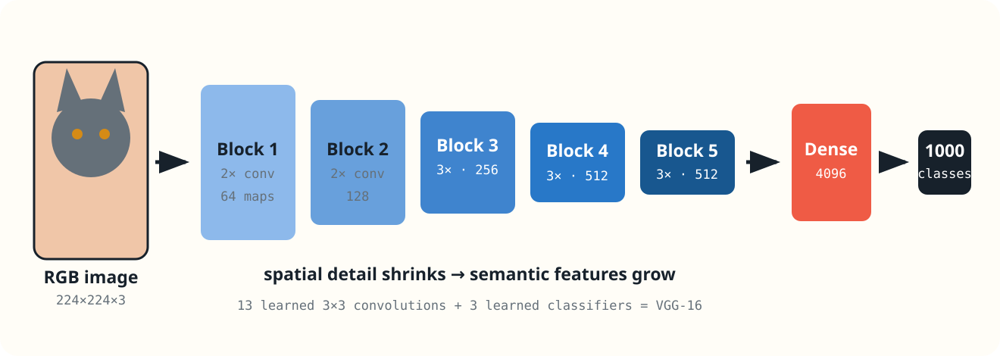
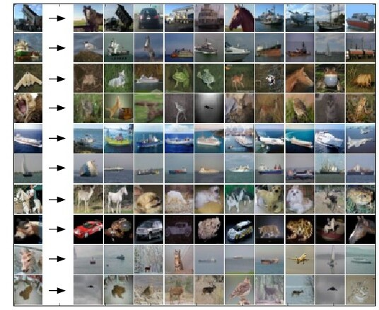
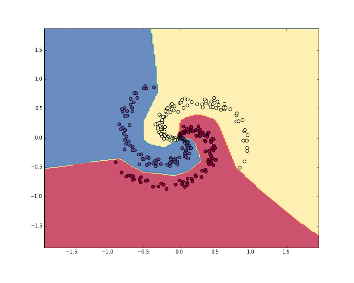
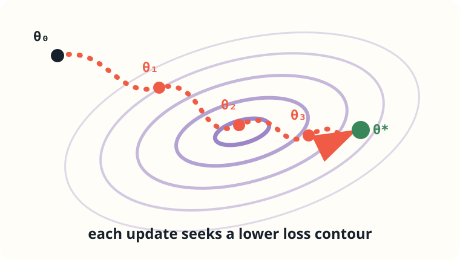

## What does it mean to learn? {.deck-title}

:::: {.deck-title-grid}
::: {.deck-title-copy}
<span class="eyebrow">CHAPTER 01 · FOUNDATIONS</span>

### Image classification and the five ingredients of machine learning

We will build one complete learning problem—not memorize a list of definitions.

<span class="deck-author">Dr. A. Belcaid</span>
:::

::: {.deck-title-art}
{fig-alt="An illustrated image-classification pipeline from examples to pixels, a learned representation, and class scores."}
:::
::::

## You already know the answer {.question-slide}

::: {.big-question}
What is in this image?
:::

::: {.mystery-image}
<div class="cat-shape"><i></i><i></i><span></span></div>
:::

::: {.fragment .answer}
Most people answer **cat** before consciously listing any rule.
:::

::: {.fragment .takeaway}
Easy to recognize does not mean easy to program.
:::

::: {.notes}
Ask for an answer immediately, then ask students to write a complete cat-detection rule. Their disagreement creates the motivation for learning from examples. 4 minutes.
:::

## A computer begins somewhere else

::: {.cs231n-figure .pixel-figure}
{fig-alt="A cat image with one region enlarged into RGB pixel values, followed by four class probabilities."}
:::

::: {.pixel-fact .fragment}
<span>one image</span>
<strong>$248\times400\times3=297{,}600$</strong>
<span>numbers in $[0,255]$</span>
:::

::: {.fragment .takeaway}
The model receives numbers—not objects, meaning, or common sense.
:::

<p class="source-note">Illustration: <a href="https://cs231n.github.io/classification/">CS231n, Image Classification notes</a>.</p>

## The task in one line

::: {.classification-rule}
<span class="input-chip">image $x$</span>
<i>→</i>
<span class="model-chip">classifier $f_\theta$</span>
<i>→</i>
<span class="output-chip">label $\hat y$</span>
:::

$$
f_\theta:\mathbb R^{H\times W\times3}\longrightarrow\mathbb R^K,
\qquad
\hat y=\arg\max_j f_\theta(x)_j
$$

::: {.fragment .prediction-vector}
<div class="prediction-label"><span>cat</span><i style="--prob:82%"></i><b>0.82</b></div>
<div><span>dog</span><i style="--prob:10%"></i><b>0.10</b></div>
<div><span>fox</span><i style="--prob:5%"></i><b>0.05</b></div>
<div><span>car</span><i style="--prob:3%"></i><b>0.03</b></div>
<p>$p(y\mid x)\in\mathbb R^K$ &nbsp; and &nbsp; $\sum_{k=1}^{K}p(y=k\mid x)=1$</p>
:::

## Why rules collapse

::: {.cs231n-figure .challenge-figure}
{fig-alt="Examples of viewpoint variation, scale variation, deformation, occlusion, illumination changes, and background clutter in image classification."}
:::

::: {.fragment .big-summary}
The label stays fixed while viewpoint, scale, shape, visibility, light, and background all change.
:::

<p class="source-note">Illustration: <a href="https://cs231n.github.io/classification/">CS231n, Image Classification notes</a>.</p>

## Machine learning changes what we write

:::: {.two-worlds}
::: {.world .rules}
<span>HANDWRITTEN PROGRAM</span>

### We write the final rule

pixels + rules about color, edges, shape → class
:::
::: {.world .learning}
<span>LEARNING SYSTEM</span>

### We write a procedure for finding a rule

labeled images + learning algorithm → classifier
:::
::::

::: {.fragment .takeaway}
The difficult design work does not disappear. It moves.
:::

## Today's map

```{mermaid}
%%| fig-width: 11
flowchart LR
  A[1 · DATA<br/>experience] --> B[2 · HYPOTHESIS<br/>possible rules]
  B --> C[3 · LOSS<br/>what wrong costs]
  C --> D[4 · OPTIMIZATION<br/>search]
  D --> E[5 · EVALUATION<br/>evidence]
  E -. better questions .-> A

  classDef first fill:#2878c8,color:#fff,stroke:#2878c8
  classDef middle fill:#fffdf7,color:#17212b,stroke:#657079
  classDef last fill:#ef5b45,color:#fff,stroke:#ef5b45
  class A first
  class B,C,D middle
  class E last
```

::: {.timeline}
**Part I · 15 min** task &nbsp; · &nbsp; **Part II · 25 min** data & hypotheses &nbsp; · &nbsp; **Part III · 25 min** losses &nbsp; · &nbsp; **Part IV · 20 min** evaluation
:::

# 01 · Data {.section-slide .data-section}

## A dataset is a collection of promises

$$
\mathcal D=\{(x^{(i)},y^{(i)})\}_{i=1}^{n}
$$

:::: {.dataset-example}
::: {.dataset-batch}
{fig-alt="A labeled sample from CIFAR-10 with ten example images for each of ten classes."}
:::
::: {.dataset-promises}
<div><b>$x^{(i)}$</b><span>one image</span></div>
<div><b>$y^{(i)}$</b><span>its class label</span></div>
<div><b>$\mathcal D$</b><span>a sample of future reality</span></div>
:::
::::

::: {.fragment .danger-line}
The last promise is the easiest to break.
:::

<p class="source-note">Example: <a href="https://cs231n.github.io/classification/">CIFAR-10 batch from CS231n</a>.</p>

## Which model did we train?

:::: {.shortcut-scene}
::: {.shortcut-column}
<span class="scene sky">BLUE WATER</span>

**Every ship**
:::
::: {.shortcut-column}
<span class="scene road">GRAY ROAD</span>

**Every car**
:::
::::

::: {.fragment .big-question}
Object classifier—or background classifier?
:::

::: {.fragment .takeaway .danger}
A shortcut can be predictive in the dataset and useless after deployment.
:::

## Four questions before training

:::: {.four-questions}
::: {.question-card}
<b>01</b>

Who or what produced the images?
:::
::: {.question-card}
<b>02</b>

Who decided the labels?
:::
::: {.question-card}
<b>03</b>

Which classes or conditions are missing?
:::
::: {.question-card}
<b>04</b>

Will tomorrow look like today?
:::
::::

## Classical ML chooses the representation

::: {.canny-stages}
{fig-alt="Six stages of Canny edge detection: grayscale, Gaussian smoothing, gradient magnitude, non-maximum suppression, double thresholding, and hysteresis."}
:::

::: {.feature-pipeline}
<span>RGB image</span><i>→</i><strong>Canny edge map</strong><i>→</i><span>SVM / linear classifier</span><i>→</i><span>class scores</span>
:::

::: {.takeaway}
The human decides which visual properties the classifier gets to see.
:::

<p class="source-note">Pipeline generated for this course; algorithm: <a href="https://docs.opencv.org/5.0/tutorials/imgproc/imgtrans/canny_detector/canny_detector.html">Canny (1986), OpenCV reference</a>.</p>

## Deep learning learns the representation

::: {.vgg-figure}
{fig-alt="VGG-16 architecture from an RGB image through five learned convolutional blocks to 1000 ImageNet classes."}
:::

::: {.takeaway}
The feature extractor and classifier are optimized together, end-to-end. **We will learn how every block works later in the course.**
:::

<p class="source-note">Architecture: <a href="https://arxiv.org/abs/1409.1556">Simonyan &amp; Zisserman, VGG (2014)</a>. Diagram created for this course.</p>

# 02 · Hypothesis {.section-slide .hypothesis-section}

## A hypothesis class is a menu of rules

:::: {.model-menu}
::: {.model-card .memory .fragment}
<span>MEMORY</span>

### $k$-nearest neighbors

Look for similar training images.

{fig-alt="CIFAR-10 query images followed by their nearest training images under pixel distance."}
:::
::: {.model-card .linear .fragment}
<span>TEMPLATES</span>

### Linear classifier

Score pixels with $Wx+b$.

{fig-alt="Images arranged in a two-dimensional space with linear decision boundaries for airplane, car, and deer classifiers."}
:::
::: {.model-card .neural .fragment}
<span>FEATURES</span>

### Neural network

Compose learned nonlinear layers.

{fig-alt="A neural network fitting nonlinear decision regions to a three-class spiral dataset."}
:::
::::

::: {.fragment .big-summary}
Choosing the class decides what can possibly be learned.
:::

<p class="source-note">Illustrations: <a href="https://cs231n.github.io/classification/">CS231n · nearest neighbors</a>, <a href="https://cs231n.github.io/linear-classify/">linear classifiers</a>, and <a href="https://cs231n.github.io/neural-networks-case-study/">neural-network case study</a>.</p>

## Nearest neighbor: learning without parameters

:::: {.neighbor-demo}
::: {.query-tile}
<span>?</span>

**query image**
:::
::: {.neighbor-arrow}
find the closest →
:::
::: {.neighbor-list}
<div class="near"><b>cat</b><span>$d=4.2$</span></div>
<div><b>dog</b><span>$d=5.7$</span></div>
<div><b>ship</b><span>$d=9.1$</span></div>
:::
::::

$$
d(x,x_i)=\lVert x-x_i\rVert_2
$$

::: {.fragment .takeaway .danger}
One-pixel translation: same object, very different raw-pixel distance.
:::

## Linear classification: one score per class

:::: {.linear-layout}
::: {.linear-equation}
$$
s=Wx+b
$$

$$
W\in\mathbb R^{K\times D},
\quad x\in\mathbb R^D,
\quad s\in\mathbb R^K
$$
:::
::: {.dimension-stack}
<span><b>image</b>$x\in\mathbb R^{3072}$</span>
<i>×</i>
<span><b>templates</b>$W\in\mathbb R^{10\times3072}$</span>
<i>+</i>
<span><b>bias</b>$b\in\mathbb R^{10}$</span>
:::
::::

::: {.takeaway}
Row $W_j$ is a learned pixel template for class $j$.
:::

## Watch the scores vote

:::: {.score-board}
::: {.score-image}
<div class="mini-cat"><i></i><i></i><span></span></div>
:::
::: {.score-list}
<div><span>cat</span><i style="--w:55%"></i><b>3.2</b></div>
<div class="winner"><span>dog</span><i style="--w:88%"></i><b>5.1</b></div>
<div><span>ship</span><i style="--w:10%"></i><b>−1.7</b></div>
:::
::::

::: {.fragment .wrong-prediction}
Correct label: **cat** · prediction: **dog**
:::

::: {.fragment .big-question}
How wrong is this prediction?
:::

## Same architecture, different rule

::: {.big-question}
Two students train the same linear-classifier code and obtain different matrices $W$.
:::

:::: {.choice-row}
::: {.choice}
Different hypothesis classes?
:::
::: {.choice}
Different hypotheses?
:::
::::

::: {.fragment .answer}
Same hypothesis class. Different learned members of that class.
:::

# 03 · Loss {.section-slide .loss-section}

## Accuracy is silent during training

:::: {.accuracy-steps}
::: {}
$s_{\text{cat}}=3.20$

wrong
:::
::: {.fragment}
$s_{\text{cat}}=3.21$

still wrong
:::
::: {.fragment}
$s_{\text{cat}}=3.22$

still wrong
:::
::::

::: {.fragment .danger-line}
The parameters improved—but 0/1 error did not move.
:::

::: {.fragment .takeaway}
A training loss must say **how wrong**, not only **wrong or right**.
:::

## Two views of the same mistake

:::: {.loss-question-grid}
::: {.loss-question .margin}
<span>SVM</span>

Is the correct score ahead by a sufficient **margin**?
:::
::: {.loss-question .probability}
<span>SOFTMAX</span>

How much **probability** belongs to the correct class?
:::
::::

::: {.same-scores}
Same scores: $[3.2,\ 5.1,\ -1.7]$ · correct class: cat
:::

## SVM loss: the correct class needs room

::: {.margin-track}
<span class="correct" style="--x:53%">cat · 3.2</span>
<span class="margin-zone" style="--x:69%">required margin</span>
<span class="rival" style="--x:85%">dog · 5.1</span>
:::

$$
L_i^{\text{SVM}}
=\sum_{j\ne y}\max(0,s_j-s_y+\Delta)
$$

::: {.fragment .takeaway}
Zero loss only when the correct score beats every rival by at least $\Delta$.
:::

## Compute it together

For $s=[3.2,5.1,-1.7]$, $y=\text{cat}$, and $\Delta=1$:

::: {.exercise-prompt}
**Your turn:** compute the multiclass SVM loss for this example.
:::

::: {.exercise-pause}
<span>PAUSE</span><b>90 seconds</b><small>Write the two margin terms before calculating.</small>
:::

::: {.fragment .exercise-solution}
<span class="solution-label">SOLUTION</span>

$$
\begin{aligned}
L_i^{\text{SVM}}
&=\max(0,5.1-3.2+1)\\
&\quad+\max(0,-1.7-3.2+1)\\[4pt]
&=\boxed{2.9}
\end{aligned}
$$
:::

::: {.fragment .exercise-extension}
What change to the scores would make the loss exactly zero?
:::

## Softmax: scores become probabilities

$$
p_j=\frac{e^{s_j}}{\sum_k e^{s_k}}
$$

:::: {.probability-bars}
::: {}
<span>cat</span><i style="--p:13%"></i><b>0.130</b>
:::
::: {.wrong}
<span>dog</span><i style="--p:87%"></i><b>0.869</b>
:::
::: {}
<span>ship</span><i style="--p:1%"></i><b>0.001</b>
:::
::::

::: {.fragment .takeaway}
Softmax preserves ranking and forces the outputs to sum to one.
:::

## Cross-entropy asks for the correct probability

$$
L_i^{\text{CE}}=-\log p_y
$$

::: {.ce-visual}
<div><span>$p_y=0.90$</span><b>$L=0.11$</b><i class="good"></i></div>
<div><span>$p_y=0.50$</span><b>$L=0.69$</b><i class="middle"></i></div>
<div><span>$p_y=0.13$</span><b>$L=2.04$</b><i class="bad"></i></div>
<div><span>$p_y=0.01$</span><b>$L=4.61$</b><i class="terrible"></i></div>
:::

::: {.fragment .big-summary}
Confidently wrong predictions are expensive.
:::

## Same goal, different pressure

| | Multiclass SVM | Softmax cross-entropy |
|---|---|---|
| View | score margins | class probabilities |
| Satisfied when | correct class clears $\Delta$ | correct probability approaches 1 |
| Beyond correct | stops after margin | keeps rewarding confidence |
| Typical output | uncalibrated scores | probability-like distribution |

::: {.takeaway}
Both prefer the correct class. They shape the score space differently.
:::

# 04 · Optimization {.section-slide .optimization-section}

## The learning loop {.loop-slide}

```{mermaid}
%%| fig-width: 13
%%| fig-height: 5.4
flowchart LR
  A[sample a mini-batch<br/>images + labels] --> B[compute scores<br/>forward pass]
  B --> C[measure loss<br/>how wrong?]
  C --> D[compute gradient<br/>which direction?]
  D --> E[update parameters<br/>take one step]
  E --> A

  classDef data fill:#dfeaff,stroke:#2878c8,color:#17212b
  classDef model fill:#fffdf7,stroke:#657079,color:#17212b
  classDef loss fill:#ffe3dc,stroke:#ef5b45,color:#17212b
  classDef update fill:#fff1d9,stroke:#d58b16,color:#17212b
  class A data
  class B,D model
  class C loss
  class E update
```

$$
\theta\leftarrow\theta-\eta\nabla_\theta J(\theta)
$$

## Loss tells us where; optimization moves us

:::: {.optimization-roles}
::: {.parameter-convergence}
{fig-alt="Parameters following successive gradient updates through loss contours toward a minimum."}
:::
::: {.role-stack}
::: {.role-card .loss-role}
<span>LOSS</span>

Defines which predictions are preferable.

$$J(\theta)$$
:::
::: {.role-card .optimizer-role}
<span>OPTIMIZER</span>

Chooses how parameters change.

$$-\eta\nabla_\theta J$$
:::
:::
::::

::: {.takeaway}
We postpone the machinery—not the distinction—to the optimization chapter.
:::

# 05 · Evaluation {.section-slide .evaluation-section}

## Fitting is not learning

:::: {.memorize-generalize}
::: {.memory-panel}
<span>MEMORIZE</span>

Training image → stored answer

**train:** excellent
**new images:** uncertain
:::
::: {.general-panel}
<span>GENERALIZE</span>

Training images → reusable structure

**train:** good
**new images:** good
:::
::::

::: {.fragment .takeaway}
Low training loss is an optimization result—not evidence of generalization.
:::

## Three datasets, three jobs

:::: {.split-visual}
::: {.split .train}
<span>TRAIN</span><b>70%</b>

fit $\theta$
:::
::: {.split .validation}
<span>VALIDATION</span><b>15%</b>

choose design
:::
::: {.split .test}
<span>TEST</span><b>15%</b>

estimate final behavior
:::
::::

::: {.fragment .danger-line}
Using the test set to choose the model turns it into validation data.
:::

## Split the thing that must generalize

:::: {.split-cases}
::: {}
**medical images**

split by patient
:::
::: {}
**video frames**

split by video
:::
::: {}
**product photos**

split by physical object
:::
::: {}
**forecasting**

split by time
:::
::::

::: {.takeaway}
Random rows are not automatically independent examples.
:::

## Training success can hide test failure

:::: {.generalization-scorecards}
::: {.scorecase .memorizer-case}
<span>MODEL A</span>

### Memorizer

<div class="scorebar train"><b>training</b><i style="--score:99%"></i><strong>99%</strong></div>
<div class="scorebar test"><b>test</b><i style="--score:54%"></i><strong>54%</strong></div>

<p>Excellent fit. Poor generalization.</p>
:::
::: {.scorecase .generalizer-case}
<span>MODEL B</span>

### Generalizer

<div class="scorebar train"><b>training</b><i style="--score:92%"></i><strong>92%</strong></div>
<div class="scorebar test"><b>test</b><i style="--score:89%"></i><strong>89%</strong></div>

<p>Smaller training score. Better unseen behavior.</p>
:::
::::

::: {.fragment .takeaway .danger}
A training score measures fitting. A held-out score provides evidence about generalization.
:::

## Read the mistakes

:::: {.error-gallery}
::: {.error-card}
<span>BLUR</span>

Is resolution the limitation?
:::
::: {.error-card}
<span>OCCLUSION</span>

Is the object partly hidden?
:::
::: {.error-card}
<span>SHORTCUT</span>

Is the background driving the score?
:::
::: {.error-card}
<span>LABEL</span>

Is the target itself wrong?
:::
::::

::: {.big-summary}
Metrics tell us how much. Examples help us ask why.
:::

## The complete experiment {.experiment-slide}

```{mermaid}
%%| fig-width: 13
%%| fig-height: 5.2
flowchart LR
  Q[define<br/>decision] --> A[audit<br/>data]
  A --> S[design<br/>split]
  S --> B[establish<br/>baseline]
  B --> T[train<br/>model]
  T --> V[choose with<br/>validation]
  V --> E[evaluate<br/>once]

  classDef start fill:#17212b,color:#fff,stroke:#17212b
  classDef process fill:#fffdf7,color:#17212b,stroke:#657079
  classDef finish fill:#ef5b45,color:#fff,stroke:#ef5b45
  class Q start
  class A,S,B,T,V process
  class E finish
```

::: {.takeaway}
This protocol is the smallest credible argument that learning occurred.
:::

## One task, two visits

:::: {.return-map}
::: {.visit .classical}
<span>NOW</span>

### Classical image classification

handcrafted features + linear classifier
:::
::: {.return-arrow}
→
:::
::: {.visit .deep}
<span>LATER</span>

### Deep image classification

learned features + convolutional network
:::
::::

::: {.fragment .big-summary}
The hypothesis changes. The five ingredients remain.
:::

## Five questions to keep {.final-slide}

:::: {.final-five}
::: {}
<b>1</b><span>What experience?</span>
:::
::: {}
<b>2</b><span>Which possible rules?</span>
:::
::: {}
<b>3</b><span>What does wrong cost?</span>
:::
::: {}
<b>4</b><span>How do parameters change?</span>
:::
::: {}
<b>5</b><span>What evidence convinces us?</span>
:::
::::

::: {.next}
**Next:** build neurons and multilayer networks from elementary operations.
:::
