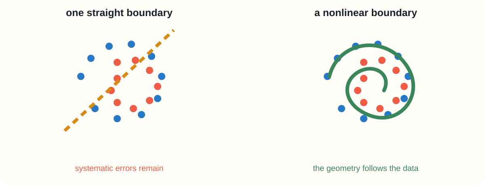
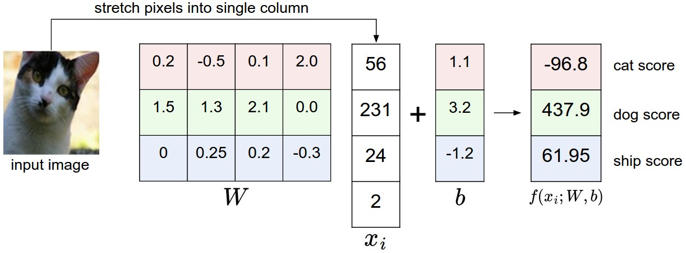
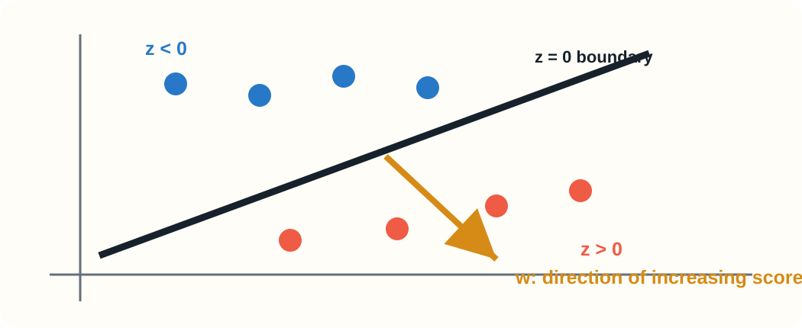
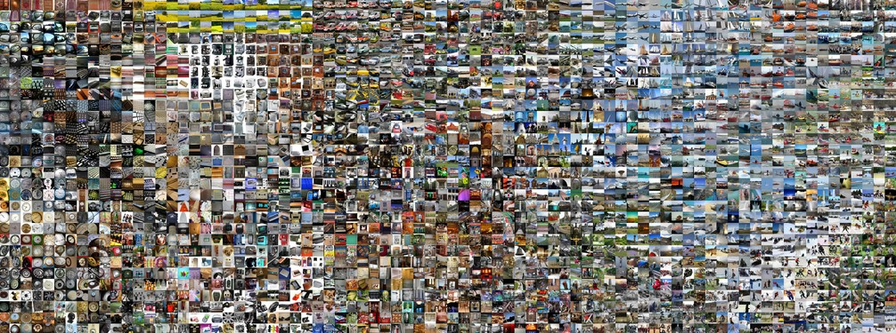
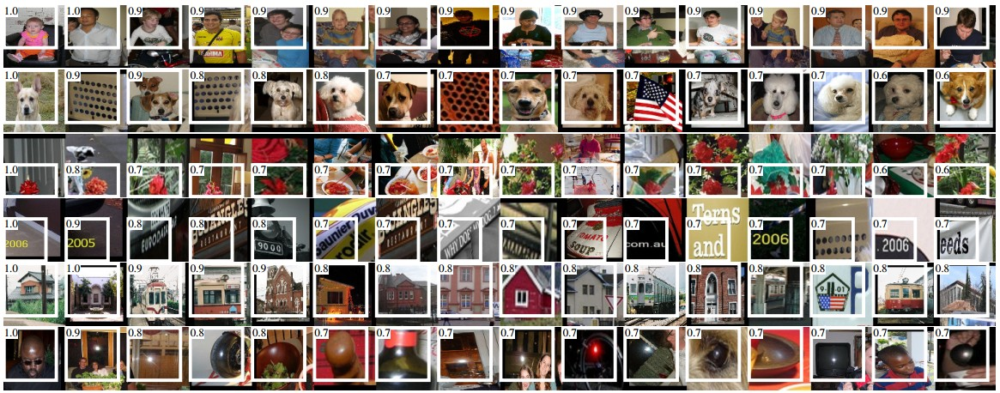

## From linear classifiers to neural networks {.deck-title}

:::: {.deck-title-grid}
::: {.deck-title-copy}
<span class="eyebrow">CHAPTER 02 · FROM SCRATCH</span>

### Neurons, nonlinear activations, hidden representations, and the forward pass

One question: **what must we add to bend a linear decision boundary?**

<span class="deck-author">Dr. A. Belcaid</span>
:::
::: {.deck-title-art .boundary-hero}
{fig-alt="A straight boundary failing on spiral data beside a nonlinear boundary."}
:::
::::

## Last time: one template per class

:::: {.linear-recall}
::: {.recall-equation}
$$S=XW+b$$

Each column of $W$ is one class template.
:::
::: {.recall-image}
{fig-alt="CIFAR-10 images mapped through a linear classifier."}
:::
::::

::: {.fragment .takeaway}
A linear classifier learns—but draws only flat boundaries.
:::

<p class="source-note">Illustration: <a href="https://cs231n.github.io/linear-classify/">Stanford CS231n</a>.</p>

## Four images, four linear regions

::: {.full-course-image}
{fig-alt="Linear decision regions for four images."}
:::

::: {.fragment .big-summary}
Changing $W$ rotates and translates boundaries. It never bends them.
:::

<p class="source-note">Illustration: <a href="https://cs231n.github.io/linear-classify/">Stanford CS231n</a>.</p>

## A dataset that refuses one straight answer

::: {.full-course-image .spiral-image}
{fig-alt="Spiral classes with straight and nonlinear boundaries."}
:::

::: {.fragment .takeaway .danger}
The failure is not optimization. No choice of one line solves this geometry.
:::

<p class="source-note">Course schematic inspired by the <a href="https://cs231n.github.io/neural-networks-case-study/">CS231n spiral case study</a>.</p>

## Exercise · Can one line separate XOR?

::: {.xor-grid}
<span class="blue" style="--x:15%;--y:15%">0</span><span class="coral" style="--x:85%;--y:15%">1</span>
<span class="coral" style="--x:15%;--y:85%">1</span><span class="blue" style="--x:85%;--y:85%">0</span>
:::
::: {.exercise-prompt}
Draw one line that puts both blue points on one side and both coral points on the other.
:::
::: {.exercise-pause}
<span>PAUSE</span><b>90 seconds</b><small>Try before declaring it impossible.</small>
:::
::: {.fragment .exercise-solution}
<span class="solution-label">SOLUTION</span>

No line works. XOR is not linearly separable.
:::

## More linear layers still make one line

::: {.collapse-stack}
<span>$h=XW_1+b_1$</span><i>→</i><span>$S=hW_2+b_2$</span>
:::
::: {.fragment}
$$S=X\underbrace{(W_1W_2)}_{W'}+\underbrace{(b_1W_2+b_2)}_{b'}$$
:::
::: {.fragment .takeaway .danger}
Depth without nonlinearity collapses into one affine map.
:::

## First, play with the answer

:::: {.playground-layout}
::: {.playground-image}
{fig-alt="TensorFlow Playground with a two-layer neural network fitting concentric circular classes."}
:::
::: {.playground-invitation}
<span>LIVE EXPERIMENT</span>

<h3><a href="https://playground.tensorflow.org/">Open TensorFlow Playground</a></h3>

1. Select the **circle** dataset.
2. Keep only $x_1$ and $x_2$ as inputs.
3. Add two hidden layers.
4. Press play and watch the boundary bend.
:::
::::

::: {.fragment .takeaway}
The network can fit the circles. Today we open the machine and explain why.
:::

<p class="source-note">Interactive tool: <a href="https://playground.tensorflow.org/">TensorFlow Playground</a>, created by Daniel Smilkov and Shan Carter. Screenshot reproduced from an experiment using the same tool.</p>

## Today's construction

```{mermaid}
flowchart LR
 A[FAILURE<br/>linear limits] --> B[NEURON<br/>evidence]
 B --> C[ACTIVATION<br/>nonlinearity]
 C --> D[NETWORK<br/>composition]
 D --> E[REPRESENTATION<br/>bend space]
 E --> F[FORWARD PASS<br/>implement]
 classDef first fill:#2878c8,color:#fff,stroke:#2878c8
 classDef middle fill:#fffdf7,color:#17212b,stroke:#657079
 classDef last fill:#ef5b45,color:#fff,stroke:#ef5b45
 class A first
 class B,C,D,E middle
 class F last
```

# 01 · A neuron {.section-slide .neuron-section}

## One artificial neuron, two useful views

:::: {.neuron-two-views}
::: {.single-neuron}
{fig-alt="Biological neuron beside the mathematical model of an artificial neuron."}
:::
::: {.neuron-computation}
<span>1 · COMBINE</span>

$$z=w^Tx+b$$

<span>2 · TRANSFORM</span>

$$a=\phi(z)$$

::: {.fragment .takeaway}
The biological analogy is inspiration—not a literal simulation of a brain cell.
:::
:::
::::

<p class="source-note">Illustration: <a href="https://cs231n.github.io/neural-networks-1/">Stanford CS231n, Neural Networks Part 1</a>; historical threshold unit: <a href="https://doi.org/10.1007/BF02478259">McCulloch &amp; Pitts, 1943</a>.</p>

## What does $w^Tx+b$ actually do?

:::: {.boundary-explanation}
::: {.boundary-visual}
{fig-alt="A neuron's zero-score line separating negative and positive score regions, with the weight direction shown."}
:::
::: {.boundary-steps}
<div class="fragment"><b>1</b><span>Each input point receives a score $z$.</span></div>
<div class="fragment"><b>2</b><span>The line $z=0$ separates negative from positive scores.</span></div>
<div class="fragment"><b>3</b><span>$w$ points toward scores that increase.</span></div>
<div class="fragment"><b>4</b><span>$b$ shifts the line without rotating it.</span></div>
:::
::::

::: {.fragment .takeaway}
Before activation, a neuron is a learned linear test: “which side of this boundary is the input on?”
:::

## A layer repeats that test with different weights

::: {.dense-neuron-figure}
{fig-alt="A conventional fully connected network with input, hidden, and output nodes."}
:::

::: {.fragment .takeaway}
Every hidden neuron draws a different boundary and produces one new feature.
:::

<p class="source-note">Conventional layered notation following <a href="https://alexlenail.me/NN-SVG/">NN-SVG</a>.</p>

## A nonlinear gate turns scores into responses

::: {.neuron-gates-figure}
{fig-alt="Five neuron pre-activations passed through sigmoid gates, producing responses from almost off to almost on."}
:::

::: {.fragment .takeaway}
The same gate acts independently on every neuron: some respond strongly, some weakly, and some almost not at all.
:::

::: {.fragment .big-question}
Which gate should we use—and what happens to its gradient?
:::

## Sigmoid · the classical soft gate

:::: {.activation-detail}
::: {.activation-detail-plot}
{fig-alt="Sigmoid output and derivative curves."}
:::
::: {.activation-detail-copy}
$$\sigma(z)=\frac{1}{1+e^{-z}}$$
$$\sigma'(z)=\sigma(z)\bigl(1-\sigma(z)\bigr)$$

<div class="strength"><b>Strength</b><span>Smooth, bounded, interpretable as a gate in $(0,1)$.</span></div>
<div class="weakness fragment"><b>Weakness</b><span>Saturates; gradients approach zero for large $|z|$. Output is not zero-centered.</span></div>
:::
::::

<p class="source-note">Activation analysis: <a href="https://www.deeplearningbook.org/contents/mlp.html">Goodfellow, Bengio &amp; Courville, Ch. 6</a>.</p>

## tanh · a centered soft gate

:::: {.activation-detail}
::: {.activation-detail-plot}
{fig-alt="Hyperbolic tangent output and derivative curves."}
:::
::: {.activation-detail-copy}
$$\tanh(z)=\frac{e^z-e^{-z}}{e^z+e^{-z}}$$

<div class="strength"><b>Strength</b><span>Output in $(-1,1)$ and centered around zero.</span></div>
<div class="weakness fragment"><b>Weakness</b><span>Still saturates on both sides, producing small gradients.</span></div>
:::
::::

## ReLU · a hard gate with a linear side

:::: {.activation-detail}
::: {.activation-detail-plot}
{fig-alt="ReLU output and derivative curves."}
:::
::: {.activation-detail-copy}
$$\operatorname{ReLU}(z)=\max(0,z)$$

<div class="strength"><b>Strength</b><span>Cheap, sparse, and non-saturating for positive inputs.</span></div>
<div class="weakness fragment"><b>Weakness</b><span>Zero gradient when inactive; a unit can become permanently “dead.” Not differentiable at zero.</span></div>
:::
::::

<p class="source-note">Rectified units in modern vision: <a href="https://papers.nips.cc/paper/4824-imagenet-classification-with-deep-convolutional-neural-networks">Krizhevsky, Sutskever &amp; Hinton, 2012</a>.</p>

## Exercise · Pass through ReLU

::: {.exercise-prompt}
For $x=(2,-1)$, $w=(-3,4)$, $b=1$, compute $z=w^Tx+b$ and $a=\operatorname{ReLU}(z)$.
:::
::: {.exercise-pause}
<span>PAUSE</span><b>75 seconds</b><small>Separate affine and activation.</small>
:::
::: {.fragment .exercise-solution}
<span class="solution-label">SOLUTION</span>

$$z=-6-4+1=-9,\qquad a=\max(0,-9)=0.$$
:::
::: {.fragment .exercise-extension}
What smallest change to $b$ makes it active?
:::

## Experiment · Same network, three activations

:::: {.activation-playground}
::: {.activation-experiment-steps}
<span>CONTROLLED COMPARISON</span>

<h3><a href="https://playground.tensorflow.org/">Open TensorFlow Playground</a></h3>

Keep the circle data, inputs, hidden layers, learning rate, and initialization fixed.

::: {.fragment}
Change only:

$$\text{sigmoid}\quad\rightarrow\quad\tanh\quad\rightarrow\quad\operatorname{ReLU}$$
:::
:::
::: {.activation-observations}
<div><b>Speed</b><span>How many epochs until the boundary closes?</span></div>
<div><b>Shape</b><span>Is the learned boundary smooth or piecewise linear?</span></div>
<div><b>Units</b><span>Which hidden neurons saturate or stay inactive?</span></div>
<div><b>Loss</b><span>Do all three reach the same final result?</span></div>
:::
::::

::: {.fragment .takeaway}
An activation is not decoration: it changes both representation and optimization.
:::

# 02 · From neurons to networks {.section-slide .network-section}

## A layer evaluates many neurons at once

:::: {.network-notation-pair}
::: {.network-chart}
{fig-alt="A course-drawn fully connected network with input, hidden, and output layers."}
:::
::: {.cs231n-network}
{fig-alt="A conventional three-layer neural network with two hidden layers."}
:::
::::

::: {.fragment .takeaway}
Each layer is a vector of neurons; every connection represents a learned weight.
:::

<p class="source-note">Right illustration: <a href="https://cs231n.github.io/neural-networks-1/">Stanford CS231n, Neural Networks Part 1</a>. Left: course diagram using the same conventional notation.</p>

## Build the forward pass—one reveal at a time

::: {.forward-pass-figure}
{fig-alt="A batch moving through hidden scores, ReLU activations, class scores, and Softmax probabilities."}
:::

::: {.forward-formulas}
<span class="fragment"><b>1</b>$Z_1=XW_1+b_1$</span>
<span class="fragment"><b>2</b>$H=\operatorname{ReLU}(Z_1)$</span>
<span class="fragment"><b>3</b>$S=HW_2+b_2$</span>
<span class="fragment"><b>4</b>$P=\operatorname{softmax}(S)$</span>
:::

## CIFAR-10 shapes tell the story

::: {.shape-pipeline}
<div><b>$X$</b><span>$B\times3072$</span></div><i>×</i>
<div><b>$W_1$</b><span>$3072\times H$</span></div><i>+</i>
<div><b>$b_1$</b><span>$H$</span></div><i>→</i>
<div class="accent"><b>$Z_1,H$</b><span>$B\times H$</span></div><i>×</i>
<div><b>$W_2$</b><span>$H\times10$</span></div><i>+</i>
<div><b>$b_2$</b><span>$10$</span></div><i>→</i>
<div><b>$S$</b><span>$B\times10$</span></div>
:::

::: {.shape-exercise}
<b>YOUR TURN · 90 seconds</b>

$B=64$, $D=3072$, $H=100$, $C=10$. Give the shapes of $W_1,b_1,Z_1,H,W_2,b_2,S$.
:::

::: {.fragment .shape-answer}
$$W_1:(3072,100),\ b_1:(100,),\ Z_1=H:(64,100),$$
$$W_2:(100,10),\ b_2:(10,),\ S:(64,10).$$
:::

## How many learned numbers?

$$3072H+H+10H+10$$

::: {.parameter-counter}
<span>$H=100$</span><i>→</i><b class="fragment">$308{,}310$ parameters</b>
:::

::: {.exercise-prompt}
If we double the hidden width to $H=200$, what happens to every parameter shape and to the total count?
:::
::: {.exercise-pause}
<span>PAUSE</span><b>60 seconds</b><small>Only dimensions involving $H$ change.</small>
:::
::: {.fragment .parameter-answer}
$W_1:(3072,200)$, $b_1:(200,)$, $W_2:(200,10)$, $b_2:(10,)$ → **616,610 parameters**.
:::

## Same Softmax ending, richer beginning

:::: {.two-worlds}
::: {.world .rules}
<h3>Linear</h3>

$$S=XW+b$$

Pixels vote for classes.
:::
::: {.world .learning}
<h3>Two-layer</h3>

$$S=\phi(XW_1+b_1)W_2+b_2$$

Pixels create features first.
:::
::::

::: {.fragment .takeaway}
We learned a better representation for the same output classifier.
:::

# 03 · Hidden representations {.section-slide .representation-section}

## A hidden layer changes coordinates

::: {.hidden-space-evidence}
::: {.hidden-space-formula}
<span>ONE IMAGE</span>

$$x\in\mathbb{R}^{D}\;\longrightarrow\;h(x)\in\mathbb{R}^{H}$$

<b>pixels</b><i>become</i><b>learned features</b>
:::
::: {.cnn-code-map}
{fig-alt="A t-SNE map of learned CNN feature vectors in which visually similar ImageNet images appear near one another."}
:::
:::

::: {.fragment .takeaway}
Each thumbnail is one high-dimensional activation vector. Nearby vectors encode similar visual features.
:::

<p class="source-note">AlexNet fc7 features projected with t-SNE: <a href="https://cs231n.github.io/understanding-cnn/">Stanford CS231n, Visualizing what ConvNets learn</a>. Representation learning: <a href="https://doi.org/10.1109/TPAMI.2013.50">Bengio, Courville &amp; Vincent, 2013</a>.</p>

## Hidden units become reusable detectors

::: {.alexnet-detectors}
::: {.alexnet-feature-card}
<span>LEARNED FILTERS · PARAMETERS</span>

{fig-alt="The 96 learned first-layer filters of AlexNet, including oriented edge and color detectors."}
:::
::: {.alexnet-feature-card}
<span>FEATURE MAPS · RESPONSES TO ONE CAT</span>

{fig-alt="AlexNet first-layer activation maps for a cat image, showing different filters responding to different visual structures."}
:::
:::

::: {.fragment .big-summary}
A filter is reusable: the same edge detector can respond wherever that feature appears.
:::

<p class="source-note">AlexNet conv1 filters and activations: <a href="https://cs231n.github.io/understanding-cnn/">Stanford CS231n</a>; architecture: <a href="https://doi.org/10.1145/3065386">Krizhevsky, Sutskever &amp; Hinton, 2012</a>.</p>

## A representation is an activation pattern

::: {.activation-evidence}
::: {.activation-code}
<div><span>unit</span><b>$h_1$</b><b>$h_2$</b><b>$h_3$</b><b>$h_4$</b><b>$h_5$</b><b>$h_6$</b></div>
<div><span>cat A</span><i class="on"></i><i></i><i class="on"></i><i class="on"></i><i></i><i class="on"></i></div>
<div class="fragment"><span>cat B</span><i class="on"></i><i class="on"></i><i></i><i class="on"></i><i></i><i class="on"></i></div>
<div class="fragment"><span>truck</span><i></i><i class="on"></i><i></i><i></i><i class="on"></i><i></i></div>
:::
::: {.activation-value-example .fragment}
<span>REAL ALEXNET POOL5 UNITS · MAXIMUM ACTIVATIONS</span>

{fig-alt="Image patches that maximally activate selected AlexNet pool5 units, annotated with their numerical activation values."}
:::
:::

::: {.fragment .takeaway}
Meaning is distributed; one unit need not equal one human concept.
:::

<p class="source-note">The white numbers are activation magnitudes for selected AlexNet pool5 units: <a href="https://cs231n.github.io/understanding-cnn/">Stanford CS231n</a>.</p>

## Neural boundaries bend around data

::: {.full-course-image .boundary-image}
{fig-alt="A nonlinear neural-network boundary on a toy dataset."}
:::

::: {.fragment .big-summary}
ReLU pieces compose into a nonlinear partition.
:::

<p class="source-note">Illustration: <a href="https://cs231n.github.io/neural-networks-case-study/">Stanford CS231n case study</a>.</p>

## Width adds pieces

::: {.width-figure}
{fig-alt="Increasing boundary complexity as hidden width grows."}
:::

::: {.fragment .takeaway .danger}
More capacity fits more structure—or more noise. Validation still decides.
:::

<p class="source-note">Course schematic; region analysis: <a href="https://arxiv.org/abs/1402.1869">Montúfar et al., 2014</a>.</p>

## Depth composes transformations

::: {.depth-activations}
::: {.alexnet-feature-card}
<span>EARLY · CONV1</span>

{fig-alt="Dense AlexNet conv1 activation maps responding to local edges, colors, and textures in a cat image."}
:::
<div class="depth-arrow"><b>DEEPER</b><i>→</i><span>larger receptive field<br>more selective response</span></div>
::: {.alexnet-feature-card}
<span>DEEP · CONV5</span>

{fig-alt="Sparse AlexNet conv5 activation maps responding selectively to higher-level regions of a cat image."}
:::
:::

::: {.fragment .takeaway}
Early maps respond broadly to local patterns; deeper maps respond sparsely to composed structure.
:::

<p class="source-note">AlexNet conv1/conv5 activations: <a href="https://cs231n.github.io/understanding-cnn/">Stanford CS231n</a>. Feature hierarchy analysis: <a href="https://arxiv.org/abs/1311.2901">Zeiler &amp; Fergus, 2014</a>.</p>

## Universal approximation—carefully stated

::: {.big-question}
Can one hidden layer represent any continuous function?
:::
::: {.fragment .answer}
Under suitable assumptions and enough units: yes, arbitrarily closely.
:::
::: {.fragment .takeaway .danger}
Representable does not mean easy to learn, data-efficient, robust, or practical.
:::

<p class="source-note">Results: <a href="https://doi.org/10.1007/BF02551274">Cybenko, 1989</a>; <a href="https://doi.org/10.1016/0893-6080(91)90009-T">Hornik, 1991</a>.</p>

## Exercise · Remove the ReLU

::: {.exercise-prompt}
Is $f(X)=(XW_1+b_1)W_2+b_2$ more expressive than one affine layer? Prove or refute.
:::
::: {.exercise-pause}
<span>PAUSE</span><b>2 minutes</b><small>Expand and name combined parameters.</small>
:::
::: {.fragment .exercise-solution}
<span class="solution-label">SOLUTION</span>

$$f(X)=X(W_1W_2)+(b_1W_2+b_2)=XW'+b'.$$

Still affine. ReLU prevents collapse.
:::

# 04 · Implement the forward pass {.section-slide .implementation-section}

## Keep the network in one class

~~~{.python code-line-numbers="1-7|9-11|13-15"}
class TwoLayerNet:
    def __init__(self, input_dim, hidden_dim, n_classes):
        self.W1 = ...
        self.b1 = ...
        self.W2 = ...
        self.b2 = ...

    def forward(self, X):
        ...
        return scores, cache

    def predict(self, X):
        scores, _ = self.forward(X)
        return scores.argmax(axis=1)
~~~

::: {.takeaway}
The class groups state and behavior; every mathematical operation stays visible.
:::

## Affine: shape first, code second

:::: {.code-explain}
::: {.code-panel}
~~~python
def affine(X, W, b):
    return X @ W + b
~~~
:::
::: {.shape-checks}
<div><b>$X$</b><span>$(B,D)$</span></div><div><b>$W$</b><span>$(D,H)$</span></div>
<div><b>$b$</b><span>$(H,)$</span></div><div class="fragment"><b>output</b><span>$(B,H)$</span></div>
:::
::::

::: {.fragment .takeaway}
Bias broadcasts because its dimension matches output columns.
:::

## ReLU: preserve shape, change geometry

:::: {.code-explain}
::: {.code-panel}
~~~python
def relu(Z):
    return np.maximum(0, Z)
~~~
:::
::: {.relu-matrix}
<span>$[-2,\ 0.4,\ 3]$</span><i>→</i><span class="fragment">$[0,\ 0.4,\ 3]$</span>
:::
::::

::: {.fragment .takeaway}
The zero pattern selects a local linear region.
:::

## Compose—and keep intermediates

~~~{.python code-line-numbers="1|2|3|4-5"}
def forward(self, X):
    Z1 = X @ self.W1 + self.b1
    H = np.maximum(0, Z1)
    scores = H @ self.W2 + self.b2
    cache = {"X": X, "Z1": Z1, "H": H}
    return scores, cache
~~~

::: {.fragment .big-question}
Why keep **X**, **Z1**, and **H** after prediction?
:::
::: {.fragment .answer}
Week 3 needs them to trace how loss depends on each parameter.
:::

## Diagnostic 1 · Initial loss has a prediction

::: {.initial-loss}
<span>10 near-equal probabilities</span><i>→</i><span>$p_y\approx0.1$</span><i>→</i><b>$-\log(0.1)\approx2.303$</b>
:::

::: {.fragment .diagnostic-grid}
<div><b>$L\approx2.3$</b><span>plausible</span></div>
<div><b>$L\gg2.3$</b><span>large scores or bug</span></div>
<div><b>NaN</b><span>numerical failure</span></div>
:::

::: {.fragment .takeaway}
A known baseline turns “the code ran” into a testable claim.
:::

## Diagnostic 2 · Count active ReLUs

::: {.activation-meter}
<div><span>active</span><i style="--meter:48%"></i><b>48%</b></div>
<div class="fragment warning"><span>active</span><i style="--meter:1%"></i><b>1%</b></div>
<div class="fragment danger"><span>active</span><i style="--meter:100%"></i><b>100%</b></div>
:::

::: {.fragment .takeaway .danger}
All-off, all-on, or identical activations expose initialization and broadcasting problems.
:::

## Exercise · Diagnose the forward pass

::: {.exercise-prompt}
For 64 images, the hidden activation has shape **(100,)** and every image gets identical scores. What happened?
:::
::: {.exercise-pause}
<span>PAUSE</span><b>90 seconds</b><small>Ask which axis disappeared.</small>
:::
::: {.fragment .exercise-solution}
<span class="solution-label">SOLUTION</span>

The batch axis was reduced, or one vector was broadcast to every example. Expected: **(64, 100)**.
:::
::: {.fragment .exercise-extension}
Shape assertions are executable mathematics.
:::

## We can now compute one scalar

::: {.loss-funnel}
<div><b>64 images</b><span>$64\times3072$</span></div><i>→</i>
<div><b>hidden</b><span>$64\times100$</span></div><i>→</i>
<div><b>scores</b><span>$64\times10$</span></div><i>→</i>
<div class="scalar"><b>loss</b><span>one number</span></div>
:::

::: {.fragment .big-question}
Which of 308,310 parameters should move—and by how much?
:::

## Numerical gradients do not scale

::: {.gradient-cost}
<div><b>one parameter</b><span>2 forward passes</span></div><i>×</i>
<div><b>308,310 parameters</b><span>616,620 passes</span></div><i>×</i>
<div><b>every SGD step</b><span class="danger-text">impossible</span></div>
:::

::: {.fragment .takeaway}
Softmax and SVM derived one gradient. A network needs a reusable mechanism.
:::

## Next week: send responsibility backward

```{mermaid}
flowchart LR
 X[inputs X] --> A[affine 1]
 A --> R[ReLU]
 R --> B[affine 2]
 B --> L[loss L]
 L -. gradient .-> B
 B -. gradient .-> R
 R -. gradient .-> A
 A -. gradient .-> X
 classDef forward fill:#2878c8,color:#fff,stroke:#2878c8
 classDef loss fill:#ef5b45,color:#fff,stroke:#ef5b45
 class X,A,R,B forward
 class L loss
```

::: {.fragment .big-summary}
Backpropagation reuses local derivatives to compute every gradient in roughly one additional pass.
:::

<p class="source-note">Layered backpropagation: <a href="https://doi.org/10.1038/323533a0">Rumelhart, Hinton &amp; Williams, 1986</a>.</p>

## The whole construction {.final-slide}

::: {.final-five}
<div><b>1</b><span>Linear scores draw flat boundaries.</span></div>
<div><b>2</b><span>Neurons combine evidence.</span></div>
<div><b>3</b><span>Nonlinearity prevents collapse.</span></div>
<div><b>4</b><span>Hidden layers learn coordinates.</span></div>
<div><b>5</b><span>Forward ends at one scalar.</span></div>
:::

::: {.next}
**Chapter 03 · Backpropagation and autodiff** — assign responsibility efficiently.
:::
