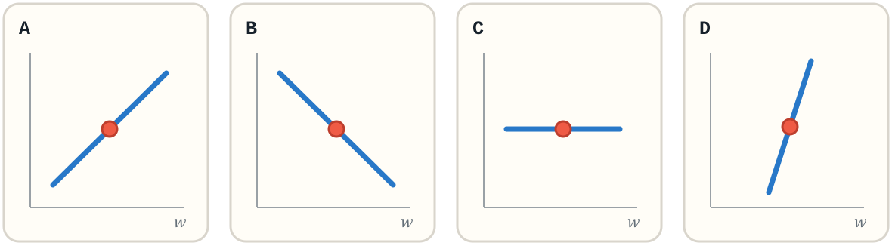
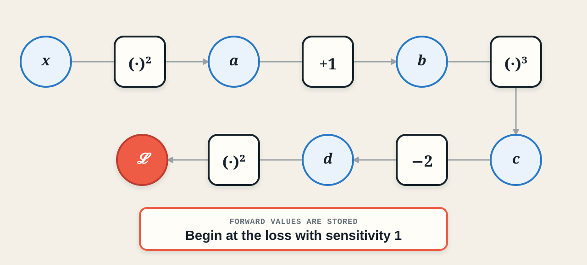
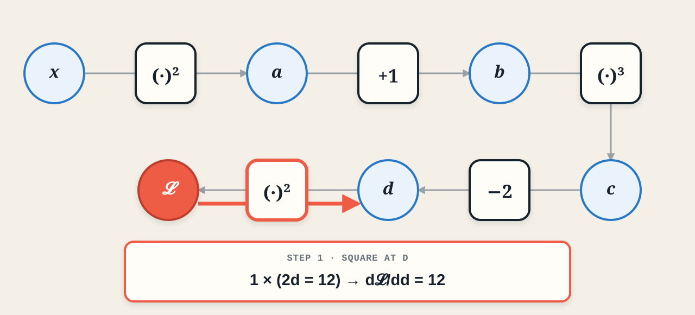
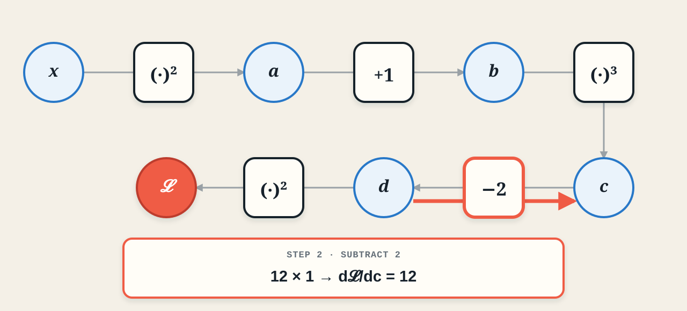
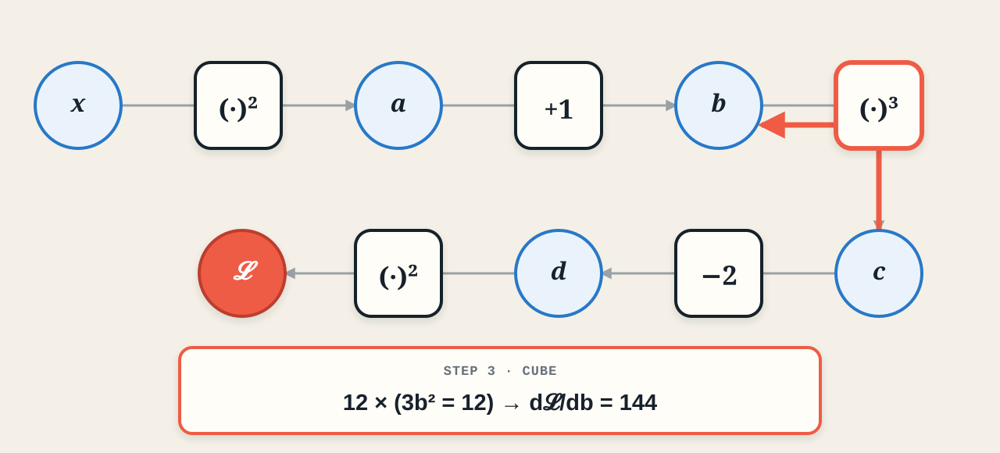
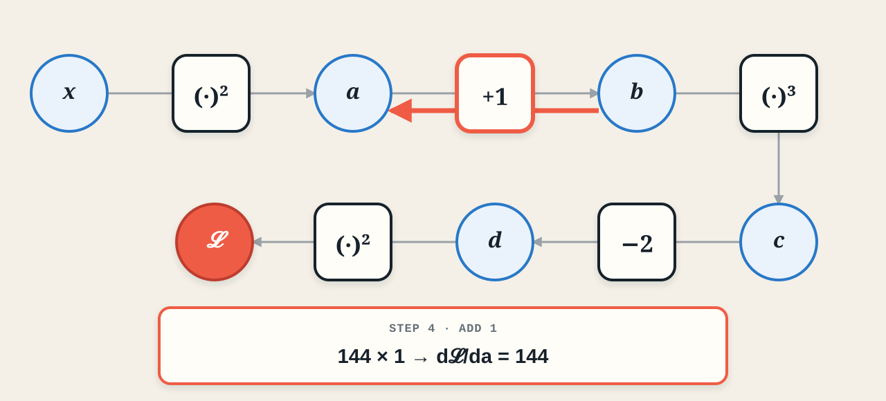
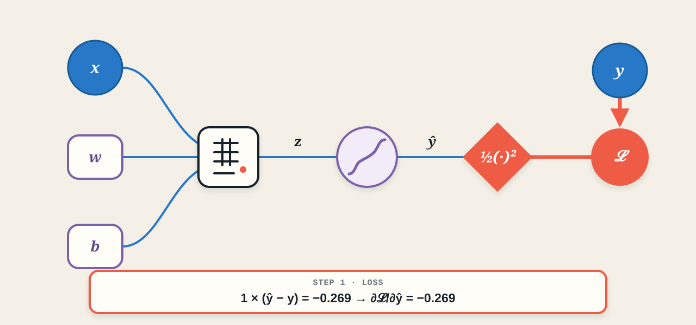
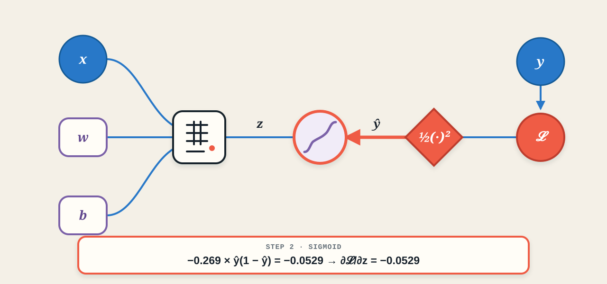
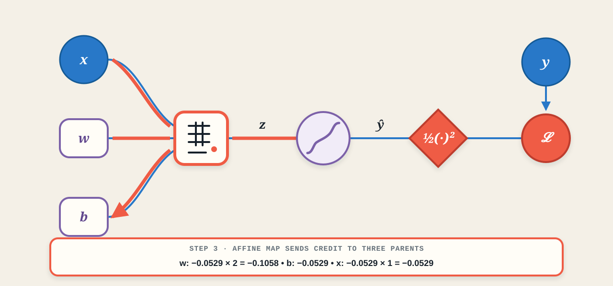

## Backpropagation: from error to credit {.deck-title}

:::: {.deck-title-grid}
::: {.deck-title-copy}
<span class="eyebrow">CHAPTER 03 · FROM SCRATCH</span>

### Local derivatives, computation graphs, and gradient flow

The loss says **how wrong** we are. Backpropagation asks: **who contributed—and by how much?**

<span class="deck-author">Dr. A. Belcaid</span>
:::
::: {.deck-title-art .backprop-hero}
{fig-alt="A two-layer neural computation graph with blue signals flowing forward and coral gradient paths branching backward from a scalar loss."}
:::
::::

## Today's journey

:::: {.backprop-roadmap}
::: {.roadmap-stop .scalar-stop}
<span>01</span>

### One variable

Derivative as sensitivity
:::
::: {.roadmap-arrow}
→
:::
::: {.roadmap-stop}
<span>02</span>

### A chain

Multiply local derivatives
:::
::: {.roadmap-arrow}
→
:::
::: {.roadmap-stop}
<span>03</span>

### Many variables

Route partial derivatives
:::
::: {.roadmap-arrow}
→
:::
::: {.roadmap-stop .branch-stop}
<span>04</span>

### Branches

Accumulate gradient paths
:::
::: {.roadmap-arrow}
→
:::
::: {.roadmap-stop .network-stop}
<span>05</span>

### Two-layer MLP

One complete backward pass
:::
::: {.roadmap-arrow}
→
:::
::: {.roadmap-stop .diagnostic-stop}
<span>06</span>

### Gradient signals

What they reveal—and hide
:::
::::

::: {.roadmap-question .fragment}
<span>One rule travels through the whole graph:</span>
<strong>incoming gradient × local derivative</strong>
:::

::: {.notes}
Preview the conceptual progression only. Emphasize that we begin with familiar single-variable calculus, then add one complication at a time until the same rule works for a neural network. Parameter updates belong to the optimization lecture.
:::

# 01 · The credit assignment problem {.section-slide .credit-section data-section-progress="1 / 6" style="--section-progress:16.667%"}

## A confident mistake

:::: {.mistake-scene}
::: {.mistake-example}
<span class="example-label">ONE TRAINING EXAMPLE</span>

<div class="cat-photo">

</div>

<small class="cat-source">Image: <a href="https://cs231n.github.io/classification/">Stanford CS231n</a></small>

<div class="target-label"><small>true label</small><strong>cat · $y=1$</strong></div>
:::
::: {.mistake-prediction}
<span class="example-label">MODEL PREDICTION</span>

<div class="class-score wrong"><span>dog</span><i style="--score:88%"></i><b>0.88</b></div>
<div class="class-score"><span>cat</span><i style="--score:12%"></i><b>0.12</b></div>

::: {.fragment .loss-result}
<span>binary cross-entropy</span>
<strong>𝓛 = −log(0.12) = 2.12</strong>
:::
:::
::::

::: {.fragment .intro-conclusion}
<span>The loss confirms the mistake.</span>
<strong>It does not identify what caused it.</strong>
:::

::: {.notes}
Begin with the prediction, not the definition. Ask whether 0.12 is good for the true class. Reveal the loss only after students judge the output. The exact architecture is deliberately hidden for now; all we know is that the model is confidently wrong.
:::

## One number, many suspects

:::: {.credit-scene}
::: {.parameter-field}
<span class="example-label">TRAINABLE PARAMETERS</span>

<div class="parameter-cloud">
<span>W<sub>1</sub></span><span>b<sub>1</sub></span><span>W<sub>2</sub></span><span>b<sub>2</sub></span>
<span>w<sub>11</sub></span><span>w<sub>12</sub></span><span>w<sub>21</sub></span><span>⋯</span>
</div>
:::
::: {.credit-arrow}
<span>forward pass</span>
<b>→</b>
:::
::: {.scalar-loss}
<small>ONE SCALAR</small>
<strong>𝓛 = 2.12</strong>
:::
::::

::: {.fragment .credit-question}
How much responsibility does each parameter have for this error?
:::

::: {.fragment .credit-definition}
That is the **credit assignment problem**.
:::

::: {.notes}
Contrast the dimensionalities: many parameters enter the computation, but the loss compresses the outcome to one scalar. “Credit” can be positive or negative: a parameter may push the loss up or down. Avoid implying moral blame; responsibility means sensitivity of the loss to a small change.
:::

## Start with one suspect

:::: {.nudge-comparison}
::: {.nudge-state}
<span>BEFORE</span>
<strong>w = 0.40</strong>
<b>𝓛(w) = 2.12</b>
:::
::: {.nudge-action}
<span>NUDGE</span>
<strong>$+0.01$</strong>
<b>→</b>
:::
::: {.nudge-state .after}
<span>AFTER</span>
<strong>w = 0.41</strong>
<b>𝓛(w) = 2.08</b>
:::
::::

::: {.fragment .sensitivity-result}
<span>observed sensitivity</span>
<div class="difference-quotient">
<span class="fraction"><b>Δ𝓛</b><b>Δw</b></span>
<i>=</i>
<span class="fraction wide"><b>2.08 − 2.12</b><b>0.41 − 0.40</b></span>
<i>=</i><strong>−4</strong>
</div>
:::

::: {.fragment .sensitivity-meaning}
<div><span>sign</span><strong>direction</strong></div>
<div><span>magnitude</span><strong>strength</strong></div>
:::

::: {.notes}
Treat these as illustrative values, not a completed optimization step. Ask students to interpret the sign before revealing the takeaway. This finite change motivates the derivative as the limiting local sensitivity. We will next formalize it with single-variable calculus.
:::

# 02 · One variable {.section-slide .scalar-section data-section-progress="2 / 6" style="--section-progress:33.333%"}

## What happens as the nudge shrinks?

::: {.limit-question}
At $w=0.40$, estimate how the loss responds to a smaller and smaller change in **one** weight.
:::

::: {.difference-table}
<div class="table-head"><span>nudge $\Delta w$</span><span>new loss</span><span>$\Delta\mathcal L/\Delta w$</span></div>
<div class="fragment"><strong>$0.1$</strong><span>$1.76$</span><b>$-3.60$</b></div>
<div class="fragment"><strong>$0.01$</strong><span>$2.0804$</span><b>$-3.96$</b></div>
<div class="fragment"><strong>$0.001$</strong><span>$2.116004$</span><b>$-3.996$</b></div>
:::

::: {.fragment .limit-result}
<span>as Δw → 0</span>
<strong>d𝓛/dw → −4</strong>
:::

::: {.notes}
Ask students to predict the third row after seeing the first two. These illustrative measurements are consistent with the previous slide and approach −4. Emphasize that the derivative is not a new kind of quantity; it is the stabilized local sensitivity as the nudge vanishes.
:::

## The derivative is a local promise

:::: {.sensitivity-layout}
::: {.sensitivity-plot}
{fig-alt="A smooth loss curve with a descending tangent at w equals 0.40 and small changes delta w and delta L marked."}
:::
::: {.local-promise}
<span>NEAR $w=0.40$</span>

$$
\Delta\mathcal L
\approx
\frac{d\mathcal L}{dw}\,\Delta w
$$

::: {.fragment .numeric-promise}
If $\Delta w=+0.001$,

$$\Delta\mathcal L\approx(-4)(0.001)=-0.004$$
:::
:::
::::

::: {.fragment .local-warning}
Local means **near this value of $w$**—not everywhere on the curve.
:::

::: {.notes}
Connect the derivative to a tangent only after the numerical limiting process. Ask students to predict whether the loss moves up or down for a positive nudge. The tangent is a local linear model of the loss, not a global description.
:::

## Exercise · Read the local signal

::: {.gradient-sign-figure}
{fig-alt="Four local loss plots: A rises, B falls, C is flat, and D rises steeply at the marked parameter value."}
:::

::: {.exercise-prompt}
For each marked point, decide: is $d\mathcal L/dw$ positive, negative, or zero—and where is its magnitude largest?
:::

::: {.exercise-pause}
<span>PAUSE</span><b>90 seconds</b><small>Use the tangent direction at the coral point.</small>
:::

::: {.fragment .exercise-solution .gradient-solution}
<span class="solution-label">SOLUTION</span>
<div><b>A</b><span>positive</span></div><div><b>B</b><span>negative</span></div><div><b>C</b><span>zero</span></div><div><b>D</b><span>largest magnitude</span></div>
:::

::: {.notes}
Have students answer with hand signals: thumbs up, down, or flat for A–C, then identify D as the strongest sensitivity. Do not discuss parameter updates; the task is only to read what the derivative reveals locally.
:::

## Challenge · Can algebra reach the first node?

::: {.long-expression}
$$
\mathcal L(x)=\left[(x^2+1)^3-2\right]^2,
\qquad x=1
$$
:::

::: {.exercise-prompt}
Compute the derivative of the final quantity with respect to the first one: $d\mathcal L/dx$ at $x=1$.
:::

::: {.exercise-pause}
<span>PAUSE</span><b>2 minutes</b><small>Differentiate the nested expression using the chain rule you already know.</small>
:::

::: {.fragment .exercise-solution .algebra-solution}
<span class="solution-label">ALGEBRAIC SOLUTION</span>

$$
\frac{d\mathcal L}{dx}
=2\big[(x^2+1)^3-2\big]\;3(x^2+1)^2\;2x
$$

$$
\left.\frac{d\mathcal L}{dx}\right|_{x=1}
=2(6)\cdot3(2)^2\cdot2=288
$$
:::

::: {.notes}
Give students a genuine attempt. They already know enough calculus to solve this expression algebraically. The purpose is not to make the derivative mysterious; it is to make the bookkeeping cost visible. Reveal 288, then ask what happens when the expression contains thousands of operations.
:::

## Correct—but the bookkeeping does not scale

::: {.scalar-graph-figure}
{fig-alt="A two-row computation graph evaluates the nested expression from x equals 1 through five operations to loss 36, storing the intermediate values a, b, c, and d."}
:::

::: {.fragment .forward-summary}
<span>same expression</span><strong>five small operations · four remembered values</strong>
:::

::: {.notes}
Read the graph left to right and have students supply each value before revealing it verbally. The variable names are bookkeeping: each operation now has one small input-output relationship that can be differentiated independently.
:::

## Each operation knows one derivative

::: {.scalar-graph-figure}
{fig-alt="The same two-row computation graph with a coral local-derivative badge attached to each of the five operation nodes."}
:::

::: {.fragment .local-rule-card}
<span>local view</span><strong>Each operation differentiates only itself.</strong>
:::

::: {.notes}
Reveal one local derivative at a time from left to right. Ask for the generic derivative first, then substitute the stored forward value. No node needs to know the entire expression or the final answer.
:::

## Backpropagation assembles the same answer

```{=html}
<div class="r-stack backprop-step-stack">






</div>
```

::: {.notes}
Advance through the five graph states. At each step, point first to the incoming sensitivity, then to the highlighted operation's local derivative, and only then read the result in the external panel. The nodes remain uncluttered throughout. The final value 288 exactly matches the algebraic solution.
:::

## Exercise · Build a neuron's graph

::: {.long-expression .neuron-exercise-formula}
$$
z=wx+b,\qquad \hat y=\sigma(z),\qquad
\mathcal L=\frac12(\hat y-y)^2
$$

$$
x=2,\qquad w=1,\qquad b=-1,\qquad y=1
$$
:::

::: {.exercise-prompt}
Draw the computation graph from the four inputs to the loss. Introduce an intermediate node whenever a new value is produced.
:::

::: {.exercise-pause}
<span>PAUSE</span><b>2 minutes</b><small>Start with the affine map, then follow the formula from left to right.</small>
:::

::: {.fragment .exercise-solution}
<span class="solution-label">READY?</span> Compare your graph on the next slide.
:::

::: {.notes}
Do not let students differentiate yet. First check whether their graph has four leaves, an affine operation, a sigmoid operation, and a loss operation. This separates graph construction from gradient bookkeeping.
:::

## Worked solution · The forward graph

::: {.neuron-exercise-figure}
{fig-alt="Computation graph for one sigmoid neuron with inputs x, w, b, and target y. The graph evaluates an affine map, sigmoid, and squared-error loss."}
:::

::: {.fragment .graph-question}
The values are stored. From which node must the backward pass begin?
:::

::: {.notes}
Trace the forward values aloud: z equals 1, prediction equals 0.731, and loss equals 0.036. Then ask for the seed sensitivity at the loss. The answer is one.
:::

## Exercise · Send the credit backward

::: {.exercise-backprop-grid}
::: {.exercise-reference-graph}
{fig-alt="The completed forward graph remains visible as a reference while students backpropagate."}
:::

::: {.exercise-prompt .backprop-task}
Compute
$$
\frac{\partial\mathcal L}{\partial w},\qquad
\frac{\partial\mathcal L}{\partial b},\qquad
\frac{\partial\mathcal L}{\partial x}.
$$
Use <strong>incoming sensitivity × local derivative</strong> at every operation.
:::
:::

::: {.exercise-pause}
<span>PAUSE</span><b>3 minutes</b><small>Work right to left. Keep the forward values available.</small>
:::

::: {.fragment .exercise-solution}
<span class="solution-label">WORKED SOLUTION</span> Advance once more and check one operation at a time.
:::

## Worked solution · Backpropagate

```{=html}
<div class="r-stack backprop-step-stack neuron-backprop-stack">




</div>
```

::: {.notes}
Reveal only one operation at a time. At the affine map, emphasize the new structural idea: one node receives an incoming sensitivity and sends a different gradient to each of its three parents. This prepares the multivariate section without introducing optimization.
:::

# 03 · Multiple paths {.section-slide .multivariable-section data-section-progress="3 / 6" style="--section-progress:50%"}

## One input reaches the result twice

::: {.multivariable-intro-layout}
::: {.multivariable-cards}
::: {.multi-rule-card}
<span class="multi-card-label">GENERAL RULE</span>

When $f$ depends on $x$ and $y$, and both depend on $t$:
$$
\frac{df}{dt}
=\frac{\partial f}{\partial x}\frac{dx}{dt}
+\frac{\partial f}{\partial y}\frac{dy}{dt}.
$$
:::

::: {.fragment .multi-example-card}
<span class="multi-card-label">CONCRETE EXAMPLE</span>
$$
f(x,y)=y+e^{xy},\qquad
x(t)=\cos t,\qquad y(t)=t^2.
$$
:::

::: {.fragment .multi-result-card}
<span class="multi-card-label">FOLLOW BOTH PATHS</span>
$$
\frac{df}{dt}
=\underbrace{y e^{xy}}_{\partial f/\partial x}(-\sin t)
+\underbrace{(1+x e^{xy})}_{\partial f/\partial y}(2t)
$$
$$
=-t^2e^{t^2\cos t}\sin t
+2t\!\left(1+\cos t\,e^{t^2\cos t}\right).
$$
:::
:::

::: {.multivariable-path-graph}
{fig-alt="A computation graph in which t branches to x and y, and both paths meet at f. Each edge is labeled by its local derivative."}
:::
:::

::: {.notes}
Keep the graph visible throughout. First trace the left path from t through x to f, then the right path through y. Ask whether the two effects should replace or reinforce one another before revealing the plus sign. In the example, compute the four local derivatives first and only then substitute x equals cosine t and y equals t squared.
:::

## Exercise · One weight, two paths

::: {.regularization-formula}
$$
\mathcal L_{\text{total}}
=\underbrace{\frac12(\hat y-y)^2}_{\mathcal L_{\text{data}}}
+\underbrace{\frac{\lambda}{2}w^2}_{\mathcal L_{\text{reg}}},
\qquad \lambda=0.1.
$$
:::

::: {.regularization-layout}
::: {.regularization-graph}
{fig-alt="The weight w reaches the total loss through both the neuron data-loss path and an L2 regularization path."}
:::

::: {.regularization-question}
From the previous exercise:
$$
\frac{\partial\mathcal L_{\text{data}}}{\partial w}=-0.1058,
\qquad w=1.
$$

How does regularization change $\partial\mathcal L_{\text{total}}/\partial w$?
:::
:::

::: {.exercise-pause .compact-pause}
<span>PAUSE</span><b>90 seconds</b><small>Find the second path's contribution, then add the two paths.</small>
:::

::: {.fragment .regularization-solution}
<span class="solution-label">TWO PATHS · ONE GRADIENT</span>
$$
\frac{\partial\mathcal L_{\text{total}}}{\partial w}
=-0.1058+\lambda w
=-0.1058+0.1
=\boxed{-0.0058}.
$$
:::

::: {.notes}
Ask for the sign of the regularization contribution before computing it. The data term pushes w upward under gradient descent because its gradient is negative; the regularizer pushes w toward zero because its contribution is positive. The point here is path addition, not the optimization update itself.
:::

## Exercise · Open one linear neuron

::: {.linear-layer-figure}
{fig-alt="A four-input, three-output linear layer feeding a scalar loss. The four edges producing h1 and the incoming gradient from the loss are highlighted."}
:::

::: {.linear-layer-question}
Given $g_1=\partial\mathcal{L}/\partial h_1$, what messages should $h_1$ send to its four weights, four inputs, and bias?
:::

::: {.exercise-pause .compact-pause}
<span>PAUSE</span><b>90 seconds</b><small>Use incoming gradient × local derivative. Start from the scalar equation for h₁.</small>
:::

::: {.notes}
The gray connections establish the full layer, but keep attention on the four blue edges into h1. The coral arrow is the gradient arriving from everything downstream. Students only need the scalar rule learned in the previous section.
:::

## One neuron sends three kinds of message

::: {.linear-neuron-equation}
$$
h_1=w_{11}x_1+w_{12}x_2+w_{13}x_3+w_{14}x_4+b_1,
\qquad g_1=\frac{\partial\mathcal{L}}{\partial h_1}.
$$
:::

::: {.linear-message-grid}
::: {.fragment .linear-message-card}
<span>TO EACH WEIGHT</span>
$$
\frac{\partial\mathcal{L}}{\partial w_{1j}}
=g_1x_j
$$
<small>The local derivative of $h_1$ with respect to $w_{1j}$ is $x_j$.</small>
:::

::: {.fragment .linear-message-card}
<span>TO EACH INPUT</span>
$$
\left.\frac{\partial\mathcal{L}}{\partial x_j}\right|_{h_1}
=g_1w_{1j}
$$
<small>This is only the contribution arriving through $h_1$.</small>
:::

::: {.fragment .linear-message-card}
<span>TO THE BIAS</span>
$$
\frac{\partial\mathcal{L}}{\partial b_1}=g_1
$$
<small>The local derivative of $h_1$ with respect to $b_1$ is $1$.</small>
:::
:::

::: {.fragment .linear-message-summary}
The formulas differ only because each edge has a different <strong>local derivative</strong>.
:::

::: {.notes}
Reveal weights, inputs, and bias separately. For each card, ask students to name the incoming message and the local derivative before reading the product. The vertical bar on the input gradient is important: h1 supplies only one of three path contributions.
:::

## Backpropagation is message passing

::: {.message-passing-figure}
{fig-alt="A generic node receives gradient messages from two children, adds them, and sends locally transformed messages to three parents."}
:::

::: {.fragment .message-passing-rule}
<strong>Receive and add</strong> messages from children. <strong>Multiply locally and send</strong> messages to parents.
:::

::: {.notes}
Use family language carefully: parents produced v in the forward pass; children consumed v. Backpropagation reverses the direction. If several children used v, their messages add at v. The accumulated gradient is then multiplied by a different local derivative for each parent edge.
:::

## From three neurons to one linear-layer rule

::: {.linear-matrix-forward}
$$
\mathbf h=W\mathbf x+\mathbf b,
\qquad
W\in\mathbb R^{3\times4},
\quad \mathbf x\in\mathbb R^4,
\quad \mathbf g_h=\frac{\partial\mathcal{L}}{\partial\mathbf h}\in\mathbb R^3.
$$
:::

::: {.r-stack .linear-matrix-stage}
::: {.linear-matrix-rules .fragment .fade-out data-fragment-index="3"}
::: {.fragment .matrix-rule-card data-fragment-index="0"}
<span>INPUT MESSAGES ADD</span>
$$
\boxed{\displaystyle
\frac{\partial\mathcal{L}}{\partial\mathbf x}=W^\top\mathbf g_h}
$$
<small>$4\times3$ times $3\times1$ gives one gradient for each input.</small>
:::

::: {.fragment .matrix-rule-card data-fragment-index="1"}
<span>EVERY EDGE GETS A GRADIENT</span>
$$
\boxed{\displaystyle
\frac{\partial\mathcal{L}}{\partial W}=\mathbf g_h\mathbf x^\top}
$$
<small>$3\times1$ times $1\times4$ gives the full $3\times4$ weight matrix.</small>
:::

::: {.fragment .matrix-rule-card data-fragment-index="2"}
<span>EACH NEURON HAS ONE BIAS</span>
$$
\boxed{\displaystyle
\frac{\partial\mathcal{L}}{\partial\mathbf b}=\mathbf g_h}
$$
<small>The bias local derivative is one for every output neuron.</small>
:::
:::

::: {.fragment .linear-layer-conclusion data-fragment-index="3"}
<span class="conclusion-label">LINEAR LAYER · BACKWARD RULES TO REMEMBER</span>

::: {.conclusion-rule-grid}
<div><small>INPUT</small>$$\displaystyle \frac{\partial\mathcal{L}}{\partial\mathbf x}=W^\top\mathbf g_h$$</div>
<div><small>WEIGHTS</small>$$\displaystyle \frac{\partial\mathcal{L}}{\partial W}=\mathbf g_h\mathbf x^\top$$</div>
<div><small>BIAS</small>$$\displaystyle \frac{\partial\mathcal{L}}{\partial\mathbf b}=\mathbf g_h$$</div>
:::

<p class="conclusion-memory"><strong>Transpose to inputs</strong> · <strong>outer product to weights</strong> · <strong>copy to bias</strong></p>
:::
:::

::: {.fragment .matrix-rule-takeaway data-fragment-index="4"}
These are three forms of the same rule: <strong>incoming gradient × local derivative</strong>.
:::

::: {.notes}
Check dimensions before interpreting the equations. W transpose appears because each input must collect one contribution from every output neuron. The weight gradient is an outer product because every output message pairs with every input value.
:::

## Restore the full two-layer network

::: {.computation-graph-figure}
{fig-alt="Forward computation graph for a two-layer binary classifier. Input x and parameters W1 and b1 enter an affine operation and sigmoid; parameters W2 and b2 enter a second affine operation and sigmoid; the prediction and target y enter binary cross-entropy to produce loss L."}
:::

::: {.fragment .graph-question}
Every block receives a gradient message, applies its local rule, and sends new messages to its parents.
:::

::: {.fragment .derivation-reference}
<span>FULL WORKED DERIVATION</span>
[Read online](../../notes/03-backpropagation/two-layer-derivation.html) · [Download PDF](../../notes/03-backpropagation/two-layer-derivation.pdf)
:::

::: {.notes}
First read the established graph from left to right, then trace the backward order from the loss to the first affine map. The linear blocks use the matrix rules just derived; sigmoid and BCE contribute their own local derivative rules. No block needs to know the entire network.
:::

# 04 · Backward-rule toolbox {.section-slide .toolbox-section data-section-progress="4 / 6" style="--section-progress:66.667%"}

## Core transformation blocks

::: {.toolbox-grid}
::: {.fragment .toolbox-card .linear-tool-card}
<span class="toolbox-name">LINEAR</span>

<div class="toolbox-visual" aria-label="A matrix transforms an input vector into an output vector.">
<svg viewBox="0 0 260 125" role="img"><g class="tb-grid"><rect x="20" y="22" width="82" height="82" rx="10"/><path d="M47 22V104M75 22V104M20 49H102M20 77H102"/></g><path class="tb-arrow" d="M112 63H151"/><g class="tb-vector"><rect x="160" y="18" width="38" height="90" rx="10"/><path d="M160 48H198M160 78H198"/></g><text x="225" y="70">+ b</text></svg>
</div>

<span class="toolbox-forward">FORWARD</span>
$$
\mathbf y=W\mathbf x+\mathbf b
$$

<span class="toolbox-backward">BACKWARD MESSAGE</span>
$$
\mathbf g_x=W^\top\mathbf g_y
$$
$$
\nabla_W\mathcal L=\mathbf g_y\mathbf x^\top,
\qquad \nabla_{\mathbf b}\mathcal L=\mathbf g_y
$$

<strong class="toolbox-memory">transpose · outer product · copy</strong>
:::

::: {.fragment .toolbox-card .sigmoid-tool-card}
<span class="toolbox-name">SIGMOID</span>

<div class="toolbox-visual" aria-label="The S-shaped sigmoid curve.">
<svg viewBox="0 0 260 125" role="img"><path class="tb-axis" d="M22 105H240M35 114V12"/><path class="tb-curve" d="M35 102C87 102 91 74 126 63C161 52 164 23 225 23"/><circle class="tb-point" cx="126" cy="63" r="6"/></svg>
</div>

<span class="toolbox-forward">FORWARD</span>
$$
y=\sigma(x)
$$

<span class="toolbox-backward">BACKWARD MESSAGE</span>
$$
g_x=g_y\,y(1-y)
$$

<strong class="toolbox-memory">gate by the stored output</strong>
:::

::: {.fragment .toolbox-card .tanh-tool-card}
<span class="toolbox-name">TANH</span>

<div class="toolbox-visual" aria-label="The zero-centered S-shaped tanh curve.">
<svg viewBox="0 0 260 125" role="img"><path class="tb-axis" d="M22 63H240M130 114V12"/><path class="tb-curve" d="M35 101C89 101 94 78 113 68C124 62 136 64 147 57C167 45 170 24 225 24"/><circle class="tb-point" cx="130" cy="63" r="6"/></svg>
</div>

<span class="toolbox-forward">FORWARD</span>
$$
y=\tanh(x)
$$

<span class="toolbox-backward">BACKWARD MESSAGE</span>
$$
g_x=g_y(1-y^2)
$$

<strong class="toolbox-memory">one minus output squared</strong>
:::
:::

::: {.notes}
Reveal one card at a time. For every card, ask students to identify the stored forward value, the incoming message, and the local derivative. Linear is the only block here that sends three kinds of message; sigmoid and tanh are elementwise gates.
:::

## Gates, probabilities, and losses

::: {.toolbox-grid}
::: {.fragment .toolbox-card .relu-tool-card}
<span class="toolbox-name">RELU</span>

<div class="toolbox-visual" aria-label="A ReLU curve blocks negative inputs and passes positive inputs.">
<svg viewBox="0 0 260 125" role="img"><path class="tb-axis" d="M22 98H240M105 114V12"/><path class="tb-curve" d="M35 98H105L220 20"/><circle class="tb-point" cx="105" cy="98" r="6"/></svg>
</div>

<span class="toolbox-forward">FORWARD</span>
$$
y=\max(0,x)
$$

<span class="toolbox-backward">BACKWARD MESSAGE</span>
$$
g_x=g_y\,\mathbf 1[x>0]
$$

<strong class="toolbox-memory">pass or block</strong>
:::

::: {.fragment .toolbox-card .softmax-tool-card}
<span class="toolbox-name">SOFTMAX</span>

<div class="toolbox-visual" aria-label="Three logits are normalized into probability bars that sum to one.">
<svg viewBox="0 0 260 125" role="img"><g class="tb-bars muted"><rect x="25" y="62" width="25" height="43"/><rect x="58" y="25" width="25" height="80"/><rect x="91" y="78" width="25" height="27"/></g><path class="tb-arrow" d="M126 63H158"/><g class="tb-bars"><rect x="170" y="77" width="25" height="28"/><rect x="203" y="35" width="25" height="70"/></g><text x="198" y="22">Σp=1</text></svg>
</div>

<span class="toolbox-forward">FORWARD</span>
$$
p_i=\frac{e^{z_i}}{\sum_j e^{z_j}}
$$

<span class="toolbox-backward">VECTOR–JACOBIAN PRODUCT</span>
$$
\mathbf g_z=\mathbf p\odot
\left(\mathbf g_p-\mathbf p^\top\mathbf g_p\right)
$$

<strong class="toolbox-memory">the outputs interact</strong>
:::

::: {.fragment .toolbox-card .ce-tool-card}
<span class="toolbox-name">CROSS-ENTROPY</span>

<div class="toolbox-visual" aria-label="Predicted probability bars are compared with a one-hot target.">
<svg viewBox="0 0 260 125" role="img"><g class="tb-bars"><rect x="30" y="82" width="32" height="23"/><rect x="70" y="34" width="32" height="71"/><rect x="110" y="72" width="32" height="33"/></g><path class="tb-target" d="M178 100V24"/><text x="178" y="118">target</text><path class="tb-arrow coral" d="M151 63H194"/><circle class="tb-loss-dot" cx="222" cy="63" r="23"/><text class="light-svg" x="222" y="69">L</text></svg>
</div>

<span class="toolbox-forward">FORWARD</span>
$$
\mathcal L=-\sum_i y_i\log p_i
$$

<span class="toolbox-backward">FUSED SHORTCUTS</span>
$$
\text{softmax + CE:}\quad \mathbf g_z=\mathbf p-\mathbf y
$$
$$
\text{sigmoid + BCE:}\quad g_z=\hat y-y
$$

<strong class="toolbox-memory">prediction minus target</strong>
:::
:::

::: {.fragment .toolbox-footer}
Do not memorize six unrelated formulas. Identify the <strong>incoming message</strong> and multiply by the block's <strong>local derivative</strong>.
:::

::: {.notes}
ReLU is a hard gate. Softmax is different from the elementwise activations because changing one logit changes every output probability. End with the fused loss shortcuts: these are the expressions students will use most often in classifiers.
:::

# 05 · Automatic differentiation {.section-slide .autodiff-section data-section-progress="5 / 6" style="--section-progress:83.333%"}

## The same graph—now automatic

::: {.micrograd-demo-layout}
::: {.micrograd-code-panel}
<span class="demo-kicker">MICROGRAD · FORWARD</span>

```{.python code-line-numbers="false"}
from micrograd.engine import Value

x = Value(1.0)
L = ((x**2 + 1)**3 - 2)**2
```

::: {.fragment}
<span class="demo-kicker backward-kicker">ONE BACKWARD CALL</span>

```{.python code-line-numbers="false"}
L.backward()

print(x.grad)  # 288.0
```
:::
:::

::: {.micrograd-demo-graph}
{fig-alt="The familiar scalar graph after its complete backward pass, ending with derivative 288 at x."}
:::
:::

::: {.fragment .micrograd-question}
The answer is familiar. What did each `Value` have to remember for `backward()` to recover it?
:::

::: {.micrograd-source}
Demonstration API: [Karpathy's micrograd](https://github.com/karpathy/micrograd)
:::

::: {.notes}
Run the forward lines first and ask what x and L contain. Reveal the backward call only after students predict its result. Micrograd is intentionally a black box in this lecture; students will build the box during the coding session.
:::

## Inspect the `Value` objects created by code

::: {.value-inspector-code}
::: {.value-composed-code}
```{.python code-line-numbers="false"}
x, y, z = Value(2.0), Value(3.0), Value(1.0)

a = x * y       # 6
b = a + z       # 7
L = b ** 2      # 49
```
:::

::: {.value-composed-formula}
<strong class="composed-expression">𝓛 = (xy + z)²</strong>
<span>Every operator returns a new `Value`.</span>
:::
:::

::: {.value-inspector}
<div class="inspector-head"><span>PYTHON NAME</span><span>data</span><span>grad</span><span>_op</span><span>_prev</span><span>_backward</span></div>
<div class="fragment inspector-row leaf-row"><strong>x · y · z</strong><code>2 · 3 · 1</code><code>0</code><code>leaf</code><code>∅</code><code>no-op</code></div>
<div class="fragment inspector-row multiply-row"><strong>a</strong><code>6</code><code>0</code><code>'*'</code><code>{x, y}</code><code>multiply backward</code></div>
<div class="fragment inspector-row add-row"><strong>b</strong><code>7</code><code>0</code><code>'+'</code><code>{a, z}</code><code>add backward</code></div>
<div class="fragment inspector-row power-row"><strong>L</strong><code>49</code><code>0</code><code>'**2'</code><code>{b}</code><code>power backward</code></div>
:::

::: {.fragment .value-after-backward}
<span>AFTER `L.backward()`</span>
<code>L.grad = 1</code><code>b.grad = 14</code><code>a.grad = 14</code><code>x.grad = 42</code><code>y.grad = 28</code><code>z.grad = 14</code>
:::

::: {.notes}
Execute the expression one line at a time. Each overloaded Python operator constructs and returns a new Value. Read each inspector row across: the forward result, initial gradient, operation label, parent references, and the operation-specific backward closure. Only after all rows are understood should L.backward be revealed.
:::

## What does `backward()` actually do?

::: {.backward-algorithm-layout}
::: {.backward-order-panel}
<span class="algorithm-label">REVERSE TOPOLOGICAL ORDER</span>
<div class="order-row"><i>forward</i><b>$x$</b><span>→</span><b>$a$</b><span>→</span><b>$b$</b><span>→</span><b>$\mathcal L$</b></div>
<div class="order-row backward-order"><i>backward</i><b>$x$</b><span>←</span><b>$a$</b><span>←</span><b>$b$</b><span>←</span><b>$\mathcal L$</b></div>
:::

::: {.backward-pseudocode}
```{.python code-line-numbers="false"}
L.grad = 1.0

for node in reversed(topological_order):
    node._backward()
```
:::
:::

::: {.fragment .accumulation-rule}
<span>THE LINE THAT MAKES BRANCHING WORK</span>
```{.python code-line-numbers="false"}
parent.grad += node.grad * local_derivative
```
<strong>`+=` adds contributions from every path.</strong>
:::

::: {.notes}
Topological order guarantees that every child has sent its message before a node runs its local backward rule. Pause on plus-equals: assignment would erase a contribution whenever a value is reused in more than one place.
:::

## Coding session · Build the black box

::: {.coding-handoff-goal}
<span>THE TARGET</span>
<pre class="handoff-code"><code>x = Value(1.0)
a = x**2
b = a + 1
c = b**3
d = c - 2
L = d**2

L.backward()
assert x.grad == 288.0</code></pre>
:::

::: {.coding-handoff-steps}
<div class="fragment"><span>01</span><strong>Store the graph</strong><small>`data`, `grad`, parents, operation</small></div>
<div class="fragment"><span>02</span><strong>Define local rules</strong><small>addition, multiplication, power</small></div>
<div class="fragment"><span>03</span><strong>Order the nodes</strong><small>topological traversal</small></div>
<div class="fragment"><span>04</span><strong>Pass messages</strong><small>seed, reverse, accumulate</small></div>
<div class="fragment"><span>05</span><strong>Extend the engine</strong><small>activation, neuron, tiny MLP</small></div>
:::

::: {.fragment .coding-handoff-close}
In the lecture, `Value` was the tool. In the coding session, <strong>`Value` is the assignment.</strong>
:::

::: {.notes}
This slide is the contract for the coding session. The students are not asked to use unexplained future machinery: they will implement the exact mechanism motivated by the lecture and verify it against a derivative they already trust.
:::

# 06 · What gradients reveal {.section-slide .diagnostics-section data-section-progress="6 / 6" style="--section-progress:100%"}

## Read a gradient before using it

::: {.gradient-reading-grid}
::: {.fragment .gradient-reading-card .sign-card}
<span class="reading-icon">− / +</span>
<h3>Sign</h3>
<strong>Which local direction raises the loss?</strong>
<p>$g_w<0$: increasing $w$ locally lowers the loss.<br>$g_w>0$: increasing $w$ locally raises the loss.</p>
:::

::: {.fragment .gradient-reading-card .magnitude-card}
<span class="reading-icon">|g|</span>
<h3>Magnitude</h3>
<strong>How sensitive is the loss?</strong>
<p>Large $|g_w|$: a small change in $w$ has a strong local effect.<br>Small $|g_w|$: weak local sensitivity.</p>
:::

::: {.fragment .gradient-reading-card .zero-card}
<span class="reading-icon">0</span>
<h3>Near zero</h3>
<strong>A clue—not a diagnosis.</strong>
<p>The parameter may be locally irrelevant, a unit may be saturated, or several path contributions may cancel.</p>
:::
:::

::: {.fragment .gradient-interpretation-example}
<span>QUICK READ</span>
$$
\nabla_{\mathbf w}\mathcal L=\begin{bmatrix}-0.80 & 0.02 & 0.00\end{bmatrix}
$$
<p>$w_1$ has the strongest local influence; $w_2$ is weakly sensitive; $w_3$ requires investigation before we call it “unimportant.”</p>
:::

::: {.notes}
Ask students to interpret signs before magnitudes. Avoid converting the gradient into an update; that belongs to optimization. Emphasize that a zero gradient has several possible causes and must be interpreted using the graph and forward activations.
:::

## Read gradient flow across layers

::: {.gradient-flow-gallery}
::: {.fragment .gradient-flow-card .healthy-flow}
<span>HEALTHY FLOW</span>
<div class="flow-bars"><i style="--bar:82%"></i><i style="--bar:68%"></i><i style="--bar:59%"></i><i style="--bar:48%"></i></div>
<strong>Messages remain measurable</strong>
<p>Earlier layers still receive useful sensitivity.</p>
:::

::: {.fragment .gradient-flow-card .vanishing-flow}
<span>VANISHING</span>
<div class="flow-bars"><i style="--bar:82%"></i><i style="--bar:38%"></i><i style="--bar:13%"></i><i style="--bar:3%"></i></div>
<strong>Messages shrink backward</strong>
<p>Repeated small local derivatives can starve early layers.</p>
:::

::: {.fragment .gradient-flow-card .exploding-flow}
<span>EXPLODING</span>
<div class="flow-bars"><i style="--bar:18%"></i><i style="--bar:35%"></i><i style="--bar:66%"></i><i style="--bar:100%"></i></div>
<strong>Messages grow backward</strong>
<p>Repeated large transformations can create unstable sensitivity.</p>
:::
:::

::: {.fragment .flow-reading-key}
<span>loss side</span><div>backward direction&nbsp; ←</div><span>input side</span>
:::

::: {.fragment .diagnostic-boundary}
Gradients expose the symptom. Initialization, architecture, normalization, and optimization determine what we do about it later.
:::

::: {.notes}
Read each set of bars from the loss side toward the input side. The diagrams are qualitative signatures rather than fixed numerical thresholds. This slide establishes diagnostic vocabulary; defer remedies to the relevant architecture and optimization lectures.
:::

## Backpropagation in five moves

::: {.final-rule-strip}
<div class="fragment"><span>01</span><strong>Compute forward</strong><small>Store the values local rules will need.</small></div>
<div class="fragment"><span>02</span><strong>Seed the loss</strong><small>Set `loss.grad` to 1.</small></div>
<div class="fragment"><span>03</span><strong>Move backward</strong><small>Use reverse topological order.</small></div>
<div class="fragment"><span>04</span><strong>Transform locally</strong><small>Incoming gradient × local derivative.</small></div>
<div class="fragment"><span>05</span><strong>Add paths</strong><small>Add every contribution; never overwrite.</small></div>
:::

::: {.fragment .final-memory-panel}
<span>THE WHOLE IDEA</span>
<strong>Receive messages · add them · apply the local rule · send messages to parents.</strong>
:::

::: {.final-resource-grid}
<a href="../../notes/03-backpropagation/two-layer-derivation.html"><span>REFERENCE</span><strong>Full two-layer derivation</strong><small>Read online →</small></a>
<a href="../../notes/03-backpropagation/two-layer-derivation.pdf"><span>PDF</span><strong>Step-by-step backward pass</strong><small>Download →</small></a>
<div><span>NEXT</span><strong>Build `Value` from scratch</strong><small>Coding session →</small></div>
:::

::: {.fragment .exit-ticket}
<span>EXIT TICKET</span>
Why must a backward engine use `parent.grad += ...` rather than `parent.grad = ...`?
:::

::: {.notes}
Reveal the five moves briskly and have the class speak the final memory sentence together. End with the exit ticket. The expected answer is that a parent can influence the loss through several children, so overwriting would discard all but one path contribution.
:::
