## Optimization: making learning move {.deck-title}

:::: {.deck-title-grid}
::: {.deck-title-copy}
CHAPTER 04 · OPTIMIZATION

### From gradients to reliable parameter updates

Backpropagation tells us **how the loss changes**. Optimization decides **how the parameters should move**.

Dr. A. Belcaid
:::
::: {.deck-title-art .optimization-hero}
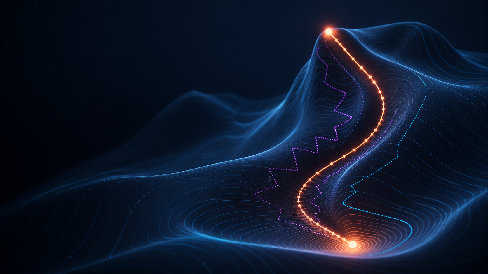{fig-alt="A luminous optimization trajectory descends through a narrow three-dimensional loss landscape, beside alternative zig-zagging paths."}
:::
::::

::: {.notes}
Connect directly to Chapter 3. Gradients are information, not updates. This chapter studies the rule that converts that information into a trajectory through parameter space. The hero previews three recurring ideas: landscape geometry, path history, and different step scales.
:::

## Today's journey

:::: {.optimization-roadmap}
::: {.optimizer-stop .landscape-stop}
01

### Loss landscapes

What does learning navigate?
:::
::: {.optimizer-stop .step-stop}
02

### Direction + step size

Gradient descent and learning rate
:::
::: {.optimizer-stop .difficulty-stop}
03

### Difficult terrain

Noise, ravines, plateaus, curvature
:::
::: {.optimizer-stop .momentum-stop}
04

### Remember direction

Momentum and Nesterov
:::
::: {.optimizer-stop .adaptive-stop}
05

### Adapt each step

AdaGrad, RMSProp, and Adam
:::
::: {.optimizer-stop .diagnostic-stop}
06

### Read the training run

Schedules, curves, and diagnosis
:::
::::

::: {.roadmap-question .fragment}
Our recurring experiment:
<strong>same landscape · same start · different update rule</strong>
:::

::: {.notes}
This is a 1h30 path with active demonstrations throughout, not six equal blocks. Sections 1–3 establish the mechanism and its failures. Sections 4–5 introduce optimizer families as responses to visible failures. Section 6 translates the visual intuition into practical training decisions. Use Gradient Lab repeatedly with the same initial point and change one control at a time.
:::

# 01 · Loss landscapes {.section-slide .landscape-section data-section-progress="1 / 6" style="--section-progress:16.667%"}

## One model, many parameter settings

::: {.landscape-model}
TWO-PARAMETER CLASSIFIER

$$
z=w_1x_1+w_2x_2,\qquad \hat y=\sigma(z)
$$
:::

:::: {.boundary-gallery}
::: {.boundary-card .fragment}
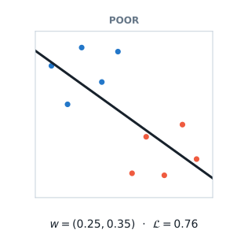{fig-alt="A poor linear decision boundary for the small binary dataset, with high binary cross-entropy."}
:::
::: {.boundary-card .fragment}
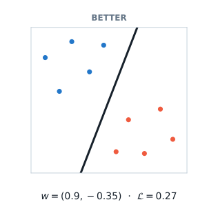{fig-alt="A better linear decision boundary for the same dataset, with lower binary cross-entropy."}
:::
::: {.boundary-card .fragment}
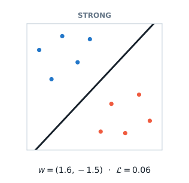{fig-alt="A strong linear decision boundary separating the same dataset, with the lowest binary cross-entropy of the three settings."}
:::
::::

::: {.landscape-takeaway .fragment}
same data · same model
<strong>change the parameters → change the predictions → change the loss</strong>
:::

::: {.notes}
Begin with the concrete classifier. Reveal one parameter setting at a time and ask students to predict whether its loss should be higher or lower before showing the next panel. The values are computed from the ten displayed observations with binary cross-entropy; they are not decorative estimates. Do not introduce optimization yet—we are only establishing that each parameter setting produces one model and one loss.
:::

## Parameters become a point

:::: {.parameter-map}
::: {.parameter-vector}
THE MODEL STORES

$$
\theta=
\begin{bmatrix}
w_1\\[4pt]w_2
\end{bmatrix}
=
\begin{bmatrix}
0.25\\[4pt]0.35
\end{bmatrix}
$$

<i></i><b></b><b></b><b></b><b></b><em></em>

:::
::: {.mapping-arrow .fragment}
one coordinate
<strong>→</strong>
:::
::: {.parameter-plane .fragment}
PARAMETER SPACE

  <i class="axis-x"></i><i class="axis-y"></i>
  <b class="parameter-dot"></b>
  <em>$(0.25,\,0.35)$</em>
  <small class="w1-label">$w_1$</small><small class="w2-label">$w_2$</small>

:::
::::

::: {.parameter-loss-map .fragment}
$$
(w_1,w_2)\quad\longmapsto\quad \mathcal L(w_1,w_2)
$$

<strong>Every point represents one complete model—and receives one loss.</strong>
:::

::: {.notes}
Make the representation change explicit: the two numbers that defined a boundary on the previous slide are now coordinates. A point in parameter space is not an observation and not a hidden activation; it is a complete parameter setting. For a model with P parameters, the same idea produces a point in P-dimensional space.
:::

## Build the landscape—do not assume it

:::: {.landscape-build}
::: {.build-stage}
1 · EVALUATE
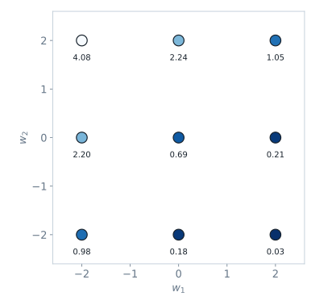{fig-alt="Nine sampled parameter settings labeled by their computed loss."}

Try several parameter settings.

:::
::: {.build-arrow .fragment}
→
:::
::: {.build-stage .fragment}
2 · CONNECT
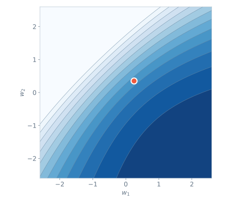{fig-alt="A contour map joining parameter settings that have equal loss."}

Join regions of equal loss.

:::
::: {.build-arrow .fragment}
→
:::
::: {.build-stage .fragment}
3 · LIFT
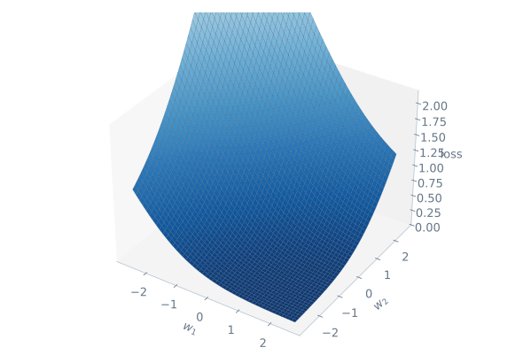{fig-alt="A three-dimensional rendering of the same two-parameter loss surface."}

Use height to encode loss.

:::
::::

::: {.landscape-definition .fragment}
<strong>A loss landscape is simply the loss evaluated across parameter settings.</strong>
:::

::: {.notes}
This slide prevents the landscape metaphor from becoming mystical. First we could train several models and record their losses. A dense set of evaluations creates the contour view; height creates the 3D view. All three panels describe the same function for the same classifier. Contours are usually more useful for reading directions, while surfaces are often more intuitive for introducing the idea.
:::

## Which move would you choose?

:::: {.contour-exercise}
::: {.contour-visual}
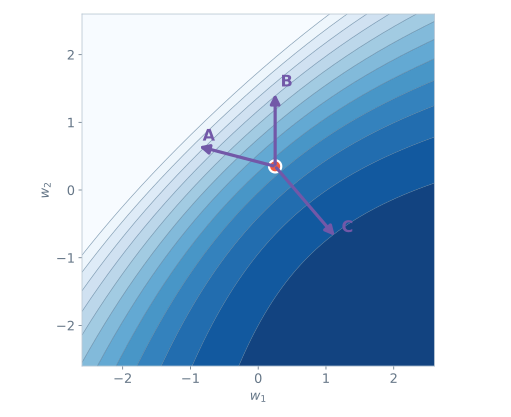{fig-alt="A loss contour map with a current parameter point and three candidate moves labeled A, B, and C."}
:::
::: {.contour-prompt}
READ THE MAP

### From the orange point, which move should reduce the loss most?

<b>A</b><b>B</b><b>C</b>

::: {.pause-panel}
<strong>PAUSE · 45 seconds</strong>
Use only the contour shading—no derivatives yet.
:::

::: {.fragment .move-answer}
WORKED READING
<strong>C crosses toward progressively lower-loss contours.</strong>
<small>A and B enter darker, higher-loss regions.</small>
:::
:::
::::

::: {.notes}
Ask for a vote before advancing. The exercise uses visual global information, which an optimizer will not actually possess. That tension is intentional and motivates the next slide. Emphasize that the choice is about a small move from the current point, not jumping directly to a visible minimum.
:::

## We see the map—the optimizer does not

:::: {.knowledge-contrast}
::: {.teacher-view}
OUR TEACHING VIEW
{fig-alt="The full loss contour map visible to the instructor and students."}
<strong>surface · contours · basin</strong>
:::
::: {.optimizer-view .fragment}
OPTIMIZER'S VIEW

  <b></b><i class="local-gradient"></i>

<strong>one point · one loss · local gradient</strong>
:::
::::

::: {.local-question .fragment}

At step $t$, it knows

$$
\theta_t,\quad \mathcal L(\theta_t),\quad \nabla_\theta\mathcal L(\theta_t)
$$

<strong>How should that local information become the next point?</strong>

:::

::: {.notes}
Correct a common misconception: gradient-based training does not render or search the whole surface. We can visualize the complete two-dimensional example because it is tiny. The optimizer evaluates the current minibatch loss and obtains local derivatives through backpropagation. Section 2 will turn that gradient into a direction and choose a step size.
:::

## A useful picture—with one warning

:::: {.dimension-story}
::: {.dimension-card .two-d}
OUR EXACT EXAMPLE
<strong>2 parameters</strong>

$(w_1,w_2)$

<small>The complete landscape fits on a page.</small>
:::
::: {.dimension-expand .fragment}
→
:::
::: {.dimension-card .many-d .fragment}
A REAL NETWORK
<strong>$P$ parameters</strong>

$(\theta_1,\theta_2,\ldots,\theta_P)$

<small>The landscape lives in $P$ dimensions.</small>
:::
::::

:::: {.slice-explanation .fragment}
::: {.slice-visual}

<i></i><i></i><i></i><i></i><i></i><b></b>

:::
::: {.slice-copy}
### Most neural-network landscapes are visualized through a 1D or 2D slice.

The picture is a **thinking tool**—not a complete map of millions of dimensions.
:::
::::

::: {.section-bridge .fragment}

KEEP THIS IDEA

<strong>Training is a trajectory through parameter space.</strong>

The update rule determines that trajectory.

:::

::: {.notes}
Be precise about dimensionality. Our logistic classifier truly has two parameters, so its surface is exact. For a network, a plotted surface usually varies parameters along two selected directions while holding the remaining coordinates implicit. The picture remains pedagogically useful for curvature, ravines, and trajectories, but it should not be presented as the full object.
:::

# 02 · Direction + step size {.section-slide .step-section data-section-progress="2 / 6" style="--section-progress:33.333%"}

## The gradient answers a local question

:::: {.slope-story}
::: {.slope-plot}
{fig-alt="A one-dimensional quadratic loss curve at w equals 3, with a tangent whose positive slope points uphill to the right and a negative-gradient arrow pointing downhill to the left."}
:::
::: {.slope-reading}

AT THE CURRENT POINT

$$
\mathcal L(w)=(w-1)^2,\qquad w_t=3
$$

The derivative is positive. Which way lowers the loss?

REVEAL
<strong>Move opposite the slope: to the left.</strong>
<small>$\nabla_w\mathcal L(3)=4$, so $-\nabla_w\mathcal L(3)=-4$.</small>

:::
::::

::: {.gradient-principle .fragment}

LOCAL RULE

The gradient points toward the steepest local increase; its negative points toward the steepest local decrease.

:::

::: {.notes}
Budget about three minutes. Start with the curve, not the definition. Ask students to read the sign of the tangent and choose left or right before revealing the arrow interpretation. The statement is local: it identifies the steepest infinitesimal decrease at the current point, not the location of the minimum and not a promise that any finite step will help.
:::

## An update needs two decisions

:::: {.update-anatomy}
::: {.update-equation}

GRADIENT DESCENT

$$
\theta_{t+1}=\theta_t-\eta\,\nabla_\theta\mathcal L(\theta_t)
$$
:::
::: {.update-parts}

1 · DIRECTION
<strong>$-\nabla_\theta\mathcal L(\theta_t)$</strong>
<small>Which way should we move?</small>

2 · STEP SIZE
<strong>$\eta$</strong>
<small>How far should we move?</small>

:::
::::

::: {.step-vector-demo .fragment}

<b></b>$\theta_t$

<i></i>smaller $\eta$

<i></i>larger $\eta$

<b></b>

<b></b>

:::

::: {.update-caution .fragment}

SAME GRADIENT

Changing $\eta$ keeps the direction—but changes the destination.

:::

::: {.notes}
Budget about two minutes. Read the equation from left to right as an action: start at the current parameters, obtain the local direction from backpropagation, scale it, and subtract. Use the lower vector diagram to distinguish direction from distance. Eta is dimensionless notation here; its practical scale depends on the loss, parameterization, batch, and optimizer.
:::

## Your turn: execute one update

:::: {.update-exercise}
::: {.exercise-givens}

GIVENS

$$
\theta_t=
\begin{bmatrix}0.25\\0.35\end{bmatrix},\qquad
\nabla_\theta\mathcal L(\theta_t)=
\begin{bmatrix}0.40\\-0.20\end{bmatrix},\qquad
\eta=0.5
$$

<strong>Task:</strong> compute $\theta_{t+1}$ and state how each parameter moves.

:::
::: {.exercise-work}

<strong>PAUSE · 60 seconds</strong>
Scale the gradient first; then subtract component by component.

WORKED SOLUTION

$$
\theta_{t+1}
=\begin{bmatrix}0.25\\0.35\end{bmatrix}
-0.5\begin{bmatrix}0.40\\-0.20\end{bmatrix}
=\begin{bmatrix}0.05\\0.45\end{bmatrix}
$$

<small>$w_1$ decreases by $0.20$; $w_2$ increases by $0.10$.</small>

:::
::::

::: {.transfer-check .fragment}

TRANSFER

If $\eta$ doubled, would the direction change, the distance change, or both?

Only the distance: the update would be twice as long.

:::

::: {.notes}
Budget about three minutes including the pause. Insist on the minus sign: the second gradient component is negative, so subtracting it increases w2. Reveal the numerical displacement before the verbal interpretation. For the transfer question, keep the gradient fixed; later sections will show that changing the destination changes the next gradient.
:::

## Same start, same landscape—change only $\eta$

:::: {.rate-experiment}
::: {.rate-card .slow-rate .fragment}

$\eta=0.05$

{fig-alt="Loss contours with a very short gradient-descent trajectory that makes safe but slow progress from the same initial point."}
<strong>Safe, but slow</strong>
<small>Ten updates barely cross the basin.</small>
:::
::: {.rate-card .useful-rate .fragment}

$\eta=0.25$

{fig-alt="Loss contours with a gradient-descent trajectory that reaches the low-loss center efficiently from the same initial point."}
<strong>Useful progress</strong>
<small>Steps shrink naturally near the minimum.</small>
:::
::: {.rate-card .large-rate .fragment}

$\eta=0.85$

{fig-alt="Loss contours with a gradient-descent trajectory that overshoots repeatedly across the basin from the same initial point."}
<strong>Overshoots</strong>
<small>Loss can oscillate—or even diverge.</small>
:::
::::

::: {.rate-conclusion .fragment}

CONCLUSION

The gradient chooses a direction. The learning rate decides whether that direction becomes progress.

:::

::: {.notes}
Budget about three minutes. Reveal the panels left to right and ask students to describe the path before naming it. All panels use the same quadratic landscape, initial point, and update rule; eta is the only controlled variable. A small eta is not incorrect—it trades time for conservative movement. A large eta can cross the valley because the gradient is local while the update is finite.
:::

## One update becomes a training loop

:::: {.gd-loop}
::: {.loop-stage .data-stage}

$B_t$

<strong>Sample a minibatch</strong>
<small>data</small>
:::
::: {.loop-arrow .fragment}
→
:::
::: {.loop-stage .forward-stage .fragment}

$\hat y$

<strong>Predict</strong>
<small>hypothesis</small>
:::
::: {.loop-arrow .fragment}
→
:::
::: {.loop-stage .loss-stage .fragment}

$\mathcal L$

<strong>Measure error</strong>
<small>loss</small>
:::
::: {.loop-arrow .fragment}
→
:::
::: {.loop-stage .gradient-stage .fragment}

$\nabla$

<strong>Backpropagate</strong>
<small>gradient</small>
:::
::: {.loop-arrow .fragment}
→
:::
::: {.loop-stage .update-stage .fragment}

$\theta^+$

<strong>Update parameters</strong>
<small>optimization</small>
:::
::::

::: {.loop-return .fragment}

↖

<strong>Repeat with the new parameters</strong>Evaluation remains separate: judge generalization on held-out data.

:::

::: {.notes}
Budget about two minutes. This reconnects optimization to the course's five-part frame. The optimizer does not replace the model, loss, or backpropagation; it consumes the gradient and changes theta. Point out that minibatch sampling makes the observed gradient vary, which sets up the next section, but do not teach stochastic optimization failures yet. Evaluation uses held-out data and does not produce training updates.
:::

## Gradient descent works cleanly on the easy bowl

:::: {.easy-bowl-bridge}
::: {.easy-bowl-visual}
{fig-alt="A smooth bowl-shaped contour landscape with gradient descent converging toward its center."}
:::
::: {.easy-bowl-copy}

SO FAR, WE ASSUMED

<b>01</b>a smooth, well-scaled bowl

<b>02</b>a trustworthy local gradient

<b>03</b>one learning rate that works everywhere

<strong>What changes when the landscape is narrow, flat, curved, or noisy?</strong>

:::
::::

::: {.notes}
Budget about one minute. This is a deliberate handoff, not a summary of failure modes. Students now have the baseline mechanism needed to recognize why difficult terrain causes trouble. Section 3 should break these assumptions one at a time using the same starting point and controlled comparisons.
:::

# 03 · Difficult terrain {.section-slide .difficulty-section data-section-progress="3 / 6" style="--section-progress:50%"}

## One rule—three very different journeys

:::: {.terrain-gallery}
::: {.terrain-card .bowl-card}

WELL-SCALED BOWL

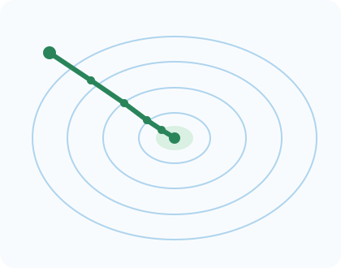{fig-alt="Circular loss contours with a short gradient-descent path moving directly toward the minimum."}
<strong>Direct progress</strong>
:::
::: {.terrain-card .ravine-card .fragment}

NARROW RAVINE

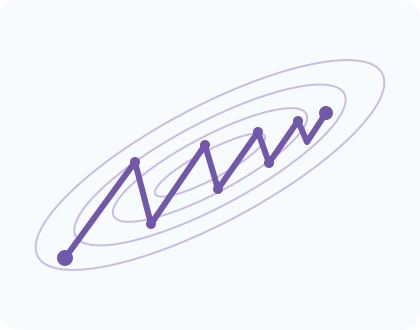{fig-alt="Long narrow loss contours with a gradient-descent path zig-zagging across the steep walls while progressing slowly along the valley."}
<strong>Side-to-side oscillation</strong>
:::
::: {.terrain-card .plateau-card .fragment}

FLAT PLATEAU

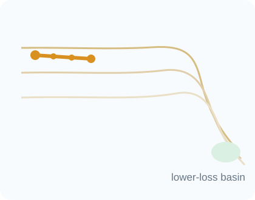{fig-alt="A mostly flat loss surface with a gradient-descent path making tiny steps far from the low-loss basin."}
<strong>Barely moves</strong>
:::
::::

::: {.terrain-control .fragment}

CONTROLLED COMPARISON

Same update rule · comparable start · useful learning rate on the easy bowl

:::

::: {.notes}
Budget about two minutes. Reveal one landscape at a time and ask students to describe only the path before naming the failure. The optimizer has not changed; the local geometry has. The three panels establish the section's organizing question: what information is missing when one current gradient is converted directly into one step?
:::

## Why does the ravine produce a zig-zag?

:::: {.ravine-exercise}
::: {.ravine-visual}
{fig-alt="A narrow diagonal ravine with the gradient at the current point decomposed into a large across-ravine component and a small along-ravine component."}
:::
::: {.ravine-prompt}

READ THE COMPONENTS

### Which component dominates the next update?

<b>A</b> along the valley<b>B</b> across the valley

::: {.pause-panel}
<strong>PAUSE · 45 seconds</strong>
Compare arrow lengths before thinking about the minimum.
:::

WORKED READING
<strong>B dominates: steep walls create a large across-valley gradient.</strong>
<small>The sign flips on the opposite wall, so successive steps bounce while forward progress remains small.</small>

:::
::::

::: {.ravine-transfer .fragment}

TRANSFER

Lowering $\eta$ reduces the bouncing—but what happens to progress along the shallow valley?

It becomes even slower.

:::

::: {.notes}
Budget about three minutes including the pause. Use the component decomposition to connect the visual path to the gradient. Curvature is high across the ravine and low along it. A single scalar learning rate scales both components equally, creating a compromise: large enough to move along the valley can be too large across it; safe across it can be painfully slow along it.
:::

## A small gradient does not mean “we are done”

:::: {.flat-contrast}
::: {.flat-case .minimum-case}

AT A MINIMUM

{fig-alt="A one-dimensional loss curve at its minimum, where the local slope and gradient are near zero and the loss is low."}

gradient<strong>small</strong>loss<strong>low</strong>

:::
::: {.flat-case .plateau-case .fragment}

ON A PLATEAU

{fig-alt="A one-dimensional loss curve on a high flat plateau, where the local slope and gradient are near zero although the loss remains high."}

gradient<strong>small</strong>loss<strong>high</strong>

:::
::::

::: {.flat-conclusion .fragment}

SAME LOCAL SIGNAL

$\lVert\nabla\mathcal L\rVert\approx0$ can mean success, a plateau, or a saddle-like region.

Check the loss and the recent trajectory—not the gradient norm alone.

:::

::: {.notes}
Budget about two minutes. Ask whether a near-zero gradient is sufficient evidence of convergence before revealing the plateau. It is not. In high dimensions, saddle points and broad flat regions are additional possibilities. Keep the claim operational: diagnose with the loss level and recent movement rather than introducing Hessian eigenvalue analysis here.
:::

## A minibatch gradient is a noisy estimate

:::: {.noise-story}
::: {.noise-visual}
{fig-alt="At one parameter point, six minibatches produce negative-gradient update arrows with different directions; their average points toward the full-dataset descent direction."}
:::
::: {.noise-copy}

SAME PARAMETERS · DIFFERENT MINIBATCHES

Which arrow should the optimizer trust?

REVEAL
<strong>Each minibatch provides an estimate—not the exact full-data gradient.</strong>
<small>Averaging more examples usually reduces variation, but costs more computation per update.</small>

:::
::::

::: {.gradient-estimate .fragment}

$-g_t=-\nabla_\theta\mathcal L_{B_t}(\theta_t)$

≈

$-\nabla_\theta\mathcal L_{\mathrm{data}}(\theta_t)$

useful direction + sampling noise

:::

::: {.notes}
Budget about three minutes. First reveal the minibatch update arrows and ask whether any single one is wrong. They are negative gradients of different minibatch losses, so variation is expected. The mean arrow in the diagram represents the full-data descent tendency conceptually. Avoid claiming that larger batches are universally better: they reduce gradient variance but change computational and generalization tradeoffs.
:::

## “SGD” can refer to three different batch regimes

::: {.batch-example}

CONCRETE DATASET

<strong><i>N</i> = 1,200</strong>training examples

How many examples contribute to one gradient update?

:::

:::: {.batch-regimes}
::: {.batch-regime .single-regime .fragment}

$|B_t|=1$

<b></b>

<strong>Stochastic GD</strong>
<small>one example per update</small>

very noisyvery frequent updates

:::
::: {.batch-regime .mini-regime .fragment}

$1<|B_t|<N$

<b></b><b></b><b></b><b></b><b></b><b></b><b></b><b></b>

<strong>Minibatch SGD</strong>
<small>for example, 32 or 128 examples</small>

moderate noiseefficient parallel work

:::
::: {.batch-regime .full-regime .fragment}

$|B_t|=N$

<b></b><b></b><b></b><b></b><b></b><b></b><b></b><b></b><b></b><b></b><b></b><b></b><b></b><b></b><b></b><b></b>

<strong>Full-batch GD</strong>
<small>all 1,200 examples per update</small>

exact dataset gradientexpensive update

:::
::::

::: {.sgd-language .fragment}

LANGUAGE WARNING

In deep learning, “SGD” usually means <strong>minibatch SGD</strong>. “Batch” alone is ambiguous—say <strong>minibatch</strong> or <strong>full batch</strong>.

:::

::: {.notes}
Budget about two minutes. Anchor all three regimes to the same 1,200-example dataset and vary only the number of examples used for one update. Strictly, stochastic gradient descent uses one example; common deep-learning usage extends the name SGD to minibatches. Full-batch gradient descent computes the exact gradient of the finite training-set objective, not a noise-free gradient of the unknown population objective. Update frequency alone is not wall-clock speed: hardware parallelism makes minibatches especially practical.
:::

## Curvature changes the safe step size

:::: {.curvature-comparison}
::: {.curvature-panel .gentle-panel}

GENTLE CURVATURE

$\mathcal L(w)=\tfrac12 w^2$

{fig-alt="A broad quadratic curve where a fixed learning-rate step moves safely toward the minimum."}
<strong>The step stays inside the bowl.</strong>
:::
::: {.curvature-panel .sharp-panel .fragment}

SHARP CURVATURE

$\mathcal L(w)=4w^2$

{fig-alt="A sharp quadratic curve where the same learning rate creates a much larger gradient step that overshoots the minimum."}
<strong>The same $\eta$ overshoots.</strong>
:::
::::

::: {.curvature-mechanism .fragment}

<b>1</b>Sharper curve

→

<b>2</b>Larger gradient change

→

<b>3</b>Smaller safe $\eta$

:::

::: {.notes}
Budget about two minutes. This is a controlled one-dimensional comparison: same starting coordinate and same eta, different curvature. The sharper quadratic produces a larger gradient magnitude and a more aggressive update. State the practical conclusion rather than proving a smoothness bound: the learning rate that is safe depends on the local curvature, which can differ across directions and change during training.
:::

## Read the failure before choosing a remedy

:::: {.failure-diagnostic}
::: {.failure-row .fragment}

↔

<strong>Zig-zag across a narrow valley</strong>large alternating gradient component

need directional persistence

:::
::: {.failure-row .fragment}

···

<strong>Loss remains high; steps become tiny</strong>weak local signal

need patience or a changed scale

:::
::: {.failure-row .fragment}

↝

<strong>Direction changes between minibatches</strong>sampling variation

need a steadier trajectory

:::
::: {.failure-row .fragment}

⌁

<strong>One scale is safe here but unstable there</strong>unequal or changing curvature

need scale awareness

:::
::::

::: {.momentum-bridge .fragment}

NEXT QUESTION

What if the optimizer remembered which directions have been consistent?

:::

::: {.notes}
Budget about two minutes. Treat this as diagnosis, not a list to memorize. Reveal the evidence column first and ask students to name the visible behavior. The final phrases describe information a remedy would need; they do not yet name algorithms. The last question motivates momentum as history-based directional persistence in section 4.
:::

# 04 · Remember direction {.section-slide .momentum-section data-section-progress="4 / 6" style="--section-progress:66.667%"}

## Gradient descent forgets after every step

:::: {.memory-contrast}
::: {.memory-panel .forget-panel}

PLAIN GRADIENT DESCENT

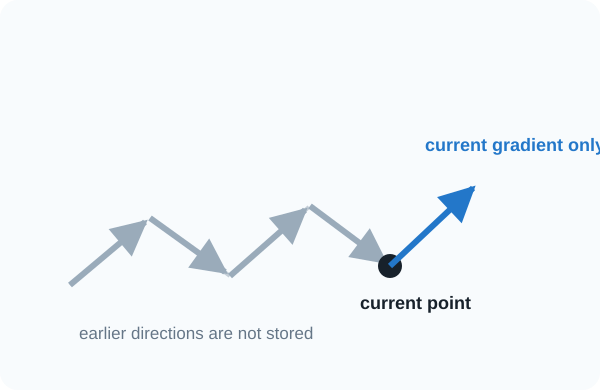{fig-alt="A sequence of recent update arrows ending at the current point, followed by a new step that uses only the current gradient and ignores the earlier consistent direction."}
<strong>Uses the current gradient only</strong>
<small>Past directions disappear from the next decision.</small>
:::
::: {.memory-panel .remember-panel .fragment}

MOMENTUM

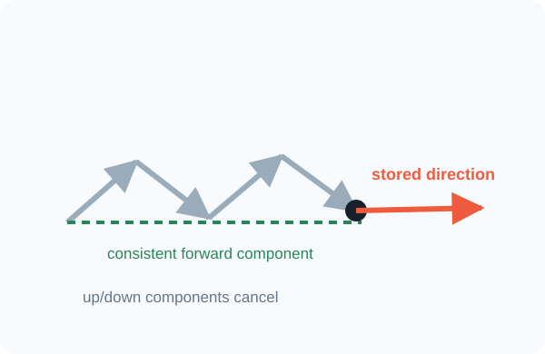{fig-alt="A sequence of recent update arrows whose consistent horizontal components accumulate into a longer forward arrow while alternating vertical components cancel."}
<strong>Carries a running direction</strong>
<small>Consistent components reinforce; oscillating components cancel.</small>
:::
::::

::: {.memory-principle .fragment}

NEW INFORMATION

The next step depends on the current gradient <em>and</em> the recent path.

:::

::: {.notes}
Budget about two minutes. Begin with the information limitation: plain gradient descent is memoryless. Reveal momentum only after students identify that recent arrows contain a stable horizontal tendency and an alternating vertical tendency. Momentum is not merely “faster gradient descent”; it changes the state of the optimizer by storing a running direction.
:::

## Momentum adds one state variable

:::: {.momentum-mechanism}
::: {.momentum-equations}

CLASSICAL MOMENTUM

$$
v_{t+1}=\beta v_t+g_t,
\qquad g_t=\nabla_\theta\mathcal L(\theta_t)
$$

$$
\theta_{t+1}=\theta_t-\eta v_{t+1}
$$
:::
::: {.momentum-parts}

HISTORY
<strong>$\beta v_t$</strong>
<small>retain part of the running direction</small>

+

NEW EVIDENCE
<strong>$g_t$</strong>
<small>add the current gradient</small>

:::
::::

::: {.beta-reading .fragment}

$0\leq\beta<1$

<strong>smaller $\beta$</strong>shorter memory

<i></i><b></b>

<strong>larger $\beta$</strong>longer memory

:::

::: {.convention-note .fragment}

NOTATION NOTE

Some libraries scale the new gradient by $(1-\beta)$. The stored quantity changes scale; the idea is the same.

:::

::: {.notes}
Budget about three minutes. Define g_t first, then reveal the history and current-gradient terms. This course uses the classical accumulated-gradient convention v equals beta v plus g. Flag the alternative exponentially weighted average convention now so students are not confused by library documentation later. Eta still controls the final parameter displacement.
:::

## In a ravine, history changes the path

:::: {.momentum-ravine-compare}
::: {.ravine-path-card .gd-path}

GRADIENT DESCENT

{fig-alt="A narrow ravine with plain gradient descent zig-zagging strongly across its walls and progressing slowly along the valley."}
<strong>Alternating wall-to-wall steps</strong>
:::
::: {.path-versus .fragment}
→
:::
::: {.ravine-path-card .momentum-path .fragment}

WITH MOMENTUM

{fig-alt="The same narrow ravine and starting point with momentum damping side-to-side oscillation and moving farther along the valley."}
<strong>Oscillation damped · progress accumulated</strong>
:::
::::

::: {.component-memory .fragment}

ACROSS THE VALLEY<strong>$+,-,+,-$</strong><small>cancels over time</small>

⇢

ALONG THE VALLEY<strong>$+,+,+,+$</strong><small>builds over time</small>

:::

::: {.notes}
Budget about two minutes. This is the recurring controlled experiment: same ravine, same start, same learning rate. Read the component signs in the lower strip. Momentum does not know the ravine geometry explicitly; its memory makes alternating components cancel and persistent components accumulate. Avoid saying it eliminates oscillation in every case—beta and eta still matter.
:::

## Your turn: update the optimizer state

:::: {.momentum-exercise}
::: {.momentum-givens}

GIVENS

$$
\theta_t=
\begin{bmatrix}1.00 \\ -0.50\end{bmatrix},\quad
v_t=\begin{bmatrix}0.60 \\ -0.20\end{bmatrix},\quad
g_t=\begin{bmatrix}0.20 \\ 0.40\end{bmatrix}
$$

$$
\beta=0.9,\qquad \eta=0.1
$$

<strong>Task:</strong> compute $v_{t+1}$, then $\theta_{t+1}$.

:::
::: {.momentum-work}
::: {.pause-panel}
<strong>PAUSE · 75 seconds</strong>
Update the velocity before using it to move the parameters.
:::

WORKED SOLUTION

$$
v_{t+1}=0.9
\begin{bmatrix}0.60 \\ -0.20\end{bmatrix}
{}+\begin{bmatrix}0.20 \\ 0.40\end{bmatrix}
=\begin{bmatrix}0.74 \\ 0.22\end{bmatrix}
$$

$$
\theta_{t+1}=\begin{bmatrix}1.00 \\ -0.50\end{bmatrix}
{}-0.1\begin{bmatrix}0.74 \\ 0.22\end{bmatrix}
=\begin{bmatrix}0.926 \\ -0.522\end{bmatrix}
$$

:::
::::

::: {.momentum-transfer .fragment}

INTERPRET

The second component of $g_t$ is positive. Why is the new velocity still influenced by its earlier negative value?

Momentum blends new evidence with stored history.

:::

::: {.notes}
Budget about three minutes including the pause. Students must update optimizer state before parameters. Work component by component and keep the sign convention visible: v stores accumulated gradients, and theta moves by minus eta v. The transfer question is the conceptual point—one gradient does not immediately erase history.
:::

## How much history should survive?

:::: {.beta-experiment}
::: {.beta-card .beta-zero}

$\beta=0$

<i></i><i></i><i></i><i></i><b></b>

<strong>No memory</strong>
<small>$v_{t+1}=g_t$</small>
:::
::: {.beta-card .beta-mid .fragment}

$\beta=0.9$

<i></i><i></i><i></i><i></i><b></b>

<strong>Persistent history</strong>
<small>recent directions remain influential</small>
:::
::: {.beta-card .beta-high-card .fragment}

$\beta=0.99$

<i></i><i></i><i></i><i></i><b></b>

<strong>Very long memory</strong>
<small>stable—but slow to change course</small>
:::
::::

::: {.beta-tradeoff .fragment}

more smoothing · stronger persistence

<i></i>

slower response to a new direction

:::

::: {.notes}
Budget about two minutes. Reveal beta values from left to right. Beta zero recovers plain gradient descent under this convention. Larger beta preserves history longer, which can smooth noise and sustain motion, but can also carry the optimizer past a turn. Treat 0.9 as a common reference value, not a universal optimum.
:::

## Nesterov asks at the look-ahead point

:::: {.nesterov-story}
::: {.nesterov-visual}
{fig-alt="A contour landscape showing the current parameter point, the momentum-only look-ahead point, the gradient evaluated there, and the corrected Nesterov destination."}
:::
::: {.nesterov-copy}

<b>1</b>Follow stored momentum to a provisional point

$$
\theta_t^{\mathrm{look}}=\theta_t-\eta\beta v_t
$$

<b>2</b>Measure the gradient there—not back at $\theta_t$

$$
v_{t+1}=\beta v_t+\nabla\mathcal L(\theta_t^{\mathrm{look}})
$$

<b>3</b>Use the corrected direction

$$
\theta_{t+1}=\theta_t-\eta v_{t+1}
$$
:::
::::

::: {.nesterov-conclusion .fragment}

NESTEROV MOMENTUM

Look where momentum is taking you, then correct using the local evidence there.

:::

::: {.notes}
Budget about three minutes. Build the picture in three advances: momentum predicts a provisional location, the gradient is evaluated at that look-ahead point, and the final step incorporates the correction. This is the conceptual distinction from classical momentum. Mention that equivalent-looking update formulas exist because implementations store and scale velocity differently.
:::

## Remembering direction solves only part of the problem

:::: {.momentum-scorecard}
::: {.score-row .score-help .fragment}

✓

<strong>Ravine oscillation</strong>alternating components can cancel

:::
::: {.score-row .score-help .fragment}

✓

<strong>Noisy directions</strong>history can steady the trajectory

:::
::: {.score-row .score-limit .fragment}

?

<strong>Different scales across parameters</strong>one global $\eta$ still scales every coordinate

:::
::: {.score-row .score-limit .fragment}

?

<strong>Changing curvature</strong>the useful step size may still vary by coordinate and time

:::
::::

::: {.adaptive-bridge .fragment}

NEXT QUESTION

What if each parameter received its own step scale?

:::

::: {.notes}
Budget about one minute. Momentum adds directional memory, not coordinate-wise scale adaptation. Use the two unresolved rows to motivate AdaGrad, RMSProp, and Adam. Do not imply the optimizer families are mutually exclusive—Adam will combine momentum-like first-moment memory with adaptive second-moment scaling.
:::

# 05 · Adapt each step {.section-slide .adaptive-section data-section-progress="5 / 6" style="--section-progress:83.333%"}

## One learning rate can mean two very different steps

:::: {.coordinate-problem}
::: {.coordinate-visual}
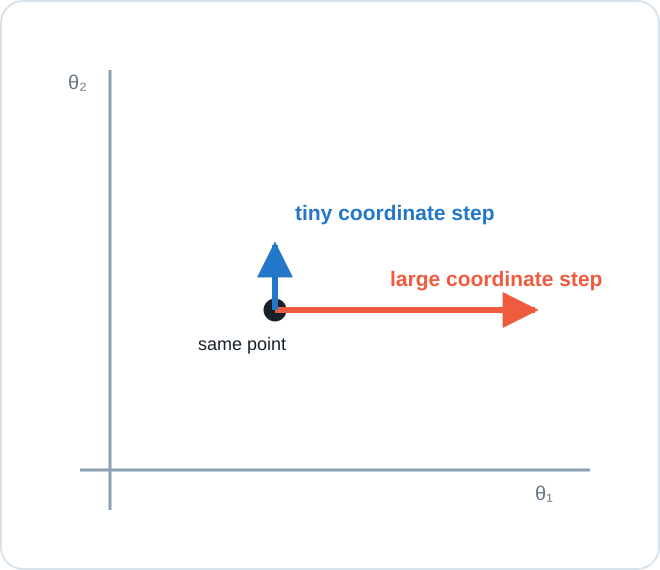{fig-alt="Two parameter coordinates at the same point: coordinate one has a consistently large gradient scale and receives an oversized step, while coordinate two has a small gradient scale and barely moves under one global learning rate."}
:::
::: {.coordinate-copy}

SAME GLOBAL $\eta$

coordinate 1<strong>$g_{t,1}=8.0$</strong><small>step is too aggressive</small>

coordinate 2<strong>$g_{t,2}=0.08$</strong><small>step is barely visible</small>

Should both coordinates use the same effective scale?

:::
::::

::: {.coordinate-conclusion .fragment}

ADAPTIVE IDEA

Keep a separate denominator for each coordinate: large historical gradients shrink future steps; small ones preserve them.

:::

::: {.notes}
Budget about two minutes. Begin with the numerical mismatch. A scalar eta multiplies both coordinates, but their gradient scales differ by a factor of one hundred. The goal is not to make every coordinate move equally; it is to normalize persistent scale differences so one coordinate does not dominate merely because its gradients are numerically larger.
:::

## AdaGrad remembers every squared gradient

:::: {.adagrad-mechanism}
::: {.adagrad-equations}

ADAGRAD

$$
s_t=s_{t-1}+g_t\odot g_t
$$

$$
\theta_{t+1}=\theta_t-
\frac{\eta}{\sqrt{s_t}+\varepsilon}\odot g_t
$$
:::
::: {.adagrad-reading}

SQUARE<strong>$g_t\odot g_t$</strong><small>measure magnitude without sign</small>

ACCUMULATE<strong>$s_t$</strong><small>store a total for each coordinate</small>

NORMALIZE<strong>$1/(\sqrt{s_t}+\varepsilon)$</strong><small>reduce repeatedly large coordinates</small>

:::
::::

::: {.elementwise-note .fragment}

$\odot$

<strong>All operations are element-wise.</strong>Each parameter receives its own accumulated scale and effective step size.

:::

AdaGrad: [@duchi2011adagrad]

::: {.notes}
Budget about three minutes. Read the mechanism in the order square, accumulate, normalize. Squaring removes the sign because s tracks scale, not direction. Epsilon prevents division by zero. Emphasize that s has the same shape as theta; adaptive optimization introduces per-parameter state rather than searching for one scalar learning rate that suits every coordinate.
:::

## Your turn: compare two coordinate updates

:::: {.adaptive-exercise}
::: {.adaptive-givens}

GIVENS

$$
g_t=\begin{bmatrix}4\\1\end{bmatrix},\qquad
s_{t-1}=\begin{bmatrix}0\\0\end{bmatrix},\qquad
\eta=0.1,\quad\varepsilon=0
$$

<strong>Task:</strong> compute $s_t$ and the AdaGrad displacement $\Delta\theta_t$.

:::
::: {.adaptive-work}
::: {.pause-panel}
<strong>PAUSE · 75 seconds</strong>
Square first, then divide each gradient component by its own square root.
:::

WORKED SOLUTION

$$
s_t=\begin{bmatrix}16\\1\end{bmatrix}
$$

$$
\Delta\theta_t
=-0.1\begin{bmatrix}4/\sqrt{16}\\1/\sqrt{1}\end{bmatrix}
=\begin{bmatrix}-0.1\\-0.1\end{bmatrix}
$$

<small>The raw gradients differ by $4\times$; the first-step normalized displacements are equal.</small>

:::
::::

::: {.adaptive-transfer .fragment}

INTERPRET

If coordinate 1 keeps producing large gradients, what happens to its denominator?

It keeps growing, so its effective step keeps shrinking.

:::

::: {.notes}
Budget about three minutes including the pause. This intentionally uses epsilon zero to keep the arithmetic transparent; real implementations require a small positive epsilon. Equal first-step magnitudes are a property of this constructed example, not AdaGrad's objective in general. The transfer question exposes the consequence of an accumulator that can only increase.
:::

## AdaGrad’s strength becomes its weakness

:::: {.adagrad-history}
::: {.history-plot}
{fig-alt="Across training steps, AdaGrad's accumulated squared-gradient total rises monotonically while the effective learning rate falls and never recovers after an early burst of large gradients."}
:::
::: {.history-copy}

AFTER AN EARLY BURST

accumulator $s_t$<strong>can only increase</strong>

effective step $\eta/\sqrt{s_t}$<strong>can only decrease</strong>

<strong>What if the useful scale changes later?</strong>AdaGrad never forgets the old large gradients.

:::
::::

::: {.forgetting-bridge .fragment}

NEEDED

Keep recent squared gradients—but gradually forget distant ones.

:::

::: {.notes}
Budget about two minutes. The graph shows an early high-gradient phase permanently enlarging the denominator. This can be useful for sparse problems, where rare coordinates retain relatively larger steps, but it can make continued neural-network training stall. The desired repair is selective memory, not abandoning coordinate-wise scaling.
:::

## RMSProp replaces the total with a moving average

:::: {.rmsprop-mechanism}
::: {.rmsprop-visual}
{fig-alt="A timeline of squared gradients with old observations fading and recent observations retaining weight in an exponentially weighted moving average."}
:::
::: {.rmsprop-copy}

RMSPROP

$$
s_t=\rho s_{t-1}+(1-\rho)g_t\odot g_t
$$

$$
\theta_{t+1}=\theta_t-
\frac{\eta}{\sqrt{s_t}+\varepsilon}\odot g_t
$$

<strong>Same normalization</strong>but $s_t$ can now adapt when the recent scale changes.

:::
::::

::: {.adagrad-rmsprop-contrast .fragment}

ADAGRAD<strong>sum of all past squares</strong><small>memory only grows</small>

→

RMSPROP<strong>weighted recent squares</strong><small>old evidence fades</small>

:::

RMSProp: [@tieleman2012rmsprop]

::: {.notes}
Budget about two minutes. Compare only the state update; the normalization step remains the same. Rho controls how quickly the squared-gradient scale can change. RMSProp was popularized in Hinton's neural-networks course notes. Keep rho conceptually distinct from momentum beta even though both are exponential-memory coefficients.
:::

## Adam keeps two kinds of memory

:::: {.adam-assembly}
::: {.adam-memory .first-memory .fragment}

FIRST MOMENT

$m_t$

<strong>Which direction persists?</strong>
<small>momentum-like average of gradients</small>
:::
::: {.adam-plus .fragment}
+
:::
::: {.adam-memory .second-memory .fragment}

SECOND MOMENT

$v_t$

<strong>What scale is typical?</strong>
<small>RMSProp-like average of squared gradients</small>
:::
::::

:::: {.adam-equations .fragment}
::: {.adam-state}
$$
m_t=\beta_1m_{t-1}+(1-\beta_1)g_t
$$

$$
v_t=\beta_2v_{t-1}+(1-\beta_2)g_t^2
$$
:::
::: {.adam-update}
$$
\hat m_t=\frac{m_t}{1-\beta_1^t},\qquad
\hat v_t=\frac{v_t}{1-\beta_2^t}
$$

$$
\theta_{t+1}=\theta_t-
\eta\frac{\hat m_t}{\sqrt{\hat v_t}+\varepsilon}
$$
:::
::::

::: {.bias-correction .fragment}

WHY THE HATS?

Both averages start at zero. Bias correction compensates for that cold start during early updates.

:::

Adam: [@kingma2015adam]

::: {.notes}
Budget about three minutes. Build Adam from the two memories before showing its equations. Here v denotes the second-moment state, not the classical-momentum velocity used in section 4; call out this overloaded convention explicitly. The square in g_t squared is element-wise. Bias correction matters most early because both moving averages are initialized at zero.
:::

## Match the optimizer to the information it stores

:::: {.optimizer-memory-table}
::: {.memory-header}

OPTIMIZER

DIRECTION MEMORY

SCALE MEMORY

MAIN TRADEOFF

:::
::: {.memory-table-row .fragment}

<strong>Gradient descent</strong>

—

—

simple; one global scale

:::
::: {.memory-table-row .fragment}

<strong>Momentum</strong>

✓

—

smoother path; can overshoot turns

:::
::: {.memory-table-row .fragment}

<strong>AdaGrad</strong>

—

all past squares

steps may decay too far

:::
::: {.memory-table-row .fragment}

<strong>RMSProp</strong>

—

recent squares

adapts scale; still no direction memory

:::
::: {.memory-table-row .adam-row .fragment}

<strong>Adam</strong>

✓

recent squares

more state; convenient strong baseline

:::
::::

::: {.diagnostic-bridge .fragment}

FINAL SECTION

The optimizer produces a trajectory. How do we read whether that trajectory is healthy?

:::

::: {.notes}
Budget about two minutes. This table organizes algorithms by stored information, not by a universal ranking. Adam is often a convenient baseline, but optimizer choice does not remove the need to tune the learning rate, monitor validation performance, or reason about the task. Transition from mechanisms to observable training evidence.
:::

# 06 · Read the training run {.section-slide .diagnostic-section data-section-progress="6 / 6" style="--section-progress:100%"}

## A training run leaves several traces

:::: {.run-dashboard}
::: {.dashboard-visual}
{fig-alt="A synchronized training dashboard showing training and validation loss, learning rate, and gradient norm over the same sequence of epochs."}
:::
::: {.dashboard-copy}

If the loss behaves badly, which trace explains why?

<b>1</b><strong>training loss</strong><small>is optimization making progress?</small>

<b>2</b><strong>validation loss</strong><small>does progress generalize?</small>

<b>3</b><strong>learning rate</strong><small>what step scale was applied?</small>

<b>4</b><strong>gradient norm</strong><small>was the local signal tiny or explosive?</small>

:::
::::

::: {.dashboard-principle .fragment}

DIAGNOSE JOINTLY

A single curve shows a symptom. Aligned traces help identify the cause.

:::

::: {.notes}
Budget about two minutes. Read all panels at the same epoch positions. Training loss answers an optimization question; validation loss answers a generalization question. Learning rate and gradient norm provide mechanism evidence. Do not diagnose from gradient norm alone—the scale depends on architecture, loss reduction, and parameterization.
:::

## The loss curve reveals the learning-rate regime

:::: {.loss-regimes}
::: {.loss-regime .slow-loss .fragment}

TOO SMALL

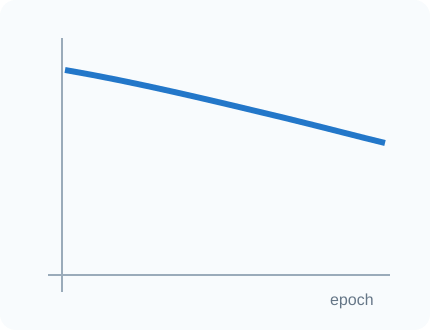{fig-alt="A smooth training-loss curve that decreases very slowly across epochs."}
<strong>Stable but nearly flat</strong>
<small>useful direction · insufficient distance</small>
:::
::: {.loss-regime .healthy-loss .fragment}

USEFUL RANGE

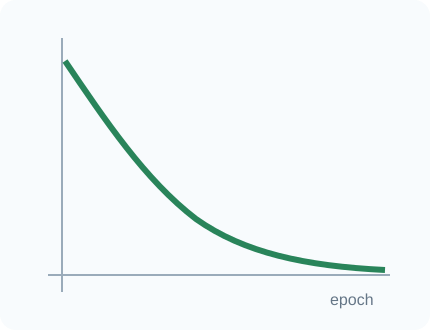{fig-alt="A training-loss curve that falls quickly and then settles smoothly."}
<strong>Fast decrease, then settling</strong>
<small>large early progress · smaller late gains</small>
:::
::: {.loss-regime .unstable-loss .fragment}

TOO LARGE

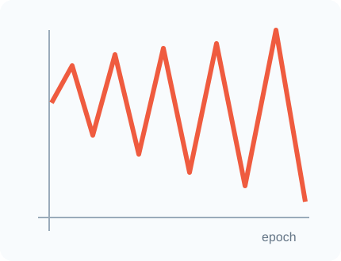{fig-alt="A training-loss curve with large oscillations and an eventual sharp increase."}
<strong>Oscillation or divergence</strong>
<small>finite steps repeatedly overshoot</small>
:::
::::

::: {.loss-caveat .fragment}

CAUTION

Noise is not automatically failure. Minibatch training can look jagged while its smoothed trend improves.

:::

::: {.notes}
Budget about two minutes. Reveal the curve before its label and ask students to name the visible evidence. These are signatures, not proofs: a flat curve can also reflect saturated activations, bad data, or a bug; divergence can come from exploding gradients or invalid numerics. Use additional traces before changing the optimizer.
:::

## Why schedule the learning rate?

:::: {.schedule-story}
::: {.schedule-visual}
{fig-alt="Four learning-rate schedules over training: constant, step decay, cosine decay, and warmup followed by cosine decay."}
:::
::: {.schedule-copy}

EARLY TRAINING<strong>Move far enough to make progress</strong><small>parameters are far from a useful solution</small>

LATE TRAINING<strong>Reduce the step to refine</strong><small>large updates can bounce around a good basin</small>

OPTIONAL WARMUP<strong>Reach the target rate gradually</strong><small>useful when early updates are fragile</small>

:::
::::

::: {.schedule-conclusion .fragment}

SCHEDULE ≠ OPTIMIZER

The optimizer defines how gradients become updates; the schedule changes the global learning rate over time.

:::

::: {.notes}
Budget about two minutes. Use the graph to separate optimizer state from the external learning-rate schedule. Decay supports coarse early movement and finer late refinement. Warmup is not required in every run; it is useful when immediately applying the target rate destabilizes early training. Step and cosine schedules are examples, not a universal ranking.
:::

## Your turn: diagnose before changing anything

:::: {.diagnosis-exercise}
::: {.diagnosis-evidence}

OBSERVED RUN

{fig-alt="Training loss decreases throughout training while validation loss decreases initially, reaches a minimum, and then rises."}

training loss keeps fallingvalidation loss turns upwardgradient norm remains finite

:::
::: {.diagnosis-work}

<strong>Task:</strong> choose the best diagnosis.
<b>A</b> learning rate too small<b>B</b> learning rate too large<b>C</b> overfitting

::: {.pause-panel}
<strong>PAUSE · 60 seconds</strong>
Use the relationship between training and validation loss.
:::

WORKED DIAGNOSIS
<strong>C · Overfitting</strong>
<small>Optimization still improves the training objective, but generalization worsens after the validation minimum.</small>

:::
::::

::: {.diagnosis-transfer .fragment}

ACTION

Keep the checkpoint with the best validation metric; then consider regularization, augmentation, more data, or earlier stopping.

:::

::: {.notes}
Budget about two minutes including the pause. This exercise prevents optimizer changes from becoming the default response to every bad curve. The training objective continues to improve, so the primary symptom is generalization, not failed optimization. A learning-rate schedule may affect the result, but it is not the most direct diagnosis from this evidence.
:::

## Translate symptoms into the next controlled test

:::: {.run-diagnostic-table}
::: {.run-diagnostic-header}

VISIBLE EVIDENCE

FIRST HYPOTHESIS

NEXT CONTROLLED TEST

:::
::: {.run-diagnostic-row .fragment}

<strong>loss decreases, but painfully slowly</strong>

step scale may be too small

increase $\eta$ modestly; keep everything else fixed

:::
::: {.run-diagnostic-row .fragment}

<strong>loss oscillates or becomes non-finite</strong>

steps or gradients may be too large

lower $\eta$; inspect gradient norm and numerics

:::
::: {.run-diagnostic-row .fragment}

<strong>loss is high and gradients are near zero</strong>

plateau, saturation, or dead path

inspect activations and initialization; test scale

:::
::: {.run-diagnostic-row .fragment}

<strong>training improves; validation worsens</strong>

overfitting

keep best checkpoint; test regularization

:::
::::

::: {.controlled-test-rule .fragment}

RULE

Change one factor, rerun from a comparable seed, and compare aligned traces.

:::

::: {.notes}
Budget about two minutes. This is a troubleshooting routine, not a guarantee. Each symptom generates a first hypothesis and a minimally confounded test. Encourage students to record configurations and seeds. A single run is noisy evidence; repeated runs matter when conclusions are consequential.
:::

## The complete optimization story

:::: {.optimization-summary}
::: {.summary-step .fragment}

01

<strong>Read the local signal</strong>the gradient points uphill

:::
::: {.summary-arrow .fragment}
→
:::
::: {.summary-step .fragment}

02

<strong>Choose direction + distance</strong>negative gradient and learning rate

:::
::: {.summary-arrow .fragment}
→
:::
::: {.summary-step .fragment}

03

<strong>Add useful memory</strong>momentum and adaptive scales

:::
::: {.summary-arrow .fragment}
→
:::
::: {.summary-step .fragment}

04

<strong>Read the trajectory</strong>curves, schedules, and evaluation

:::
::::

::: {.five-frame-return .fragment}

data

hypothesis

loss

optimization

evaluation

:::

::: {.final-takeaway .fragment}

TAKEAWAY

An optimizer is not a magic model chooser—it is a rule for turning local evidence into a training trajectory.

:::

::: {.notes}
Budget about one minute. Close by returning to the five-part frame. Optimization consumes the loss gradient and changes the hypothesis parameters; evaluation judges the resulting model on held-out data. The durable skill is not memorizing a ranking of optimizers, but connecting stored information and hyperparameters to observable trajectories.
:::
