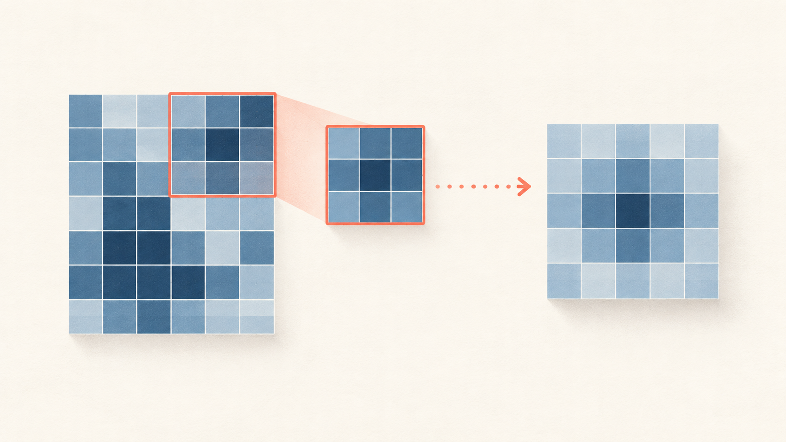
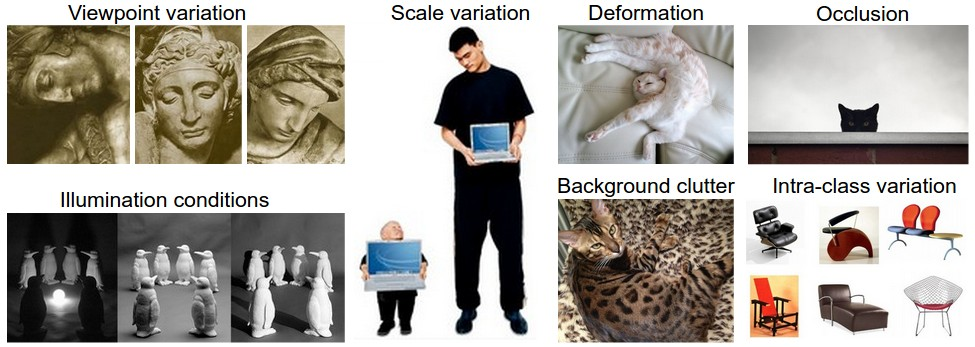
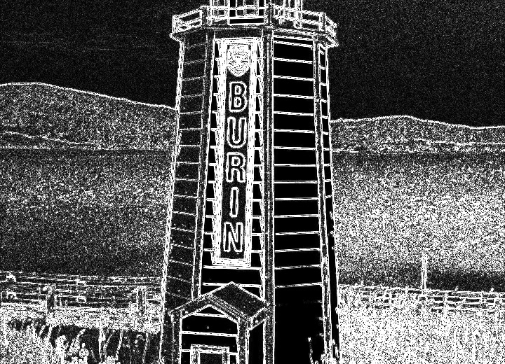
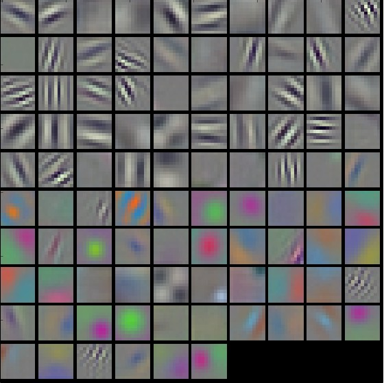
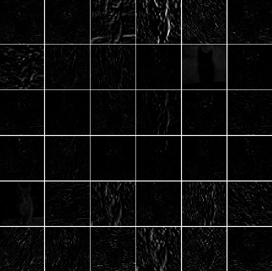
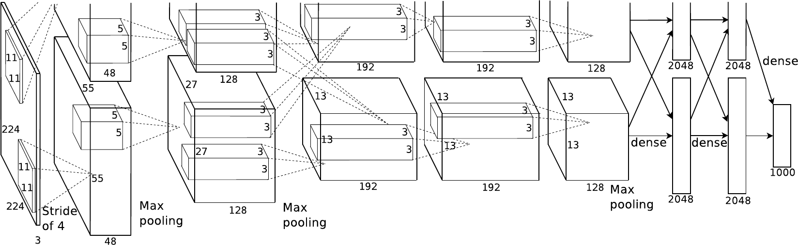

## Convolutional Neural Networks {.deck-title}

:::: {.deck-title-grid}
::: {.deck-title-copy}
CHAPTER 07 · LEARNING FROM IMAGES

### Learning spatial features from images

See exactly how a small learned filter becomes a feature map—and how those maps become an image classifier.

Dr. A. Belcaid
:::
::: {.deck-title-art .convolution-hero}
{fig-alt="A restrained geometric illustration of a small filter moving across an image grid to produce a feature map."}
:::
::::

Lecture spine adapted from Stanford <a href="https://cs231n.github.io/convolutional-networks/">CS231n · Convolutional Neural Networks</a> [@cs231nnotes].

::: {.notes}
The image on the right is the lecture's visual promise: we will not treat convolution as a mysterious layer name. We will repeatedly show the input patch, the shared filter, the numerical operation, and the resulting feature map. The recurring implementation is the CIFAR-10 classifier begun in the PyTorch coding session.
:::

## From pixels to a convolutional classifier

:::: {.cnn-toc}
::: {.cnn-toc-item .why-item}
01

### Why images need spatial structure
:::
::: {.cnn-toc-item .operation-item}
02

### The convolution operation
:::
::: {.cnn-toc-item .geometry-item}
03

### Shape, padding, and stride
:::
::: {.cnn-toc-item .volume-item}
04

### Channels and feature maps
:::
::: {.cnn-toc-item .field-item}
05

### Pooling, receptive fields, and PyTorch
:::
::: {.cnn-toc-item .pytorch-item}
06

### Read and build complete CNNs
:::
::::

::: {.notes}
Use this as the contract for the lecture. Start from the concrete failure of flattening an image, then spend most of the time making convolution visible and computable. Separate spatial output geometry from channel mixing so students can reason about each axis. Pooling and receptive fields explain how local evidence becomes contextual evidence. The last section translates every mechanism into the `torch.nn` model used in the second coding session. Architecture history and residual networks belong to the next chapter.
:::

# 01 · Why images need spatial structure {.section-slide .cnn-section .why-section data-section-progress="1 / 6" style="--section-progress:16.667%"}

## Move the object; keep the answer

:::: {.translation-stage}
::: {.translation-example}
IMAGE A

<i></i>

<strong>boat</strong>
:::

<b>→</b>same pixels, new position

::: {.translation-example}
IMAGE B

<i></i>

<strong>boat</strong>
:::
::::

::: {.translation-question .fragment}
DESIGN QUESTION
<strong>Should learning “boat on the left” be independent from learning “boat on the right”?</strong>
:::

::: {.translation-answer .fragment}
No. The useful evidence moved; its meaning did not.
:::

::: {.notes}
Begin with the prediction, not the mechanism. Ask students whether both images deserve the same label. They do. Then ask the design question. An ordinary fully connected model can learn both positions, but it has no built-in reason to reuse the detector learned at the first position. Avoid saying that CNNs are perfectly translation invariant; convolution is translation equivariant away from boundary and sampling effects, while pooling and aggregation can add limited robustness.
:::

## Flattening keeps values—and breaks the map

:::: {.flattening-story}
::: {.spatial-image-panel}
IMAGE TENSOR · 8 × 8

  <i></i><i></i><i></i><i></i><i></i><i></i><i></i><i></i>
  <i></i><i></i><i></i><i class="on"></i><i class="on"></i><i></i><i></i><i></i>
  <i></i><i></i><i class="on"></i><i class="on"></i><i class="on"></i><i class="on"></i><i></i><i></i>
  <i></i><i class="on"></i><i class="on"></i><i></i><i></i><i class="on"></i><i class="on"></i><i></i>
  <i></i><i class="on"></i><i class="on"></i><i class="on"></i><i class="on"></i><i class="on"></i><i class="on"></i><i></i>
  <i></i><i class="on"></i><i class="on"></i><i></i><i></i><i class="on"></i><i class="on"></i><i></i>
  <i></i><i></i><i class="on"></i><i></i><i></i><i class="on"></i><i></i><i></i>
  <i></i><i></i><i></i><i></i><i></i><i></i><i></i><i></i>

<small>Neighbors in the grid describe edges, corners, and texture.</small>
:::

<b>reshape</b>→

::: {.flat-vector-panel}
VECTOR · 64

  <i></i><i></i><i></i><i></i><i></i><i></i><i></i><i></i><i></i><i></i><i></i><i class="on"></i><i class="on"></i><i></i><i></i><i></i><i></i><i></i><i class="on"></i><i class="on"></i><i class="on"></i><i class="on"></i><i></i><i></i><i></i><i class="on"></i><i class="on"></i><i></i><i></i><i class="on"></i><i class="on"></i><i></i><i></i><i class="on"></i><i class="on"></i><i class="on"></i><i class="on"></i><i class="on"></i><i class="on"></i><i></i><i></i><i class="on"></i><i class="on"></i><i></i><i></i><i class="on"></i><i class="on"></i><i></i><i></i><i></i><i class="on"></i><i></i><i></i><i class="on"></i><i></i><i></i><i></i><i></i><i></i><i></i><i></i><i></i><i></i><i></i>

<small>Index 23 is close to 24—but what happened above, below, and diagonally?</small>
:::
::::

::: {.flattening-verdict .fragment}
THE NUMBERS SURVIVE
<strong>The two-dimensional neighborhood is no longer explicit to the layer.</strong>
:::

::: {.notes}
Clarify the precise claim. Flattening is reversible if shape metadata is retained, so it does not mathematically destroy values. The problem is architectural: after flattening, a generic dense layer assigns an unrelated parameter to every input coordinate and does not encode which pixels were neighbors. It can relearn spatial relationships from data, but we have discarded a powerful prior that images give us for free.
:::

## Full connectivity spends parameters on every location

ONE HIDDEN UNIT<strong>How many incoming weights does it need?</strong>

:::: {.dense-scale-comparison}
::: {.dense-scale-case .cifar-case}
CIFAR-10

<b>32</b><b>32</b><b>3</b>

$32\times32\times3$

<strong class="fragment">3,072 weights</strong>
<small class="fragment">for one neuron</small>
:::

::: {.scale-jump .fragment}
larger image<b>×39</b>
:::

::: {.dense-scale-case .photo-case}
SMALL PHOTO

<b>200</b><b>200</b><b>3</b>

$200\times200\times3$

<strong class="fragment">120,000 weights</strong>
<small class="fragment">for one neuron</small>
:::
::::

::: {.dense-layer-total .fragment}
ADD 1,000 HIDDEN UNITS
<strong>120 million weights in the first layer alone</strong>
:::

Numerical motivation adapted from Stanford <a href="https://cs231n.github.io/convolutional-networks/#overview">CS231n · Architecture Overview</a> [@cs231nnotes].

::: {.notes}
Let students calculate before revealing each count. CIFAR-10 is manageable, but the same dense design scales directly with image area. The 120-million figure excludes biases and all later layers. Parameter count is not the only issue; the more fundamental waste is that a useful local pattern has a separate weight set at every absolute position.
:::

## Most visual evidence is local

:::: {.local-evidence-layout}
::: {.local-scene}

  
?

  
?

  
?

:::

::: {.local-observations}

PATCH 1<strong>vertical edge</strong><small>neighboring pixels change together</small>

PATCH 2<strong>corner</strong><small>two local boundaries meet</small>

PATCH 3<strong>flat region</strong><small>little local variation</small>

:::
::::

::: {.local-principle .fragment}
<strong>To detect a small pattern here, inspect a small neighborhood here.</strong>
This is <b>local connectivity</b>.
:::

::: {.notes}
Reveal the interpretations one patch at a time. A low-level visual pattern can often be decided from nearby pixels; a unit does not need to connect to the entire image to detect it. “Local” does not mean the final prediction only sees a small patch. Stacking layers grows the receptive field, which we will visualize later.
:::

## Find the same edge three times

VISUAL SEARCH<strong>One detector is shown in coral. Where else should we use it?</strong>

::: {.shared-detector-scene}
<svg viewBox="0 0 1180 470" role="img" aria-label="One small edge detector is applied at three different positions of a stylized image, producing three responses.">
  <defs>
    <pattern id="cnn-grid" width="47" height="47" patternUnits="userSpaceOnUse"><path d="M47 0H0V47" fill="none" stroke="#d1dbe1" stroke-width="2"/></pattern>
  </defs>
  <rect x="20" y="20" width="470" height="423" rx="13" fill="#fdfcf8" stroke="#9fb2be" stroke-width="3"/>
  <rect x="20" y="20" width="470" height="423" rx="13" fill="url(#cnn-grid)"/>
  <path d="M120 85V190H220M275 105V255H385M105 315H225V405" fill="none" stroke="#244b68" stroke-width="28" stroke-linecap="square"/>
  <g class="detector-first"><rect x="85" y="56" width="94" height="141" rx="8" fill="none" stroke="#ef5b45" stroke-width="8"/><path d="M179 126H585" stroke="#ef5b45" stroke-width="4"/><circle cx="608" cy="126" r="25" fill="#ef5b45"/><text x="608" y="135" text-anchor="middle">✓</text></g>
  <g class="fragment"><rect x="240" y="76" width="94" height="188" rx="8" fill="none" stroke="#ef5b45" stroke-width="8"/><path d="M334 170H760" stroke="#ef5b45" stroke-width="4"/><circle cx="783" cy="170" r="25" fill="#ef5b45"/><text x="783" y="179" text-anchor="middle">✓</text></g>
  <g class="fragment"><rect x="72" y="280" width="94" height="141" rx="8" fill="none" stroke="#ef5b45" stroke-width="8"/><path d="M166 350H935" stroke="#ef5b45" stroke-width="4"/><circle cx="958" cy="350" r="25" fill="#ef5b45"/><text x="958" y="359" text-anchor="middle">✓</text></g>
  <g class="detector-key"><rect x="770" y="50" width="78" height="78" fill="#dceeff" stroke="#ef5b45" stroke-width="6"/><path d="M809 60V118" stroke="#244b68" stroke-width="17"/><text x="875" y="83">same detector</text><text x="875" y="107">same weights</text></g>
</svg>
:::

::: {.sharing-conclusion .fragment}
ONE PATTERN · MANY POSITIONS
<strong>Learn the detector once, then slide it across the image.</strong>
:::

::: {.notes}
Pause after the first response and ask students to point to the other vertical edges. Reveal the other two uses. The detector's parameters do not change as it moves. This is spatial parameter sharing, the decisive contrast with a dense layer's separate parameter for every input-to-unit connection. The next section will make the detector numerical and name the sliding operation convolution.
:::

## The label stays; the pixels can change completely

::: {.real-challenges-figure}

:::

:::: {.challenge-demands}
::: {.challenge-demand .ignore-demand .fragment}
IGNORE
<strong>changes that should not alter the class</strong>
:::
::: {.challenge-demand .notice-demand .fragment}
NOTICE
<strong>small evidence that distinguishes one class from another</strong>
:::
::::

::: {.challenge-tension .fragment}
<strong>The representation must become stable to nuisance variation without becoming blind to useful spatial detail.</strong>
:::

Photographs and challenge taxonomy from Stanford <a href="https://cs231n.github.io/classification/#challenges">CS231n · Image Classification Challenges</a> [@cs231nnotes].

::: {.notes}
Let students scan the photographs before reading the labels. Ask which changes should preserve the category and where the discriminative evidence remains. The two demands are in tension: a representation should suppress viewpoint, scale, deformation, occlusion, illumination, and background changes when they are irrelevant, yet preserve the details that separate classes. Do not claim that convolution alone grants invariance to every listed transformation. Local connectivity and shared filters provide an efficient starting bias; learned hierarchies, pooling, data augmentation, and training data contribute further robustness.
:::

## Three image assumptions become one architecture

:::: {.spatial-synthesis}
::: {.synthesis-evidence}

WHAT WE OBSERVED<strong>Nearby pixels form useful patterns.</strong>

WHAT WE EXPECT<strong>The same pattern can matter anywhere.</strong>

WHAT DEPTH CAN DO<strong>Small patterns can compose into larger ones.</strong>

:::

::: {.synthesis-mapping}

<b>local connectivity</b>inspect a patch

<b>shared weights</b>reuse one detector

<b>feature hierarchy</b>stack learned maps

:::
::::

::: {.cnn-arrival .fragment}
THE CONVOLUTIONAL IDEA
<strong>A small learned filter moves across the spatial grid and records where its pattern appears.</strong>
:::

Conceptual progression follows Stanford <a href="https://cs231n.github.io/convolutional-networks/#conv">CS231n · Convolutional Layer</a> [@cs231nnotes].

::: {.notes}
This is the abstraction only after the evidence. Map each observation to its architectural choice. Feature hierarchy is a promise for the receptive-field section, not something to fully explain here. End by pointing back to the cover image: input grid, small filter, output feature map. We are now ready to calculate a convolution one position at a time.
:::

# 02 · The convolution operation {.section-slide .cnn-section .operation-section data-section-progress="2 / 6" style="--section-progress:33.333%"}

## One patch produces one output value

:::: {.one-position-layout}
::: {.patch-stage}
INPUT IMAGE

  <i>1</i><i>1</i><i>0</i><i>0</i><i>0</i>
  <i>1</i><i>1</i><i>0</i><i>0</i><i>0</i>
  <i>1</i><i>1</i><i>0</i><i>1</i><i>1</i>
  <i>0</i><i>0</i><i>0</i><i>1</i><i>1</i>
  <i>0</i><i>0</i><i>0</i><i>1</i><i>1</i>
  <b class="patch-outline"></b>

:::

×<small>elementwise</small>

::: {.filter-stage}
LEARNED FILTER

  <i>1</i><i>0</i><i>−1</i>
  <i>1</i><i>0</i><i>−1</i>
  <i>1</i><i>0</i><i>−1</i>

<small>3 × 3 weights</small>
:::

→<small>sum</small>

::: {.one-output-stage .fragment}
FEATURE MAP

<i>3</i><i></i><i></i><i></i><i></i><i></i><i></i><i></i><i></i>

<small>one location filled</small>
:::
::::

::: {.one-position-rule .fragment}
<strong>Align → multiply matching cells → add the products → write one number.</strong>
:::

::: {.notes}
Hold the slide before the output appears. The highlighted 3 by 3 patch contains a bright region on its left and zeros on its right, so it agrees with the positive-left, negative-right filter. Multiply corresponding cells and sum; the response is 3. Stress the correspondence: one patch and one filter produce one scalar at one spatial position in the output. Bias is omitted for the first calculation and added explicitly on the next slide.
:::

## Calculate the response before revealing it

:::: {.conv-exercise-layout}
::: {.exercise-matrices}

PATCH $X$

<i>1</i><i>1</i><i>0</i><i>1</i><i>1</i><i>0</i><i>1</i><i>1</i><i>0</i>

<b>⊙</b>

FILTER $K$

<i>1</i><i>0</i><i>−1</i><i>1</i><i>0</i><i>−1</i><i>1</i><i>0</i><i>−1</i>

<b>+</b>

BIAS<strong>−1</strong>

:::

::: {.exercise-prompt}
The filter sees a bright region on the left. Compute the output activation $y$.
:::

::: {.exercise-pause}
PAUSE<b>45 seconds</b><small>Multiply cell by cell; then add all nine products and the bias.</small>
:::

::: {.conv-worked-solution .fragment}
WORKED SOLUTION

<i>1</i><i>0</i><i>0</i><i>1</i><i>0</i><i>0</i><i>1</i><i>0</i><i>0</i>

<strong>$y=(1+0+0)+(1+0+0)+(1+0+0)-1=2$</strong>
:::
::::

::: {.notes}
Enforce the pause. Students should obtain three positive products, no negative products, and then add the bias of minus one. Reveal the product strip before reading the compact equation. This is the affine operation performed at a single location. If a nonlinearity follows the convolution, it acts on this response afterward; do not mix that separate step into the convolution arithmetic.
:::

## Slide the same filter; write the next value

FIXED FOR THIS EXAMPLE<strong>3 × 3 filter · stride 1 · no padding</strong>

::: {.scan-sequence}
<svg viewBox="0 0 1270 500" role="img" aria-label="A three by three filter slides across a five by five input and writes responses into successive positions of a three by three feature map.">
  <defs><pattern id="scanGrid" width="72" height="72" patternUnits="userSpaceOnUse"><path d="M72 0H0V72" fill="none" stroke="#aebdc7" stroke-width="2"/></pattern></defs>
  <g class="scan-input">
    <rect x="35" y="45" width="360" height="360" rx="10" fill="#edf3f6" stroke="#657687" stroke-width="3"/>
    <rect x="35" y="45" width="360" height="360" rx="10" fill="url(#scanGrid)"/>
    <rect x="35" y="45" width="144" height="216" fill="#8fb9d7" opacity=".72"/>
    <rect x="251" y="189" width="144" height="216" fill="#244b68" opacity=".88"/>
    <text x="35" y="30">INPUT 5 × 5</text>
  </g>
  <g class="scan-output">
    <rect x="555" y="70" width="216" height="216" rx="10" fill="#fff" stroke="#657687" stroke-width="3"/>
    <path d="M627 70V286M699 70V286M555 142H771M555 214H771" stroke="#aebdc7" stroke-width="2"/>
    <text x="555" y="55">FEATURE MAP 3 × 3</text>
  </g>
  <g class="scan-step scan-step-one">
    <rect x="35" y="45" width="216" height="216" rx="8" fill="none" stroke="#ef5b45" stroke-width="9"/>
    <path d="M255 153 C390 153 425 95 555 95" fill="none" stroke="#ef5b45" stroke-width="5"/>
    <circle cx="580" cy="95" r="25" fill="#ef5b45"/><text x="580" y="104" text-anchor="middle" class="response-text">3</text>
  </g>
  <g class="scan-step scan-step-two fragment">
    <rect x="107" y="45" width="216" height="216" rx="8" fill="none" stroke="#d58b16" stroke-width="9"/>
    <path d="M327 153 C440 153 475 167 627 167" fill="none" stroke="#d58b16" stroke-width="5"/>
    <circle cx="652" cy="167" r="25" fill="#d58b16"/><text x="652" y="176" text-anchor="middle" class="response-text">2</text>
  </g>
  <g class="scan-step scan-step-three fragment">
    <rect x="179" y="45" width="216" height="216" rx="8" fill="none" stroke="#38865a" stroke-width="9"/>
    <path d="M399 153 C505 153 540 239 699 239" fill="none" stroke="#38865a" stroke-width="5"/>
    <circle cx="724" cy="239" r="25" fill="#38865a"/><text x="724" y="248" text-anchor="middle" class="response-text">−1</text>
  </g>
  <g class="scan-reading fragment">
    <rect x="845" y="88" width="365" height="252" rx="16" fill="#17212b"/>
    <text x="875" y="128" class="reading-label">READ EACH OUTPUT AS</text>
    <text x="875" y="178" class="reading-main">How strongly did</text><text x="875" y="215" class="reading-main">this patch match</text><text x="875" y="252" class="reading-main">this filter?</text>
    <text x="875" y="307" class="reading-small">same weights at every position</text>
  </g>
</svg>
:::

::: {.scan-takeaway .fragment}
The output keeps a spatial map: nearby responses came from nearby input patches.
:::

::: {.notes}
Reveal the three filter positions in order. With stride one, the window moves one input cell horizontally and the response is written one output cell horizontally. Do not spend time verifying all three arithmetic values—the purpose is the spatial correspondence. Point out that a 5 by 5 input and a 3 by 3 filter admit three horizontal and three vertical valid placements, hence the 3 by 3 output. The general sizing rule belongs to the next section.
:::

## A feature map is a map of matches

:::: {.match-map-layout}
::: {.match-source}
INPUT

  <i class="edge-a"></i><i class="edge-b"></i><i class="edge-c"></i>

:::

::: {.match-filter}
VERTICAL-EDGE FILTER

<i>1</i><i>0</i><i>−1</i><i>1</i><i>0</i><i>−1</i><i>1</i><i>0</i><i>−1</i>

<small>one learned pattern</small>
:::

::: {.match-map .fragment}
FEATURE MAP

  <i></i><i></i><i class="warm"></i><i class="hot"></i><i></i><i></i><i></i><i class="warm"></i>
  <i></i><i></i><i class="warm"></i><i class="hot"></i><i></i><i></i><i></i><i class="warm"></i>
  <i></i><i></i><i class="warm"></i><i class="hot"></i><i></i><i class="mild"></i><i></i><i class="warm"></i>
  <i></i><i></i><i class="warm"></i><i class="hot"></i><i></i><i class="mild"></i><i></i><i class="warm"></i>
  <i></i><i></i><i class="warm"></i><i class="hot"></i><i></i><i class="mild"></i><i></i><i class="warm"></i>
  <i></i><i></i><i class="warm"></i><i class="hot"></i><i></i><i></i><i></i><i class="warm"></i>

:::
::::

::: {.heatmap-legend .fragment}
weak match<i></i><i></i><i></i><i></i><strong>strong match</strong>
:::

::: {.feature-map-reading .fragment}
High response = <em>this filter's pattern</em> was present at <em>this position</em>.
:::

::: {.notes}
Read the result spatially. The feature map is not a compressed class label; it records where one learned pattern responds. Stronger contrast produces a stronger magnitude. Depending on the filter sign, the opposite edge direction can produce a negative response, which is not represented in this simplified positive heatmap. Later, multiple filters will produce multiple maps for different patterns.
:::

## Filters are learned—not chosen by hand

:::: {.learning-filter-story}
::: {.filter-before}
BEFORE TRAINING

<i>.2</i><i>−.1</i><i>.3</i><i>−.2</i><i>.1</i><i>.0</i><i>.1</i><i>−.3</i><i>.2</i>

<small>random weights</small>
:::

::: {.gradient-journey}

<b>images</b>+<b>labels</b>

<strong>loss → backpropagation → optimizer</strong>
<i>→</i>
:::

::: {.filter-after .fragment}
AFTER TRAINING

<i>.8</i><i>.0</i><i>−.8</i><i>1.0</i><i>.1</i><i>−.9</i><i>.7</i><i>.0</i><i>−.7</i>

<small>one possible useful pattern</small>
:::
::::

::: {.filter-learning-message .fragment}
WHAT CHANGED?
<strong>Only the connectivity pattern was designed. The data shaped the numerical detector.</strong>
:::

::: {.notes}
The hand-written edge filter was a transparent teaching device. In a CNN, filter values are ordinary parameters initialized numerically and updated by the optimizer using gradients. Training is not guaranteed to produce this exact edge detector, and deeper filters are rarely this directly interpretable. The architecture supplies locality and sharing; the dataset and loss determine which patterns become useful for prediction.
:::

## The kernel changes what the response emphasizes

SAME PHOTOGRAPH<strong>Only the 3 × 3 kernel changes</strong>

:::: {.real-kernel-gallery}
::: {.real-kernel-case .smooth-case}
SMOOTH

<i>⅑</i><i>⅑</i><i>⅑</i><i>⅑</i><i>⅑</i><i>⅑</i><i>⅑</i><i>⅑</i><i>⅑</i>

<strong>average nearby pixels</strong>
<small>noise and fine detail respond less</small>
:::

::: {.real-kernel-case .edge-case .fragment}
DETECT EDGES

<i>−1</i><i>−1</i><i>−1</i><i>−1</i><i>8</i><i>−1</i><i>−1</i><i>−1</i><i>−1</i>

<strong>respond to local change</strong>
<small>flat regions approach zero</small>
:::

::: {.real-kernel-case .sharpen-case .fragment}
SHARPEN

<i>0</i><i>−1</i><i>0</i><i>−1</i><i>5</i><i>−1</i><i>0</i><i>−1</i><i>0</i>

<strong>amplify local contrast</strong>
<small>boundaries appear crisper</small>
:::
::::

::: {.kernel-demo-link .fragment}
TRY IT LIVE
<strong><a href="https://setosa.io/ev/image-kernels/">Image Kernels Explained Visually ↗</a></strong>
<small>select a kernel · inspect one calculation · upload an image</small>
:::

Examples generated for this course with explicit kernels. Photograph: <a href="https://commons.wikimedia.org/wiki/File:Burin_Lighthouse.jpg">“Burin Lighthouse” by MMMcMaster</a>, CC0. Interactive demo: <a href="https://setosa.io/ev/image-kernels/">Victor Powell · Image Kernels</a>.

::: {.notes}
Reveal one result at a time while keeping the photograph fixed. For smoothing, every output is a local average, so isolated changes and fine texture weaken. For edge detection, the weights sum to zero: a constant patch therefore gives zero, while a local intensity change produces a large magnitude. Sharpening retains the center and subtracts neighboring values, increasing local contrast. These are fixed illustrative kernels, not a catalogue students must memorize. A CNN learns filters appropriate to its loss rather than selecting these three by name. Open Victor Powell's interactive demo if time permits; students can hover over a pixel to inspect its exact calculation.
:::

# 03 · Shape, padding, and stride {.section-slide .cnn-section .geometry-section data-section-progress="3 / 6" style="--section-progress:50%"}

## Without padding, every convolution shrinks the map

:::: {.shrink-story}
::: {.shrink-grid-stage}
INPUT · 5 × 5

  <i></i><i></i><i></i><i></i><i></i><i></i><i></i><i></i><i></i><i></i><i></i><i></i><i></i><i></i><i></i><i></i><i></i><i></i><i></i><i></i><i></i><i></i><i></i><i></i><i></i>
  <b class="first-valid"></b><b class="last-valid fragment"></b>

:::

::: {.shrink-travel .fragment}
LEGAL TOP-LEFT POSITIONS

<b>0</b><i>→</i><b>1</b><i>→</i><b>2</b>

<small>The 3 × 3 filter cannot start at column 3 or 4.</small>
:::

::: {.shrink-output-stage .fragment}
OUTPUT · 3 × 3

<i></i><i></i><i></i><i></i><i></i><i></i><i></i><i></i><i></i>

<strong>5 − 3 + 1 = 3</strong>
:::
::::

::: {.border-cost .fragment}
BORDER COST<strong>Interior pixels participate in more patches than corner pixels.</strong>
:::

::: {.notes}
Start horizontally. A 3-wide filter can begin at input columns 0, 1, or 2. Starting at 3 would require a column beyond the image. The exact same count applies vertically, giving a 3 by 3 output. The plus one counts the starting placement itself. Then mention the border asymmetry: without padding, a corner belongs to one 3 by 3 patch, while the center belongs to nine patches.
:::

## Padding gives the filter a border to stand on

:::: {.padding-layout}
::: {.padded-canvas-wrap}
ZERO PADDING · $P=1$

<i>0</i><i>0</i><i>0</i><i>0</i><i>0</i><i>0</i><i>0</i><i>0</i><i class="data">1</i><i class="data">1</i><i class="data">1</i><i class="data">1</i><i class="data">1</i><i>0</i><i>0</i><i class="data">1</i><i class="data">1</i><i class="data">1</i><i class="data">1</i><i class="data">1</i><i>0</i><i>0</i><i class="data">1</i><i class="data">1</i><i class="data">1</i><i class="data">1</i><i class="data">1</i><i>0</i><i>0</i><i class="data">1</i><i class="data">1</i><i class="data">1</i><i class="data">1</i><i class="data">1</i><i>0</i><i>0</i><i class="data">1</i><i class="data">1</i><i class="data">1</i><i class="data">1</i><i class="data">1</i><i>0</i><i>0</i><i>0</i><i>0</i><i>0</i><i>0</i><i>0</i><i>0</i>

  <b class="corner-filter"></b>

:::

::: {.padding-logic}

1
The working width becomes <strong>$5+2P=7$</strong>.

2
The filter may now center on an original border pixel.

3
Legal starts become <strong>$0,1,2,3,4$</strong>.

RESULT<strong>5 × 5 → 5 × 5</strong><small>when K = 3, P = 1, S = 1</small>

:::
::::

::: {.padding-warning .fragment}
Padding does not invent image evidence; it defines what the operation assumes beyond the boundary.
:::

::: {.notes}
The dark blue 5 by 5 region is the original image; the pale outer ring is one cell of zeros on every side. Padding one cell adds two cells to each spatial dimension, not one. Move the highlighted 3 by 3 filter to the upper-left legal position: its center now aligns with the original corner. With kernel 3, stride 1, and padding 1, the output preserves spatial size. Zero padding is common, but reflect and replicate padding encode different boundary assumptions.
:::

## Stride controls how far the filter jumps

SAME INPUT · SAME KERNEL · NO PADDING<strong>5 × 5 image · 3 × 3 kernel</strong>

:::: {.stride-2d-comparison}
::: {.stride-2d-case .stride-one-2d}

STRIDE 1<strong>move one cell</strong>

<b class="stride-kernel-frame"></b>
<i></i><i></i><i></i><i></i><i></i><i></i><i></i><i></i><i></i>

<b class="stride-map-arrow">→</b>
9 placements
<i></i><i></i><i></i><i></i><i></i><i></i><i></i><i></i><i></i>
<strong>3 × 3</strong>

:::

::: {.stride-2d-case .stride-two-2d .fragment}

STRIDE 2<strong>move two cells</strong>

<b class="stride-kernel-frame"></b>
<i></i><i></i><i></i><i></i>

<b class="stride-map-arrow">→</b>
4 placements
<i></i><i></i><i></i><i></i>
<strong>2 × 2</strong>

:::
::::

::: {.stride-rule .fragment}
STRIDE DOES TWO THINGS
<strong>reduces the output size</strong><i>·</i><strong>skips intermediate filter placements</strong>
:::

::: {.notes}
Keep the input, 3 by 3 kernel, and padding fixed. The dots mark filter centers, hence one output value per dot. With stride one, the kernel starts at rows and columns 0, 1, 2: nine placements produce a 3 by 3 map. With stride two, it starts only at rows and columns 0 and 2: four placements produce a 2 by 2 map. The coral square shows the same first kernel placement in both cases. “Downsampling” is descriptive, not automatically beneficial: intermediate placements are never evaluated by the stride-two layer.
:::

## Count starts—not pixels

:::: {.formula-derivation}
::: {.derivation-track}
ONE SPATIAL AXIS

  
<b>$P$</b>

  
<b>$W_{in}$</b>

  
<b>$P$</b>

  
<b>$K$</b>

<small>Total working width: $W_{in}+2P$</small>
:::

::: {.derivation-steps}

1 · LAST START<strong>Win + 2P − K</strong><small>move until the filter's far edge still fits</small>

2 · NUMBER OF MOVES<strong>⌊(Win + 2P − K) / S⌋</strong><small>each move advances S cells</small>

3 · COUNT THE FIRST POSITION<strong>+1</strong><small>zero moves is already one valid placement</small>

:::
::::

::: {.derived-width-formula .fragment}
OUTPUT WIDTH
$$W_{out}=\left\lfloor\frac{W_{in}+2P-K}{S}\right\rfloor+1$$
:::

::: {.notes}
Do not reveal all three steps together. The padded axis has total length W-in plus 2P. A K-wide filter's last legal starting coordinate is total width minus K. Dividing by stride counts how many full jumps reach legal positions; the floor discards a final incomplete jump. Finally add one because a starting coordinate of zero is a valid placement before any move. This derivation assumes dilation one; dilation is deliberately outside this introductory formula.
:::

## Width and height use the same reasoning

:::: {.two-axis-formula-layout}
::: {.rectangular-input-demo}
RECTANGULAR INPUT

<b>$H_{in}=6$</b><strong>$W_{in}=8$</strong><i>$K=3$</i>

<small>$P=1$ on every side · $S=2$ on both axes</small>
:::

::: {.axis-calculations}

WIDTH<strong>⌊(8 + 2 − 3) / 2⌋ + 1 = 4</strong>

HEIGHT<strong>⌊(6 + 2 − 3) / 2⌋ + 1 = 3</strong>

OUTPUT
<i></i><i></i><i></i><i></i><i></i><i></i><i></i><i></i><i></i><i></i><i></i><i></i>
<strong>3 × 4</strong>

:::
::::

::: {.two-axis-rule .fragment}
If kernel, padding, or stride differ by axis, substitute $K_h,P_h,S_h$ and $K_w,P_w,S_w$ separately.
:::

::: {.notes}
Apply the one-dimensional derivation twice. Quarto and PyTorch shape convention is height then width, so the resulting spatial shape is 3 by 4 even though width was calculated first here. The symmetric scalar settings K=3, P=1, S=2 apply to both axes. PyTorch also accepts tuples, for example kernel size (3,5), in which case calculate each axis with its own values.
:::

## Your turn: predict the output shape

:::: {.shape-exercise}
::: {.shape-givens}
GIVENS

<b>input</b><strong>32 × 32</strong>

<b>kernel</b><strong>5 × 5</strong>

<b>padding</b><strong>2</strong>

<b>stride</b><strong>2</strong>

:::

::: {.shape-task}
TASK
<strong>Derive $H_{out}$ and $W_{out}$.</strong>
<small>Do not guess from “stride halves.” Count legal starts.</small>
:::

::: {.exercise-pause}
PAUSE<b>60 seconds</b><small>Write the formula, substitute once, then explain the final $+1$.</small>
:::

::: {.shape-solution .fragment}
WORKED SOLUTION

$\left\lfloor\dfrac{32+2(2)-5}{2}\right\rfloor+1=\lfloor15.5\rfloor+1=16$

<b>$H_{out}=16$</b><i>×</i><b>$W_{out}=16$</b>

The floor removes an incomplete final jump; $+1$ counts the starting placement.

:::
::::

::: {.notes}
Give students the full minute. Both axes share the same values, so one substitution is enough, but they must state both output dimensions. Ask one student to explain the floor and another to explain plus one. A useful verification is to compute the padded width 36: the last legal start is 31, and stride-two starts are 0 through 30, giving 16 positions.
:::

## Choose geometry by the representation you need

:::: {.geometry-decisions}
::: {.geometry-decision .preserve-geometry}
PRESERVE SIZE

<i class="geo-input"></i><b>→</b><i class="geo-same"></i>

<strong>$K=3,\;S=1,\;P=1$</strong>
<small>8 × 8 → 8 × 8</small>
:::
::: {.geometry-decision .shrink-geometry .fragment}
SHRINK NATURALLY

<i class="geo-input"></i><b>→</b><i class="geo-small"></i>

<strong>$K=3,\;S=1,\;P=0$</strong>
<small>8 × 8 → 6 × 6</small>
:::
::: {.geometry-decision .downsample-geometry .fragment}
DOWNSAMPLE

<i class="geo-input"></i><b>→</b><i class="geo-tiny"></i>

<strong>$K=3,\;S=2,\;P=1$</strong>
<small>8 × 8 → 4 × 4</small>
:::
::::

::: {.geometry-checklist .fragment}
BEFORE BUILDING THE NEXT LAYER
<strong>Write $(H,W)$ → substitute → floor → add one → verify the result is positive.</strong>
:::

::: {.geometry-demo-link .fragment}
EXPLORE IT LIVE
<strong><a href="https://ezyang.github.io/convolution-visualizer/">Convolution Visualizer ↗</a></strong>
<small>change input size · kernel · padding · stride</small>
:::

Geometry conventions follow Stanford <a href="https://cs231n.github.io/convolutional-networks/#conv">CS231n · Spatial Arrangement</a> [@cs231nnotes].

::: {.notes}
End with decisions, not algebra. Padding one with a 3 by 3 kernel and stride one is the familiar same-size pattern. No padding shrinks the map by two. Stride two with padding one roughly halves it; for even size 8 the exact result is 4. Make students calculate rather than rely on “roughly.” The checklist is the habit to carry into model construction and debugging. Open the visualizer and reproduce one of the three cards if time permits; students can change one parameter and immediately inspect the output geometry.
:::

# 04 · Channels and feature maps {.section-slide .cnn-section .volume-section data-section-progress="4 / 6" style="--section-progress:66.667%"}

## A color image is three aligned spatial maps

:::: {.rgb-volume-layout}
::: {.rgb-photo}

<i></i>

<strong>one image</strong><small>height × width × color</small>
:::

::: {.rgb-separation .fragment}

R<i></i>

G<i></i>

B<i></i>

:::

::: {.rgb-contract .fragment}
PYTORCH SAMPLE SHAPE
<strong>$(C,H,W)=(3,H,W)$</strong>

<b>same row</b><b>same column</b><b>three measurements</b>

Channels are aligned descriptions of each spatial position.

:::
::::

::: {.notes}
Separate “channel” from “object.” An RGB image has three aligned measurements at every pixel coordinate. PyTorch stores a single image channel-first as C, H, W. The three sheets do not represent three independent images, and channel order is not spatial depth in the physical scene. This distinction becomes essential when a filter combines channels.
:::

## One filter must span every input channel

:::: {.depth-filter-layout}
::: {.rgb-patch-stack}
ONE 3 × 3 RGB PATCH

<b>R</b><i>3 × 3</i>

<b>G</b><i>3 × 3</i>

<b>B</b><i>3 × 3</i>

:::

::: {.depth-match-symbol .fragment}
⊙<small>channel by channel</small>
:::

::: {.kernel-depth-stack .fragment}
ONE FILTER

<b>$K_R$</b><i>3 × 3</i>

<b>$K_G$</b><i>3 × 3</i>

<b>$K_B$</b><i>3 × 3</i>

<strong>shape: 3 × 3 × 3</strong>
:::

::: {.channel-sum .fragment}
SUM ALL CHANNELS

<b>R response</b><i>+</i><b>G response</b><i>+</i><b>B response</b><i>+ bias</i>

<strong>one scalar</strong>
:::
::::

::: {.depth-rule .fragment}
The filter's depth is not a choice: it must equal $C_{in}$.
:::

::: {.notes}
Follow one spatial patch only. The filter has a separate 3 by 3 weight slice for red, green, and blue. Multiply each input-channel patch by its corresponding filter slice, sum all 27 products, then add one bias. The result is still one scalar. A filter cannot choose to have depth two when the input has three channels; its depth must match C-in.
:::

## One filter creates one feature map

:::: {.filters-to-maps}
::: {.shared-input-volume}
INPUT VOLUME

<i></i><i></i><i></i>

<strong>3 × 32 × 32</strong>
:::

→

::: {.filter-bank .fragment}
FILTER BANK

<i style="--f:#2878c8">1</i><i style="--f:#ef5b45">2</i><i style="--f:#d58b16">3</i><i style="--f:#38865a">4</i><i style="--f:#7655ad">5</i><i style="--f:#008e9b">6</i>

<strong>6 filters</strong><small>each filter spans all 3 input channels</small>
:::

→

::: {.output-map-stack .fragment}
OUTPUT VOLUME

<i style="--f:#2878c8"></i><i style="--f:#ef5b45"></i><i style="--f:#d58b16"></i><i style="--f:#38865a"></i><i style="--f:#7655ad"></i><i style="--f:#008e9b"></i>

<strong>6 × 30 × 30</strong><small>$K=3$, $P=0$, $S=1$</small>
:::
::::

::: {.map-count-rule .fragment}
COUNT THE OUTPUT CHANNELS<strong>$C_{out}$ = number of filters</strong>
:::

::: {.notes}
Each filter slides over the same input volume and produces one two-dimensional response map. Six different filters therefore produce six maps, stacked as the six channels of the output volume. Spatial geometry is computed with the formula from Section 3: 32 becomes 30 here. Keep the two counts distinct: input channels determine each filter's depth; the number of filters determines output channels.
:::

## Read a convolution as a shape contract

PYTORCH BATCH ORDER<strong>N × C × H × W</strong>

:::: {.shape-contract-flow}
::: {.contract-volume .input-contract-volume}
INPUT<strong>(64, 3, 32, 32)</strong><small>64 RGB images</small>
:::

<b>16 filters</b>3 × 3 · P=1 · S=1

::: {.contract-volume .output-contract-volume .fragment}
OUTPUT<strong>(64, 16, 32, 32)</strong><small>16 maps per image</small>
:::
::::

:::: {.dimension-reasons}
::: {.dimension-reason .fragment}
<b>N = 64</b>convolution processes every batch item
:::
::: {.dimension-reason .fragment}
<b>Cout = 16</b>one channel per learned filter
:::
::: {.dimension-reason .fragment}
<b>Hout = Wout = 32</b>padding preserves spatial size
:::
::::

::: {.notes}
Read the tuple from left to right. Convolution does not mix examples, so batch size remains 64. Sixteen filters create sixteen output maps for every image. Kernel 3, padding 1, stride 1 preserves 32 by 32. This is the debugging contract students should state before writing a layer. Emphasize that PyTorch uses NCHW, whereas image files or NumPy arrays often arrive as HWC.
:::

## How many parameters does this layer learn?

:::: {.parameter-count-layout}
::: {.parameter-filter-visual}
ONE FILTER

<i>3 × 3</i><i>3 × 3</i><i>3 × 3</i>

<strong>$3\cdot3\cdot3=27$ weights</strong>
<small>plus one bias</small>
:::

::: {.parameter-bank-visual .fragment}
16 FILTERS

<i></i><i></i><i></i><i></i><i></i><i></i><i></i><i></i><i></i><i></i><i></i><i></i><i></i><i></i><i></i><i></i>

<strong>$16(27+1)=448$</strong>
<small>learnable parameters</small>
:::
::::

::: {.parameter-formula .fragment}
GENERAL RULE

#θ = Cout (CinKhKw + 1)

<strong>Parameter count does not depend on image height or width.</strong>
:::

::: {.notes}
Count one filter before multiplying by the number of filters. Each output filter owns C-in times K-h times K-w weights and one scalar bias. With three input channels and a 3 by 3 kernel, that is 27 plus one. Sixteen filters give 448. The spatial reuse is visible in the formula: H and W do not appear. If bias is disabled, remove the plus one.
:::

## Trained filters become different visual questions

:::: {.trained-evidence-layout}
::: {.trained-filters-panel}
ALEXNET · FIRST-LAYER FILTERS

<strong>different weights → different patterns</strong>
:::

::: {.trained-activations-panel .fragment}
ONE IMAGE · MANY ACTIVATION MAPS

<strong>different filters → different response maps</strong>
:::
::::

::: {.trained-reading .fragment}
DO NOT ASK “WHAT DOES THE LAYER SEE?”
<strong>Ask: which filter, and where does its feature map respond?</strong>
:::

Trained filters and activations reproduced from Stanford <a href="https://cs231n.github.io/understanding-cnn/#vis">CS231n · Visualizing ConvNets</a> [@cs231nnotes].

::: {.notes}
Give students time to inspect the filters. First-layer filters often resemble oriented edges, color transitions, and blobs. The activation panel shows one response map per filter for one image; bright locations indicate strong positive response. These are examples from a trained AlexNet, not a universal dictionary. Deeper-layer filters span input feature channels rather than raw RGB, so their weights are harder to visualize directly.
:::

## Keep the two channel rules separate

:::: {.channel-summary}
::: {.channel-summary-rule .input-channel-rule}
INPUT CHANNELS
<strong>set each filter's depth</strong>

Cin = 3 → every filter has 3 slices

:::
::: {.channel-summary-rule .output-channel-rule .fragment}
OUTPUT CHANNELS
<strong>count the filters</strong>

16 filters → Cout = 16 maps

:::
::::

::: {.channel-summary-shape .fragment}
COMPLETE CONTRACT
<strong>(N, Cin, H, W) → convolution → (N, Cout, Hout, Wout)</strong>
:::

::: {.channel-check .fragment}
Before the next layer, verify channels and spatial geometry independently.
:::

::: {.notes}
Close by asking two rapid questions. If input has 32 channels, how deep is every filter? Thirty-two. If the layer has 64 filters, how many output maps? Sixty-four. Then read the full shape contract. This separation prevents the most common conceptual mistake before implementing a CNN.
:::

# 05 · Pooling, receptive fields, and PyTorch {.section-slide .cnn-section .building-section data-section-progress="5 / 6" style="--section-progress:83.333%"}

## Translate the shape decision into `nn.Conv2d`

:::: {.conv-api-layout}
::: {.light-code-editor .conv-api-editor}

PYTORCH LAYER<strong>features.py</strong>

<pre><code># (N, 3, 32, 32) → (N, 16, 32, 32)
conv = nn.Conv2d(
    in_channels=3,
    out_channels=16,
    kernel_size=3,
    stride=1,
    padding=1,
)

y = conv(x)
print(y.shape)
# torch.Size([64, 16, 32, 32])</code></pre>
:::

::: {.conv-api-map}

in_channels = 3<strong>filter depth</strong><small>must match Cin</small>

out_channels = 16<strong>number of filters</strong><small>becomes Cout</small>

kernel_size = 3<strong>3 × 3 local window</strong><small>one integer applies to both axes</small>

stride = 1 · padding = 1<strong>movement and border</strong><small>preserve 32 × 32 here</small>

:::
::::

::: {.conv-api-takeaway .fragment}
DECLARATION ≠ EXECUTION<strong>`nn.Conv2d(...)` owns the learnable filters; `conv(x)` applies them to a batch.</strong>
:::

::: {.notes}
Connect every constructor argument to the visual contract from the preceding section. In-channels fixes the depth of every filter; out-channels counts independently learned filters. Kernel size, stride, and padding control spatial geometry. Creating the module allocates and registers parameters—it does not process data. The forward call applies the same filter bank to all 64 images. Ask students to predict the output before revealing the printed shape.
:::

## Why reduce a feature map?

:::: {.pooling-motivation-layout}
::: {.pooling-map-large}
EARLY FEATURE MAP

<i></i><b></b>

<strong>precise location</strong><small>32 × 32 values</small>
:::

::: {.pooling-motive-arrow .fragment}
→<small>summarize neighborhoods</small>
:::

::: {.pooling-map-small .fragment}
REDUCED MAP

<i></i><b></b>

<strong>coarser location</strong><small>16 × 16 values</small>
:::

::: {.pooling-tradeoff .fragment}
THE TRADE

<b>keep</b>
the strongest local evidence

<b>lose</b>
some exact position

<b>gain</b>
less computation downstream

:::
::::

::: {.notes}
Start from a feature map, not a raw image. The highlighted response might mean an edge or texture was found. Pooling summarizes nearby responses and reduces spatial resolution. It does not create new channels and normally has no learned weights. The benefit is cheaper later computation and tolerance to small shifts; the cost is discarded spatial detail. This is a design trade, not an automatic improvement.
:::

## Max pooling keeps one winner per window

:::: {.maxpool-worked-layout}
::: {.maxpool-input}
4 × 4 FEATURE MAP

<i>1</i><i>3</i><i>2</i><i>0</i>
<i>4</i><i class="winner">6</i><i>1</i><i class="winner">5</i>
<i>2</i><i>1</i><i>3</i><i>2</i>
<i>0</i><i class="winner">7</i><i>4</i><i class="winner">8</i>

<small>window 2 × 2 · stride 2</small>
:::

→<small>maximum of each color block</small>

::: {.maxpool-output .fragment}
2 × 2 OUTPUT

<i>6</i><i>5</i><i>7</i><i>8</i>

<strong>no weighted sum</strong><small>no learnable parameters</small>
:::
::::

::: {.maxpool-rule .fragment}
ONE CHANNEL AT A TIME<strong>Max pooling changes H and W—not the number of channels.</strong>
:::

::: {.notes}
Trace each non-overlapping 2 by 2 region. The maximum becomes one output value: 6, 5, 7, and 8. Pooling applies independently to every feature map, so C is preserved. Unlike convolution, there is no dot product, bias, or filter bank. With kernel two and stride two, each spatial dimension is halved when it is even.
:::

## Max and average pooling answer different questions

For the patch <strong>[1, 2; 3, 8]</strong>, what evidence should survive?

:::: {.pooling-choice-layout}
::: {.pool-choice .max-choice}
MAX POOL

<i>1</i><i>2</i><i>3</i><i class="winner">8</i>

<strong>→ 8</strong>

“Was the feature strongly present anywhere?”

:::

::: {.pool-choice .average-choice .fragment}
AVERAGE POOL

<i>1</i><i>2</i><i>3</i><i>8</i>

<strong>→ 3.5</strong>

“How much feature evidence was present overall?”

:::
::::

::: {.pooling-choice-note .fragment}
The output shape can be identical; the retained information is not.
:::

::: {.notes}
Use the same input patch to isolate the aggregation rule. Max pooling preserves the strongest detection; average pooling measures mean activity. Neither is universally best. Max pooling was historically common in classification CNNs, while learned strided convolutions and global average pooling are also common architectural choices. The important question is what information the reduction should preserve.
:::

## Depth lets one unit combine a larger pattern

CONCRETE QUESTION<strong>How could one later unit respond to an eye-like part?</strong>

::::: {.receptive-depth-story}
:::: {.receptive-stage .rf-edge}
LAYER 1 · 3 × 3 VIEW

<i></i><i></i><i></i><i></i><i class="signal"></i><i class="signal"></i><i></i><i class="signal"></i><i></i>

<strong>short edges</strong>
<small>combine nearby pixels</small>
::::

<b>→</b><small>combine neighboring edge responses</small>

:::: {.receptive-stage .rf-curve .fragment}
LAYER 2 · 5 × 5 VIEW

<i></i><i></i><i class="signal"></i><i class="signal"></i><i></i><i></i><i class="signal"></i><i></i><i></i><i class="signal"></i><i class="signal"></i><i></i><i></i><i></i><i></i><i></i><i class="signal"></i><i></i><i></i><i class="signal"></i><i></i><i></i><i class="signal"></i><i class="signal"></i><i></i>

<strong>curves and corners</strong>
<small>combine compatible edges</small>
::::

<b>→</b><small>combine neighboring motif responses</small>

:::: {.receptive-stage .rf-part .fragment}
LAYER 3 · 7 × 7 VIEW

<i></i>

<strong>an eye-like part</strong>
<small>combine motifs over a wider region</small>
::::
:::::

::: {.receptive-growth .fragment}
THREE 3 × 3 CONVOLUTIONS · STRIDE 1

<b>start</b><strong>1</strong><i>→ +2</i><strong>3</strong><i>→ +2</i><strong>5</strong><i>→ +2</i><strong>7</strong>

Each layer can use a wider region of the original image.

:::

Course-made illustration. Receptive-field arithmetic follows the convolution relationships in Stanford CS231n [@cs231nnotes].

::: {.notes}
Begin with the eye-like target on the right, then work from left to right. A first-layer unit can only combine a small patch of pixels, so a short oriented edge is a plausible feature. A second-layer unit receives neighboring first-layer responses and can combine compatible edges into a curve or corner. A third-layer unit can combine those motifs over a seven-by-seven region. For stride-one three-by-three convolutions, begin with one input pixel and add two pixels to the receptive-field width at every layer: one, three, five, seven. Say “could learn,” not “must learn”: depth provides the spatial scope and compositional mechanism, while training determines the actual features.
:::

## Global average pooling turns each map into one number

:::: {.global-pool-layout}
::: {.global-map-stack}
16 FEATURE MAPS

<i></i><i></i><i></i><i></i>

<strong>(N, 16, 8, 8)</strong>
:::

::: {.global-pool-operation .fragment}
AVERAGE ALL H × W LOCATIONS

<b>map 1</b><i>→</i><strong>0.72</strong>

<b>map 2</b><i>→</i><strong>0.11</strong>

<b>⋮</b><i></i><strong>⋮</strong>

<b>map 16</b><i>→</i><strong>0.64</strong>

:::

::: {.global-vector .fragment}
ONE VALUE PER CHANNEL

<i>.72</i><i>.11</i><i>…</i><i>.64</i>

<strong>(N, 16, 1, 1)</strong>
<small>then flatten → (N, 16)</small>
:::
::::

::: {.global-pool-insight .fragment}
LOCALIZATION → PRESENCE<strong>“Where did the feature fire?” becomes “How much did it fire?”</strong>
:::

::: {.notes}
Contrast local pooling with global average pooling. Local pooling slides a small window and keeps a smaller spatial map. Global pooling uses the entire spatial extent as one window, producing one scalar for each channel. It therefore removes spatial location completely while retaining a summary of each learned feature. This often forms a compact bridge from convolutional features to a classifier.
:::

## PyTorch exposes pooling at three useful levels

:::: {.pool-api-layout}
::: {.light-code-editor .pool-api-editor}

POOLING OPERATIONS<strong>pooling.py</strong>

<pre><code># x.shape: (64, 16, 32, 32)
pool = nn.MaxPool2d(
    kernel_size=2,
    stride=2,
)

y = pool(x)
print(y.shape)
# torch.Size([64, 16, 16, 16])</code></pre>
:::

::: {.pool-api-decisions}

WORKED ABOVE<strong><code>nn.MaxPool2d</code></strong><small>strongest value in each local window</small>

LOCAL MEAN<strong><code>nn.AvgPool2d</code></strong><small>average value in each local window</small>

FIXED OUTPUT SIZE<strong><code>nn.AdaptiveAvgPool2d</code></strong><small>average into the requested Hout × Wout</small>

FIXED OUTPUT SIZE<strong><code>nn.AdaptiveMaxPool2d</code></strong><small>maximum into the requested Hout × Wout</small>

:::
::::

::: {.pool-api-check .fragment}
All these pooling methods operate independently on tensors shaped (N, C, H, W); none changes C.
:::

::: {.notes}
Present modules because they fit naturally inside nn.Sequential and model definitions. Functional equivalents also exist in torch.nn.functional: max_pool2d, avg_pool2d, and adaptive_avg_pool2d. Adaptive pooling is convenient when input resolution may vary because students specify the desired output size rather than calculating a kernel manually. For global average pooling, output size one is the clearest intent.
:::

## The complete reduction story

:::: {.reduction-story}
::: {.reduction-stage .conv-stage}
CONVOLUTION

<strong>(N, 16, 32, 32)</strong><small>learn new local features</small>
:::

→

::: {.reduction-stage .local-stage .fragment}
LOCAL POOL

<strong>(N, 16, 16, 16)</strong><small>keep coarse spatial evidence</small>
:::

→

::: {.reduction-stage .global-stage .fragment}
GLOBAL POOL
<i></i><i></i><i></i><i></i>
<strong>(N, 16)</strong><small>one summary per feature</small>
:::
::::

::: {.reduction-story-rule .fragment}
<strong>Convolution changes what is represented.</strong>Pooling changes how precisely it is located.
:::

::: {.notes}
Finish by telling the complete shape story. Convolution learns features and can change channels. Local pooling reduces spatial precision while retaining a grid. Global pooling removes the grid and leaves one summary per channel. This prepares students to assemble a complete model in the final section. Stress that pooling never mixes examples in the batch and ordinarily never mixes channels.
:::

# 06 · Read and build complete CNNs {.section-slide .cnn-section .case-section data-section-progress="6 / 6" style="--section-progress:100%"}

## AlexNet: can we read this model now?

::: {.alexnet-paper-figure}

:::

::: {.alexnet-paper-prompt}
READ LEFT → RIGHT<strong>Which shapes, convolutions, and pooling operations can you already explain?</strong>
:::

Original Figure 2 from “ImageNet Classification with Deep Convolutional Neural Networks,” Krizhevsky, Sutskever &amp; Hinton [@krizhevsky2012imagenet]. <a href="https://proceedings.neurips.cc/paper_files/paper/2012/file/c399862d3b9d6b76c8436e924a68c45b-Paper.pdf">Read the paper ↗</a>

::: {.notes}
Show the historical figure without translating or simplifying it first. Give students time to inspect the real architecture and retrieve the vocabulary developed so far: filters, channel counts, spatial sizes, stride, max pooling, and dense layers. The upper and lower paths reflect the original model's split across two GPUs. Stop here before unpacking the architecture in subsequent slides.
:::

## Read a model definition as a network

:::: {.keras-reading-layout}
::: {.light-code-editor .keras-simple-editor}

PYTORCH · SEQUENTIAL<strong>small_cnn.py</strong>

<pre><code>model = nn.Sequential(
    nn.Conv2d(1, 8, kernel_size=3, padding=1),
    nn.ReLU(),
    nn.MaxPool2d(kernel_size=2),
    nn.Flatten(),
    nn.Linear(8 * 14 * 14, 10)
)</code></pre>
:::

::: {.keras-network-diagram}

INPUT<strong>(N, 1, 28, 28)</strong><small>batch · channels · height · width</small>

<i>→</i>

8 FILTERS<strong>(N, 8, 28, 28)</strong><small>Conv 3 × 3 → ReLU</small>

<i class="fragment">→</i>

POOL /2<strong>(N, 8, 14, 14)</strong><small>no learned weights</small>

<i class="fragment">→</i>

CLASSIFIER<strong>1,568 → 10</strong><small>Flatten → Dense</small>

:::
::::

::: {.keras-reading-rule .fragment}
READ TOP → BOTTOM<strong>Each line transforms the output shape of the line before it.</strong>
:::

::: {.notes}
Use this deliberately small example to establish the reading direction in the framework students already know. PyTorch tensors use channels-first notation: batch, channels, height, width. Padding one preserves 28 by 28, Conv2d creates eight output channels, and pooling halves only the spatial dimensions. Flatten converts 8 times 14 times 14 into 1,568 values before Linear produces ten class scores. Point to one code line and then its matching stage in the diagram; the diagram is a translation of the code, not a second architecture.
:::

## Compose two feature-learning blocks

:::: {.two-block-reading-layout}
::: {.light-code-editor .two-block-editor}

PYTORCH · SEQUENTIAL<strong>two_block_cnn.py</strong>

<pre><code>model = nn.Sequential(
    nn.Conv2d(3, 16, 3, padding=1),
    nn.ReLU(),
    nn.MaxPool2d(2),

    nn.Conv2d(16, 32, 3, padding=1),
    nn.ReLU(),
    nn.MaxPool2d(2),

    nn.Flatten(),
    nn.Linear(32 * 8 * 8, 10)
)</code></pre>
:::

::: {.two-block-network aria-label="Equivalent two-block convolutional network with tensor shapes"}

INPUT<strong>N × 3 × 32 × 32</strong>

<i>↓</i>

  BLOCK 1
  
<b>Conv 3→16</b><b>ReLU</b><b>Pool /2</b>

  <strong>N × 16 × 16 × 16</strong>

<i class="fragment">↓</i>

  BLOCK 2
  
<b>Conv 16→32</b><b>ReLU</b><b>Pool /2</b>

  <strong>N × 32 × 8 × 8</strong>

<i class="fragment">↓</i>

CLASSIFIER<strong>2,048 → 10</strong><small>Flatten → Linear</small>

:::
::::

::: {.two-block-pattern .fragment}
THE REPEATED PATTERN<strong>Convolution changes the feature channels; pooling changes the spatial resolution.</strong>
:::

::: {.notes}
Read the code and drawing together. The input is a batch of 32 by 32 RGB images. In each block, padding one lets the 3 by 3 convolution preserve height and width, ReLU preserves the entire shape, and max pooling halves height and width. The first block changes 3 channels into 16 and ends at 16 by 16. The second changes 16 channels into 32 and ends at 8 by 8. Flatten therefore receives 32 times 8 times 8, or 2,048 values per image. Use the repeated colors and aligned labels to make the composition visible without naming it as a classical architecture.
:::

## Your turn: read a larger printed model

:::: {.keras-summary-exercise}
::: {.light-code-editor .keras-summary-editor}

PYTORCH · PRINT(MODEL)<strong>three_block_cnn</strong>

<pre><code>Sequential(
  (0): Conv2d(3, 16, kernel_size=(3, 3),
              stride=(1, 1), padding=(1, 1))
  (1): ReLU()
  (2): MaxPool2d(kernel_size=2, stride=2)
  (3): Conv2d(16, 32, kernel_size=(3, 3),
              stride=(1, 1), padding=(1, 1))
  (4): ReLU()
  (5): MaxPool2d(kernel_size=2, stride=2)
  (6): Conv2d(32, 64, kernel_size=(3, 3),
              stride=(1, 1), padding=(1, 1))
  (7): ReLU()
  (8): AdaptiveAvgPool2d(output_size=(1, 1))
  (9): Flatten(start_dim=1, end_dim=-1)
  (10): Linear(in_features=64, out_features=10)
)</code></pre>
:::

::: {.summary-reading-task}
EXACT TASK
<strong>Input: (N, 3, 32, 32). Recover the architecture.</strong>

<b>1</b><small>How many layers own learned weights?</small>

<b>2</b><small>Where does resolution change?</small>

<b>3</b><small>Which lines have no learned parameters?</small>

:::
::::

::: {.pause-panel .summary-pause}
<strong>PAUSE · 90 seconds</strong>Track (C, H, W) after every row; keep the batch size <code>N</code> unchanged.
:::

::: {.summary-reading-solution .fragment}
WORKED READING

<strong>4 learned layers</strong><small>3 convolutions + 1 dense classifier</small>

<strong>32 → 16 → 8 → 1</strong><small>two local pools, then global average pooling</small>

<strong>ReLU + pooling</strong><small>change values or shape, but own no learned weights</small>

:::

::: {.notes}
Honor the pause before revealing the reading. Students should identify learned layers by operation semantics, not by counting every printed row: the three convolutions and the linear layer own parameters; the ReLU and pooling operations do not. The two max-pooling rows halve height and width. Adaptive average pooling collapses the remaining 8 by 8 grid to one number per channel, so the linear layer receives 64 features. The indices are the order assigned by Sequential. This architecture is intentionally unnamed: the aim is to read compositions, not preview the named architecture families of the next lecture.
:::

::: {.content-hidden}

## Build a smaller network we can audit completely

:::: {.smallnet-problem-layout}
::: {.fashion-input-card}
CONCRETE PROBLEM

<strong>Fashion-MNIST</strong>
<small>one grayscale image · 28 × 28 · 10 classes</small>
:::

::: {.smallnet-architecture}

<b>INPUT</b>(N, 1, 28, 28)

↓

<b>CONV BLOCK 1</b>Conv 1→8 · ReLU · Pool /2<strong>(N, 8, 14, 14)</strong>

↓

<b>CONV BLOCK 2</b>Conv 8→16 · ReLU · Pool /2<strong>(N, 16, 7, 7)</strong>

↓

<b>CLASSIFIER</b>Flatten · Linear<strong>(N, 10)</strong>

:::
::::

::: {.smallnet-goal .fragment}
Every tensor shape and every parameter will be accounted for.
:::

::: {.notes}
Reduce the problem before adding code. Fashion-MNIST images have one channel and 28 by 28 pixels. Padding one makes each 3 by 3 convolution preserve spatial size; each 2 by 2 max pool then halves it. The first block therefore ends at 8 by 14 by 14, and the second at 16 by 7 by 7. Only after this contract is clear should the class be implemented.
:::

## Declare the two-block ConvNet

:::: {.case-code-layout}
::: {.light-code-editor .case-model-editor}

MODEL DEFINITION<strong>fashion_convnet.py</strong>

<pre><code>class FashionConvNet(nn.Module):
    def __init__(self):
        super().__init__()
        self.features = nn.Sequential(
            nn.Conv2d(1, 8, 3, padding=1),
            nn.ReLU(),
            nn.MaxPool2d(2),
            nn.Conv2d(8, 16, 3, padding=1),
            nn.ReLU(),
            nn.MaxPool2d(2),
        )
        self.classifier = nn.Linear(16 * 7 * 7, 10)</code></pre>
:::

::: {.case-ownership-cards}

features<strong>keeps the spatial representation</strong><small>(N, C, H, W)</small>

classifier<strong>maps one vector to ten scores</strong><small>(N, 784) → (N, 10)</small>

registered automatically<strong>all Conv2d and Linear parameters</strong><small>visible through <code>model.parameters()</code></small>

:::
::::

::: {.notes}
The class owns two meaningful submodules: a spatial feature extractor and a classifier. Sequential is appropriate because the feature operations form a simple chain. ReLU and MaxPool2d have no learnable parameters. The input dimension of the linear layer is not magic: 16 times 7 times 7 comes directly from the shape contract. PyTorch registers every nested module automatically.
:::

## The forward method is a representation change

:::: {.forward-case-layout}
::: {.light-code-editor .forward-case-editor}

FORWARD PASS<strong>fashion_convnet.py</strong>

<pre><code>def forward(self, x):
    x = self.features(x)
    x = torch.flatten(x, start_dim=1)
    x = self.classifier(x)
    return x</code></pre>
:::

::: {.forward-shape-story}

SPATIAL TENSOR<strong>(N, 16, 7, 7)</strong><small>16 maps still preserve a 7 × 7 layout</small>

<i class="fragment">↓ flatten from dimension 1</i>

FEATURE VECTOR<strong>(N, 784)</strong><small>batch dimension N is preserved</small>

<i class="fragment">↓ linear classifier</i>

CLASS SCORES<strong>(N, 10)</strong><small>one score per clothing class</small>

:::
::::

::: {.forward-warning .fragment}
COMMON BUG<strong>Flattening from dimension 0 would merge the examples in the batch.</strong>
:::

::: {.notes}
Treat flatten as a semantic boundary, not a routine syntax detail. Before flattening, nearby positions and channels form a spatial representation. After flattening, each image is one vector. start_dim equals one preserves dimension zero—the batch. The linear layer outputs raw class scores, or logits; softmax is not required inside the model when using CrossEntropyLoss.
:::

## Your turn: count every learnable parameter

:::: {.parameter-audit-prompt}
::: {.audit-givens}
GIVENS

<b>Conv 1</b><strong>1 → 8</strong><small>3 × 3 · bias</small>

<b>Conv 2</b><strong>8 → 16</strong><small>3 × 3 · bias</small>

<b>Linear</b><strong>784 → 10</strong><small>bias</small>

:::
::: {.audit-task}
EXACT TASK<strong>Compute the parameters of each layer and the model total.</strong><small>ReLU and pooling contribute zero.</small>
:::
::: {.pause-panel .audit-pause}
<strong>PAUSE · 2 minutes</strong>Count one output unit first, include its bias, then multiply.
:::

::: {.audit-solution .fragment}
WORKED SOLUTION

<b>Conv 1</b><strong>8(1·3·3 + 1) = 80</strong>

<b>Conv 2</b><strong>16(8·3·3 + 1) = 1,168</strong>

<b>Linear</b><strong>10(784 + 1) = 7,850</strong>

<b>TOTAL</b><strong>9,098 learnable parameters</strong>

:::
::::

::: {.notes}
Honor the pause before revealing the solution. Conv1 has eight filters, each with nine weights and one bias. Conv2 has sixteen filters, each with eight 3 by 3 slices and one bias. The linear classifier dominates this small model because it connects all 784 features to ten outputs. This observation prepares a later discussion of global average pooling and compact heads.
:::

## Verify the contract with PyTorch

:::: {.verify-contract-layout}
::: {.light-code-editor .verify-contract-editor}

EXECUTABLE CHECK<strong>verify_model.py</strong>

<pre><code>model = FashionConvNet()
x = torch.randn(64, 1, 28, 28)

logits = model(x)
print(logits.shape)
# torch.Size([64, 10])

count = sum(p.numel() for p in model.parameters())
print(count)
# 9098</code></pre>
:::

::: {.verification-loop}

1<strong>predict</strong><small>write shapes and parameter counts first</small>

<i>→</i>

2<strong>execute</strong><small>run one synthetic batch</small>

<i class="fragment">→</i>

3<strong>compare</strong><small>debug the first disagreement</small>

:::
::::

::: {.verification-principle .fragment}
Code verifies a shape argument; it should not replace one.
:::

::: {.notes}
Use a synthetic batch to verify the interface without involving a dataset or training loop. The batch dimension 64 is arbitrary and should propagate unchanged. Parameter counting through numel provides an independent check of the manual audit. If the predictions disagree with execution, inspect the first layer where the shape diverges rather than patching the final linear dimension blindly.
:::

## AlexNet is larger—not a different language

:::: {.alexnet-return-layout}
::: {.return-column .our-column}
OUR CONVNET

<b>2</b><small>convolutions</small>

<b>2</b><small>pooling steps</small>

<b>10</b><small>output scores</small>

<strong>9,098 parameters</strong>
:::

::: {.same-vocabulary}
SAME VOCABULARY

<b>local filters</b><b>shared weights</b><b>feature maps</b><b>pooling</b><b>classifier</b>

:::

::: {.return-column .alex-column .fragment}
ALEXNET

<b>5</b><small>convolutions</small>

<b>3</b><small>pooling steps</small>

<b>1000</b><small>output scores</small>

<strong>≈ 60 million parameters</strong>
:::
::::

::: {.case-final-takeaway .fragment}
YOU CAN NOW READ A CNN<strong>Track the tensor as channels describe more features while height and width usually become smaller.</strong>
:::

AlexNet architecture and reported scale: Krizhevsky, Sutskever &amp; Hinton [@krizhevsky2012imagenet].

::: {.notes}
Return to the landmark model after the complete audit. AlexNet is historically larger, accepts color images, and uses a much wider classifier, but its conceptual language is now familiar. The students' durable skill is not memorizing AlexNet: it is reading any CNN by tracking N, C, H, and W, identifying which operations own parameters, and recognizing the transition from spatial features to class scores.
:::
:::
