## Modern Vision Architectures {.deck-title}

:::: {.deck-title-grid}
::: {.deck-title-copy}
CHAPTER 08 · LEARNING FROM IMAGES

### Designing depth, information flow, and reuse

How can a vision model become deeper and more capable without becoming impossible to optimize or deploy?

Dr. A. Belcaid
:::

::: {.deck-title-art .modern-vision-hero}
{fig-alt="A stylized image tensor passes through modular feature blocks while a skip path carries information around the middle transformations."}
:::
::::

::: {.notes}
The image previews the lecture's design problem rather than one named architecture. The main path becomes deeper and more abstract; the arc preserves an earlier signal and merges it back later. Ask students what can go wrong as we keep stacking the convolutional blocks from Chapter 7. This lecture studies architectural answers: disciplined repetition, channel mixing, multi-scale branching, residual information flow, dense feature reuse, and task-driven composition.
:::

## A first-level map of the lecture

:::: {.architecture-toc}
::: {.architecture-toc-item .pressure-item}
01

### Why architecture becomes a design problem
:::

::: {.architecture-toc-item .blocks-item}
02

### Depth through repeated blocks
:::

::: {.architecture-toc-item .branch-item}
03

### Branching across spatial scales
:::

::: {.architecture-toc-item .residual-item}
04

### Learning residual corrections
:::

::: {.architecture-toc-item .dense-item}
05

### Reusing earlier features
:::

::: {.architecture-toc-item .augmentation-item}
06

### The architecture toolkit
:::

::: {.architecture-toc-item .transfer-item}
07

### Composing a task-specific network
:::
::::

::: {.notes}
Keep this roadmap at the level of transferable design ideas. We first establish why a naive chain of convolution and pooling does not scale cleanly: resolution may disappear too quickly, wide kernels and dense heads spend parameters heavily, and deeper chains become harder to optimize. VGG supplies the concrete case for depth through repeated small padded convolutions [@simonyan2015vgg]. ResNet introduces residual addition [@he2016resnet], while DenseNet uses dense concatenation to reuse earlier features [@huang2017densenet]. The final two sections turn the historical architectures into a reusable toolkit, then compose several mechanisms around one task specification.
:::

# 01 · Why architecture becomes a design problem {.section-slide .architecture-section .pressure-section data-section-progress="1 / 7" style="--section-progress:14.286%"}

## Yesterday's CNN meets a larger world

:::: {.scale-up-stage}
::: {.scale-up-model}
THE FAMILIAR MODEL
<strong>two convolution blocks</strong>

<i>32²</i><b>conv pool</b><i>16²</i><b>conv pool</b><i>8²</i><b>linear</b><i>10</i>

<small>CIFAR-10 · 32 × 32 RGB · 10 classes</small>
:::

→

::: {.scale-up-brief .fragment data-fragment-index="0"}
NEW DESIGN BRIEF
<strong>recognize 1,000 categories</strong>

<b>224 × 224</b><small>larger images</small>

<b>1.2M</b><small>training examples</small>

<b>1,000</b><small>output classes</small>

:::
::::

::: {.scale-up-question .fragment data-fragment-index="1"}
YOUR PREDICTION
<strong>Can we scale by repeating the same block—convolution, pooling, repeat?</strong>
:::

Large-scale setting: ImageNet / ILSVRC classification [@deng2009imagenet; @he2016resnet].

::: {.notes}
Retrieve the exact model students read at the end of Chapter 7, then change the problem rather than beginning with an architecture name. The 1.2 million count refers to the ILSVRC classification training set. Reveal the new brief and ask for a show of hands: repeat the familiar block, redesign it, or unsure. Do not judge the answers yet. This section will audit that tempting first proposal.
:::

## Audit the tempting design

:::: {.audit-layout}
::: {.audit-chain}
PROPOSED PLAIN CNN

<b>INPUT</b><strong>224 × 224 × 3</strong>

<i>↓</i>

<b>BLOCK × 5</b><strong>Conv · ReLU · Pool /2</strong>

<i>↓</i>

<b>FEATURES</b><strong>512 × ? × ?</strong>

<i>↓</i>

<b>HEAD</b><strong>Flatten · Linear 4096</strong>

:::

::: {.audit-task}
EXACT TASK
<strong>Audit the design before training it.</strong>

<b>1</b><small>What spatial size remains after five pools?</small>

<b>2</b><small>How many values enter the first dense layer?</small>

<b>3</b><small>How many weights does that dense layer own?</small>

:::
::::

::: {.pause-panel .architecture-audit-pause .fragment .fade-out data-fragment-index="0"}
<strong>PAUSE · 90 seconds</strong>Track only $H\times W$ first; restore the 512 channels at the end.
:::

::: {.audit-solution .fragment data-fragment-index="0"}
WORKED AUDIT

<strong>$224/2^5=7$</strong><small>final spatial size</small>

<strong>$512\times7\times7=25{,}088$</strong><small>flattened values</small>

<strong>$25{,}088\times4{,}096\approx102.8\text{M}$</strong><small>weights in one layer</small>

:::

::: {.notes}
Honor the pause. Students know pooling geometry and dense-layer parameter counting from earlier chapters, so this is retrieval in service of a new design question. The computation deliberately resembles the first VGG dense layer, but do not name VGG yet. Reveal the complete solution on one advancement. Bias parameters add only 4,096 and do not change the conclusion.
:::

## Every pool spends spatial resolution

TRACE ONE SMALL OBJECT<strong>At which stage does its precise location become difficult to preserve?</strong>

:::: {.resolution-ledger}
::: {.resolution-stage .r224}
INPUT<strong>224²</strong>

<small>1×</small>
:::

<b>→</b>

::: {.resolution-stage .r112 .fragment}
POOL 1<strong>112²</strong>

<small>½ width</small>
:::

<b class="fragment">→</b>

::: {.resolution-stage .r56 .fragment}
POOL 2<strong>56²</strong>

<small>¼ width</small>
:::

<b class="fragment">→</b>

::: {.resolution-stage .r28 .fragment}
POOL 3<strong>28²</strong>

<small>⅛ width</small>
:::

<b class="fragment">→</b>

::: {.resolution-stage .r7 .fragment}
POOL 5<strong>7²</strong>

<small>1⁄32 width</small>
:::

::::

::: {.resolution-verdict .fragment}
DESIGN DECISION<strong>Downsampling buys context and efficiency—but it spends localization detail.</strong>
:::

::: {.notes}
Ask students to follow the orange object, not merely recite the dimensions. Each displayed square is schematic: it represents the resolution budget rather than literal pixels. Pooling is not a mistake; reducing resolution increases the effective field of view and lowers computation. The architectural question is when to spend that budget. Segmentation and detection will make the cost of localization loss especially visible in Chapter 9.
:::

## Capacity can accumulate in the wrong place

:::: {.parameter-balance}
::: {.parameter-map}
WHERE DO THE WEIGHTS LIVE?

<b>512</b><i>feature maps</i><strong>7 × 7</strong>

flatten → <strong>25,088</strong>

<b>4,096</b><i>dense units</i>

:::

::: {.parameter-reckoning}
ONE MATRIX

$25{,}088\times4{,}096$

<strong class="fragment">102,760,448 weights</strong>
<small class="fragment">before its bias—and before the next dense layer</small>

Which representation owns most of the hypothesis: the spatial feature extractor or the classifier head?

:::
::::

::: {.parameter-verdict .fragment}
More parameters do not automatically mean better features. <strong>Placement matters.</strong>
:::

::: {.notes}
Let students estimate the order of magnitude before revealing the exact multiplication. The question is about parameter allocation, not an assertion that dense layers are universally wrong. Historically, large dense heads were viable and influential. Later designs increasingly replace them with pooling and small classifiers so capacity is concentrated in learned spatial features. This slide sets up that later evolution without jumping ahead to its solution.
:::

## A deeper hypothesis should not be worse—should it?

:::: {.depth-thought-experiment}
::: {.depth-model .shallow-model}
20-LAYER PLAIN CNN

20

<small>learn a classifier $f(x)$</small>
:::

::: {.depth-logic}
CONSTRUCTION ARGUMENT

Copy the 20 learned layers.

<strong>Set the 36 added layers to identity mappings.</strong>

Then the deeper model can represent the same function.

:::

::: {.depth-model .deep-model .fragment}
56-LAYER PLAIN CNN

56

<small>contains at least that candidate solution</small>
:::

::::

::: {.depth-prediction .fragment}
PREDICT BEFORE THE DATA<strong>Should its training error be lower, equal, or higher?</strong>
:::

::: {.notes}
This argument is adapted from the motivation in He et al. [@he2016resnet]. Be precise: it establishes the existence of a candidate solution for a suitably constructed deeper counterpart; it does not claim that ordinary nonlinear layers are automatically initialized as exact identities. Ask students to vote lower, equal, or higher. Their optimization algorithm must still find the useful parameters.
:::

## Three pressures define the design brief

:::: {.design-brief-grid}
::: {.design-pressure .pressure-space}
01 · REPRESENTATION

<strong>When should resolution shrink?</strong>
<small>Preserve detail long enough; buy context and efficiency deliberately.</small>
:::
::: {.design-pressure .pressure-capacity .fragment}
02 · CAPACITY

<strong>Where should parameters live?</strong>
<small>Spend capacity on reusable features, not accidental bottlenecks.</small>
:::
::: {.design-pressure .pressure-flow .fragment}
03 · OPTIMIZATION

<strong>How should information travel?</strong>
<small>Make useful deep solutions reachable by gradient-based training.</small>
:::
::::

::: {.design-bridge .fragment}
NEXT<strong>Repeated small blocks make depth systematic.</strong><i>→ VGG</i>
:::

::: {.notes}
Use this as the section synthesis. Architecture is part of the hypothesis: it determines representation geometry, parameter allocation, and information flow. The three pressures came from concrete evidence, not a taxonomy. Map them forward without giving away the full lecture: VGG makes depth systematic, ResNet changes information flow, and DenseNet makes feature reuse explicit. The next section begins with VGG and asks how repeated small kernels can grow depth economically.
:::

# 02 · Depth through repeated small blocks {.section-slide .architecture-section .blocks-section data-section-progress="2 / 7" style="--section-progress:28.571%"}

## AlexNet: the reference recipe

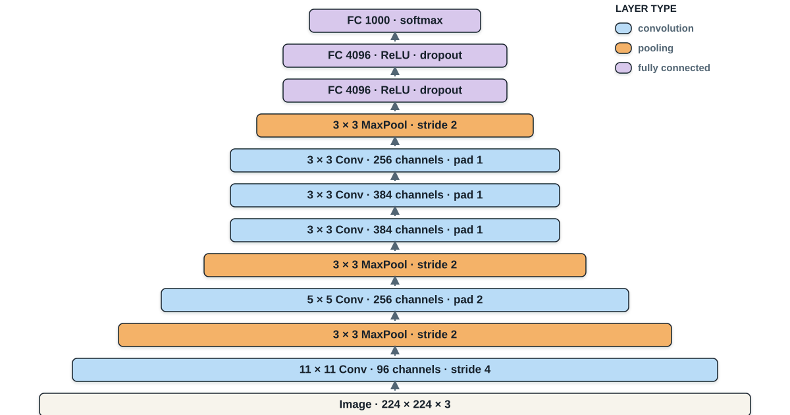

READ BOTTOM → TOP
<strong>Which components repeat—and which design choices keep changing?</strong>
<small class="fragment">Convolution and pooling repeat, but kernel sizes shift from $11\times11$ to $5\times5$ to $3\times3$.</small>

Course-made reconstruction of AlexNet from Krizhevsky, Sutskever &amp; Hinton [@krizhevsky2012imagenet]. Bar width qualitatively indicates the reduction of spatial resolution.

::: {.notes}
Let students read the figure before interpreting it. The layer bars deliberately follow the compact graphical grammar of the supplied AlexNet–VGG reference: one bar per operation, a distinct color for pooling, and a bottom-to-top computational path. Ask students to identify the recurring components first. Then reveal the irregularity that VGG will address: AlexNet changes kernel sizes and uses an aggressive stride-four entrance before settling on three-by-three convolutions.
:::

## VGG turns architecture design into an experiment

:::: {.vgg-paper-intro}
::: {.vgg-paper-figure}
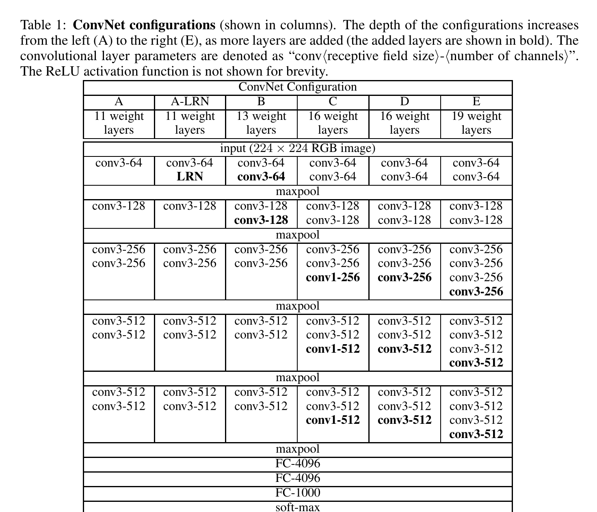
<small>Original architecture configurations · Table 1</small>
:::

::: {.vgg-paper-ideas}
SIMONYAN &amp; ZISSERMAN · 2014
<strong>Very Deep Convolutional Networks for Large-Scale Image Recognition</strong>

<b>STANDARDIZE</b><small>Replace changing kernel recipes with padded $3\times3$ convolutions.</small>

<b>ISOLATE DEPTH</b><small>Compare configurations built from the same disciplined design rules.</small>

<b>DELAY DOWNSAMPLING</b><small>Apply several convolutions before spending resolution on pooling.</small>

:::
::::

RESEARCH QUESTION<strong>Can a deeper, regular stack outperform a shallower sequence of special cases?</strong>

Original Table 1 and design analysis from Simonyan &amp; Zisserman [@simonyan2015vgg]. See also the <a href="https://anassbelcaid.github.io/deeplearning/modernconv/">2024 course chapter</a>.

::: {.notes}
Introduce VGG as a research program rather than merely a named architecture. The table is the paper's experimental design: configurations A through E increase learned depth while retaining a disciplined local recipe. Ask students what must remain fixed if depth is the variable of interest. Reveal the three ideas only after their answers. The crucial abstraction is to stop designing every layer as a special case and begin composing repeated blocks.
:::

## One VGG block becomes the design unit

:::: {.vgg-block-code-layout}
::: {.vgg-block-native-figure}
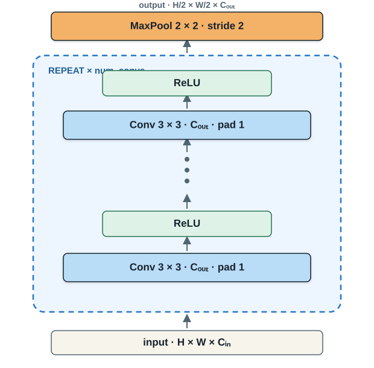
:::

::: {.light-code-editor .vgg-native-editor}

PYTORCH · BLOCK FACTORY<strong>vgg.py</strong>

<pre><code>def vgg_block(num_convs, out_channels):
    layers = []

    for _ in range(num_convs):
        layers.extend([
            nn.LazyConv2d(
                out_channels,
                kernel_size=3, padding=1
            ),
            nn.ReLU(),
        ])

    layers.append(
        nn.MaxPool2d(kernel_size=2, stride=2)
    )
    return nn.Sequential(*layers)</code></pre>
:::
::::

BLOCK CONTRACT<strong>$H\times W$ is preserved inside the plate</strong><b>→</b><strong>pooling returns $H/2\times W/2$ once</strong>

Block design from Simonyan &amp; Zisserman [@simonyan2015vgg]; PyTorch implementation adapted from the instructor’s 2024 course chapter.

::: {.notes}
Trace the figure and code together from bottom to top. The loop is the plate: it repeats the same spatially preserving operation. Padding one keeps height and width unchanged for every three-by-three convolution. Pooling sits outside the repetition and therefore halves resolution exactly once per block. Ask students which two arguments define a block; the answer is its repetition count and output channel count.
:::

## From AlexNet’s sequence to VGG’s grammar

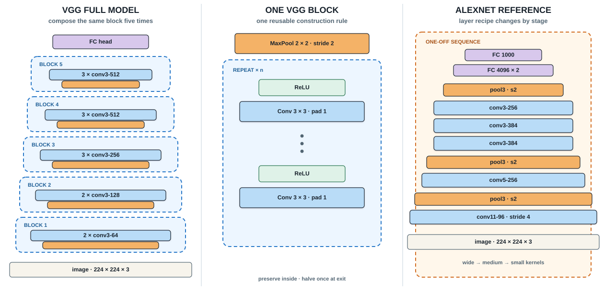

THE ARCHITECTURAL MOVE
<strong>AlexNet chooses layers one by one.</strong>
<b>→</b>
<strong>VGG defines one block, then scales by composition.</strong>

Course-made comparison derived from Krizhevsky et al. [@krizhevsky2012imagenet] and Simonyan &amp; Zisserman [@simonyan2015vgg].

::: {.notes}
Read the columns in the requested order. Start with the full VGG model on the left: five labeled plates make the repeated organization visible. Move to the center to open one plate and expose its internal contract. End with AlexNet on the right as the reference: it uses the same broad vocabulary of convolution, pooling, and fully connected layers, but its local recipe changes by stage. The conceptual advance is architectural grammar—one reusable unit whose repetition count and channel width specify the network.
:::

## The architecture becomes a short specification

:::: {.vgg-model-code-layout}
::: {.vgg-arch-spec}
PAPER CONFIGURATION A · VGG-11
<pre><code>arch = ((1, 64),
        (1, 128),
        (2, 256),
        (2, 512),
        (2, 512))</code></pre>

<b>$(n, C)$</b><strong>repeat $n$ convolutions with $C$ output channels</strong>

<i><b>1×</b>64</i>
<i><b>1×</b>128</i>
<i><b>2×</b>256</i>
<i><b>2×</b>512</i>
<i><b>2×</b>512</i>

<small>Five tuples → five calls to <code>vgg_block</code></small>
:::

::: {.light-code-editor .vgg-model-editor}

PYTORCH · FULL MODEL<strong>vgg.py</strong>

<pre><code>class VGG(nn.Module):
    def __init__(self, arch, num_classes=10):
        super().__init__()

        conv_blocks = [
            vgg_block(num_convs, out_channels)
            for num_convs, out_channels in arch
        ]

        self.net = nn.Sequential(
            *conv_blocks,
            nn.Flatten(),
            nn.LazyLinear(4096), nn.ReLU(), nn.Dropout(0.5),
            nn.LazyLinear(4096), nn.ReLU(), nn.Dropout(0.5),
            nn.LazyLinear(num_classes),
        )
        self.net.apply(d2l.init_cnn)</code></pre>
:::
::::

TRACE THE ABSTRACTION<strong>configuration</strong><b>→</b><strong>block factory</strong><b>→</b><strong>feature extractor</strong><b>→</b><strong>classifier</strong>

Configuration A from Table 1 of Simonyan &amp; Zisserman [@simonyan2015vgg]. Implementation adapted from the instructor’s <a href="https://anassbelcaid.github.io/deeplearning/modernconv/">2024 course chapter</a>.

::: {.notes}
Begin on the left. Each pair stores only two decisions: how many convolutions the block repeats and how many channels those convolutions produce. Configuration A expands to eight convolutional layers across five blocks; the three fully connected layers produce the name VGG-11. Then trace the list comprehension on the right: each tuple becomes one call to the block factory from the previous slide. The sequential model concatenates the five blocks, flattens once, and attaches the historical VGG classifier. Mention that num_classes is ten here for course datasets; the ImageNet paper used one thousand outputs.
:::

## VGG’s legacy—and its unfinished business

ARCHITECTURE AUDIT · VGG<strong>What became systematic—and what still prevents clean scaling?</strong>

:::: {.network-synthesis}
::: {.network-ledger .network-gains}
MAIN IDEAS

<b>REPEAT</b><strong>Build depth from a reusable convolutional block.</strong><small>Architecture becomes a short configuration.</small>

<b>STANDARDIZE</b><strong>Use padded $3\times3$ kernels throughout.</strong><small>Small kernels accumulate context and nonlinearities.</small>

<b>CONTROL RESOLUTION</b><strong>Pool once after several convolutions.</strong><small>Feature extraction happens before downsampling.</small>

:::
::: {.network-ledger .network-limits .fragment}
DRAWBACKS

<b>DENSE HEAD</b><strong>Most parameters remain in the classifier.</strong><small>Flattening creates very large matrices.</small>

<b>PLAIN CHAIN</b><strong>Every signal follows one long route.</strong><small>Optimization becomes harder as depth grows.</small>

<b>COMPUTE</b><strong>Repeated dense convolutions remain expensive.</strong><small>Regular does not automatically mean efficient.</small>

:::
::::

NEXT RESPONSE<strong>Keep spatial structure, add local channel mixing, and remove the dense head.</strong><b>→ NiN</b>

Synthesis based on Simonyan &amp; Zisserman [@simonyan2015vgg].

::: {.notes}
Ask students to supply one item in each column before revealing the drawbacks. VGG's durable contribution is a regular block grammar built from small padded convolutions and deliberate pooling. Its original implementation still carries a huge fully connected classifier, and the feature extractor is a plain sequential chain. The compute cost also remains high because every block applies dense spatial convolutions. Use the final bridge to motivate NiN without claiming that NiN solves optimization at extreme depth.
:::

## NiN fixes what VGG leaves expensive

LIN · CHEN · YAN · ICLR 2014
<strong>Network in Network</strong>
<small>Replace a linear local filter with a tiny network—and remove the dense classifier.</small>

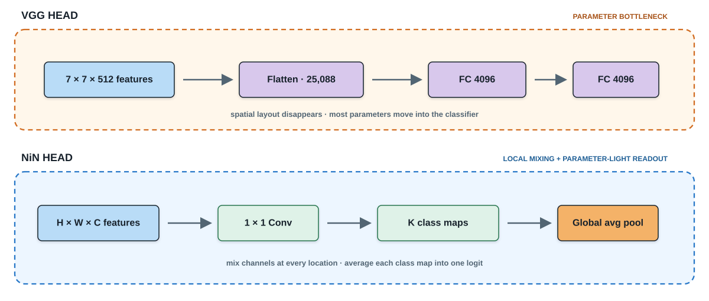

<b>FIX 1 · LOCAL EXPRESSIVENESS</b><strong>$1\times1$ convolutions mix channels independently at every spatial location.</strong>

<b>FIX 2 · CLASSIFIER COST</b><strong>One class map per label + global average pooling replaces the dense head.</strong>

NiN motivation and global-average-pooling design from Lin, Chen &amp; Yan [@lin2014nin]. Framing follows the instructor’s <a href="https://anassbelcaid.github.io/deeplearning/modernconv/">2024 course chapter</a>.

::: {.notes}
Start from VGG's remaining problems, not from the NiN name. Flattening destroys the spatial arrangement and feeds a very large dense classifier. Yet inserting a standard fully connected layer earlier would also destroy spatial structure. NiN's first move is a one-by-one convolution: at each pixel location it applies the same learned channel transformation, behaving like a shared fully connected layer without mixing locations. Its second move is global average pooling. The last block produces one spatial map per class; averaging each map yields its class logit. Ask students to point to the two places where parameters disappear.
:::

## A NiN block learns within each location

:::: {.nin-block-code-layout}
::: {.nin-block-figure}
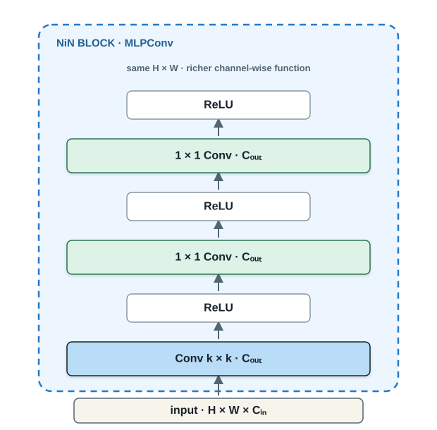
:::

::: {.light-code-editor .nin-block-editor}

PYTORCH · NiN BLOCK<strong>nin.py</strong>

<pre><code>def nin_block(
    out_channels, kernel_size,
    stride=1, padding=0
):
    return nn.Sequential(
        nn.LazyConv2d(
            out_channels, kernel_size,
            stride=stride, padding=padding
        ),
        nn.ReLU(),
        nn.LazyConv2d(out_channels, 1),
        nn.ReLU(),
        nn.LazyConv2d(out_channels, 1),
        nn.ReLU(),
    )</code></pre>
:::
::::

AT EACH $(h,w)$<strong>channel vector $\mathbf{x}_{h,w}$</strong><b>→</b><strong>shared MLP</strong><b>→</b><strong>richer channel vector</strong><small>Spatial positions remain distinct.</small>

MLPConv block from Lin, Chen &amp; Yan [@lin2014nin].

::: {.notes}
Read the plate from bottom to top. The first convolution performs the usual spatial extraction and may change resolution. The following one-by-one convolutions do not look at neighboring pixels; they transform the channel vector at each location with shared weights. ReLU after every convolution turns the sequence into a small multilayer perceptron applied across channels. Contrast this with VGG: VGG repeats spatial three-by-three convolutions, whereas NiN follows one spatial convolution with two channel-mixing convolutions.
:::

## NiN ends with class maps—not a dense head

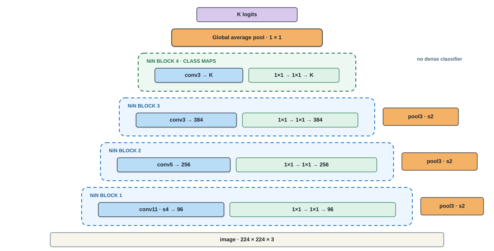

ONE MAP PER CLASS<strong>$z_k = \dfrac{1}{HW}\sum_{h,w} A_{h,w,k}$</strong><small>Evidence for class $k$ is averaged across all locations.</small>

<strong>VGG:</strong>features → flatten → large dense head<b>→</b><strong>NiN:</strong>class maps → global average → logits

Course-made reconstruction of NiN from Lin, Chen &amp; Yan [@lin2014nin].

::: {.notes}
Build from the image upward. The first three blocks retain AlexNet-like spatial kernel sizes—eleven, five, then three—but each becomes a NiN block by adding two one-by-one transformations. Pooling follows those blocks. The final NiN block outputs num_classes channels, so each channel can be interpreted as a class evidence map. Adaptive average pooling reduces each map to one number, and flattening produces the logits. This removes the two 4096-unit fully connected layers. Emphasize the tradeoff: far fewer classifier parameters, but the model must learn spatial maps whose averages are directly predictive.
:::

## The complete NiN module mirrors the figure

:::: {.nin-model-code-layout}
::: {.nin-code-map}
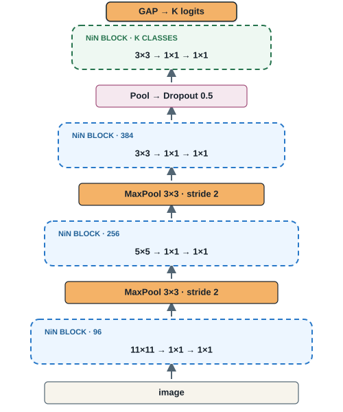
:::

::: {.light-code-editor .nin-model-editor}

PYTORCH · FULL MODEL<strong>nin.py</strong>

<pre><code>class NiN(nn.Module):
    def __init__(self, num_classes=10):
        super().__init__()

        self.net = nn.Sequential(
            nin_block(96,  11, stride=4),
            nn.MaxPool2d(3, stride=2),
            nin_block(256, 5, padding=2),
            nn.MaxPool2d(3, stride=2),
            nin_block(384, 3, padding=1),
            nn.MaxPool2d(3, stride=2),
            nn.Dropout(0.5),
            nin_block(num_classes, 3, padding=1),
            nn.AdaptiveAvgPool2d((1, 1)),
            nn.Flatten(),
        )
        self.net.apply(d2l.init_cnn)</code></pre>
:::
::::

LAST THREE LINES<strong>$K$ class maps</strong><b>→</b><strong>average each map to $1\times1$</strong><b>→</b><strong>flatten to $K$ logits</strong>

Implementation adapted from the instructor’s <a href="https://anassbelcaid.github.io/deeplearning/modernconv/">2024 course chapter</a> and Lin, Chen &amp; Yan [@lin2014nin].

::: {.notes}
Map each code line to the compact trace. The first three NiN blocks use the same spatial kernel sizes and output channels described on the previous slide, with max pooling after each block. Dropout regularizes the final feature representation. The last NiN block has num_classes output channels, producing one evidence map per class. AdaptiveAvgPool2d forces every map to one-by-one regardless of the incoming spatial size, and Flatten converts the K scalar averages into the classifier output. We omit the learning-rate argument and save_hyperparameters because this class is a plain torch module; training configuration belongs outside the architecture.
:::

## NiN changes both the block and the head

ARCHITECTURE AUDIT · NiN<strong>Which VGG costs disappear—and which design choices remain rigid?</strong>

:::: {.network-synthesis}
::: {.network-ledger .network-gains}
MAIN IDEAS

<b>LOCAL MLP</b><strong>Stack $1\times1$ convolutions inside each block.</strong><small>Mix channels without destroying spatial layout.</small>

<b>CLASS MAPS</b><strong>Produce one spatial evidence map per class.</strong><small>The representation connects directly to prediction.</small>

<b>GLOBAL AVERAGE</b><strong>Replace the dense classifier with averaging.</strong><small>Classifier parameters collapse dramatically.</small>

:::
::: {.network-ledger .network-limits .fragment}
DRAWBACKS

<b>FIXED PATH</b><strong>Every block still chooses one spatial kernel.</strong><small>Only one receptive-field scale is processed at a time.</small>

<b>AGGRESSIVE STEM</b><strong>Large early kernels and pooling remain.</strong><small>Fine spatial evidence can disappear quickly.</small>

<b>CLASS-MAP CONTRACT</b><strong>The last channels must become class evidence.</strong><small>Global averaging can discard spatial arrangement.</small>

:::
::::

NEXT RESPONSE<strong>Process several spatial scales in parallel, then concatenate their evidence.</strong><b>→ Inception</b>

Synthesis based on Lin, Chen &amp; Yan [@lin2014nin].

::: {.notes}
Retrieve the two NiN fixes first: local channel-wise nonlinear transformations and a parameter-light global-average-pooling head. Then ask what NiN still forces the designer to choose. Each spatial stage selects one kernel size and follows one path. Its early architecture also retains AlexNet-like wide kernels and aggressive pooling. The final class-map contract is elegant but restrictive: the representation must align channels with labels before averaging. This leads naturally to Inception's parallel multi-scale paths.
:::

# 03 · Branching across spatial scales {.section-slide .architecture-section .branching-section data-section-progress="3 / 7" style="--section-progress:42.857%"}

## One input—four receptive-field choices

SZEGEDY ET AL. · CVPR 2015<strong>Going Deeper with Convolutions</strong><small>Instead of choosing one kernel size, let the block learn from several scales in parallel.</small>

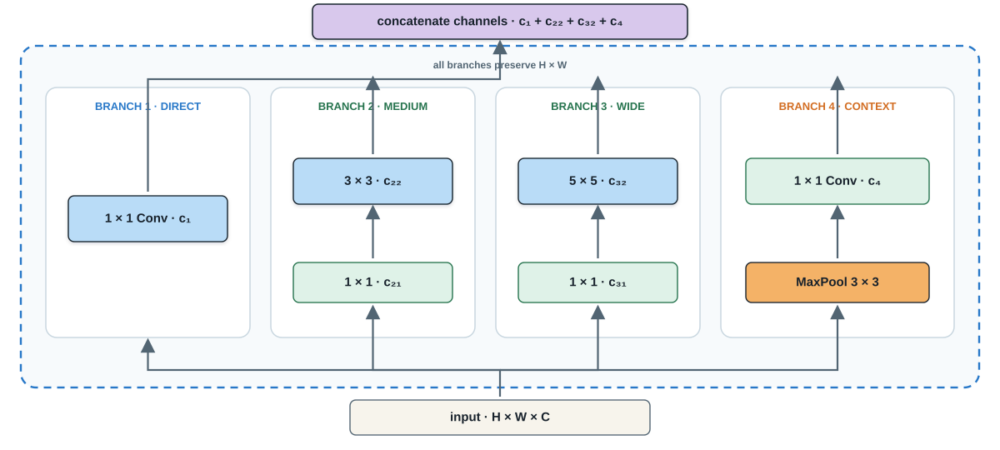

SAME $H\times W$<strong>Every path preserves spatial size.</strong><b>+</b>DIFFERENT EVIDENCE<strong>Each path sees or summarizes a different spatial extent.</strong><b>→</b>CONCATENATE<strong>Keep every branch along the channel axis.</strong>

Course-made Inception diagram based on Szegedy et al. [@szegedy2015googlenet].

::: {.notes}
Ask students to choose a kernel size before revealing the full diagram. The Inception answer is not to choose: the input is sent through four parallel paths. The one-by-one branch captures channel interactions, the three-by-three and five-by-five branches see different spatial extents, and the pooling branch summarizes local context. All branches preserve height and width through stride one and appropriate padding, which makes concatenation possible. Concatenation increases channels; it does not add the branch tensors elementwise.
:::

## The $1\times1$ layers are capacity valves

:::: {.inception-bottleneck-layout}
::: {.inception-expensive-path}
WITHOUT REDUCTION<strong>$C_{in}\xrightarrow{5\times5}C_{out}$</strong>
<b>$25C_{in}C_{out}$</b><small>weights</small>

:::
::: {.inception-valve-path .fragment}
WITH A $1\times1$ VALVE<strong>$C_{in}\xrightarrow{1\times1}C_r\xrightarrow{5\times5}C_{out}$</strong>
<b>$C_{in}C_r+25C_rC_{out}$</b><small>weights</small>

:::
::::

THE DESIGN VARIABLE<strong>Allocate channels to branches—not one kernel to the entire layer.</strong><small>The reduction width $C_r$ controls how expensive the wider spatial kernel becomes.</small>

Dimension-reduction rationale from Szegedy et al. [@szegedy2015googlenet].

::: {.notes}
Use the five-by-five branch to explain why the one-by-one convolution appears before wider kernels. A direct five-by-five convolution costs twenty-five times input channels times output channels. Reducing first to Cr channels changes the cost to Cin times Cr plus twenty-five times Cr times Cout. The one-by-one layer is therefore a learned capacity valve. It also adds a nonlinearity. Ask students what happens as Cr approaches Cin: the saving disappears.
:::

## The diagram becomes an Inception module

:::: {.inception-code-layout}
::: {.inception-code-miniature}

:::

::: {.light-code-editor .inception-editor}

PYTORCH · FOUR BRANCHES<strong>inception.py</strong>

<pre><code>class Inception(nn.Module):
    def __init__(self, c1, c2, c3, c4):
        super().__init__()
        self.b1 = conv_relu(c1, 1)
        self.b2 = nn.Sequential(
            conv_relu(c2[0], 1),
            conv_relu(c2[1], 3, padding=1))
        self.b3 = nn.Sequential(
            conv_relu(c3[0], 1),
            conv_relu(c3[1], 5, padding=2))
        self.b4 = nn.Sequential(
            nn.MaxPool2d(3, stride=1, padding=1),
            conv_relu(c4, 1))

    def forward(self, x):
        ys = [branch(x) for branch in
              (self.b1, self.b2, self.b3, self.b4)]
        return torch.cat(ys, dim=1)</code></pre>
:::
::::

SHAPE CONTRACT<strong>branches agree on $(H,W)$</strong><b>→</b><strong><code>torch.cat(..., dim=1)</code></strong><b>→</b><strong>channels sum</strong>

Simplified PyTorch implementation based on Szegedy et al. [@szegedy2015googlenet] and the instructor’s <a href="https://anassbelcaid.github.io/deeplearning/modernconv/">2024 course chapter</a>.

::: {.notes}
The helper conv_relu denotes a convolution followed by ReLU and keeps the code focused on branch topology. Match b1 through b4 to the four lanes in the figure. Each branch receives the same x. Because padding preserves height and width, torch.cat can join the outputs along dimension one, the channel dimension in NCHW tensors. Ask students to compute the output channel count: c1 plus c2[1] plus c3[1] plus c4.
:::

## Once understood, compress the block

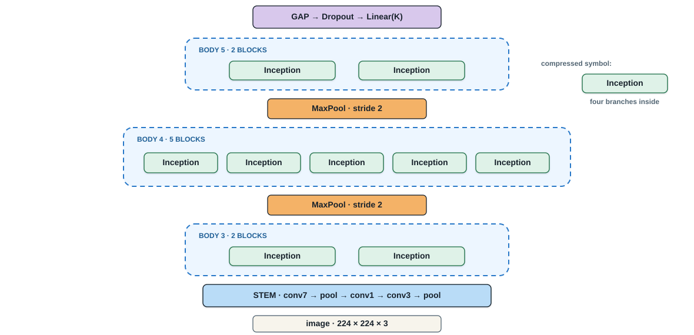

STEM<strong>ingest the image</strong><b>→</b>BODY<strong>2 + 5 + 2 Inception blocks</strong><b>→</b>HEAD<strong>global average pooling + classifier</strong>

Course-made compressed GoogLeNet diagram based on Szegedy et al. [@szegedy2015googlenet]. The original network also used auxiliary classifiers during training.

::: {.notes}
Now that students understand the internal four-branch structure, replace it with one compact green symbol. GoogLeNet uses nine Inception blocks arranged into groups of two, five, and two, with max pooling between groups. The stem performs early image ingestion; the body performs multi-scale processing; the head uses global average pooling, inherited conceptually from NiN, before classification. Mention that the original paper included auxiliary classifiers to stabilize training, but the simplified course implementation omits them because modern training recipes make them less essential.
:::

## Nine blocks become one GoogLeNet class

:::: {.googlenet-code-layout}
::: {.googlenet-code-map}

GAP → Linear(K)

BODY 5<strong>Inception × 2</strong>

<b>↑</b>

MaxPool · stride 2

BODY 4<strong>Inception × 5</strong>

<b>↑</b>

MaxPool · stride 2

BODY 3<strong>Inception × 2</strong>

<b>↑</b>

STEM

224² × 3 image

:::

::: {.light-code-editor .googlenet-editor}

PYTORCH · COMPRESSED MODEL<strong>googlenet.py</strong>

<pre><code>class GoogLeNet(nn.Module):
    def __init__(self, num_classes=10):
        super().__init__()
        pool = lambda: nn.MaxPool2d(3, 2, 1)

        self.stem = nn.Sequential(
            conv_relu(64, 7, stride=2, padding=3), pool(),
            conv_relu(64, 1), conv_relu(192, 3, padding=1), pool())

        self.body = nn.Sequential(
            Inception(64, (96,128), (16,32), 32),
            Inception(128, (128,192), (32,96), 64), pool(),
            Inception(192, (96,208), (16,48), 64),
            Inception(160, (112,224), (24,64), 64),
            Inception(128, (128,256), (24,64), 64),
            Inception(112, (144,288), (32,64), 64),
            Inception(256, (160,320), (32,128), 128), pool(),
            Inception(256, (160,320), (32,128), 128),
            Inception(384, (192,384), (48,128), 128))

        self.head = nn.Sequential(
            nn.AdaptiveAvgPool2d((1,1)), nn.Flatten(),
            nn.Dropout(0.4), nn.LazyLinear(num_classes))

    def forward(self, x):
        return self.head(self.body(self.stem(x)))</code></pre>
:::
::::

READ THE CLASS<strong><code>stem</code></strong><b>→</b><strong><code>body</code>: 2 + 5 + 2 blocks</strong><b>→</b><strong><code>head</code>: GAP + classifier</strong>

Simplified GoogLeNet without auxiliary classifiers, based on Szegedy et al. [@szegedy2015googlenet].

::: {.notes}
Keep the compressed figure visible while reading the class. The stem performs early downsampling and reaches 192 channels. The body contains exactly nine Inception calls: two before the first pool, five before the second, and two at the final resolution. Each constructor tuple allocates output channels across the four branches. The head compresses each channel to one spatial value, flattens, applies dropout, and learns the final class projection. The forward method exposes the persistent stem–body–head pattern. This simplified teaching implementation omits the original auxiliary classifiers.
:::

## GoogLeNet gains scale diversity—at a cost

ARCHITECTURE AUDIT · GOOGLENET<strong>What does branching buy—and what complexity does it introduce?</strong>

:::: {.network-synthesis}
::: {.network-ledger .network-gains}
MAIN IDEAS

<b>MULTI-SCALE</b><strong>Process $1\times1$, $3\times3$, $5\times5$, and pooled evidence together.</strong><small>The block avoids committing to one receptive field.</small>

<b>CAPACITY VALVES</b><strong>Use $1\times1$ reductions before wide kernels.</strong><small>Branch widths allocate the parameter budget.</small>

<b>MODULAR BODY</b><strong>Compress four paths into one reusable symbol.</strong><small>Nine blocks form a clear stem–body–head network.</small>

:::
::: {.network-ledger .network-limits .fragment}
DRAWBACKS

<b>HAND-TUNED WIDTHS</b><strong>Every branch needs several channel choices.</strong><small>The architecture specification becomes intricate.</small>

<b>BRANCH COMPLEXITY</b><strong>Parallel paths complicate implementation and hardware scheduling.</strong><small>Fewer parameters do not guarantee simple execution.</small>

<b>TRAINING SUPPORT</b><strong>The original model used auxiliary classifiers.</strong><small>Very deep plain information paths remain difficult.</small>

:::
::::

OPEN PROBLEM<strong>Can adding depth preserve an easy route for information and gradients?</strong><b>→ residual learning</b>

Synthesis based on Szegedy et al. [@szegedy2015googlenet].

::: {.notes}
Have students name the benefit of each branch before showing the drawbacks. GoogLeNet makes multi-scale processing explicit and uses one-by-one reductions to allocate capacity economically. Once compressed, the Inception symbol supports a modular nine-block body. The cost is architectural complexity: many branch widths must be hand tuned, parallel paths are less straightforward to schedule, and the original model used auxiliary classifiers during training. Close on the remaining information-flow problem, which prepares the residual-learning section without teaching it yet.
:::

# 04 · Learning residual corrections {.section-slide .architecture-section .resnet-section data-section-progress="4 / 7" style="--section-progress:57.143%"}

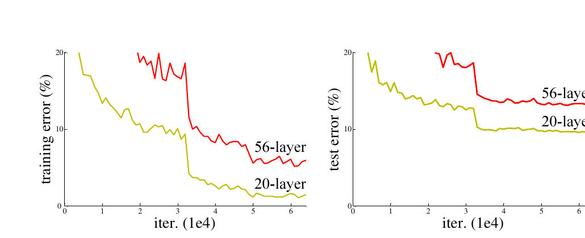
<small>Plain networks on CIFAR-10 · He et al., Figure 1</small>

PREDICT BEFORE REVEAL
<strong>If 20 layers work, should 56 layers fit the training set at least as well?</strong>

<b>No.</b>
The deeper <em>plain</em> network has higher training error—not merely higher test error.

<b>DIAGNOSIS</b>
Extra depth created an optimization problem: the added layers failed even to learn an identity mapping.

Original experimental curves reproduced from He et al. [@he2016resnet], Figure 1.

::: {.notes}
Begin with the apparently obvious claim: a deeper model contains enough capacity to imitate the shallower one by making the extra layers identities. Ask students to predict the 56-layer training curve. Reveal that it is worse than the 20-layer curve. Because the failure already appears in training error, this is not the usual overfitting story. He et al. call it the degradation problem. The architecture needs to make “do nothing” easy before depth can become reliably useful.
:::

## Learn the correction—not the whole transformation

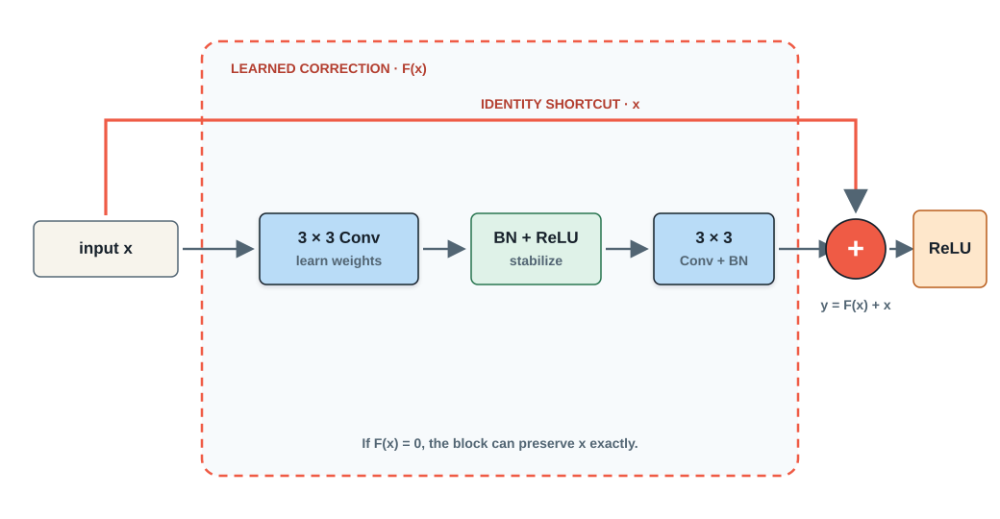

THE RESIDUAL CONTRACT

<b>TARGET</b><strong>Desired mapping: $H(x)$</strong><small>A plain stack must learn the entire transformation.</small>

<b>REPARAMETERIZE</b><strong>Learn $F(x)=H(x)-x$</strong><small>The block returns $H(x)=F(x)+x$.</small>

<b>EASY FALLBACK</b><strong>Set $F(x)\approx0$ to preserve $x$</strong><small>Information and gradients retain a direct route.</small>

ASK THE ROOM<strong>What must be true before the two paths can be added?</strong><b>same shape</b>

Course-made diagram based on the residual building block in He et al. [@he2016resnet].

::: {.notes}
Trace the two routes with a finger. The main path learns a correction F(x); the shortcut transports x unchanged. Addition is elementwise, so shape compatibility is a hard interface contract. Ask what happens if all convolutional weights produce zero: the block becomes an identity after the final activation. The important claim is not that gradients magically avoid every difficulty, but that residual parameterization provides a short information and gradient route and makes the identity solution accessible.
:::

## One block, two shortcut policies

:::: {.residual-code-layout}
::: {.residual-code-visual}
READ THE DECISION

<b>same shape?</b><strong><code>projection = None</code></strong><small>Reuse $x$ directly.</small>

↓

<b>shape changes?</b><strong><code>Conv2d(1×1)</code></strong><small>Align channels and resolution.</small>

<strong>$F(x)$</strong><b>+</b><strong>$x$ or $W_sx$</strong>

:::
::: {.light-code-editor .residual-editor}

PYTORCH · RESIDUAL BLOCK<strong>residual.py</strong>

<pre><code>class ResidualBlock(nn.Module):
    def __init__(self, in_ch, out_ch,
                 stride=1, use_projection=False):
        super().__init__()
        self.main = nn.Sequential(
            nn.Conv2d(in_ch, out_ch, 3, stride,
                      padding=1, bias=False),
            nn.BatchNorm2d(out_ch), nn.ReLU(),
            nn.Conv2d(out_ch, out_ch, 3,
                      padding=1, bias=False),
            nn.BatchNorm2d(out_ch))

        self.shortcut = (
            nn.Conv2d(in_ch, out_ch, 1, stride,
                      bias=False)
            if use_projection else None)

    def forward(self, x):
        identity = x if self.shortcut is None \
                     else self.shortcut(x)
        return F.relu(self.main(x) + identity)</code></pre>
:::
::::

Teaching implementation of the basic residual block from He et al. [@he2016resnet].

::: {.notes}
Keep the code as the principal content. The main branch is identical in both cases; only the shortcut policy changes. With stride one and equal channel counts, use_projection stays false and identity is exactly x. At a stage boundary, the caller sets stride two and enables the one-by-one projection. Point out that both paths then downsample consistently before addition. This explicit flag makes the architectural decision visible to students.
:::

## Addition imposes a shape contract

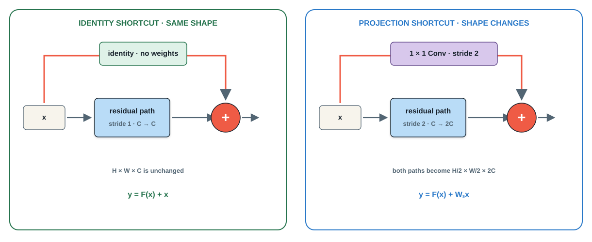

IDENTITY<strong><code>ResidualBlock(64, 64)</code></strong><small>H × W × C stays fixed · zero shortcut parameters</small>

PROJECTION<strong><code>ResidualBlock(64, 128, stride=2, use_projection=True)</code></strong><small>H and W halve · channels double · learned alignment</small>

DESIGN RULE<strong>Use identity whenever shapes agree; project only when the stage changes shape.</strong>

Course-made comparison based on the shortcut options in He et al. [@he2016resnet].

::: {.notes}
Ask students to decide which shortcut the two constructor calls require before revealing the design rule. Addition requires identical H, W, and C. Inside a stage, the residual branch preserves shape and the free identity shortcut is preferable. At a stage transition, stride two changes spatial resolution and the output channel count grows, so a one-by-one convolution applies the same stride and learns the necessary channel projection. Contrast this with concatenation: addition preserves the channel count rather than stacking both representations.
:::

# 05 · Reusing every feature with DenseNet {.section-slide .architecture-section .densenet-section data-section-progress="5 / 7" style="--section-progress:71.429%"}

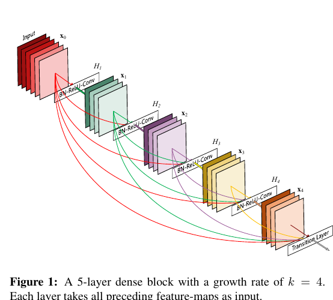

READ THE CONNECTIONS
<strong>What reaches $H_4$ that would not reach it in a plain chain?</strong>

<b>EVERY EARLIER FEATURE</b>
$H_4$ receives $[x_0,x_1,x_2,x_3]$ directly.

<b>NO SUMMATION</b>
Features remain distinguishable because DenseNet concatenates them.

<a href="https://arxiv.org/abs/1608.06993" target="_blank" rel="noopener">Read the original paper ↗</a>

Original Figure 1 from Huang et al. [@huang2017densenet]. <a href="https://arxiv.org/abs/1608.06993">Densely Connected Convolutional Networks</a>.

::: {.notes}
Let students inspect the colored curves before naming the mechanism. Ask them to list the inputs of H4. A plain chain would supply only x3; the dense block supplies x0 through x3. The paper’s figure uses growth rate k=4: each layer contributes only four new feature maps, but all earlier maps remain available. Make the paper link explicit so students can trace the architecture to its primary source.
:::

## A dense layer appends—it does not replace

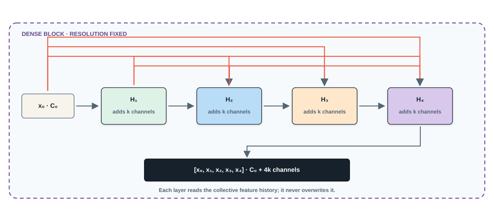

THE DENSE CONTRACT

<b>READ</b><strong>$z_\ell=[x_0,\ldots,x_{\ell-1}]$</strong><small>Concatenate the entire feature history.</small>

<b>CONTRIBUTE</b><strong>$x_\ell=H_\ell(z_\ell)$</strong><small>Produce only $k$ new feature maps.</small>

<b>GROW</b><strong>$C_\ell=C_0+\ell k$</strong><small>The growth rate controls new capacity.</small>

RESNET<strong>$F(x)+x$ · combine by addition</strong><b>vs.</b>DENSENET<strong>$[x_0,x_1,\ldots]$ · preserve by concatenation</strong>

Course-made diagram based on Huang et al. [@huang2017densenet].

::: {.notes}
Build the equations from the picture rather than presenting them first. Each layer reads the concatenated feature history and contributes k new maps. The channel count therefore grows linearly within a dense block. Contrast this with ResNet’s addition: ResNet merges two same-shaped tensors into one state, whereas DenseNet preserves separate feature maps and makes them jointly visible downstream.
:::

## Watch the feature bank grow

START WITH<strong>$C_0=8$ channels</strong>EACH LAYER ADDS<strong>$k=4$ channels</strong><b>Predict the width after four layers.</b>

INPUT
<i></i><i></i>
<strong>8</strong><small>channels</small>

<b class="fragment">+</b>

$H_1$ ADDS 4
<i></i><i></i><i></i>
<strong>12</strong><small>$8+4$</small>

<b class="fragment">+</b>

$H_2$ ADDS 4
<i></i><i></i><i></i><i></i>
<strong>16</strong><small>$8+2(4)$</small>

<b class="fragment">+</b>

$H_3$ ADDS 4
<i></i><i></i><i></i><i></i><i></i>
<strong>20</strong><small>$8+3(4)$</small>

<b class="fragment">+</b>

$H_4$ ADDS 4
<i></i><i></i><i></i><i></i><i></i><i></i>
<strong>24</strong><small>$8+4(4)$</small>

GENERAL RULE<strong>After $L$ layers: $C_L=C_0+Lk$</strong><b>Depth grows the feature bank predictably.</b>

::: {.notes}
Ask for the final width before advancing. Reveal one dense layer at a time and make students update the running channel count aloud. The key is that a layer does not output the entire wider state from scratch: it computes only k new maps, then concatenation carries the existing bank forward. With C0 equal to eight, growth rate four, and four layers, the output contains twenty-four channels.
:::

## Cool the representation before it grows again

DENSE BLOCK OUTPUT
<i></i><i></i><i></i><i></i><i></i><i></i><i></i><i></i>
<strong>$C$ channels</strong><small>many reusable activations</small>

<b class="cool-arrow fragment">→</b>

1 × 1 CONV
<i></i><i></i><i></i><i></i>
<strong>$\lfloor\theta C\rfloor$</strong><small>$0\lt\theta\leq1$ controls width</small>

<b class="cool-arrow fragment">→</b>

AVG POOL 2 × 2
<i></i><i></i><i></i><i></i>
<strong>$H/2\times W/2$</strong><small>less spatial redundancy</small>

CAPACITY CONTROL<strong>Compression prevents uncontrolled channel growth.</strong><small>DenseNet-BC commonly uses transition compression.</small>

OVERFITTING CONTROL<strong>Dropout can mask newly produced features during training.</strong><small>The paper uses dropout on small datasets; augmentation remains essential.</small>

DO NOT CONFUSE THEM<strong>Compression makes the network smaller; dropout makes feature reliance stochastic.</strong>

Transition compression and dropout follow the DenseNet training variants in Huang et al. [@huang2017densenet].

::: {.notes}
Use “cooling” as a visual metaphor, then make the mechanisms precise. The transition layer first uses a one-by-one convolution to reduce channels by compression factor theta, then average pooling halves the spatial resolution. This controls representation size and computation. It is not identical to regularization: dropout directly combats co-adaptation by randomly masking newly produced features during training. The paper reports dropout for several small-dataset experiments; data augmentation is a complementary data-side intervention rather than a connectivity mechanism.
:::

## The implementation mirrors the equation

:::: {.dense-code-layout}
::: {.dense-code-map}
CHANNEL ACCOUNTING

<b>START</b><strong>$C_0$</strong>
<i>+</i>

<b>LAYER 1</b><strong>$k$</strong>
<i>+</i>

<b>LAYER 2</b><strong>$k$</strong>
<i>+</i>

<b>LAYER $L$</b><strong>$k$</strong>

$C_{out}=C_0+Lk$

<small><strong>torch.cat</strong> is the architectural operation.</small>
:::
::: {.light-code-editor .dense-editor}

PYTORCH · DENSE BLOCK<strong>densenet.py</strong>

<pre><code>class DenseLayer(nn.Module):
    def __init__(self, in_ch, growth_rate):
        super().__init__()
        self.transform = nn.Sequential(
            nn.BatchNorm2d(in_ch), nn.ReLU(),
            nn.Conv2d(in_ch, growth_rate, 3,
                      padding=1, bias=False))

    def forward(self, x):
        new_features = self.transform(x)
        return torch.cat([x, new_features], dim=1)

def dense_block(in_ch, num_layers, k):
    layers = []
    for i in range(num_layers):
        layers.append(DenseLayer(in_ch + i * k, k))
    return nn.Sequential(*layers)</code></pre>
:::
::::

CHECK<strong><code>dense_block(64, 4, 32)</code></strong><b>→</b><strong>64 + 4 × 32 = 192 output channels</strong>

Compact teaching implementation based on Huang et al. [@huang2017densenet].

::: {.notes}
Have students predict the output channel count before revealing the numerical check. DenseLayer receives the accumulated tensor, creates k new maps, and concatenates them with the input along dimension one. Sequential works because each DenseLayer returns the enlarged collective state. The constructor’s in_ch plus i times k is exactly the channel-growth equation translated into code.
:::

## Feature reuse buys efficiency—but stores activations

ARCHITECTURE AUDIT · DENSENET<strong>What does preserving every feature buy—and what must remain in memory?</strong>

:::: {.network-synthesis}
::: {.network-ledger .network-gains}
MAIN IDEAS

<b>FEATURE REUSE</b><strong>Every layer can read low- and high-level evidence.</strong><small>Useful maps need not be relearned downstream.</small>

<b>SHORT PATHS</b><strong>Features and gradients have many direct routes.</strong><small>Deep supervision emerges without auxiliary heads.</small>

<b>NARROW UPDATES</b><strong>Each layer contributes only $k$ new maps.</strong><small>Growth rate separates depth from per-layer width.</small>

:::
::: {.network-ledger .network-limits .fragment}
DRAWBACKS

<b>ACTIVATION MEMORY</b><strong>Earlier maps must remain available for reuse.</strong><small>Training memory can become the practical bottleneck.</small>

<b>CHANNEL GROWTH</b><strong>Concatenation widens the shared state.</strong><small>Transition layers must compress and downsample.</small>

<b>DATA MOVEMENT</b><strong>Repeated concatenation is not computationally free.</strong><small>Parameter efficiency does not guarantee fast execution.</small>

:::
::::

ARCHITECTURAL LESSON<strong>Skip connections decide not only what bypasses layers—but how information is combined.</strong><b>add vs. concatenate</b>

Synthesis based on Huang et al. [@huang2017densenet]. <a href="https://arxiv.org/abs/1608.06993">Original paper ↗</a>

::: {.notes}
Ask students to name one benefit and one cost before revealing the right column. Dense connectivity supports feature reuse, short gradient paths, and narrow per-layer contributions. Its main systems cost is activation memory and data movement: earlier features must stay available and the concatenated state grows. Transition layers—typically one-by-one convolution followed by average pooling—control this growth between dense blocks. Close by comparing the combination operators: addition and concatenation express different information-preservation policies.
:::

# 06 · The architecture toolkit {.section-slide .architecture-section .closing-section .summary-closing data-section-progress="6 / 7" style="--section-progress:85.714%"}

DO NOT MEMORIZE FIVE NETWORKS<strong>Remember five reusable operations—and the pressure each one answers.</strong>

VGG
<i></i><i></i><i></i>
<strong>REPEAT</strong><small>Build depth from uniform small-kernel blocks.</small><b>cost · compute</b>

NiN
<i></i><em>1×1</em><i></i>
<strong>MIX CHANNELS</strong><small>Learn nonlinear combinations at each location.</small><b>gain · compact head</b>

INCEPTION
<i></i><i></i><i></i>
<strong>BRANCH</strong><small>Process several spatial scales in parallel.</small><b>cost · complexity</b>

RESNET
<i></i><em>+</em>
<strong>ADD</strong><small>Learn a correction while preserving an identity path.</small><b>gain · optimization</b>

DENSENET
<i></i><i></i><i></i><i></i>
<strong>CONCATENATE</strong><small>Expose every earlier feature for explicit reuse.</small><b>cost · memory</b>

THE COMMON QUESTION<strong>What should the next layer receive?</strong><b>one output · many scales · an identity · or the full history</b>

::: {.notes}
Reveal the cards one at a time and ask students to supply the verb before it appears. Each historical network contributes a transferable operation rather than a complete recipe that must be copied wholesale. VGG contributes disciplined repetition, NiN local channel mixing, Inception parallel scales, ResNet additive correction, and DenseNet explicit feature reuse. Keep the cost visible because architecture design always trades one pressure for another.
:::

# 07 · Compose for the task {.section-slide .architecture-section .closing-section .composition-closing data-section-progress="7 / 7" style="--section-progress:100%"}

DESIGN BRIEF<strong>Classify plant disease from mobile images</strong>
<b>small lesions</b><b>limited compute</b><b>deep training must stay stable</b><b>10 classes</b>

STEM<strong>VGG idea</strong><small>repeat padded $3\times3$ convolutions</small>
<b class="fragment">→</b>

LOCAL DETAIL<strong>Inception idea</strong><small>branch across receptive-field sizes</small>
<b class="fragment">→</b>

DEEP FLOW<strong>ResNet idea</strong><small>add identity shortcuts</small>
<b class="fragment">→</b>

HEAD<strong>NiN idea</strong><small>class maps + global average pooling</small>

WHY NOT EVERYTHING?<strong>Dense concatenation is useful, but its activation-memory cost conflicts with the mobile constraint.</strong>

SPECIFICATION<strong>What must the model do?</strong>
<b>→</b>

PRESSURE<strong>What will fail first?</strong>
<b>→</b>

MECHANISM<strong>Which technique addresses it?</strong>
<b>→</b>

EVIDENCE<strong>Did the experiment improve?</strong>

LEAVE WITH THIS<strong>A network is not a historical name. It is a composition of mechanisms chosen for a task.</strong>

::: {.notes}
Give students the design brief and ask which techniques they would combine before revealing the proposed network. The answer deliberately borrows from four families: VGG repetition for a regular stem, Inception branching for small lesions at different scales, ResNet shortcuts for stable depth, and NiN’s global-average-pooling head for a compact classifier. DenseNet is not “bad”; it is rejected here because the task says mobile compute and activation memory matter. End with the design loop: specification, pressure, mechanism, evidence. Students should leave prepared to build hybrids rather than choose architecture names from a menu.
:::
