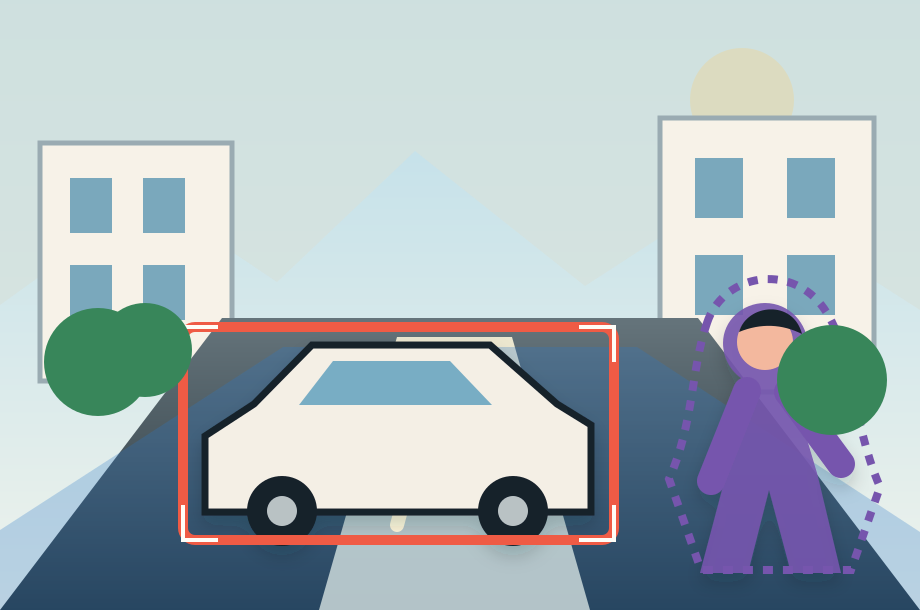

## Segmentation and Object Detection {.deck-title}

:::: {.deck-title-grid}
::: {.deck-title-copy}
CHAPTER 09 · UNDERSTANDING THE SCENE

### From one label to a structured scene

What changes when a model must explain <em>where</em> objects are—and which pixels belong to each one?

Dr. A. Belcaid
:::

::: {.deck-title-art .spatial-prediction-hero}
{fig-alt="A stylized street scene in which a vehicle is localized by a bounding box while a pedestrian and the road are identified by colored pixel masks."}
:::
::::

::: {.notes}
The thumbnail makes the chapter's shift visible before naming any architecture. Classification can say that a car or person is present. Detection must localize individual objects; segmentation must account for pixels. Keep the opening question on outputs and objectives. This is a deep-learning overview of spatial prediction tasks, not a specialist course on the implementation details of a production vision system.
:::

## A journey from labels to scenes

<svg viewBox="0 0 1240 470" aria-hidden="true">
  <path class="journey-shadow" d="M70 256 C190 80 310 82 420 226 S650 430 770 256 S1010 75 1170 246"/>
  <path class="journey-line" d="M70 256 C190 80 310 82 420 226 S650 430 770 256 S1010 75 1170 246"/>
  <circle cx="70" cy="256" r="15"/><circle cx="268" cy="126" r="15"/>
  <circle cx="470" cy="286" r="15"/><circle cx="675" cy="350" r="15"/>
  <circle cx="885" cy="142" r="15"/><circle cx="1170" cy="246" r="15"/>
</svg>

<ol>
  <li class="stop-1"><b>01</b>Beyond image classification</li>
  <li class="stop-2"><b>02</b>Semantic segmentation</li>
  <li class="stop-3"><b>03</b>Object detection</li>
  <li class="stop-4"><b>04</b>Instance &amp; panoptic segmentation</li>
  <li class="stop-5"><b>05</b>Edge detection</li>
  <li class="stop-6"><b>06</b>Connecting the tasks</li>
</ol>

Begin with the output a task requires. Only then ask which model can produce it.

::: {.notes}
Read the map as a progression, not six isolated topics. We first change the prediction contract, then study the two central tasks: segmentation and detection. Instance and panoptic segmentation reconnect them. Edge detection then steps back to ask how local boundaries can be extracted with classical and learned methods. The final section reconnects only these taught tasks through their outputs, supervision, and evaluation.
:::

# 01 · Beyond image classification {.section-slide .spatial-section .beyond-section data-section-progress="1 / 6" style="--section-progress:16.667%"}

## A correct label can still be useless

:::: {.insufficient-stage}
::: {.insufficient-scene}
<svg viewBox="0 0 820 480" role="img" aria-label="A street contains a car, two pedestrians, a bicycle, buildings, sidewalk, and road.">
  <rect width="820" height="480" fill="#cde5ee"/>
  <circle cx="677" cy="73" r="38" fill="#f3c75f"/>
  <path d="M0 239 146 135 252 230 361 114 499 235 632 150 820 243V0H0Z" fill="#e4ebe5"/>
  <g fill="#f8f3e8" stroke="#82959d" stroke-width="4"><path d="M25 128h170v214H25z"/><path d="M641 105h154v242H641z"/></g>
  <g fill="#78a9bd"><path d="M54 159h38v48H54zM126 159h38v48h-38zM54 239h38v48H54zM126 239h38v48h-38z"/><path d="M672 141h35v49h-35zM735 141h35v49h-35zM672 224h35v49h-35zM735 224h35v49h-35z"/></g>
  <path d="M186 277h449l185 203H0Z" fill="#4a5961"/>
  <path d="M0 480v-52l245-151h335l240 151v52Z" fill="#869ca5"/>
  <path d="M394 296h32l20 184h-72Z" fill="#fff5cf" opacity=".85"/>
  <g transform="translate(232 310)"><path d="m0 67 43-50h160l54 50 29 17v66H-30V91Z" fill="#f8f3e8" stroke="#17212b" stroke-width="6"/><path d="m58 31-28 38h176l-38-38Z" fill="#78a9bd"/><circle cx="35" cy="149" r="27" fill="#17212b"/><circle cx="221" cy="149" r="27" fill="#17212b"/></g>
  <g class="scene-person" transform="translate(667 246)" fill="#7655ad"><circle cx="24" cy="24" r="21" fill="#efb294"/><path d="M10 52h29l18 91H-7Z"/><path d="m5 77-32 57M39 77l37 50M8 136l-13 73M41 136l16 73" fill="none" stroke="#7655ad" stroke-width="15" stroke-linecap="round"/></g>
  <g class="scene-person" transform="translate(112 274) scale(.78)" fill="#38865a"><circle cx="24" cy="24" r="21" fill="#8a5a3d"/><path d="M10 52h29l18 91H-7Z"/><path d="m5 77-32 57M39 77l37 50M8 136l-13 73M41 136l16 73" fill="none" stroke="#38865a" stroke-width="15" stroke-linecap="round"/></g>
  <g transform="translate(565 357)" fill="none" stroke="#17212b" stroke-width="7"><circle cx="0" cy="70" r="33"/><circle cx="98" cy="70" r="33"/><path d="m0 70 40-65 58 65H0l60-33 38 33M40 5h32"/></g>
</svg>
:::

::: {.single-label}
IMAGE CLASSIFICATION
<strong>street scene</strong>
<small>one image → one label</small>
:::
::::

Where is the car?
How many people?
Which pixels are safe road?

::: {.fragment .classification-limit}
The prediction is correct—but its structure cannot answer the questions.
:::

::: {.notes}
Begin with a success, not a failure: “street scene” is a reasonable classification. Reveal the three downstream questions one at a time. Students should say that the label contains no location, count, or boundary information. The limitation belongs to the output contract, not necessarily to the quality of the learned features. A more powerful classifier still returns the wrong kind of object for these questions.
:::

## One image—four prediction contracts

<i></i><i></i><i></i>

<b>CLASSIFICATION</b>

street

<strong>What is in the image?</strong>
y ∈ {1, …, C}

<b>DETECTION</b>

<i></i><i></i>

<strong>What—and where?</strong>
{(class, score, box)}ₖ

<b>SEMANTIC SEGMENTATION</b>

<i></i><i></i><i></i>

<strong>What is every pixel?</strong>
Y ∈ {1, …, C}ᴴˣᵂ

<b>INSTANCE SEGMENTATION</b>

<i></i><i></i><i></i>

<strong>Which pixels form each object?</strong>
{(class, score, mask)}ₖ

The input did not change. <strong>The required output did.</strong>

::: {.notes}
Reveal the contracts from coarse to structured. Define only the symbols needed to read the outputs: c is class, s is confidence, b is a box, and M is an object mask. Detection returns a variable-size set; semantic segmentation returns one class at every spatial position; instance segmentation returns separate object masks. Do not discuss algorithms yet. Ask students which outputs retain identity when two cars touch.
:::

## Three meanings of “segment the image”

SEMANTIC
<svg viewBox="0 0 360 330" role="img" aria-label="Two people share one purple semantic category mask while road and sky receive category colors.">
  <rect width="360" height="170" fill="#88c8e8"/><rect y="170" width="360" height="160" fill="#4d82b0"/>
  <g fill="#7655ad"><circle cx="105" cy="93" r="35"/><path d="M67 132h76l27 151H39Z"/><circle cx="252" cy="105" r="31"/><path d="M218 139h69l25 144h-119Z"/></g>
</svg>
<strong>same category → same label</strong>

INSTANCE
<svg viewBox="0 0 360 330" role="img" aria-label="The two people receive different instance colors while background remains unassigned.">
  <rect width="360" height="330" fill="#e8e4db"/>
  <g fill="#7655ad"><circle cx="105" cy="93" r="35"/><path d="M67 132h76l27 151H39Z"/></g>
  <g fill="#ef5b45"><circle cx="252" cy="105" r="31"/><path d="M218 139h69l25 144h-119Z"/></g>
</svg>
<strong>same category, different objects</strong>

PANOPTIC
<svg viewBox="0 0 360 330" role="img" aria-label="Every pixel is assigned: sky and road have semantic colors and the two people retain separate identities.">
  <rect width="360" height="170" fill="#88c8e8"/><rect y="170" width="360" height="160" fill="#4d82b0"/>
  <g fill="#7655ad"><circle cx="105" cy="93" r="35"/><path d="M67 132h76l27 151H39Z"/></g>
  <g fill="#ef5b45"><circle cx="252" cy="105" r="31"/><path d="M218 139h69l25 144h-119Z"/></g>
</svg>
<strong>categories + identities everywhere</strong>

<b>things</b> are countable instances · <b>stuff</b> describes amorphous regions such as road, sky, and grass

Task formulation: <a href="https://arxiv.org/abs/1801.00868">Kirillov et al. · Panoptic Segmentation</a>.

::: {.notes}
Students often use “segmentation” as if it named one output. Hold the geometry constant and change only the meaning of color. In semantic segmentation both people share the person label. In instance segmentation they remain distinct, but stuff regions are not the focus. Panoptic segmentation assigns every pixel while retaining the identity of countable things. The terms “thing” and “stuff” come from the panoptic formulation; they are about annotation semantics, not visual importance.
:::

## The same distinction in a real street scene

{fig-alt="A real street photograph is shown beside its semantic, instance, and panoptic segmentation annotations. Semantic segmentation colors object categories uniformly, instance segmentation separates countable objects, and panoptic segmentation assigns both category and identity across the complete scene."}

<b>Look at the cars:</b> one semantic color becomes several instance identities.
<b>Look at road and sky:</b> panoptic segmentation keeps the stuff regions too.

Figure 1 from <a href="https://arxiv.org/abs/1801.00868">Kirillov et al. · Panoptic Segmentation, CVPR 2019</a>.

::: {.notes}
Move from the course abstraction to the evidence used by the researchers. Give students a few seconds to read the four images before revealing the prompts. The semantic view answers category everywhere but merges all cars into the same category color. The instance view separates countable objects but leaves stuff largely absent. The panoptic target combines both requirements into one coherent, non-overlapping scene interpretation. This is ground truth from the paper, not a model claim or a performance comparison.
:::

## Choose the prediction before the model

For each application, point to the minimum output that makes the decision possible.

  

  
<i>①</i><strong>Is pneumonia visible?</strong>one chest radiograph<b class="fragment" data-fragment-index="1">classification</b>

  
<i>②</i><strong>Where are all pedestrians?</strong>autonomous driving<b class="fragment" data-fragment-index="1">detection</b>

  
<i>③</i><strong>Which pixels are tumor?</strong>radiotherapy planning<b class="fragment" data-fragment-index="1">semantic segmentation</b>

  
<i>④</i><strong>Count touching cells separately.</strong>microscopy<b class="fragment" data-fragment-index="1">instance segmentation</b>

::: {.pause-panel .task-choice-pause .fragment .fade-out data-fragment-index="1"}
<strong>PAUSE · 60 seconds</strong>Name the smallest sufficient output—not the most sophisticated model.
:::

::: {.notes}
State all four givens and the exact task, then honor the pause. Students should answer with an output type, not an architecture name. Reveal each answer after discussion. For the pneumonia question, classification is sufficient only because the required decision is image-level; a clinician might demand localization for interpretability, but that changes the specification. Touching cells require identities, which a semantic mask alone cannot preserve.
:::

## The target defines the learning problem

<i></i><b></b>

<i></i><i></i><i></i><i></i>

<b>label</b>one category

<b>boxes</b>objects and locations

<b>class map</b>a category per pixel

<b>object masks</b>a shape per instance

Before choosing a network, ask: <strong>what supervision can we provide, and what output must the decision consume?</strong>

::: {.notes}
Close the section by reconnecting the task to the five-part course frame. The data now include spatial annotations; the hypothesis must emit a compatible structure; the loss compares that structure with the target; evaluation must respect the intended output. Architecture choice comes after this contract. Transition to semantic segmentation by selecting the class-map branch and asking how a convolutional classifier can preserve and recover spatial detail.
:::

# 02 · Semantic segmentation {.section-slide .spatial-section .semantic-section data-section-progress="2 / 6" style="--section-progress:33.333%"}

## Classification—repeated at every pixel

<i></i><b></b>

→

H × W × C logits

→

<i></i><b></b>

ONE LOCATION
<strong class="fragment">scores for sky · road · vegetation · car · …</strong>
<b class="fragment">argmax → one class label</b>

Training compares the predicted class distribution with the target class <strong>at every labeled pixel</strong>.

::: {.notes}
Retrieve classification rather than introducing a new mystery. The familiar class-score vector is now produced at every spatial position. The tensor contains C scores for each of H by W locations; an argmax yields the displayed class map. In the simplest formulation, training sums or averages cross-entropy across labeled pixels. Mention that ignore labels and class imbalance exist, but defer specialized losses and sampling strategies—the conceptual change is from one decision to a dense field of decisions.
:::

## The classifier knows what—but has forgotten exactly where

<i></i>small pedestrian

<b>112²</b><i></i>

<b>56²</b><i></i>

<b>28²</b><i></i>

<b>14²</b><i></i>

<b>7²</b><i></i>

A 224 × 224 image becomes a 7 × 7 feature map. Which output boundary can the deepest representation draw precisely?

::: {.pause-panel .semantic-pause .fragment .fade-out data-fragment-index="1"}
<strong>PAUSE · 45 seconds</strong>Track the pedestrian—not the tensor notation.
:::

<b>deep features</b> carry class and context
<i>↔</i>
<b>shallow features</b> retain edges and position

::: {.notes}
The given is the familiar 224-pixel input and five stages of downsampling. Ask students to track the thin pedestrian. At 7 by 7, each feature location summarizes a large region; this helps recognition but makes exact boundaries difficult. Do not say deep features contain no location—they retain coarse spatial organization. The problem is precision. The rest of the section studies ways to combine semantic context with fine spatial evidence.
:::

## FCN: keep the spatial grid to the end

<i></i><b></b>

<svg viewBox="0 0 850 350" role="img" aria-label="A fully convolutional network maps an image through a contracting feature hierarchy, a class-producing one-by-one convolution, and upsampling to a dense mask.">
  <defs><marker id="fcn-arrow" viewBox="0 0 10 10" refX="9" refY="5" markerWidth="7" markerHeight="7" orient="auto-start-reverse"><path d="M0 0 10 5 0 10Z" fill="#2878c8"/></marker></defs>
  <path d="M22 175H805" stroke="#2878c8" stroke-width="6" marker-end="url(#fcn-arrow)"/>
  <g fill="#fffdf7" stroke="#17212b" stroke-width="5">
    <rect x="45" y="45" width="118" height="260"/><rect x="213" y="78" width="108" height="194"/>
    <rect x="370" y="109" width="96" height="132"/><rect x="515" y="129" width="78" height="92"/>
  </g>
  <rect x="641" y="111" width="70" height="128" fill="#ef5b45" opacity=".9"/>
  <rect x="755" y="45" width="64" height="260" fill="#7655ad" opacity=".85"/>
  <g fill="#17212b" font-family="DM Mono" font-size="17" text-anchor="middle">
    <text x="104" y="334">features</text><text x="267" y="302">features</text><text x="418" y="270">context</text>
    <text x="554" y="250">1×1 conv</text><text x="676" y="270">C scores</text><text x="786" y="334">upsample</text>
  </g>
</svg>

<i></i><b></b>

<b>1</b> Remove the fixed-size dense classifier.
<b>2</b> Predict class scores on the coarse feature grid.
<b>3</b> Upsample scores to image resolution.

Core formulation: <a href="https://arxiv.org/abs/1411.4038">Long, Shelhamer &amp; Darrell · Fully Convolutional Networks for Semantic Segmentation, CVPR 2015</a>.

::: {.notes}
FCN's conceptual break is simple and foundational: do not flatten away the spatial grid. A one-by-one convolution acts as the same linear classifier at every feature location, producing C score maps. Upsampling restores the requested output size, and the whole computation remains differentiable and can accept arbitrary image sizes. The original FCN also fused intermediate predictions to improve detail; use that observation to motivate the more explicit skip pathway on the next slides.
:::

## Upsampling size does not recreate lost detail

<i></i>

resize × 8<b>→</b>

<i></i>

The output is now 224 × 224. Did the model recover the pedestrian’s exact outline?

<b>No.</b>Interpolation can enlarge a coarse decision; it cannot invent the boundary evidence discarded earlier.

::: {.notes}
Make the distinction between resolution and information explicit. A resize operation can create the correct number of pixels while preserving a blocky or blurred boundary. The decoder therefore needs access to higher-resolution evidence from the encoder. This is the motivation for skip connections in encoder-decoder segmentation networks; it is not a claim that every upsampling operation is intrinsically poor.
:::

## U-Net: return localization evidence to the decoder

<svg viewBox="0 0 1240 500" role="img" aria-label="A U-shaped encoder-decoder diagram contracts through four resolutions and expands back, with skip arrows connecting matching resolutions.">
  <defs><marker id="u-arrow" viewBox="0 0 10 10" refX="9" refY="5" markerWidth="8" markerHeight="8" orient="auto"><path d="M0 0 10 5 0 10Z" fill="#2878c8"/></marker><marker id="skip-arrow" viewBox="0 0 10 10" refX="9" refY="5" markerWidth="8" markerHeight="8" orient="auto"><path d="M0 0 10 5 0 10Z" fill="#ef5b45"/></marker></defs>
  <path d="M90 90 260 185 430 280 600 385 770 280 940 185 1110 90" fill="none" stroke="#2878c8" stroke-width="9" marker-end="url(#u-arrow)"/>
  <g fill="#fffdf7" stroke="#2878c8" stroke-width="6"><rect x="35" y="30" width="110" height="120"/><rect x="205" y="135" width="110" height="105"/><rect x="375" y="235" width="110" height="90"/><rect x="545" y="345" width="110" height="75"/><rect x="715" y="235" width="110" height="90"/><rect x="885" y="135" width="110" height="105"/><rect x="1055" y="30" width="110" height="120"/></g>
  <g stroke="#ef5b45" stroke-width="7" fill="none" marker-end="url(#skip-arrow)"><path d="M145 60H1050"/><path d="M315 165H880"/><path d="M485 260H710"/></g>
  <g fill="#17212b" font-family="DM Mono" font-size="20" text-anchor="middle"><text x="260" y="475">ENCODER · what + context</text><text x="940" y="475">DECODER · where + boundaries</text></g>
  <g fill="#ef5b45" font-family="DM Mono" font-size="17"><text x="547" y="46">copy spatial evidence</text><text x="548" y="151">copy</text><text x="548" y="246">copy</text></g>
</svg>

<strong>At each scale:</strong> upsample semantic features, then combine them with encoder features that still know the local geometry.

::: {.notes}
Trace the blue path first: contraction grows context and abstraction; expansion restores spatial resolution. Then reveal the coral skip pathways. They do not bypass learning in the residual-network sense. They transfer feature maps from an encoder resolution to the matching decoder resolution, commonly through concatenation. The decoder can therefore decide a class using both context and local evidence. The U shape is a visual mnemonic for this multi-resolution exchange, not the reason the network works.
:::

## Read the architecture from the U-Net paper

{fig-alt="The original U-Net architecture contracts feature-map resolution through convolution and max pooling, expands through up-convolution, and uses copy-and-crop skip connections between matching levels."}

<b>Blue path</b> extracts increasingly contextual features.
<b>Green arrows</b> increase spatial resolution.
<b>Gray arrows</b> copy encoder features into the decoder.

Figure 1 from <a href="https://arxiv.org/abs/1505.04597">Ronneberger, Fischer &amp; Brox · U-Net, MICCAI 2015</a>.

::: {.notes}
Now ask students to decode the real figure using the simplified diagram. The original 2015 architecture used valid convolutions, so feature maps shrink and encoder features are cropped before copying; many modern U-Net implementations use padding and avoid this exact crop. The transferable idea is the symmetric multi-resolution decoder with lateral feature transfer, not the precise channel counts or cropping arithmetic.
:::

## DeepLab: gather context without shrinking again

rate 1<i style="grid-area:3/3"></i><i style="grid-area:3/4"></i><i style="grid-area:3/5"></i><i style="grid-area:4/3"></i><i style="grid-area:4/4"></i><i style="grid-area:4/5"></i><i style="grid-area:5/3"></i><i style="grid-area:5/4"></i><i style="grid-area:5/5"></i>

rate 2<i style="grid-area:2/2"></i><i style="grid-area:2/4"></i><i style="grid-area:2/6"></i><i style="grid-area:4/2"></i><i style="grid-area:4/4"></i><i style="grid-area:4/6"></i><i style="grid-area:6/2"></i><i style="grid-area:6/4"></i><i style="grid-area:6/6"></i>

<strong>same 3 × 3 weights</strong>
<b class="fragment">wider field of view</b>
no additional downsampling

small rate<i>+</i>medium rate<i>+</i>large rate<i>→</i><strong>multi-scale context</strong>

Atrous spatial pyramid and encoder-decoder formulation: <a href="https://arxiv.org/abs/1802.02611">Chen et al. · DeepLabv3+, ECCV 2018</a>.

::: {.notes}
Use the two sampling grids to define atrous, or dilated, convolution: insert gaps between the sampled positions. The kernel still owns nine spatial weights, but its receptive field covers a wider region. DeepLab applies multiple rates in parallel through atrous spatial pyramid pooling, allowing the prediction to use context at several scales. DeepLabv3+ then adds a decoder to sharpen boundaries. Keep this at the level of purpose and information flow; rate schedules and backbone details are outside this overview.
:::

## Results are convincing—and failure remains visible

{fig-alt="DeepLabv3+ validation examples pair photographs with predicted semantic masks. The final row, separated by a line, contains failure cases including confused indoor regions and missed objects."}

paper result
<strong>82.1% mIoU</strong>
<small>Cityscapes test set · reported in 2018</small>

Good masks can still miss an object, merge classes, or fail under unusual context.

Qualitative results and Cityscapes score from <a href="https://arxiv.org/abs/1802.02611">Chen et al. · DeepLabv3+, Figure 6 and Table 7</a>. The paper marks the final row as failure cases.

::: {.notes}
Give the images time. The top rows show predictions that follow object silhouettes surprisingly well. The authors deliberately include a failure row; point out missing or confused regions rather than treating the gallery as proof of perfection. The 82.1 percent mIoU is the paper's historical Cityscapes test result under its stated training setting, not a current leaderboard claim and not directly comparable across datasets. The evaluation section will define mIoU precisely.
:::

## Three reusable answers to the same tension

<i>2015</i><b>FCN</b>preserve a score grid and learn to upsample

<i>2015</i><b>U-Net</b>return high-resolution encoder evidence

<i>2018</i><b>DeepLabv3+</b>collect multi-scale context then refine boundaries

SEMANTIC CONTEXT<b>must meet</b>SPATIAL PRECISION

::: {.notes}
Close on mechanisms rather than winners. FCN established end-to-end dense prediction while retaining a spatial output grid. U-Net made the encoder-decoder skip pattern a powerful default, especially in biomedical imaging. DeepLab uses dilated sampling and multi-scale context, then a decoder for detail. Modern systems recombine these ideas with stronger backbones and attention. Students should now be able to look at a segmentation architecture and ask where context is built, where resolution is restored, and how fine spatial evidence reaches the output.
:::

# 03 · Object detection {.section-slide .spatial-section .detection-section data-section-progress="3 / 6" style="--section-progress:50%"}

## Detection returns a set—not one fixed vector

car · 0.96

person · 0.91

bicycle · 0.84

one detection<strong>(class, confidence, x₁, y₁, x₂, y₂)</strong><i>× K objects</i>

The difficult part is not only recognizing a car. It is deciding <strong>how many objects exist</strong> and <strong>where each one ends</strong>.

::: {.notes}
Read the output before naming a detector. Each prediction contains a category, a confidence score, and four box coordinates. The image produces a variable-size set because the number of objects is unknown. Boxes are deliberately imperfect spatial summaries: they localize instances but include background and do not trace shape. Detection is appropriate when object identity and approximate extent are sufficient for the downstream decision.
:::

## A box is a geometric claim

<i class="corner tl">(x₁,y₁)</i><i class="corner br">(x₂,y₂)</i>

position<strong>top-left and bottom-right</strong>alternative<strong>center, width, and height</strong>meaning<strong>the object lies inside this rectangle</strong>

<svg viewBox="0 0 970 150" role="img" aria-label="Three plausible boxes around the same object vary from too tight through accurate to too loose.">
<g transform="translate(35 5)"><ellipse cx="100" cy="78" rx="66" ry="42" fill="#7655ad"/><rect x="52" y="37" width="96" height="83" fill="none" stroke="#ef5b45" stroke-width="6"/><text x="100" y="145" text-anchor="middle">too tight</text></g>
<g transform="translate(360 5)"><ellipse cx="100" cy="78" rx="66" ry="42" fill="#7655ad"/><rect x="27" y="29" width="146" height="99" fill="none" stroke="#38865a" stroke-width="6"/><text x="100" y="145" text-anchor="middle">good overlap</text></g>
<g transform="translate(685 5)"><ellipse cx="100" cy="78" rx="66" ry="42" fill="#7655ad"/><rect x="3" y="8" width="194" height="134" fill="none" stroke="#2878c8" stroke-width="6"/><text x="100" y="145" text-anchor="middle">too loose</text></g>
</svg>

Localization quality is continuous—not simply “box” or “no box.”

::: {.notes}
Boxes may be parameterized in several equivalent ways; the convention matters when decoding a model or dataset. Use the three examples to anticipate intersection over union without defining the metric yet. A box can have the correct class and still localize poorly. This is why detection evaluation must combine recognition and localization rather than using classification accuracy alone.
:::

## Why one object produces many candidates

.94

.89

.76

.41

Four overlapping predictions say “car.” How many cars should the system report?

::: {.pause-panel .nms-pause .fragment .fade-out data-fragment-index="1"}
<strong>PAUSE · 45 seconds</strong>Keep the highest-confidence box, then decide what to do with strongly overlapping alternatives.
:::

<b>1</b> select .94<i>→</i><b>2</b> suppress boxes with high overlap<i>→</i><strong>one reported car</strong>

<b>Non-maximum suppression (NMS)</b> converts many local candidates into a cleaner detection set.

::: {.notes}
State the exact task and honor the pause. Dense detectors commonly produce several plausible boxes around one object. NMS sorts candidates by confidence, keeps the current maximum, and suppresses lower-scoring boxes whose overlap exceeds a chosen threshold; the process repeats. Stress that NMS is a selection heuristic, not another learned classifier. It can also remove a true object when two nearby objects overlap heavily, so its threshold encodes a tradeoff.
:::

## Two stages: find promising regions, then inspect them

<i></i><i></i><i></i><i></i>many proposals

→

<i></i><i></i><i></i>shared features

→

<i></i><i></i>classify + refine

<b>Stage 1</b> Which regions might contain an object?<b>Stage 2</b> What is each region, and how should its box move?

Spend detailed computation on a smaller set of plausible regions.

::: {.notes}
This is the reusable two-stage idea. The region proposal network predicts objectness and candidate geometry from shared image features. The detection head then classifies and refines selected regions. Faster R-CNN made proposal generation part of the trainable network and shared convolutional computation with the detector. Avoid anchor enumeration and ROI pooling arithmetic; students need the functional decomposition and its quality-versus-latency implication.
:::

## Faster R-CNN in the original paper

{fig-alt="The Faster R-CNN paper diagram shows an image passing through shared convolutional layers into feature maps. A region proposal network proposes candidate boxes, and ROI pooling sends selected regions to a classifier."}

<b>Shared convolutional features</b> are computed once.<b>Region Proposal Network</b> says where to look.<b>ROI head</b> classifies and refines each proposal.

Figure 2 from <a href="https://arxiv.org/abs/1506.01497">Ren et al. · Faster R-CNN, NeurIPS 2015</a>.

::: {.notes}
Use the real figure as a reading exercise. Follow the shared feature map upward along two paths: the proposal path generates candidate regions, and the ROI path extracts region-specific features for classification. The authors described the proposal module as telling the detector where to look. The historical diagram is more detailed than the course abstraction, but it should now be readable without teaching its implementation.
:::

## Why proposals help

Why not classify every possible rectangle in the image?

<i></i><i></i><i></i>

<b>01</b><strong>Focus the search</strong>The proposal stage rejects most background locations and keeps a manageable set of regions that may contain an object.

<b>02</b><strong>Specialize the decisions</strong>Objectness asks <em>“is something here?”</em>; the second stage can spend its capacity deciding the class and refining the box.

<b>03</b><strong>Pay for selectivity</strong>Region extraction and per-proposal reasoning improve focus, but create a longer inference pipeline with more sequential work.

Two-stage detection buys<strong>selectivity</strong><i>with</i><strong>computation.</strong>

::: {.notes}
Consolidate the proposal idea before changing families. Enumerating every rectangle is impossible because the number grows combinatorially. A learned proposal mechanism turns that search into a smaller ranking problem. The two stages also have different responsibilities: the first favors recall so likely objects are not missed; the second makes a finer class and localization decision. This division is useful, but selected regions still require additional processing. “Two-stage” therefore describes an architectural allocation of work, not an absolute guarantee of accuracy.
:::

## One stage: predict classes and boxes everywhere

→

<i class="pbox p1"></i><i class="pbox p2"></i><i class="pbox p3"></i><i class="pbox p4"></i><strong>boxes + objectness + class scores</strong>

A single dense prediction network replaces the explicit proposal-then-classify pipeline.

{fig-alt="The original YOLO paper summarizes its detection system as resizing an image, running one convolutional network, and applying non-maximum suppression to obtain labeled boxes."}

Original one-stage formulation and Figure 1: <a href="https://arxiv.org/abs/1506.02640">Redmon et al. · You Only Look Once, CVPR 2016</a>.

::: {.notes}
One-stage detectors evaluate a dense collection of spatial predictions in one network pass. Each location predicts objectness, class information, and box geometry; a selection stage removes weak and duplicate outputs. YOLO made the speed and simplicity of this framing highly visible. Modern YOLO variants differ substantially from the 2016 architecture, so treat “YOLO” here as the influential one-stage family idea rather than one frozen implementation.
:::

## What changes when detection becomes one stage?

<i></i><i></i><i></i><i></i><b></b>

<b>01</b>
<strong>Predict densely</strong>Many spatial locations propose objectness, class scores, and box offsets at the same time.

<b>02</b>
<strong>Learn jointly</strong>One network shares image features while optimizing recognition and localization objectives together.

<b>03</b>
<strong>Filter afterward</strong>“One stage” does not mean one box: confidence filtering and usually NMS still turn many candidates into the reported set.

efficient shared prediction<i></i><strong>many easy background locations</strong>

One stage means<strong>one prediction pipeline</strong><i>— not one prediction.</i>

::: {.notes}
Clarify a frequent misconception: one-stage detectors do not emit a single detection. They emit a dense field of candidates in one unified prediction pipeline. This removes the explicit proposal-and-ROI sequence and is attractive for low-latency systems. The dense formulation introduces its own learning difficulty: most locations are background, while useful foreground examples are sparse. Architectures and losses such as focal loss address this imbalance, although their derivation is outside this overview. Duplicate removal usually remains part of the output pipeline.
:::

## DETR: predict the final set directly

<i></i><b></b>

<small>image features</small><strong>transformer</strong>object queries

<i></i><i></i><i></i><i></i><strong>K prediction slots</strong>

P₁P₂P₃∅
<svg viewBox="0 0 330 120" aria-hidden="true"><path d="M10 20 320 96M10 57 320 20M10 96 320 57" fill="none" stroke="#ef5b45" stroke-width="5"/></svg>
carpersonbike

<strong>One-to-one matching:</strong> each ground-truth object is assigned to one prediction; unmatched slots learn “no object.”

Set prediction formulation: <a href="https://arxiv.org/abs/2005.12872">Carion et al. · End-to-End Object Detection with Transformers, ECCV 2020</a>.

::: {.notes}
DETR reframes detection as direct set prediction. A fixed number of query slots each emit either one detection or “no object.” During training, bipartite matching finds a one-to-one assignment between predictions and targets, eliminating ambiguity about which slot should learn which object. This set loss discourages duplicates and allows the original DETR to omit hand-designed anchors and NMS. Do not derive Hungarian matching; its function is unique assignment.
:::

## The DETR paper makes the assignment explicit

{fig-alt="The original DETR figure shows an image passing through a CNN and transformer to a set of box predictions. Bipartite matching connects each ground-truth object to one prediction, while unmatched slots are assigned no object."}

<b>Parallel slots</b> produce a candidate set.<b>Matching</b> creates one training target per slot.<b>No object</b> absorbs unused slots.

Figure 1 from <a href="https://arxiv.org/abs/2005.12872">Carion et al. · DETR, ECCV 2020</a>.

::: {.notes}
The paper figure should now be directly readable. Colored lines show unique assignments; the remaining predictions connect to the no-object symbol. Mention the original paper's important limitation: competitive overall results but weaker small-object performance and long training. Later DETR variants improve efficiency and convergence, but the set-prediction idea is the lasting conceptual contribution.
:::

## Why set prediction is a conceptual change

<b>K</b>
<strong>Prediction slots</strong>A fixed capacity can represent a variable-size answer because unused slots may predict “no object.”

<i class="fragment" data-fragment-index="1">→</i>

<b>1↔1</b>
<strong>Unique ownership</strong>Matching assigns each target object to exactly one slot, so predictions no longer compete to learn the same target.

<i class="fragment" data-fragment-index="2">→</i>

<b>∅</b>
<strong>Complete supervision</strong>Matched slots learn a class and box; every unmatched slot receives the valid target “no object.”

Faster R-CNN · YOLO<strong>generate many candidates</strong><i>then remove duplicate outputs</i>

<b>versus</b>

DETR<strong>assign one owner per object</strong><i>and learn not to duplicate</i>

Matching moves duplicate control from <del>post-processing</del> into the <strong>learning objective.</strong>

::: {.notes}
Separate capacity from output size. DETR always maintains K slots, but the semantic output is variable because unused slots predict no object. The matching step then resolves a learning ambiguity: if several predictions overlap the same person, only the matched slot receives that person's target. The others are explicitly trained as no object or matched elsewhere. This is why the original DETR can produce a set without NMS. The important change is not merely using a transformer; it is supervising a permutation-invariant set through unique assignment.
:::

## Detector families make different structural choices

<i>01</i><b>Two-stage</b><strong>propose → inspect</strong>Faster R-CNN

<i>02</i><b>One-stage</b><strong>predict densely → filter</strong>YOLO · SSD · RetinaNet

<i>03</i><b>Set prediction</b><strong>predict slots → match</strong>DETR family

All must solve<strong>recognition + localization + duplicate control</strong>but place those decisions in different parts of the system.

::: {.notes}
Avoid presenting this as a strict accuracy ranking. Two-stage systems focus computation on selected regions. One-stage systems make many dense predictions and are associated with efficient deployment. DETR-style systems use global attention and one-to-one matching to predict a set. Modern detectors borrow across these categories, so the diagram is a map of structural choices, not three sealed boxes. Students should be able to explain where candidates come from and how duplicates are controlled in each family.
:::

## Choose mechanisms from the task—not a family label

IF THE TASK VALUES…<strong>careful region reasoning</strong><strong>low-latency deployment</strong><strong>global set reasoning</strong>

<i></i><i></i><i></i>

START BY EXAMINING…<strong>proposal + refinement</strong><strong>dense shared prediction</strong><strong>queries + matching</strong>

Modern detectors borrow freely:<b>multi-scale features</b><i>+</i><b>dense proposals</b><i>+</i><b>transformer attention</b><i>+</i><b>matching losses</b>

The useful question is not <del>“Which family wins?”</del> <strong>Where does this model create candidates, refine geometry, and control duplicates?</strong>

::: {.notes}
Turn the taxonomy into a design-reading strategy. Two-stage systems are a natural reference when selected-region reasoning matters; one-stage systems are a natural reference for efficient dense inference; set predictors are a natural reference for global interactions and direct assignment. These are starting points, not prescriptions. Contemporary systems routinely mix feature pyramids, dense proposal mechanisms, attention, and matching-based losses. Ask students to inspect mechanisms rather than infer behavior from a family name or marketing label.
:::

# 04 · Instance & panoptic segmentation {.section-slide .spatial-section .instance-section data-section-progress="4 / 6" style="--section-progress:66.667%"}

## One category mask cannot count its members

IMAGE<svg viewBox="0 0 360 330" role="img" aria-label="Two people stand close together in a street scene."><rect width="360" height="170" fill="#cbe4ed"/><rect y="170" width="360" height="160" fill="#596970"/><g fill="#f8f3e8" stroke="#17212b" stroke-width="5"><circle cx="142" cy="96" r="31"/><path d="M105 132h74l22 149H82Z"/><circle cx="218" cy="103" r="29"/><path d="M184 136h69l26 145h-118Z"/></g></svg>

→

SEMANTIC MASK<svg viewBox="0 0 360 330" role="img" aria-label="The two people merge into one purple person-class region."><rect width="360" height="330" fill="#e7e1d6"/><path d="M111 69c35-25 70 3 64 36 34-25 72 2 67 35l37 141H82l23-145c-20-19-12-52 6-67Z" fill="#7655ad"/></svg><strong class="fragment">person pixels ✓ two people ?</strong>

→

INSTANCE MASKS<svg viewBox="0 0 360 330" role="img" aria-label="The two people receive separate purple and orange instance masks."><rect width="360" height="330" fill="#e7e1d6"/><g fill="#7655ad"><circle cx="142" cy="96" r="31"/><path d="M105 132h74l22 149H82Z"/></g><g fill="#ef5b45"><circle cx="218" cy="103" r="29"/><path d="M184 136h69l26 145h-118Z"/></g></svg><strong>person 1 ✓ person 2 ✓</strong>

Instance segmentation asks for <strong>category, extent, and identity</strong> at the same time.

::: {.notes}
Use touching objects to expose the missing variable. Semantic segmentation correctly assigns the person category to every foreground pixel, but its output contains no instance identifier. Connected components are not a reliable repair because people may touch or one object may appear disconnected by occlusion. Instance segmentation instead returns a separate mask for each detected object. It therefore inherits the variable-size output of detection and the spatial precision of segmentation.
:::

## Each detected object owns a mask

<i class="imask one"></i><i class="imask two"></i><b class="ibox one"></b><b class="ibox two"></b>

INSTANCE 1<strong>person · 0.96</strong><code>box₁ + binary mask₁</code>
INSTANCE 2<strong>person · 0.92</strong><code>box₂ + binary mask₂</code>

output<strong>{(class, confidence, box, mask)}k</strong><i>for k = 1 … K objects</i>

Pixels may share a class label while retaining different object identities.

::: {.notes}
Read one row of the ledger as a single structured prediction. The box provides a coarse location, while the binary mask specifies which pixels inside that region belong to the instance. Two rows may carry the same category but must preserve different identities. Background stuff such as sky and road is not necessarily covered by this instance output; that omission will motivate panoptic segmentation later in the section.
:::

## Mask R-CNN: add one parallel question

<i></i><b></b>
<i class="mrcnn-arrow">→</i>
shared features<strong>RoIAlign</strong>

<i></i><i></i><i></i>

<b>WHAT?</b>class scores

<b>WHERE?</b>refined box

<b>WHICH PIXELS?</b>one binary mask

Faster R-CNN<i>+</i><strong>small mask-prediction branch per selected region</strong><i>=</i><b>Mask R-CNN</b>

Architecture: <a href="https://arxiv.org/abs/1703.06870">He, Gkioxari, Dollár &amp; Girshick · Mask R-CNN, ICCV 2017</a>.

::: {.notes}
Build directly on the Faster R-CNN model students just learned. The proposal mechanism and box/class head remain. For every selected region, a parallel fully convolutional branch predicts a small binary mask. Classification chooses the category; the mask branch focuses on shape rather than making every mask pixel compete across categories. The central contribution is conceptually small but powerful: keep the region-based detector and ask one additional spatial question in parallel.
:::

## Read the Mask R-CNN paper figure

{fig-alt="The original Mask R-CNN diagram sends region-aligned features into a class-and-box branch and a parallel convolutional mask branch, producing a separate colored mask for each detected object."}

<b>One selected region</b> becomes an aligned feature grid.<b>Parallel outputs</b> separate recognition from shape prediction.<b>Per-instance masks</b> preserve identity even when objects overlap.

Figure 1 from <a href="https://openaccess.thecvf.com/content_ICCV_2017/html/He_Mask_R-CNN_ICCV_2017_paper.html">He et al. · Mask R-CNN, ICCV 2017</a>.

::: {.notes}
Ask students to locate the architectural delta in the original figure. The upper branch predicts class and box; the lower convolutional branch predicts the mask. Both consume features sampled from the same region. The final image overlays boxes and distinct masks, illustrating that detection identity is carried through to pixel prediction. This is a framework diagram, not a claim that these exact layers remain unchanged in every modern instance segmenter.
:::

## Pixel masks expose a hidden rounding problem

ROI POOLING<svg viewBox="0 0 420 310" role="img" aria-label="A fractional proposal is rounded to grid boundaries, shifting the sampled region."><defs><pattern id="grid-round" width="42" height="42" patternUnits="userSpaceOnUse"><path d="M42 0H0V42" fill="none" stroke="#9aa5ab" stroke-width="2"/></pattern></defs><rect width="420" height="294" fill="url(#grid-round)"/><rect x="76" y="65" width="247" height="161" fill="#7655ad33" stroke="#7655ad" stroke-width="6" stroke-dasharray="10 7"/><rect x="84" y="84" width="252" height="168" fill="none" stroke="#ef5b45" stroke-width="7"/><text x="210" y="286" text-anchor="middle">round coordinates → shifted samples</text></svg>

ROI ALIGN<svg viewBox="0 0 420 310" role="img" aria-label="The fractional proposal coordinates are preserved and values are interpolated at exact sample positions."><defs><pattern id="grid-align" width="42" height="42" patternUnits="userSpaceOnUse"><path d="M42 0H0V42" fill="none" stroke="#9aa5ab" stroke-width="2"/></pattern></defs><rect width="420" height="294" fill="url(#grid-align)"/><rect x="76" y="65" width="247" height="161" fill="#38865a22" stroke="#38865a" stroke-width="7"/><g fill="#ef5b45"><circle cx="118" cy="107" r="8"/><circle cx="202" cy="149" r="8"/><circle cx="286" cy="191" r="8"/></g><text x="210" y="286" text-anchor="middle">preserve coordinates → interpolate</text></svg>

A one-pixel shift may barely affect a class label—but visibly damages a boundary.

::: {.notes}
Retrieve the role of ROI pooling without deriving it. A detector must convert differently sized proposals into a fixed-size feature grid. Earlier ROI pooling quantized region coordinates to discrete cells. That rounding is tolerable for coarse recognition but misaligns features and image pixels. ROIAlign removes coordinate quantization and uses interpolation at sampled positions. The paper reported that this seemingly small correction was especially important under stricter localization metrics. The general lesson is that dense prediction makes spatial alignment a first-class concern.
:::

## Panoptic segmentation leaves no pixel anonymous

{fig-alt="The Panoptic Segmentation paper compares a photograph with semantic, instance, and panoptic annotations; the panoptic view gives every pixel a category and separates individual countable objects."}

<b>THINGS</b><strong>countable objects</strong>person 1 · person 2 · car 1

<b>STUFF</b><strong>amorphous regions</strong>road · sky · grass

<b>ONE PARTITION</b><strong>exactly one owner per pixel</strong>no overlap · no unlabeled gaps

Task and Figure 1: <a href="https://arxiv.org/abs/1801.00868">Kirillov et al. · Panoptic Segmentation, CVPR 2019</a>.

::: {.notes}
Return to the paper figure introduced near the start of the lecture, now with enough machinery to explain it. Panoptic segmentation combines instance-aware predictions for things with category regions for stuff. Its output is a partition: every pixel has exactly one semantic category, and thing pixels additionally carry an instance identifier. Unlike a stack of independent instance masks, the final panoptic map cannot leave overlaps unresolved. “Thing” and “stuff” describe annotation behavior, not importance.
:::

## Two predictions must become one coherent scene

INSTANCE HEAD<i class="person-mask"></i><i class="car-mask"></i><strong>things + confidence</strong>

SEMANTIC HEAD<i class="sky-mask"></i><i class="road-mask"></i><strong>stuff classes</strong>

<small>resolve</small><b>overlap</b><b>low confidence</b><b>unclaimed pixels</b>

<i></i><b></b><strong>PANOPTIC MAP</strong>

Recognition proposes pieces.<strong>Fusion enforces a valid partition.</strong>

::: {.notes}
Explain a classical two-head panoptic system at the level of responsibilities. One head predicts thing instances, while another assigns semantic classes to the full image. Their predictions may conflict: two instance masks overlap, a person mask covers pixels labeled road, or low-confidence regions remain. A fusion procedure orders instances, resolves overlaps, removes tiny or weak regions, and fills remaining pixels with stuff labels. Newer architectures may predict masks more jointly, but every panoptic system must still produce one coherent ownership decision per pixel.
:::

## Identity and coverage are separate design choices

partial scene coverage<i></i>complete scene coverage

category only<i></i>instance identity

<b>DETECTION</b>boxes + identities

<b>SEMANTIC</b>all pixels + categories

<b>INSTANCE</b>thing masks + identities

<b>PANOPTIC</b>all pixels + thing identities

Choose the output contract by asking two questions: <strong>Must every pixel be explained?</strong> <strong>Must objects remain individually countable?</strong>

::: {.notes}
Close the section with two independent axes rather than another architecture ranking. Semantic segmentation provides complete pixel coverage but no identity. Instance segmentation preserves the identities of countable things but does not necessarily explain stuff. Detection preserves object identity through boxes but not exact boundaries. Panoptic segmentation requires both complete coverage and instance identity for things. The application should determine which contract is needed; predicting more structure also increases annotation, modeling, and evaluation cost.
:::

# 05 · Edge detection {.section-slide .spatial-section .edge-section data-section-progress="5 / 6" style="--section-progress:83.333%"}

## An edge marks a rapid change—not an object

<i class="edge-building"></i><i class="edge-car"></i><i class="edge-person"></i>

<i class="edge-transform">→</i>

<i class="edge-building"></i><i class="edge-car"></i><i class="edge-person"></i>

input<strong>intensity image</strong><i>→</i>output<strong>edge strength at every pixel</strong>

A strong edge may be an object boundary—but also a shadow, texture, lane marking, or illumination change.

::: {.notes}
Define the task from the output. An edge detector produces a spatial map whose high values indicate rapid local image change. It does not inherently recognize cars or people, and it does not decide which closed curves form objects. Ask students to identify edges caused by geometry and edges caused only by appearance. This distinction will later explain why purely local operators respond strongly to texture and shadows.
:::

## A boundary becomes a peak in the derivative

DARK REGIONBRIGHT REGION<i></i><b>x</b>

<svg viewBox="0 0 700 210" role="img" aria-label="A one-dimensional intensity profile jumps from dark to bright."><path d="M45 175H660M45 175V20" fill="none" stroke="#17212b" stroke-width="4"/><path d="M50 150H340V48H650" fill="none" stroke="#2878c8" stroke-width="8"/><text x="65" y="42">intensity I(x)</text></svg>
<svg class="fragment" viewBox="0 0 700 210" role="img" aria-label="The derivative of the intensity profile forms a positive peak at the boundary."><path d="M45 175H660M45 175V20" fill="none" stroke="#17212b" stroke-width="4"/><path d="M50 175H305L345 42 385 175H650" fill="none" stroke="#ef5b45" stroke-width="8"/><text x="65" y="42">change dI/dx</text><text x="345" y="25" text-anchor="middle">edge response</text></svg>

discrete approximation<strong>I(x + 1) − I(x − 1)</strong><i>large magnitude ⇒ rapid local change</i>

::: {.notes}
Begin with one dimension so the formula answers a visible question. The intensity is nearly constant inside each region and changes abruptly at the boundary. Its derivative is therefore near zero away from the transition and large at the transition. Digital images contain samples rather than a continuous function, so neighboring differences approximate the derivative. The sign gives transition direction; the magnitude tells how strong the change is.
:::

## Sobel measures change in two directions

horizontal change · Gₓ
<b>−1</b><b>0</b><b>1</b><b>−2</b><b>0</b><b>2</b><b>−1</b><b>0</b><b>1</b>

vertical change · Gᵧ
<b>−1</b><b>−2</b><b>−1</b><b>0</b><b>0</b><b>0</b><b>1</b><b>2</b><b>1</b>

combine<strong>G = √(Gₓ² + Gᵧ²)</strong><i>edge strength</i><strong>θ = atan2(Gᵧ, Gₓ)</strong><i>direction of change</i>

A vertical boundary creates strong <b>horizontal intensity change</b>.The gradient direction is <b>perpendicular to the visible edge</b>.

::: {.notes}
The Sobel kernels combine a finite difference in one direction with mild smoothing in the perpendicular direction. Convolving with both kernels estimates the two components of the image gradient. Their Euclidean magnitude measures edge strength, and atan2 gives the direction in which intensity increases fastest. Emphasize the common source of confusion: a vertical line has a horizontal normal, so it produces a large horizontal derivative.
:::

## Predict the responding Sobel kernel

<i></i>darkbright

GIVEN<strong>intensity changes from left to right</strong>TASK<strong>Which response dominates: |Gₓ| or |Gᵧ|?</strong>

::: {.pause-panel .edge-pause .fragment .fade-out data-fragment-index="1"}
<strong>PAUSE · 45 seconds</strong>Trace the signs of one kernel across the dark–bright boundary; exact arithmetic is unnecessary.
:::

<b>|Gₓ| dominates.</b>The image changes along x, while rows remain nearly constant.<i>The detected edge itself is vertical.</i>

::: {.notes}
State the givens and task, then honor the pause. Students often name the edge orientation rather than the gradient direction. The left-to-right transition produces a strong x derivative. The gradient vector points horizontally, normal to the vertical boundary. Use the result to reinforce that Gx describes the direction of change, not the orientation of the drawn line.
:::

## A raw gradient map is noisy and thick

<i></i><b></b>
<i>→</i>
<i></i><b></b>

<b>NOISE</b>Small pixel fluctuations create large derivatives.<b>MULTIPLE RESPONSES</b>A broad transition produces a thick ridge.<b>BROKEN CONTOURS</b>One threshold either loses weak edges or keeps clutter.

Canny is not one filter. It is a pipeline designed to correct these three failures.

::: {.notes}
Motivate Canny from evidence rather than listing steps. Differentiation amplifies noise. A gradient magnitude image often produces broad ridges rather than one-pixel contours. A single threshold cannot preserve weak but meaningful continuations while rejecting isolated weak texture. Canny's stages address these problems in sequence. This also illustrates a broader engineering pattern: a useful algorithm often combines several simple operations whose responsibilities are explicit.
:::

## Canny turns responses into connected contours

<i class="blur-icon"></i><b>1 · SMOOTH</b>Gaussian blur suppresses high-frequency noise.
<em>→</em>

<i class="gradient-icon"></i><b>2 · GRADIENT</b>Estimate strength and direction of local change.
<em class="fragment">→</em>

<i class="thin-icon"></i><b>3 · THIN</b>Keep only local maxima across the gradient direction.
<em class="fragment">→</em>

<i class="link-icon"></i><b>4 · LINK</b>Keep strong edges and weak edges connected to them.

high threshold<strong>definite edge</strong><i>+</i>low threshold<strong>keep only if connected</strong>

Pipeline derived from <a href="https://www.cs.princeton.edu/courses/archive/fall13/cos429/papers/Canny86.pdf">Canny · A Computational Approach to Edge Detection, IEEE TPAMI 1986</a>.

::: {.notes}
Walk through the pipeline as failure correction. Gaussian smoothing reduces derivative noise. Gradient estimation provides magnitude and direction. Non-maximum suppression looks across the gradient direction and retains only the ridge maximum, creating thin contours. Hysteresis uses two thresholds: strong responses seed contours, while weak responses survive only when connected to a strong edge. The original paper formalized competing goals of good detection, good localization, and a single response to one edge.
:::

## Watch Canny refine a real photograph

{fig-alt="Six views of the Lena photograph show grayscale input, Gaussian blur, gradient magnitude, non-maximum suppression, double thresholding, and the final hysteresis-linked Canny contours."}

<b>Blur</b> removes small fluctuations before differentiation amplifies them.<b>Thinning</b> reduces bright gradient ridges to localized candidates.<b>Hysteresis</b> reconnects weak responses that continue a strong contour.

Course-generated pipeline using the standard OpenCV sample image; stages follow <a href="https://www.cs.princeton.edu/courses/archive/fall13/cos429/papers/Canny86.pdf">Canny (1986)</a>.

::: {.notes}
Let students read the images from left to right before naming the mechanism. The gradient magnitude still contains responses from facial detail, feathers, and background structure. Non-maximum suppression localizes those responses, but many are weak. Double thresholding labels strong and weak candidates; hysteresis keeps weak candidates only when they connect to a strong contour. This real photograph makes clear that Canny does not remove texture semantically—it manages responses through scale, local maxima, thresholds, and connectivity.
:::

## Thresholds encode a precision–recall trade-off

LOW THRESHOLD
<i></i><i></i><i></i><i></i><i></i>
<strong>more true boundaries</strong><b>more texture and noise</b>

HIGH THRESHOLD
<i></i><i></i>
<strong>cleaner responses</strong><b>more missing weak boundaries</b>

HYSTERESIS
<i></i><i></i><i></i>
<strong>strong seeds + weak continuation</strong><b>connectivity informs the decision</b>

There is no universally correct threshold—the operating point depends on what errors the application can tolerate.

::: {.notes}
Use the three outputs to anticipate evaluation concepts without opening a full metrics section. Lower thresholds improve sensitivity but admit clutter. Higher thresholds improve precision but break faint contours. Hysteresis uses spatial continuity to retain useful weak responses. Parameter choices still depend on image scale, noise, contrast, and downstream costs. Edge maps should therefore be evaluated for the intended use, not only for visual crispness.
:::

## Learned edges ask which boundaries matter

SOBEL / CANNY
<i></i><i></i><i></i><i></i><i></i><i></i>
<strong>local intensity change</strong><small>responds to texture, shadows, and object contours</small>

<i class="edge-evolution-arrow">→</i>

LEARNED BOUNDARIES
<i></i><b></b>
<strong>patterns labeled as meaningful boundaries</strong><small>combines local detail with larger visual context</small>

<b>HED</b>side predictions at several CNN depths<i>+</i>deep supervision<i>→</i><strong>multi-scale boundary map</strong>

Deep edge formulation: <a href="https://openaccess.thecvf.com/content_iccv_2015/html/Xie_Holistically-Nested_Edge_Detection_ICCV_2015_paper.html">Xie &amp; Tu · Holistically-Nested Edge Detection, ICCV 2015</a>.

::: {.notes}
Contrast the questions, not simply old versus new. Sobel and Canny detect local appearance transitions according to fixed rules. Learned edge detectors train on human-marked boundaries and can use larger context to suppress some texture while preserving object contours. HED attaches supervised side outputs at multiple CNN depths, then fuses them: shallow features contribute localization and deeper features contribute context. Learned boundaries remain dataset-dependent and can still miss unfamiliar or ambiguous structures.
:::

## Read HED's claim in the paper's evidence

{fig-alt="Figure 1 from the HED paper compares a real photograph of a cat, human-annotated boundaries, the fused HED output, three HED side outputs, and Canny results at three smoothing scales."}

<b>Human annotation</b> selects perceptually meaningful boundaries rather than every intensity change.<b>Side outputs</b> move from fine local texture toward coarser, more global structure.<b>Fused HED</b> combines scales; Canny's single scale parameter trades detail against missing boundaries.

Figure 1 from <a href="https://openaccess.thecvf.com/content_iccv_2015/html/Xie_Holistically-Nested_Edge_Detection_ICCV_2015_paper.html">Xie &amp; Tu · Holistically-Nested Edge Detection, ICCV 2015</a>. Example image and annotations are from BSDS500.

::: {.notes}
Read columns before discussing the architecture. The human annotation is the target contract: it omits much of the foliage texture while preserving the cat, stump, and flower boundaries. HED's early side output responds to fine local detail; deeper side outputs become coarser as receptive fields grow. The fused prediction uses evidence from several depths. The three Canny results expose the scale dilemma: low smoothing preserves detail and clutter, while high smoothing suppresses clutter but also removes legitimate structure. Do not frame this single example as universal proof; it visualizes the mechanism, while the paper's BSDS500 benchmark supplies the aggregate evidence.
:::

## Edge detection is useful—but deliberately incomplete

<b>GRADIENT</b>Where does intensity change?<i>local measurement</i>

<b>SOBEL</b>How strong and in which direction?<i>fixed derivative filters</i>

<b>CANNY</b>Which responses form thin, stable contours?<i>structured post-processing</i>

<b>LEARNED EDGE</b>Which boundaries resemble annotated ones?<i>data + multi-scale context</i>

An edge map answers <strong>“where does appearance change?”</strong> It still does not answer <strong>“what is the object?”</strong>

::: {.notes}
Close with the limits of the contract. Gradients measure local change. Sobel estimates its components. Canny turns raw responses into cleaner contours through smoothing, thinning, and linking. Learned edge detectors incorporate context and supervision. None of these outputs alone carries a class label or instance identity. Edge detection can support segmentation, measurement, shape analysis, or preprocessing, but the downstream task must supply the missing semantics.
:::

# 06 · Connecting the tasks {.section-slide .spatial-section .connect-section data-section-progress="6 / 6" style="--section-progress:100%"}

## IoU asks how much two spatial claims agree

<i class="iou-truth"></i><i class="iou-prediction"></i>

intersection<strong>pixels claimed by both</strong>

union<strong>pixels claimed by either</strong>

<b>IoU</b><strong>= intersection / union</strong>

Perfect overlap gives 1. Disjoint predictions give 0. Extra area and missing area both reduce the score.

::: {.notes}
Derive the metric from the visible sets. The intersection is the region both prediction and target claim; the union is every pixel claimed by either. Dividing makes the measure independent of absolute object size. The same idea compares masks directly and boxes through their enclosed areas. IoU says whether two spatial claims agree, not whether the predicted class name is correct.
:::

## Mean IoU prevents large classes from deciding everything

road<i style="--score:90%"></i><strong>0.90</strong>

car<i style="--score:60%"></i><strong>0.60</strong>

pedestrian<i style="--score:30%"></i><strong>0.30</strong>

mean across classes<strong>(0.90 + 0.60 + 0.30) / 3 = 0.60</strong>

A large road region cannot hide weak performance on a small but important pedestrian class.

::: {.notes}
Use numbers before the name. Compute IoU separately for each class and average the three values. This gives each class equal weight rather than letting the many road pixels dominate. Dataset conventions differ in how absent or ignored classes are handled, so the reported protocol matters. Reconnect this definition to the earlier DeepLab result: 82.1 percent mIoU summarized class-wise overlap under that paper's Cityscapes setting.
:::

## Detection evaluation couples recognition and localization

1 · RANK<strong>sort detections by confidence</strong><i>Which claims are trusted first?</i>

2 · MATCH<strong>require correct class + sufficient IoU</strong><i>Duplicate matches become false positives.</i>

3 · SWEEP<strong>trace precision against recall</strong><i>Average precision summarizes the curve.</i>

looser IoU threshold<b>accepts coarse boxes</b><i>→</i>stricter IoU threshold<b>demands precise localization</b>

::: {.notes}
Keep AP conceptual. A detection counts as correct only when its class is correct and it matches an unused ground-truth object above the chosen IoU threshold. Sorting by confidence and sweeping the acceptance point produces precision and recall pairs; AP summarizes that curve. Duplicate detections are false positives after one prediction has claimed the object. Modern benchmarks often average across classes and multiple IoU thresholds, so a detector must recognize and localize well.
:::

## Every task is a contract between five choices

<b>TASK</b><b>DATA / TARGET</b><b>HYPOTHESIS OUTPUT</b><b>LOSS SIGNAL</b><b>EVALUATION</b>

<strong>classification</strong>image labelclass scorescross-entropyaccuracy

<strong>detection</strong>boxes + classesscored box setclass + box + assignmentAP across IoU

<strong>semantic segmentation</strong>class per pixelclass-score gridpixel-wise class lossmIoU

<strong>instance / panoptic</strong>masks + identitymask set / full sceneclass + region + matchingtask-specific overlap

<strong>edge detection</strong>image + boundary targetedge-strength mapfixed rule or pixel lossboundary precision–recall

Choose the smallest output structure that can support the real decision.

::: {.notes}
Reconnect the whole lecture to the five-part frame. Data annotations define what supervision exists. The hypothesis must emit a compatible structure. The loss communicates errors during training. Evaluation judges the structure in the way the application cares about. Classical edge detection is the exception that clarifies the frame: its fixed operator has no learned loss, while a learned boundary detector uses annotated edges and a pixel-wise objective. Optimization remains essential for learned models but does not repair a mismatched task contract. Read rows progressively and emphasize that architecture names are examples, not the task definition.
:::

## Specify the task before choosing the model

GIVEN<strong>A traffic camera must count each cyclist and measure the exact road area each cyclist occupies.</strong>

TASK<strong>Choose the smallest sufficient output, one suitable evaluation measure, and one model family.</strong>

::: {.pause-panel .final-pause .fragment .fade-out data-fragment-index="1"}
<strong>PAUSE · 75 seconds</strong>Start from the required decision. A more complicated output is not automatically a better specification.
:::

<b>OUTPUT</b><strong>one mask per cyclist</strong>identity enables counting; pixels enable occupied area

<b>EVALUATION</b><strong>instance matching + mask IoU</strong>both missed cyclists and boundary quality matter

<b>MODEL FAMILY</b><strong>instance segmentation</strong>for example, a Mask R-CNN-style system

::: {.notes}
State the givens and task, then honor the pause. Detection boxes preserve cyclist identity but overestimate occupied pixels. Semantic segmentation provides pixels but can merge touching cyclists and lose the count. Instance segmentation is therefore the smallest sufficient contract. Evaluation must first match predicted instances to true cyclists and then judge mask overlap; a suitable family is Mask R-CNN or another instance-mask predictor. The architecture follows from the contract.
:::

## From labels to structured scenes

<b>01</b><strong>Ask what the decision needs</strong>label · box · map · mask set · boundary

<b>02</b><strong>Preserve the required structure</strong>context, resolution, identity, and alignment

<b>03</b><strong>Supervise the same contract</strong>targets, matching, and losses must agree

<b>04</b><strong>Evaluate the intended use</strong>accuracy · IoU · mIoU · AP · interaction quality

The model family is a consequence of the task specification—not its starting point.

::: {.notes}
Conclude by composing only mechanisms already taught. Spatial prediction begins with a decision that requires a particular output. Architecture must preserve the information needed to construct it: semantic context, fine resolution, object identity, or prompt alignment. Targets and loss must supervise that same object, and evaluation must measure the failure costs that matter. End on the course-wide habit: define data, hypothesis, loss, optimization, and evaluation before debating model names.
:::
