## Autoencoders and Latent Representations {.deck-title}

:::: {.deck-title-grid}
::: {.deck-title-copy}
CHAPTER 10 · GENERATIVE REPRESENTATION LEARNING

### Learning what an image must preserve

Can a network compress an image, discard what is unnecessary, and still reconstruct what matters?

Dr. A. Belcaid
:::

::: {.deck-title-art .autoencoder-hero}
{fig-alt="A colorful image grid contracts through an encoder into one compact latent point, then expands through a decoder into a reconstructed grid."}
:::
::::

::: {.notes}
The thumbnail shows the complete contract before naming its parts: a structured input is compressed into a much smaller representation and reconstructed. Ask students what information could be removed while the output still looks like the same image. Keep the opening on preservation and compression; generation becomes relevant only after the latent representation has been understood.
:::

## A first-level map of the lecture

:::: {.autoencoder-toc}
::: {.autoencoder-toc-item .reconstruct-item}
01

### Reconstructing before generating
:::

::: {.autoencoder-toc-item .contract-item}
02

### The autoencoder contract
:::

::: {.autoencoder-toc-item .bottleneck-item}
03

### Learning through a bottleneck
:::

::: {.autoencoder-toc-item .latent-item}
04

### Reading the latent space
:::

::: {.autoencoder-toc-item .useful-item}
05

### When reconstruction becomes useful
:::

::: {.autoencoder-toc-item .sampling-item}
06

### Why sampling still fails
:::
::::

::: {.notes}
Read the six sections as one argument. We first establish reconstruction as the concrete task. We then expose the encoder–latent–decoder contract and ask how a bottleneck changes what can be copied. Once the mechanism is clear, we inspect the geometry of the learned representation and use reconstruction for denoising, retrieval, and anomaly detection. The final section demonstrates a limitation rather than teaching a new model: an ordinary autoencoder does not guarantee that arbitrary latent samples decode into meaningful images. That unresolved problem motivates the VAE lecture.
:::

# 01 · Reconstructing before generating {.section-slide .autoencoder-section .reconstruct-section data-section-progress="1 / 6" style="--section-progress:16.667%"}

## Begin with an image we already have

:::: {.reconstruction-question}
::: {.reconstruction-photo}
{fig-alt="Two cats resting on a couch in a COCO validation photograph."}

INPUT · $64 \times 64 \times 3 = 12{,}288$ values
:::

::: {.reconstruction-challenge}
THE TASK

### Send the image through a small message

<i></i><i></i><i></i><i></i><i></i><i></i><b>32 values</b>

Then rebuild <strong>the same image</strong> from that message.

:::
::::

Image: <a href="https://cocodataset.org/#download">COCO 2017 validation set</a>, image 000000039769.

::: {.question-prompt .fragment}
What must those 32 values preserve—and what can they afford to forget?
:::

::: {.notes}
Start from the photograph, not a model diagram. The input contains 12,288 scalar values after resizing to 64 by 64 RGB. The communication channel permits only 32 values. Ask students to name information worth preserving: the two cats, their pose, boundaries, dominant colors, and rough background. Then ask what might be discarded: sensor noise, tiny texture, and exact pixel values. Do not name the encoder or decoder yet; Section 2 formalizes those roles.
:::

## Reconstruction alone is too easy

$x$

<i></i><strong>COPY</strong><i></i>

$\hat{x}=x$

reconstruction error
<strong>$0$</strong>
<b>perfect score</b>

::: {.takeaway .danger .fragment}
A perfect copy has learned nothing useful if every pixel can bypass the representation.
:::

::: {.notes}
Let students celebrate the zero error for a moment, then ask what representation was learned. The direct wire satisfies the output request but avoids the learning problem. This is the identity shortcut. Reconstruction becomes meaningful only after we restrict the information path or otherwise corrupt the input. Today, the first restriction is a bottleneck.
:::

## Make copying impossible

UNRESTRICTED PATH

<b>12,288</b><i></i><b>12,288</b><i></i><b>12,288</b>

Every pixel can pass through.

<strong class="fragment">Likely strategy: copy</strong>

BOTTLENECK

<b>12,288</b><i></i><b>32</b><i></i><b>12,288</b>

The middle cannot hold every pixel.

<strong class="fragment">Required strategy: compress</strong>

<b>$12{,}288 / 32 = 384$</b>
The network gets one stored value for every 384 input values.

::: {.notes}
Contrast the visible widths before revealing the strategies. In the unrestricted path, an identity mapping is available. In the bottlenecked path, 12,288 input values must pass through 32 numbers, a nominal compression ratio of 384 to 1. Be precise: this count alone does not measure information in bits because the values are continuous. It does make the architectural constraint concrete.
:::

## “Same image” does not mean identical pixels

REFERENCE

objects · pose · layout · color

RECONSTRUCTION A

same scene, softer texture

RECONSTRUCTION B

colors survive, objects fade

::: {.question-prompt .fragment}
Which error is acceptable depends on what the representation will be used for.
:::

::: {.notes}
Reveal the reconstructions in order. A keeps the scene and loses high-frequency texture; B preserves broad color statistics but damages object structure. Both may be close under some pixel metric, yet they are not equally useful. This is the first warning that a reconstruction loss defines what “similar” means. Later sections connect that choice to denoising and anomaly detection.
:::

## Turn reconstruction into a learning signal

:::: {.loss-story}
::: {.loss-question}
FOR EACH IMAGE $x$

1. produce a reconstruction $\hat{x}$
2. compare it with the input
3. update the network to reduce the mismatch
:::

::: {.loss-equation .fragment}
$$
\mathcal{L}_{\mathrm{rec}}(x,\hat{x})
= \frac{1}{D}\sum_{j=1}^{D}(x_j-\hat{x}_j)^2
$$

Mean squared error asks every reconstructed pixel to approach its target.

:::
::::

input<strong>$x$</strong><i>is also the target</i><strong>$x$</strong>target

::: {.takeaway .fragment}
No class label is required: the image supplies its own target.
:::

::: {.notes}
Only now introduce the loss. D is the number of pixel-channel values. MSE averages squared residuals, so large pixel errors are penalized more strongly. The key conceptual step is not the formula; it is that the target is available for every image without manual annotation. Reconstruction is therefore a self-supervised learning task. Mention that binary cross-entropy is also common for suitably scaled or binary data, but keep MSE as the running loss.
:::

## Predict what the bottleneck will preserve

::: {.exercise-prompt}
A $64 \times 64$ RGB cat image must pass through only **32 values**. Rank these from most likely to least likely to survive: exact whisker pixels, number of cats, broad color regions, sensor noise.
:::

::: {.exercise-pause}
PAUSE<b>60 seconds</b><small>First decide which information helps reconstruct many training images—not only this one.</small>
:::

?<b>exact whisker pixels</b>

?<b>number of cats</b>

?<b>broad color regions</b>

?<b>sensor noise</b>

::: {.exercise-solution .fragment}
WORKED SOLUTION

**Likely:** broad color regions and object/layout cues such as two cat-shaped regions.
**Unlikely:** exact whisker pixels and unpredictable sensor noise.

The precise ranking is learned from the data and loss; the bottleneck creates pressure, not a guarantee.
:::

Transfer: what would change if the training target were a clean image but the input were noisy?

::: {.notes}
Enforce the pause before revealing the answer. The number of cats is a semantic phrase rather than a pixel property, so avoid claiming the model must explicitly store the integer two. A useful reconstruction often preserves object and layout cues from which two cats remain visible. The qualification matters: a bottleneck encourages compact regularities, but it does not guarantee human-interpretable factors. For the transfer question, students should anticipate denoising: noise becomes information the system is rewarded for discarding.
:::

## Reconstruction is the task; representation is the prize

01<strong>Use the image as its own target</strong><small>No manual class annotation</small>

<i></i>

02<strong>Restrict the information path</strong><small>Identity copying becomes impossible</small>

<i></i>

03<strong>Preserve recurring structure</strong><small>A compact code becomes useful</small>

::: {.course-takeaway-dark .fragment}
NEXT

Who creates the compact code, and who turns it back into an image?
:::

::: {.notes}
Close the section by distinguishing the visible objective from the hoped-for outcome. We optimize reconstruction; we care about the representation forced to support it. Do not promise that every compact code is automatically semantic. The next section names the two learned functions and establishes their tensor contract.
:::

# 02 · The autoencoder contract {.section-slide .autoencoder-section .contract-section data-section-progress="2 / 6" style="--section-progress:33.333%"}

## One input—two learned transformations

IMAGE<strong>$x$</strong><small>$H \times W \times C$</small>

<i class="ae-arrow fragment"></i>

LEARNED FUNCTION<strong>encoder</strong><small>$f_\theta$</small>

<i class="ae-arrow fragment"></i>

HIDDEN CODE<strong>$z$</strong><small>$d$ values</small>

<i class="ae-arrow fragment"></i>

LEARNED FUNCTION<strong>decoder</strong><small>$g_\phi$</small>

<i class="ae-arrow fragment"></i>

RECONSTRUCTION<strong>$\hat{x}$</strong><small>$H \times W \times C$</small>

$z=f_\theta(x)$<b>then</b>$\hat{x}=g_\phi(z)$

::: {.takeaway .fragment}
The encoder changes representation; the decoder returns to the input space.
:::

::: {.notes}
Reveal the path in the order data moves. The encoder f with parameters theta maps the image to a compact code z. The decoder g with parameters phi maps that code back to an image-shaped reconstruction. Stress that both functions are learned jointly. The two ends share shape, but x-hat is a prediction—not a stored copy. This pair of functions is the autoencoder contract.
:::

## The hidden state forms an hourglass

ENCODER<strong>$f_\theta$</strong><small>compress representation</small>

INPUT<strong>$x$</strong><small>$D$</small>

<i class="state-edge"></i>

HIDDEN<strong>$h_1$</strong><small>$m_1$</small>

<i class="state-edge"></i>

HIDDEN<strong>$h_2$</strong><small>$m_2$</small>

<i class="state-edge latent-edge"></i>

CODE<strong>$z$</strong><small>$d$</small>

<i class="state-edge latent-edge fragment"></i>

DECODER<strong>$g_\phi$</strong><small>expand representation</small>

HIDDEN<strong>$\tilde h_2$</strong><small>$m_2$</small>

<i class="state-edge"></i>

HIDDEN<strong>$\tilde h_1$</strong><small>$m_1$</small>

<i class="state-edge"></i>

RECONSTRUCTION<strong>$\hat{x}$</strong><small>$D$</small>

$D > m_1 > m_2 > d$
<strong>representation shrinks toward $z$, then expands back to the input dimension</strong>

::: {.question-prompt .fragment}
The architecture may vary; the general contract remains $x \rightarrow z \rightarrow \hat{x}$.
:::

::: {.notes}
Read the diagram from left to right. Each vertical rounded bar represents a full hidden state, and its height encodes the number of coordinates rather than a literal layer width on screen. The encoder f theta is a succession of transformations that reduce the representation from D to m1 to m2 and finally d. The decoder g phi mirrors the dimensional journey until x-hat again has D coordinates. The two halves need not be perfectly symmetric in a real model; what generalizes is the contraction toward z and reconstruction back in the input space.
:::

## Start from a CNN students already know

IMAGE CLASSIFIER

image<small>$3\!\times\!64\!\times\!64$</small>

<i></i>

CNN features<small>$128\!\times\!8\!\times\!8$</small>

<i></i>

feature vector<small>$d$</small>

<i></i>

class scores<small>$K$</small>

Compress, then answer a label question.

AUTOENCODER

image<small>$3\!\times\!64\!\times\!64$</small>

<i></i>

CNN features<small>$128\!\times\!8\!\times\!8$</small>

<i></i>

latent vector<small>$d$</small>

<i></i>

decoder<small>expand</small>

<i></i>

image<small>$3\!\times\!64\!\times\!64$</small>

Compress, then answer an image question.

::: {.course-takeaway-dark .fragment}
NEW MODULE

The encoder is familiar feature extraction. The decoder learns the reverse journey in shape—not a mathematical inverse.
:::

::: {.notes}
Begin with the classifier pipeline from the CNN lectures. Its feature extractor already compresses an image into a representation. The autoencoder keeps that familiar front half but replaces the classifier with a decoder that expands the code into an image. Be careful with the word reverse: the decoder reverses the progression of tensor shapes, but it is not generally the algebraic inverse of the encoder because compression discarded information.
:::

## The contract is defined by spaces and shapes

:::: {.mapping-contract}
::: {.mapping-card .encoder-map}
ENCODER

$$
f_\theta:\mathbb{R}^{H\times W\times C}\rightarrow\mathbb{R}^{d}
$$

many pixel values → compact coordinates

:::

::: {.mapping-card .decoder-map .fragment}
DECODER

$$
g_\phi:\mathbb{R}^{d}\rightarrow\mathbb{R}^{H\times W\times C}
$$

compact coordinates → image-shaped prediction

:::
::::

INPUT BATCH<strong>$(N,C,H,W)$</strong>

<i>encoder</i>

LATENT BATCH<strong>$(N,d)$</strong>

<i>decoder</i>

OUTPUT BATCH<strong>$(N,C,H,W)$</strong>

::: {.question-prompt .fragment}
Invariant to protect: the decoder output must have the same shape and value convention as its target.
:::

::: {.notes}
Read each mapping as an input/output promise rather than an implementation. With batched PyTorch tensors, the batch axis N survives both transformations. The reconstruction must match not only the target shape but also its value convention: for example, inputs scaled to zero through one require an appropriate final activation and loss. A sigmoid output is common for zero-to-one pixels; unrestricted outputs may be used with standardized data.
:::

## A smallest useful architecture

ENCODER · REMOVE DIMENSIONS

<b>pixels</b><small>784</small>
<i></i>

<b>hidden</b><small>128</small>
<i></i>

<b>$z$</b><small>32</small>

DECODER · RESTORE DIMENSIONS

<b>$z$</b><small>32</small>
<i></i>

<b>hidden</b><small>128</small>
<i></i>

<b>$\hat{x}$</b><small>784</small>

HIDDEN ACTIVATIONS<strong>ReLU</strong><small>build nonlinear features</small>

OUTPUT ACTIVATION<strong>Sigmoid</strong><small>match pixels scaled to $[0,1]$</small>

::: {.takeaway .fragment}
Symmetric widths are convenient, not mandatory. Matching the output contract is mandatory.
:::

::: {.notes}
Use a 28 by 28 grayscale image so the complete architecture is visible without convolution details. Flattening gives 784 values. The encoder maps 784 to 128 to 32; the decoder maps 32 to 128 to 784. This visual symmetry is a design convenience, not a requirement. Explain why ReLU is appropriate inside and sigmoid is compatible with targets scaled to zero through one. If targets are standardized, the output choice should change.
:::

## Map the modules directly into PyTorch

:::: {.ae-code-layout}
::: {.ae-code-visual}

INPUT<strong>$(N,1,28,28)$</strong>

<i>Flatten</i>

ENCODER OUTPUT<strong>$(N,32)$</strong>

<i>decoder</i>

RECONSTRUCTION<strong>$(N,1,28,28)$</strong>

:::

::: {.light-code-editor .ae-code-editor}

EXECUTABLE CONTRACT<strong>autoencoder.py</strong>

<pre><code>class Autoencoder(nn.Module):
    def __init__(self):
        super().__init__()
        self.encoder = nn.Sequential(
            nn.Flatten(),
            nn.Linear(784, 128), nn.ReLU(),
            nn.Linear(128, 32)
        )
        self.decoder = nn.Sequential(
            nn.Linear(32, 128), nn.ReLU(),
            nn.Linear(128, 784), nn.Sigmoid(),
            nn.Unflatten(1, (1, 28, 28))
        )

    def forward(self, x):
        z = self.encoder(x)
        x_hat = self.decoder(z)
        return x_hat</code></pre>
:::
::::

::: {.notes}
Trace the code against the three shapes on the left. Flatten preserves N and converts the remaining axes into 784 values. The encoder owns the compression layers; the decoder owns expansion and restores the image axes with Unflatten. The forward method makes the conceptual contract literal. Point out that returning only x-hat is enough for reconstruction training, while returning both x-hat and z is useful when inspecting representations later.
:::

## Trace the contract before running the model

::: {.exercise-prompt}
A batch contains **16 grayscale $28\times28$ images**. The encoder is `Flatten → Linear(784,128) → Linear(128,32)`. The decoder mirrors it and unflattens the result. Write the shape after each named stage.
:::

::: {.exercise-pause}
PAUSE<b>75 seconds</b><small>Keep the batch dimension; only transform the axes after it.</small>
:::

input<strong>$(16,1,28,28)$</strong>
<i>Flatten</i>

flat<strong>?</strong>
<i>encoder</i>

$z$<strong>?</strong>
<i>decoder + unflatten</i>

$\hat{x}$<strong>?</strong>

::: {.exercise-solution .fragment}
WORKED SOLUTION

$$
(16,1,28,28)\rightarrow(16,784)\rightarrow(16,32)\rightarrow(16,1,28,28)
$$

The model changes each example’s representation; it never merges the 16 examples.
:::

Debugging check: what shape mismatch would appear if `Unflatten` were omitted?

::: {.notes}
Require students to retain the batch dimension in every answer. Flatten begins at dimension one, giving 16 by 784. The latent batch is 16 by 32. The decoder returns 16 by 784, and Unflatten restores 16 by 1 by 28 by 28. Without Unflatten, the numerical element count matches but the reconstruction and image target have different ranks and spatial semantics.
:::

## The contract separates roles—not objectives

$f_\theta$<strong>encode</strong><small>decide what reaches $z$</small>

$z$<strong>represent</strong><small>carry the compact evidence</small>

$g_\phi$<strong>decode</strong><small>turn evidence into $\hat{x}$</small>

ONE RECONSTRUCTION LOSS
<strong>updates both $\theta$ and $\phi$ together</strong>

::: {.course-takeaway-dark .fragment}
NEXT

Why does shrinking $z$ change what the pair learns?
:::

::: {.notes}
Synthesize the named roles without suggesting three independent objectives. The reconstruction loss at the output sends gradients through the decoder and then the encoder, updating phi and theta jointly. The contract tells us what each module consumes and produces. It does not yet explain why the latent representation becomes useful. Section 3 studies the learning pressure created by the bottleneck.
:::

# 03 · Learning through a bottleneck {.section-slide .autoencoder-section .bottleneck-section data-section-progress="3 / 6" style="--section-progress:50%"}

## Hold everything fixed—change only $d$

LATENT DIMENSION
<button type="button" data-d="2">2</button><button type="button" data-d="4">4</button><button type="button" data-d="8">8</button><button type="button" data-d="16">16</button><button type="button" data-d="32">32</button><button type="button" data-d="64">64</button><button type="button" data-d="128">128</button>

<figure>INPUT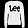<figcaption data-role="class">Pullover</figcaption></figure>
<i class="stage-arrow"></i>
<figure class="reconstruction-frame">RECONSTRUCTION · $d=$<b data-role="dimension">8</b>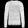<figcaption>sample MSE <b data-role="sample-mse">0.0320</b></figcaption></figure>
<figure class="error-frame">ABSOLUTE ERROR<figcaption>bright = larger error</figcaption></figure>

COORDINATES KEPT<strong><b data-role="dimension">8</b> / 784</strong>

WIDTH RATIO<strong data-role="ratio">1.0%</strong>

TEST MSE<strong data-role="test-mse">0.0168</strong>

<button type="button" data-sample="0"></button>
<button type="button" data-sample="1">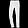</button>
<button type="button" data-sample="2"></button>
<button type="button" data-sample="3">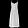</button>
<button type="button" data-sample="4">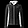</button>
<button type="button" data-sample="5"></button>
<button type="button" data-sample="6">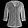</button>
<button type="button" data-sample="7"></button>
<button type="button" data-sample="8">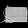</button>
<button type="button" data-sample="9">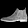</button>

::: {.notes}
This is the section's controlled experiment. Every model uses the same Fashion-MNIST split, MLP architecture, optimizer, seed, six epochs, and ten fixed test examples; only latent width d changes. Click different garments, then sweep d from 2 to 128. Ask students to identify what appears first—global silhouette—and what arrives later—edges, openings, and fine contrast. Do not claim monotonic improvement for every individual image: the measured result is deliberately visible.
:::

## Watch one reconstruction acquire detail

<figure class="filmstrip-input">INPUT<figcaption>pullover</figcaption></figure>
<i></i>
<figure>$d=2$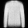<figcaption>.0473</figcaption></figure>
<figure>$d=4$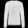<figcaption>.0368</figcaption></figure>
<figure>$d=8$<figcaption>.0320</figcaption></figure>
<figure>$d=16$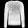<figcaption>.0280</figcaption></figure>
<figure>$d=32$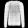<figcaption>.0312</figcaption></figure>
<figure>$d=64$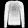<figcaption>.0263</figcaption></figure>
<figure>$d=128$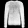<figcaption>.0282</figcaption></figure>

sample MSE ↓
<strong>Silhouette survives first; fine structure improves unevenly.</strong>

::: {.question-prompt .fragment}
Prediction check: if width alone determined quality, what pattern should these seven errors follow?
:::

::: {.notes}
Read the images before the numbers. With d equals 2, the pullover remains recognizable but is heavily averaged. Additional coordinates recover more structure. The sample error is not monotonic: d equals 32 and 128 are worse than nearby widths under the fixed six-epoch training budget. Width changes capacity, but optimization and generalization still matter. This is precisely why we measure rather than narrate a guaranteed curve.
:::

## Measure the gain instead of assuming it

CONTROLLED SWEEP · 10,000 TEST IMAGES
<strong>$d:2\rightarrow8$ cuts test MSE by 42%.</strong>
<small>From $d=8$ to $128$, four more doublings buy only a modest additional reduction.</small>

::: {.notes}
The curve aggregates all ten thousand Fashion-MNIST test images. Test MSE drops from 0.0292 at d equals 2 to 0.0168 at d equals 8, a reduction of roughly 42 percent. Beyond that point, gains flatten and are slightly uneven because every model received the same finite training budget. The curve supports an evidence-based claim: larger d expands capacity, but useful returns diminish for this architecture and training setup.
:::

## Choose a bottleneck from evidence

DEPLOYMENT LIMIT<strong>at most 16 coordinates</strong><i></i>

::: {.exercise-prompt}
You need recognizable reconstructions for a low-bandwidth device. Based on this experiment, choose $d\in\{2,4,8,16\}$ and justify the extra coordinates using the test curve—not intuition alone.
:::

::: {.exercise-pause}
PAUSE<b>60 seconds</b><small>Compare marginal error reduction against each increase in width.</small>
:::

::: {.exercise-solution .fragment}
EVIDENCE-BASED DECISION

Start with **$d=8$**: it reaches test MSE $0.0168$ using only $1.0\%$ as many coordinates as the input. Moving to $d=16$ doubles the channel width but improves MSE by only $0.0006$. Choose $16$ only if that small measured gain matters for the application.
:::

The decision belongs to this dataset, architecture, loss, and training budget—not to autoencoders universally.

::: {.notes}
Require a decision and a quantitative justification. d equals 8 is the natural elbow in this controlled run. d equals 16 remains defensible when reconstruction fidelity is worth the extra coordinates. The point is not to decree one correct dimension; it is to make students use validation evidence and deployment constraints together.
:::

## Reconstruction alone permits a shortcut {data-visibility="hidden"}

WIDE CODE

$x$<small>784</small>
<i></i>

$z$<small>1024</small>
<i></i>

$\hat{x}$<small>784</small>

<strong>enough room to preserve every pixel</strong>

NARROW CODE

$x$<small>784</small>
<i></i>

$z$<small>32</small>
<i></i>

$\hat{x}$<small>784</small>

<strong>must decide what earns space</strong>

::: {.question-prompt .fragment}
Both models can reduce reconstruction loss. Which architecture creates pressure to learn reusable structure?
:::

::: {.course-takeaway-dark .fragment}
THE SHORTCUT

If copying is easy, low reconstruction error does not imply a useful representation.
:::

::: {.notes}
Begin with the optimization objective students already know: nothing in reconstruction loss explicitly asks for semantic features. A wide code can learn an identity-like route, especially with a sufficiently expressive network. Reveal the 32-dimensional alternative and ask what changes. The narrow route does not tell the model which features to keep; it merely makes indiscriminate copying harder.
:::

## Give the model a concrete information budget {data-visibility="hidden"}

INPUT<strong>784</strong><small>pixel values</small>

<i class="budget-arrow"></i>

CODE<strong>32</strong><small>coordinates</small>

WIDTH RATIO
<strong>$\dfrac{32}{784}\approx 0.041$</strong>
<small>about <b>4.1%</b> as many coordinates</small>

SPEND CAPACITY ON<strong>stroke layout · pose · coarse intensity</strong>

LIKELY DISCARD<strong>tiny fluctuations · exact background pixels</strong>

::: {.takeaway .fragment}
The bottleneck changes the optimization problem from “copy everything” to “preserve what repeatedly helps reconstruction.”
:::

::: {.notes}
Compute the width ratio before stating the rule: 32 divided by 784 is approximately 4.1 percent. This is a coordinate budget, not a literal compression-file size because each coordinate is still a floating-point value. Ask what recurring evidence would be worth spending those coordinates on. The answer depends on the dataset and loss, but stable structure is useful across many examples while unpredictable pixel noise is not.
:::

## Predict the effect of changing $d$ {data-visibility="hidden"}

$d=2$

<i></i>

<strong>very severe</strong>
<small>simple global structure may survive; detail is costly</small>

$d=32$

<i></i>

<strong>useful pressure</strong>
<small>enough room for several recurring factors</small>

$d=512$

<i></i>

<strong>weak pressure</strong>
<small>finer reconstruction, but copying becomes easier</small>

strong compression<i></i>high reconstruction fidelity

::: {.question-prompt .fragment}
There is no universally correct $d$: select it using validation evidence for the representation’s intended use.
:::

::: {.notes}
Treat these as predictions, not experimental measurements. At d equals 2, the decoder receives very little freedom and details are expensive. At d equals 512, reconstruction may improve while the representation becomes less selective. The middle value is only a plausible starting point. Code dimension is a hyperparameter chosen against validation reconstruction and, when possible, a downstream criterion such as retrieval quality or anomaly separation.
:::

## A narrow code creates pressure—not semantics {data-visibility="hidden"}

DATA<strong>A small dataset can be memorized.</strong><small>The encoder may assign a different code to every training example.</small>

CAPACITY<strong>A powerful decoder can hide weak codes.</strong><small>Architecture and regularization also control what can be reconstructed.</small>

OBJECTIVE<strong>The loss defines what “important” means.</strong><small>Pixel MSE rewards average pixel agreement, not human meaning.</small>

::: {.course-takeaway-dark .fragment}
PRECISE CLAIM

An undercomplete code discourages trivial copying; it does not guarantee disentangled or semantic features.
:::

::: {.notes}
Use this slide to prevent an overclaim. Dimension is one source of inductive bias, but it works together with dataset size, network capacity, noise, regularization, and the reconstruction loss. A narrow code creates competition for capacity. What wins that competition is empirical, so later slides inspect the learned latent geometry instead of assuming it is meaningful.
:::

## Quantify the bottleneck before training {data-visibility="hidden"}

::: {.exercise-prompt}
A grayscale image has shape $28\times28$ and the latent code has $d=16$. Compute how many times narrower the code is. Then name one property you expect reconstruction to preserve and one it may discard.
:::

::: {.exercise-pause}
PAUSE<b>60 seconds</b><small>Calculate the width reduction first; label the feature claims as hypotheses.</small>
:::

INPUT WIDTH<strong>$28\times28=784$</strong>

<i>÷</i>

CODE WIDTH<strong>$16$</strong>

<i>=</i>

REDUCTION<strong>?</strong>

::: {.exercise-solution .fragment}
WORKED SOLUTION

$$
\frac{784}{16}=49
$$

The code is **49× narrower**. A reasonable hypothesis is that digit stroke layout survives while tiny pixel fluctuations are discarded—but only the trained reconstructions can confirm it.
:::

Transfer: would increasing $d$ necessarily improve nearest-neighbor retrieval in latent space?

::: {.notes}
Give students one minute. The arithmetic establishes the strength of the dimensional bottleneck. Accept different preserve and discard hypotheses if they are tied to the dataset. The transfer answer is no: increasing d may improve reconstruction while retaining nuisance variation that hurts retrieval. That trade-off must be measured.
:::

## The bottleneck is a learning pressure {data-visibility="hidden"}

1<strong>Restrict</strong><small>make $d$ smaller than the input representation</small>

<i></i>

2<strong>Compete</strong><small>features compete for limited coordinates</small>

<i class="fragment"></i>

3<strong>Preserve</strong><small>recurring evidence helps reconstruction</small>

<i class="fragment"></i>

4<strong>Verify</strong><small>inspect reconstruction and latent geometry</small>

::: {.course-takeaway-dark .fragment}
NEXT

What geometry did the encoder organize inside those $d$ coordinates?
:::

::: {.notes}
Close with a causal chain rather than a promise. Restricting code width creates competition. Features that repeatedly help the decoder reconstruct many examples have an advantage, but the result still depends on data, model, and loss. The next section tests the learned representation by projecting, interpolating, and examining neighborhoods in latent space.
:::

# 04 · Reading the latent space {.section-slide .autoencoder-section .latent-section data-section-progress="4 / 6" style="--section-progress:66.667%"}

## Explore the map before seeing the labels

<canvas data-role="scatter" width="820" height="520" aria-label="Unlabelled scatterplot of 1,000 Fashion-MNIST test images encoded into two latent dimensions"></canvas>
$z_1$$z_2$

CLICK ANY POINT
<canvas data-role="input" width="210" height="210"></canvas>

→

<canvas data-role="reconstruction" width="210" height="210"></canvas>

<strong data-role="class">Pullover</strong><small>$z=$ <b data-role="coords"></b> · MSE <b data-role="mse"></b></small>

Without labels, where do shapes change smoothly—and where do abrupt boundaries appear?

::: {.notes}
Teaching goal: let students discover that a latent space is a map they can interrogate, not merely a vector produced by the encoder.

Begin without naming any clothing classes. Explain that every dot is one held-out Fashion-MNIST image passed through the same trained encoder, and that its horizontal and vertical positions are the two learned coordinates $z_1$ and $z_2$. These are not PCA axes and they were not chosen by a human. The map contains 1,000 test images; none of their labels were used by the autoencoder.

Demonstrate one click first. The left thumbnail is the original test image, the right thumbnail is $g_\phi(f_\theta(x))$, and the displayed MSE is the per-image reconstruction error. Then ask students to direct two or three clicks: one inside a dense region, one on an isolated point, and one near a visible boundary. Pause after each click and ask, “What changed in the image as we moved across the map?” Seek observations about silhouette, height, width, orientation, and texture—not class names yet.

Emphasize that nearby dots mean nearby encoder outputs under ordinary Euclidean distance in this two-dimensional coordinate system. They do not automatically mean identical inputs or identical semantic labels. A detached island may indicate a distinctive visual pattern, but it may also expose an unusual example or a distortion caused by forcing the representation into only two dimensions.

Close the slide with the causal point: reconstruction supplied the only training signal. Whatever organization appears was useful for predicting pixels through the decoder. Transition by asking whether those visual regions happen to align with the labels humans assigned.
:::

## Reveal what occupies each region

<canvas data-role="scatter" width="880" height="510" aria-label="Fashion-MNIST latent map colored by the ten ground-truth classes"></canvas>
$z_1$$z_2$

<canvas data-role="input" width="175" height="175"></canvas>
<canvas data-role="reconstruction" width="175" height="175"></canvas>
<strong data-role="class">Sneaker</strong><small>$z=$ <b data-role="coords"></b></small>

T-shirtTrouserPulloverDressCoatSandalShirtSneakerBagBoot

<strong>Structure emerged:</strong> footwear separates from tops, while visually similar shirts, coats, and pullovers overlap.

::: {.notes}
Teaching goal: distinguish emergent semantic structure from supervised class separation.

Reveal the colors only after students have described the unlabeled geometry. Remind them that the colors are a diagnostic overlay added after training; the encoder and decoder never received these class labels. Read the map from the easiest evidence first. Trousers form a visibly distinctive region because their two-leg silhouette differs strongly from most tops. Bags and footwear also occupy characteristic areas. Sandals, sneakers, and ankle boots show partial separation, while shirts, coats, pullovers, and T-shirts overlap substantially.

Click representative points from a clean region and then from an overlap region. For each, compare the original with the reconstruction. Ask: “What evidence could the decoder use to reconstruct this shape, even if that evidence is insufficient to assign the human label?” Students should notice that coarse outline, vertical extent, and mass distribution can be reconstruction-useful without cleanly distinguishing coat from pullover.

When the conclusion fragment appears, state the claim carefully. The plot is evidence that semantic structure can emerge, not evidence that the autoencoder has learned a classifier. A supervised objective would explicitly push decision boundaries between labels; reconstruction instead groups examples according to factors that help reproduce their pixels. Also note that a two-dimensional bottleneck exaggerates overlaps and cannot preserve every factor present in the original $28\times28$ image.

Transition: a global colored map suggests structure, but a representation becomes operational when we ask what examples it retrieves as similar.
:::

## Zoom from a point into its neighborhood

<canvas data-role="scatter" width="560" height="350" aria-label="Clickable two-dimensional latent map for selecting a neighborhood anchor"></canvas>
$z_1$$z_2$

ANCHOR<canvas data-role="input" width="185" height="185"></canvas><strong data-role="class">Shirt</strong><small>$z=$ <b data-role="coords"></b></small>

<canvas data-kind="input" width="105" height="105"></canvas><canvas data-kind="reconstruction" width="105" height="105"></canvas><b></b><small></small>

<canvas data-kind="input" width="105" height="105"></canvas><canvas data-kind="reconstruction" width="105" height="105"></canvas><b></b><small></small>

<canvas data-kind="input" width="105" height="105"></canvas><canvas data-kind="reconstruction" width="105" height="105"></canvas><b></b><small></small>

<canvas data-kind="input" width="105" height="105"></canvas><canvas data-kind="reconstruction" width="105" height="105"></canvas><b></b><small></small>

<canvas data-kind="input" width="105" height="105"></canvas><canvas data-kind="reconstruction" width="105" height="105"></canvas><b></b><small></small>

<canvas data-kind="input" width="105" height="105"></canvas><canvas data-kind="reconstruction" width="105" height="105"></canvas><b></b><small></small>

<canvas data-kind="input" width="105" height="105"></canvas><canvas data-kind="reconstruction" width="105" height="105"></canvas><b></b><small></small>

top: inputbottom: reconstruction<strong>Nearest in $z$ means similar evidence for this decoder—not necessarily the same class.</strong>

::: {.notes}
Teaching goal: turn the vague phrase “similar representations” into a concrete retrieval operation.

Click a point to choose an anchor. The large image on the right is the anchor input. The seven columns below are its nearest test examples under Euclidean distance in $z$; within each column, the top image is the original and the bottom image is the decoder reconstruction. Give students a few seconds to compare the row before reading the labels.

Ask three questions in order. First: “What visual property stays stable across this neighborhood?” Look for silhouette, orientation, brightness distribution, sleeve length, or footwear height. Second: “Do all neighbors share the anchor's class?” Usually they do not, especially in the overlapping top-clothing region. Third: “Does the reconstruction make the neighbors look more alike than the inputs do?” This exposes the decoder's smoothing and the information discarded by the bottleneck.

Try anchors in contrasting regions if time permits: a trouser or bag from a separated region, then a shirt or coat from an overlap region. The former usually retrieves a semantically cleaner neighborhood; the latter demonstrates that proximity reflects the factors learned for reconstruction rather than a guarantee of category identity.

Define the operational statement explicitly: for this model, “similar” means small $\lVert f_\theta(x_i)-f_\theta(x_j)\rVert_2$. That metric can be useful for retrieval, but usefulness must be evaluated against the intended downstream task. A different encoder, latent dimension, normalization, or distance function could produce different neighbors.

Transition: nearest neighbors inspect observed points. Interpolation asks the harder question of what the decoder believes exists between two observed points.
:::

## Decode paths—not just points

PATH A<strong>sneaker → ankle boot</strong><small>$z(t)=(1-t)z_a+t z_b$</small>

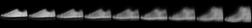

$t=0$<i></i>$t=1$

PATH B<strong>shirt → coat</strong><small>same straight-line rule</small>

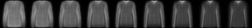

$t=0$<i></i>$t=1$

::: {.question-prompt .fragment}
Where does the decoder change smoothly, and where does it blur incompatible evidence together?
:::

::: {.course-takeaway-dark .fragment}
READING $z$

Points reveal neighborhoods; paths reveal whether the space between them decodes coherently.
:::

::: {.notes}
Teaching goal: use interpolation as a test of the geometry between encoded examples, while avoiding the claim that smoothness alone makes the model generative.

Start with Path A only. The endpoints are real test images encoded as $z_a$ and $z_b$. Each intermediate code is computed by the displayed linear rule, $z(t)=(1-t)z_a+t z_b$, for evenly spaced values from $t=0$ to $t=1$, and then passed through the decoder. Read the strip left to right. Point out the gradual rise of the footwear silhouette and the changing ankle region. Ask whether any transition appears abrupt or whether two incompatible shapes are visibly averaged.

Reveal Path B and repeat the same inspection before showing the question. The shirt-to-coat path changes more subtly; several middle frames look blurred or averaged. Connect this to the previous map: top-clothing classes occupied overlapping regions, so a straight path through that area asks the decoder to combine evidence that the two-dimensional code did not cleanly separate.

Use the prompt as a genuine pause. Students should identify both smooth transformations and regions where smooth pixel change does not correspond to an unambiguous garment. Then reveal the takeaway: points let us study local neighborhoods, while paths probe the decoder's behavior between points.

State three cautions. First, linear movement in coordinates is a choice, not proof that the true data manifold is linear. Second, a decoder is a continuous neural network, so visually smooth outputs can occur even through low-density regions where the training data contain few or no examples. Third, blurry intermediate images may reflect the MSE objective averaging several plausible pixel configurations. Therefore interpolation is a diagnostic of the learned representation and decoder—not by itself proof that every intermediate is a realistic sample.

Transition to the final section: reconstruction becomes useful when we deliberately choose what corruption, invariance, or downstream behavior the representation should support.
:::

# 05 · When reconstruction becomes useful {.section-slide .autoencoder-section .useful-section data-section-progress="5 / 6" style="--section-progress:83.333%"}

## Corrupt the input—preserve the target

NETWORK SEES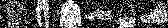

<i></i><strong>$f_\theta \rightarrow z \rightarrow g_\phi$</strong><i></i>

NETWORK PRODUCES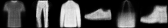

LOSS COMPARES WITH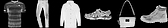

<strong>Noise MSE</strong> 0.101 <i>→</i> <strong>after reconstruction</strong> 0.021

::: {.notes}
Teaching goal: show that reconstruction becomes useful when input and target are deliberately different.

Begin with only the noisy row visible. These are real Fashion-MNIST test images after additive Gaussian noise with $\sigma=0.45$. Ask what information remains recoverable: the corruption damages individual pixels, but the global silhouettes are still visible.

Trace the images through the encoder, 16-dimensional code, and decoder. The middle row contains the model's actual outputs after six epochs of denoising training. Invite students to compare specific details: trouser legs reappear, isolated bright noise disappears, and fine edges become smoother.

Reveal the clean targets last. Stress the changed contract: the network receives $\tilde{x}$ but the loss compares its output with $x$. Across these six held-out examples, mean corruption error falls from 0.101 to reconstruction error 0.021. This is not a generic image filter programmed by hand; the model learned recurring Fashion-MNIST structure from many noisy-clean pairs.

Mention the tradeoff visible in the results: noise is suppressed, but some legitimate fine detail is also removed. The model restores what its training distribution makes predictable, not necessarily every authentic pixel.
:::

## The target defines what must survive

$\tilde{x}=x+\epsilon$

ENCODE<b>16 numbers</b>DECODE

target $=x$

$\displaystyle \min_{\theta,\phi}\;\mathbb{E}_{x,\epsilon}\left[\left\|x-g_\phi(f_\theta(x+\epsilon))\right\|_2^2\right]$

THE DESIGN MOVE<strong>Destroy a nuisance in the input; require the output to recover without it.</strong>

::: {.notes}
Teaching goal: derive denoising as a precise change to the autoencoder contract, then generalize the design principle.

Read the diagram left to right. We sample a clean image $x$, corrupt it to obtain $\tilde{x}=x+\epsilon$, and feed only $\tilde{x}$ to the encoder. The clean $x$ bypasses the network and appears only as the supervision target. Therefore copying noisy pixels cannot minimize the loss consistently.

Reveal the objective and identify each random quantity. The expectation is over both training examples and fresh corruption. Re-sampling noise matters: if every image always received the same fixed corruption, a sufficiently capable model could memorize those pairs. With varied corruption, the reusable strategy is to model regularities of clean garments.

Reveal the design statement. A narrow code restricts capacity structurally; corruption changes the learning problem statistically. They can be combined, but they are not the same mechanism. Denoising pressure comes from predicting information absent from the particular input but predictable from the data distribution.

Ask for transfer examples orally: masking patches encourages contextual completion; color jitter can encourage color invariance; removing one sensor channel can train cross-channel prediction. Caution that corruption defines the nuisance. If it removes task-relevant evidence, the representation may learn the wrong invariance.
:::

## Reconstruction error can expose the unfamiliar

TRAINED ONLY ON<strong>sandals · sneakers · ankle boots</strong>

INPUT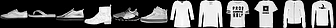

RECONSTRUCTION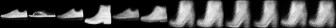

<i style="--score:.0040"></i><i style="--score:.0094"></i><i style="--score:.0127"></i><i style="--score:.0171"></i><i style="--score:.0210"></i><i style="--score:.0268"></i><i class="foreign" style="--score:.1874"></i><i class="foreign" style="--score:.1765"></i><i class="foreign" style="--score:.1737"></i><i class="foreign" style="--score:.1670"></i><i class="foreign" style="--score:.1661"></i><i class="foreign" style="--score:.1653"></i>

familiar footwearunseen garments

$s(x)=\|x-\hat{x}\|_2^2$ <i></i> large error is evidence of mismatch

::: {.notes}
Teaching goal: make anomaly detection a consequence of a deliberately restricted training distribution.

State the setup before interpreting the pictures. This second autoencoder was trained only on Fashion-MNIST sandals, sneakers, and ankle boots. The left six columns are held-out footwear examples; the right six are garments that the model never encountered during training. Each input is aligned vertically with its reconstruction.

Ask students to inspect the images before looking at scores. Familiar footwear is reconstructed with recognizable shape. Unseen tops are forced through a decoder specialized for footwear and collapse into implausible smears or shoe-like structures. The bars underneath encode per-image MSE on one common scale; orange marks examples outside the training family.

Reveal the score rule. Reconstruction error becomes an anomaly score because the model is expected to reconstruct normal examples better than inputs outside its learned regularities. Here, median MSE is 0.0168 for held-out footwear and 0.0838 for the other seven classes.

Give the essential caution: high error means mismatch with what this model reconstructs well; it does not explain the cause and does not prove an input is harmful. A damaged shoe, rare shoe, distribution shift, or poorly trained model can also produce high error. Conversely, a powerful autoencoder may reconstruct anomalies too well.
:::

## Set the alarm before seeing the answer

0.00<i></i>0.20 MSE<b class="threshold-line fragment"></b>

HELD-OUT FOOTWEAR<i style="left:2%"></i><i style="left:5%"></i><i style="left:6.5%"></i><i style="left:8.5%"></i><i style="left:10.5%"></i><i style="left:13.5%"></i>

UNSEEN GARMENTS<i style="left:82.7%"></i><i style="left:83.1%"></i><i style="left:83.5%"></i><i style="left:86.8%"></i><i style="left:88.3%"></i><i style="left:93.7%"></i>

::: {.exercise-prompt}
**Given:** footwear is “normal”; false alarms are costly. **Task:** place a threshold and name one failure mode.
:::

::: {.exercise-pause}
PAUSE<strong>60 seconds</strong><small>Choose from validation scores—not from the anomalies you hope to detect.</small>
:::

::: {.exercise-solution .fragment}
**Worked choice:** the 95th percentile of normal validation error gives $\tau=0.0397$.

Flag when $s(x)>\tau$. This controls false alarms on validation footwear—but novel inputs that reconstruct well can still pass.
:::

::: {.notes}
Teaching goal: prevent students from treating the anomaly threshold as a universal constant or choosing it after inspecting test anomalies.

The dots reuse the twelve examples from the preceding gallery on a common 0–0.20 MSE axis. Before revealing the vertical threshold, ask where students would place it if false alarms on legitimate footwear are costly. Require them to state what data they are allowed to use.

Display the pause panel for about one minute. The key reasoning is that the threshold must be calibrated on separate normal validation data, not selected to separate the displayed anomalies. A threshold chosen after examining target anomalies leaks test information and gives an optimistic evaluation.

Reveal the worked choice. In the full held-out footwear validation set, the 95th percentile is $\tau=0.0397$. The rule is $s(x)>\tau$. Interpret the percentile: roughly five percent of normal validation examples exceed the threshold, so this choice explicitly accepts that validation false-positive rate. Deployment rates may differ under shift.

Ask for failure modes: an unusual but valid shoe triggers an alarm; a simple anomaly reconstructs too well; preprocessing changes raise every score; or MSE overlooks a small but important defect. Close by separating the ingredients: the model supplies a score, validation calibrates a threshold, and the application determines the cost tradeoff.
:::

# 06 · Why sampling still fails {.section-slide .autoencoder-section .sampling-section data-section-progress="6 / 6" style="--section-progress:100%"}

## The decoder accepts coordinates it never learned

<canvas data-role="sampling-map" width="790" height="500" aria-label="Encoded Fashion-MNIST points with uniformly sampled latent coordinates overlaid"></canvas>

encoded test imageuniform random coordinate

250 LEGAL INPUTS TO $g_\phi$
<strong>Which colored points were supported by training data?</strong>
<small>Color warms as distance to the nearest encoded example increases.</small>

The reconstruction objective defined <strong>where encoded data landed</strong>—not a distribution from which to sample new $z$.

::: {.notes}
Teaching goal: separate the decoder's mathematical domain from the part of latent space supported by encoded data.

The gray cloud contains the same 1,000 encoded test images used in Section 4. The colored dots are 250 coordinates sampled uniformly inside the rectangular range of that cloud. Every colored coordinate has the correct shape—two real numbers—and the decoder will accept all of them.

Ask students to compare the rectangle with the gray support. Many random points fall inside holes, sparse edges, or regions between curved concentrations. Warmer color means a greater Euclidean distance to the nearest encoded example. The important distinction is “valid tensor” versus “supported representation.” Shape checking can guarantee only the first.

Reveal the answer after students identify empty regions. During ordinary training, $g_\phi$ receives codes of the form $f_\theta(x)$ for training examples. The objective never asks random coordinates from a simple prior to decode well. The encoder may arrange data in disconnected islands, stretched filaments, or an irregularly occupied region.

Transition: the map shows unsupported coordinates abstractly; next we decode an entire regular grid and inspect what the model actually produces there.
:::

## Decode the empty space

high $z_2$<i></i>low $z_2$

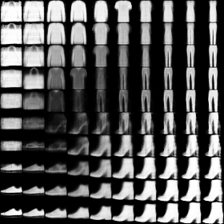

low $z_1$<i></i>high $z_1$

Trace a row: where does a recognizable garment become an average, a hybrid, or nearly blank?

::: {.course-takeaway-dark .fragment}
CONTINUITY IS NOT COVERAGE

The decoder changes smoothly across the grid, even where no training image supplied evidence.
:::

::: {.notes}
Teaching goal: let students see that smooth decoder output does not imply a well-supported generative latent space.

This is a real 10-by-10 decoder atlas. We span the central 98 percent range of each learned coordinate, evaluate a regular grid of 100 codes, and decode every code with the same two-dimensional autoencoder. Neighboring cells differ by a fixed step in latent space.

Read one horizontal row and then one vertical column. Some regions contain recognizable footwear or tops. Other regions contain faint averages, abrupt semantic mixtures, or nearly blank images. Invite students to point to a boundary where visual identity becomes ambiguous.

Reveal the prompt and allow several interpretations. Then make the precise claim: neural-network continuity encourages nearby coordinates to produce nearby pixel arrays. It does not ensure those arrays lie on the data distribution. A smooth transition can pass through implausible images, as already hinted by interpolation.

Connect back to the first slide: the weak cells tend to occur where the grid traverses sparse or unsupported regions. We need both a way to sample codes and a reason for sampled codes to occupy regions the decoder learned.
:::

## A prior does not repair a missing contract

<canvas data-role="sampling-map" width="520" height="335" aria-label="Latent support and random probes"></canvas>

RANDOM PROBES · nearest four → farthest four
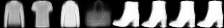

<b>0.02</b><i></i><b>8.64 distance to data</b>

::: {.exercise-prompt}
**Proposal:** “Let us generate by drawing $z\sim\mathcal{N}(0,I)$.” **Task:** identify the missing guarantee.
:::

::: {.exercise-pause}
PAUSE<strong>45 seconds</strong><small>Ask what loss term ever compared encoded points with that Gaussian.</small>
:::

::: {.exercise-solution .fragment}
**Missing guarantee:** nothing trained $f_\theta(x)$ to follow $\mathcal N(0,I)$, so prior samples can land far from every code the decoder saw.
:::

::: {.notes}
Teaching goal: make students reject an arbitrary sampling rule by checking it against the training objective.

The eight decoded probes are ordered by distance to the nearest encoded test point. The first four random coordinates happen to land close to data support; the last four occupy the most unsupported regions among 250 uniform draws. Use them as evidence, not as a claim that distance alone perfectly measures realism.

Present the Gaussian proposal as plausible. The decoder accepts two numbers, and a standard normal is easy to sample. Then show the pause panel. The expected response is not merely “the samples may look bad”; students must name the missing training constraint.

Reveal the solution. Our loss optimized reconstruction only for $z=f_\theta(x)$. It neither matched the aggregate collection of codes to a standard normal nor ensured that neighborhoods around arbitrary prior samples were populated. Changing the random-number generator after training cannot retroactively organize latent space.

Clarify that some Gaussian draws might still decode plausibly by accident, especially if scale and center roughly overlap the codes. The issue is absence of a guarantee and unreliable coverage, not impossibility of ever obtaining a good sample.

Do not teach the VAE mechanism here. End the slide by asking what additional contract a genuinely sampleable model would need; the final synthesis names the requirement without solving it.
:::

## Reconstruction taught us where the next question begins

WHAT WE TRAINED<b>$x$</b><i>→</i><b>$z=f_\theta(x)$</b><i>→</i><b>$\hat{x}$</b><strong>preserve what predicts the target</strong>

WHAT WE USED<b>$\tilde{x}$</b><i>→</i><b>clean $\hat{x}$</b><em>+</em><b>$\|x-\hat{x}\|^2$</b><strong>denoise · retrieve · flag mismatch</strong>

WHAT IS STILL MISSING<b>sample $z$</b><i>→</i><b>supported region?</b><i>→</i><b>realistic $x$?</b><strong>a training contract for the distribution of latent codes</strong>

::: {.course-takeaway-dark .fragment}
NEXT QUESTION

How can we learn representations that reconstruct well **and** make sampling reliable?
:::

::: {.notes}
Teaching goal: close the lecture by composing mechanisms already established, then leave one precise unresolved requirement.

Read the first route as the core contract: the encoder maps an observed image to a code, the decoder reconstructs it, and the loss rewards preservation of target-predictive information. Recall that bottleneck width changes pressure and that neighborhoods and paths let us inspect the resulting representation.

Reveal the second route as applications, not separate architectures. Denoising changes the input-target pair. Retrieval uses distance between codes. Anomaly detection turns reconstruction mismatch into a score and requires validation-based calibration. Each use depends on how the training task defines what should be preserved.

Reveal the third route and pause at each question mark. Ordinary reconstruction training gives no chosen sampling distribution for $z$ and no coverage guarantee between encoded examples. This is exactly why “has a decoder” does not imply “is a reliable generator.”

Finish with the next question. Do not introduce KL divergence, reparameterization, or the VAE objective yet. The intellectual handoff is simply the missing specification: future training must retain reconstruction while organizing latent codes so samples come from supported regions.
:::

