## Variational Autoencoders {.deck-title}

:::: {.deck-title-grid}
::: {.deck-title-copy}
<span class="eyebrow">CHAPTER 11 · GENERATIVE MODELS</span>

### Learning a latent space we can sample

We learned to reconstruct an image. How do we generate one without an input?

<span class="deck-author">Dr. A. Belcaid</span>
:::

::: {.deck-title-art}
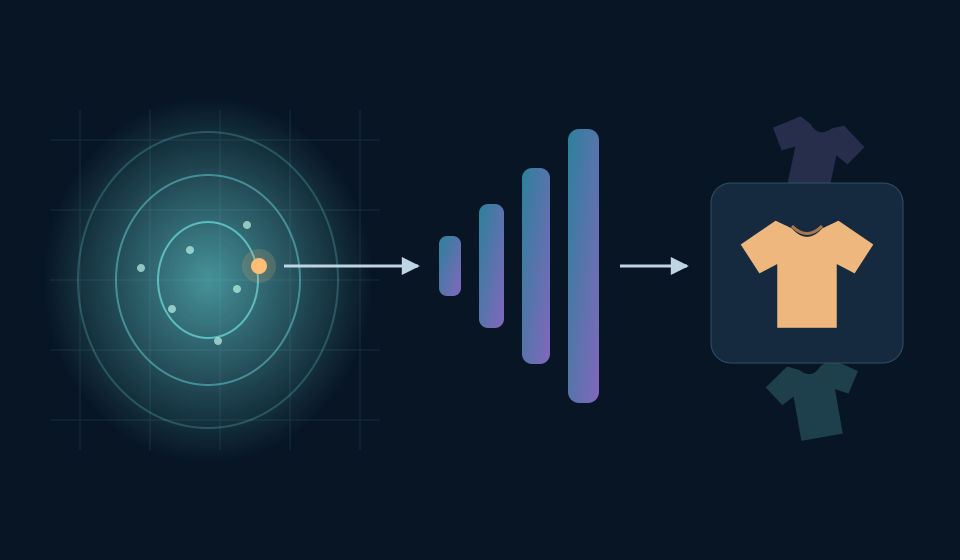{fig-alt="Conceptual diagram: a point is sampled from a smooth latent distribution, passed through a decoder, and turned into a clothing image. Faint nearby clothing outlines suggest variation."}
:::
::::

::: {.notes}
Open at the unresolved question from Chapter 10, not with a list of VAE definitions. Students have reconstructed Fashion-MNIST images, explored codes, and interpolated between examples. They also saw that an ordinary autoencoder leaves arbitrary latent samples unsupported by its training objective. Ask: if we remove the input image, where should the decoder's code come from?

The thumbnail is a course-made conceptual illustration, not measured VAE output. It previews the generation path: draw a latent code from a prior, then use the learned decoder. It deliberately omits the encoder because no input image is required on this path. During training, the encoder will approximate an image-dependent posterior; distinguish that distribution from the prior when the mechanism is introduced. A VAE encourages compatibility with a chosen prior, but does not guarantee that every sampled code produces a good image.

The opening and roadmap are approved. Sections 1–5 develop generation, the probabilistic encoder, the variational objective, and reparameterization through model outputs, exact examples, and executable gradient probes; the model assembly and training code are now included. Section 6 closes with recorded latent paths, unfiltered samples, a latent-use diagnostic, and a generation task.
:::

## A first-level map of the lecture

:::: {.lecture-toc}
::: {.lecture-toc-item style="--toc-color:#2878c8"}
<span>01</span>

### From reconstruction to generation
:::
::: {.lecture-toc-item style="--toc-color:#008e9b"}
<span>02</span>

### From one code to a distribution
:::
::: {.lecture-toc-item style="--toc-color:#ef5b45"}
<span>03</span>

### Learning to reconstruct—and to sample
:::
::: {.lecture-toc-item style="--toc-color:#7655ad"}
<span>04</span>

### Backpropagating through a random draw
:::
::: {.lecture-toc-item style="--toc-color:#38865a"}
<span>05</span>

### Building and training a VAE
:::
::: {.lecture-toc-item style="--toc-color:#c94f78"}
<span>06</span>

### Sampling, interpolation, and limitations
:::
::::

::: {.notes}
Read these six sections as a single investigation with Fashion-MNIST as the visual thread.

1. Retrieve the previous lecture's failed random samples. Contrast reconstructing a known image with generating a new one, and introduce the prior-to-decoder generative story before equations.
2. Compare the familiar autoencoder with the VAE module structure. Replace the encoder's single code with the parameters of a diagonal Gaussian approximate posterior. Use repeated draws for one image to explain mean, spread, and the roles of posterior versus prior; do not describe uncertainty as an arbitrary blur effect.
3. Raise the competing demands with visual evidence: preserve the input while shaping codes toward a distribution from which we know how to sample. Develop expected reconstruction and KL divergence, then connect them to the evidence lower bound. Explain the direction of the KL and that the bound is on log likelihood, not a promise of perceptually perfect samples. Keep derivations tied to what the model is being asked to preserve or change.
4. Turn randomness into fixed sampled noise plus a differentiable transformation. Trace z = mu + sigma * epsilon with a concrete numerical draw and a computation graph before showing the implementation. Clarify that gradients flow to the distribution parameters, not into the random-number generator.
5. Map the architecture to PyTorch: mean/log-variance heads, sampling, decoder, and the loss. Show tensor shapes and consistent loss reductions. Use training infrastructure students already know, compare reconstructions with prior samples, and distinguish posterior-mean reconstructions from stochastic ones.
6. Inspect generated images, latent paths, and failures. Compare controlled settings before claiming improvement; explain the reconstruction/regularization tradeoff, blurry outputs, and posterior collapse through evidence. Interpolation is an experiment, not a guarantee of semantic continuity. Finish by composing the mechanisms already taught, without introducing another model family.

Keep the roadmap at this first level on screen. Detailed derivations and experiments belong to the sections we will develop after approval, not to this TOC.
:::

# 01 · From reconstruction to generation {.section-slide .vae-section data-section-progress="1 / 6" data-background-color="#17212b"}

::: {.notes}
This section should take approximately 15–20 minutes including discussion. Its goal is to separate reconstruction from generation, identify the missing sampling rule, and establish a concrete generative path. It does not derive the ELBO, KL term, or reparameterization yet. Use the live samples and the final prediction exercise to diagnose whether students understand that distinction before advancing.
:::

## We can reconstruct an image we already have

<div class="course-centered-figure evidence-wide"><figure>
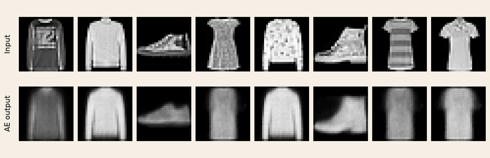
<figcaption><span>RETRIEVE THE PREVIOUS LECTURE</span><strong>The decoder receives a code supplied by a real image.</strong><small>What information must we supply before this pipeline can start?</small><small class="course-caption-source">Course experiment · <a href="https://github.com/zalandoresearch/fashion-mnist">Fashion-MNIST</a> · Project 3 AE, d = 2, six epochs · first eight validation examples.</small></figcaption>
</figure></div>

::: {.fragment .vae-line}
$x \xrightarrow{\text{encoder}} z \xrightarrow{\text{decoder}} \hat{x}$ — the input gives us a starting point.
:::

::: {.notes}
Start with the images, not the formula. Have students name two details that survived and two that did not. These are actual outputs from the Project 3 checkpoint, not an idealized autoencoder diagram. A two-dimensional code is severe compression, so the purpose is not to claim excellent reconstruction. The point is that each output has a specific target: the image directly above it.

Ask where the decoder's input came from. After their answer, reveal the familiar path. The encoder supplies the code for an observed validation image. Validation images were not used for weight updates: reconstruction of a held-out image is already generalization, but it still requires an input image. Do not equate held-out reconstruction with unconditional generation.

Protocol: Fashion-MNIST's official training set is split reproducibly into 50,000 training and 10,000 validation images with seed 41. The AE uses 784–256–128–2 and a mirrored sigmoid decoder, trained for six epochs with pixel MSE. No new AE training was needed when the saved Project 3 checkpoint was available. The displayed examples are the first eight validation images, without selecting the prettiest reconstructions.
:::

## Remove the input. Where does an image come from?

<div class="course-centered-figure evidence-wide"><figure>
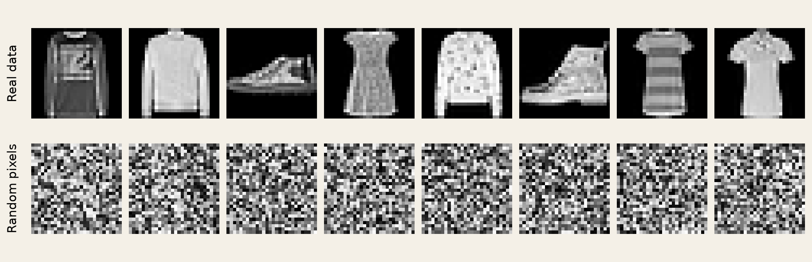
<figcaption><span>TRY THE MOST DIRECT RANDOM GENERATOR</span><strong>Draw each of the 784 pixel values independently.</strong><small>Both rows are valid 28 × 28 arrays. Why is only one row recognizable clothing?</small><small class="course-caption-source">Fashion-MNIST validation images; independent Uniform(0, 1) pixels · course experiment, seed 97.</small></figcaption>
</figure></div>

::: {.fragment .vae-line}
An image distribution must capture <strong>relationships between pixels</strong>.
:::

::: {.notes}
Give students time to inspect the two rows. Both have the same shape and numerical range. The difference is not that the second row violates the tensor contract. Independent pixel draws ignore relationships: a sleeve is connected to a torso, a shoe has a coherent outline, and background pixels tend to occur together. A valid array is not necessarily a plausible image.

Avoid claiming that random pixels can never form a recognizable object; the point is that this independent uniform distribution puts negligible probability on the structured images we care about. Nor is the lesson that randomness itself is bad. We want structured variation, rather than 784 unrelated choices.

Retrieve the decoder: we already have a learned transformation that couples output pixels through shared latent variables and weights. That suggests moving randomness into the small latent space, then allowing the decoder to turn it into structure. Ask students whether this alone is sufficient. The next two slides test that proposal on an actual AE rather than answering with a cartoon.
:::

## Let the decoder provide the structure

<div class="vae-map-layout">
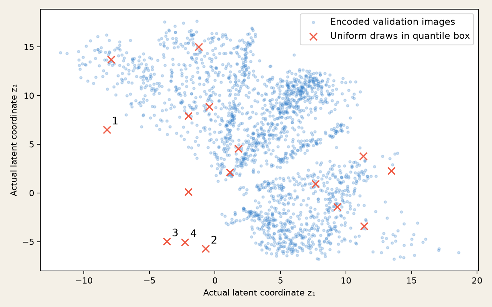
<div class="vae-map-copy">
<p><strong>Blue points</strong><br>Encode real images.</p>
<p><strong>Orange crosses</strong><br>Draw new codes.</p>
<p class="fragment">Same decoder.<br>No input image.<br><strong>Predict the outputs.</strong></p>
</div></div>
<p class="vae-source">Actual AE coordinates, not PCA · 2,000 validation images · uniform draws inside the 1st–99th percentile box · seed 211.</p>

::: {.notes}
Explain the axes: each blue point is an actual pair of encoder outputs. This is not a PCA or t-SNE projection; d equals two. Orange crosses are a reproducible first batch of sixteen uniform random points within the coordinate-wise 1st–99th percentile bounds. The first four are numbered so students can connect them to the next gallery in reading order.

Ask students to distinguish numerical validity from training support. All crosses have a valid decoder input shape. Some are close to observed codes; others are far from the plotted sample. The decoder was optimized on encoded training images, not uniformly over this rectangle. These validation codes are a visual proxy for the occupied regions, not a proof of zero training density elsewhere. Avoid the literal claim that every point outside the scatter is impossible or guaranteed to fail.

Reveal the prediction prompt. Keep the model fixed while changing only how its input code is obtained. Do not insert a Gaussian here: the uniform box is deliberately a simple proposal, not a theoretical prior fitted to the model. A better post-hoc density model could be learned for an AE; ordinary reconstruction training simply does not supply one automatically.
:::

## Valid codes do not guarantee useful samples

<div class="course-centered-figure evidence-wide"><figure>
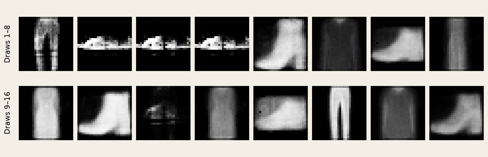
<figcaption><span>REVEAL THE PREDICTED OUTPUTS</span><strong>These are the same 16 orange crosses, in reading order.</strong><small>Which samples are recognizable? Which are ambiguous? Judge before explaining.</small><small class="course-caption-source">Unmodified Project 3 d = 2 decoder · first 16 fixed-seed uniform draws, no cherry-picking.</small></figcaption>
</figure></div>

::: {.fragment .vae-line}
Reconstruction learned a decoder—not a reliable rule for drawing its inputs.
:::

::: {.notes}
Let students disagree about ambiguous samples. Some outputs can be recognizable; do not teach that all random AE samples are necessarily garbage. This gallery is evidence from one small model and one sampling proposal, not a universal impossibility theorem. The uncertainty about which region to sample is precisely the unresolved contract.

Connect an output to the corresponding cross on the previous slide if useful. The images are displayed in the original draw order, not ranked by visual quality or distance from data. We deliberately retain all sixteen, including reasonable results. Explain that reconstruction loss evaluates pairs x and decoder(encoder(x)); it does not directly tell us how to sample z without x.

Reveal the conclusion after the discussion. An ordinary AE can be combined with a separately fitted latent density, but we would like a model trained with an explicit generative story. The next slide introduces that story, not the entire VAE training algorithm.
:::

## Choose where to draw; learn what to draw

<div class="vae-generative-flow" role="img" aria-label="Generation path: sample z from a prior, use a learned decoder distribution, produce an image. No encoder or input image is required.">
<div><span>1 · DRAW A CODE</span><div class="vae-circle">$z$</div><p>$z \sim p(z)$</p><small>A known sampling rule</small></div>
<b aria-hidden="true">→</b>
<div><span>2 · DECODE</span><div class="vae-decoder-bars"><i></i><i></i><i></i><i></i></div><p>$p_\theta(x\mid z)$</p><small>Learned image distribution</small></div>
<b aria-hidden="true">→</b>
<div><span>3 · PRODUCE AN IMAGE</span>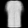<p>$x \sim p_\theta(x\mid z)$</p><small>Here: display the decoder mean</small></div>
</div>
::: {.fragment .vae-line}
No input image is needed at generation time. The decoder still had to learn from images.
:::
<p class="vae-source">Course diagram based on <a href="https://arxiv.org/abs/1312.6114">Kingma &amp; Welling, Auto-Encoding Variational Bayes (2014), §2.1</a>. Image: actual course VAE preview.</p>

::: {.notes}
Read the path left to right. First draw a low-dimensional code from a specified prior. In this experiment the prior is a standard two-dimensional Gaussian. Then a learned decoder specifies an image distribution conditional on that code. Formally we may sample an image from that conditional distribution. The preview displays its mean pixel values, as is common in VAE visualizations, rather than an additional pixel-level sample. A fresh latent draw already changes the displayed mean image.

Distinguish the random variable from the distribution: z is one draw, p(z) is the rule generating possible draws. Theta denotes learned decoder parameters. This is a general latent-variable generative story; the diagram alone does not define a VAE. Variational inference and the encoder's role in training are the next sections' work.

The right-hand image is an actual output from the small VAE trained for this section. It is evidence supporting the schematic, not an artist's ideal output. Do not claim the two coordinates correspond directly to named attributes such as sleeve length. The model is unsupervised, and such disentanglement is not guaranteed.

Ask where the encoder is. It is absent because this is the generation path. That does not mean the encoder is unimportant: it will help us learn from observed images. Keep that question open for the section transition. The generative story follows Kingma and Welling, §2.1; the training explanation is intentionally deferred.
:::

## A fresh draw, without an input image

<div class="vae-live" id="vae-sampler">
<div class="vae-live-controls"><span>FIXED-SEED VAE PREVIEW · d = 2</span><h3>Draw <b id="draw-count">1</b> / 16</h3><p id="draw-code">Loading the recorded code…</p><button id="next-draw" type="button">Next latent draw →</button><p>Same trained decoder.<br>Only the latent code changes.</p><small>Cycles through 16 recorded samples.<br>No training or inference in the browser.</small></div>

</div>
::: {.fragment .vae-line}
Recognizable variation is possible. Sharpness, diversity, and coverage still need checking.
:::
<p class="vae-source">Course experiment · Fashion-MNIST, 50k train · VAE, 10 epochs · z ∼ N(0, I) · decoder means, not pixel draws.</p>

::: {.notes}
Press the button several times and ask students to describe what changed. It cycles through the first sixteen recorded latent draws from a fixed seed, not a hand-selected good-example collection. No training or model inference runs in the page, so the demonstration works reliably offline. Use the adjacent model gallery in the reproducibility assets if a static handout is needed.

This is a preview of what we will learn to construct. Its model uses a 784–256–128 encoder with two mean and two log-variance outputs, a two-dimensional Gaussian latent variable, and a mirrored sigmoid decoder. It was trained for ten epochs on the same 50,000-image training split, with Adam at 0.001. Its objective is summed-pixel binary cross-entropy with grayscale targets plus KL, averaged over images. For grayscale images this BCE is the conventional soft-target surrogate, not an exact continuous-data likelihood. Those distinctions belong in the later loss section.

Do not present this as a controlled AE-versus-VAE performance ranking: objectives and epoch budgets differ. The question here is whether this explicitly trained prior-to-decoder path can yield recognizable clothing without an input. The outputs may be blurry and some ambiguous; retain those examples. A small d = 2 demonstration trades quality for inspectable geometry. A few images do not establish full distribution coverage or rule out memorization.
:::

## A plausible image is only the first check

<div class="course-centered-figure evidence-wide"><figure>
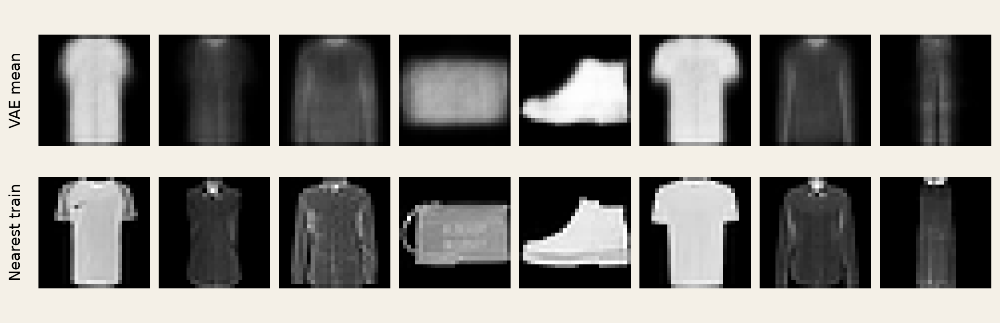
<figcaption><span>LOOK FOR COPYING—WITHOUT OVERCLAIMING</span><strong>Top: generated means. Bottom: nearest training images by pixel MSE.</strong><small>What is shared? What differs? Does this prove the model never memorizes?</small><small class="course-caption-source">Exact search over all 50,000 training images · first eight recorded VAE draws · pixel MSE is not semantic similarity.</small></figcaption>
</figure></div>

::: {.fragment .vae-line}
Check plausibility, variation, and resemblance to training data—not just one attractive sample.
:::

::: {.notes}
Students may call any unfamiliar image novel. Slow that inference down. We compare each generated decoder mean with its nearest image in the complete training split under a specified metric, pixel MSE. Ask them to identify a shared outline and a differing detail. The search is exact over 50,000 images, not over a small conveniently selected gallery.

This is a simple diagnostic, not a proof of non-memorization or a privacy guarantee. Pixel distance can miss perceptually similar copies, small transformations can change MSE, and inspecting eight samples says little about rare behavior. The experiment records the selected training dataset indices and distances in the manifest so the figure is auditable.

Separate three questions students often collapse: is an individual image plausible, are different draws meaningfully varied, and how do generated results relate to the training data? Distribution-level coverage requires broader evaluation. No formal generative metric is introduced here; the purpose is to establish that reconstruction MSE and a pretty sample are both insufficient to judge an unconditional generator.
:::

## Which machine can start without an image?

<div class="vae-choice-paths">
<p><b>A</b> held-out image → encoder → code → decoder</p>
<p><b>B</b> draw a stored training code → decoder</p>
<p><b>C</b> draw from a prior → trained decoder</p>
</div>
<p class="vae-task">For each path: does it need a new input image, and what limits its outputs?</p>
<div class="exercise-pause"><span>PAUSE</span><b>90 seconds</b><small>Separate “no new input” from “new latent codes.”</small></div>
<div class="fragment exercise-solution vae-solution"><span class="solution-label">WORKED SOLUTION</span>
<p><strong>A:</strong> Yes—reconstruction remains tied to the supplied image.</p>
<p><strong>B:</strong> No new image—but a deterministic decoder repeats a finite collection of reconstructions.</p>
<p><strong>C:</strong> No image—new codes are possible; useful outputs depend on learning compatibility with the prior.</p>
</div>
<p class="fragment exercise-extension">If generation needs no encoder, why train one? → Section 02</p>

::: {.notes}
State the givens precisely: these paths use fixed trained networks; B samples only from a finite bank of stored training codes and uses a deterministic decoder. Students should classify both the input requirement and the limitation, not merely choose the path that looks like the VAE diagram.

A can reconstruct an unseen image but still needs it as input. B can start without a newly supplied image, so saying it cannot generate anything is too strong. However, it only selects among a finite bank of fixed decoded outputs; it introduces no new latent locations. C defines an unconditional latent sampling process, but an arbitrary decoder plus a prior is not sufficient for good results, as our AE experiment showed.

Reveal the worked solution only after the pause. Invite a student to explain why “no input image” does not alone distinguish B from C. Then reveal the transfer question. We have specified a direction for generation, z to x; learning from data starts with x. The next section will ask what distribution over codes could account for a given image, introducing the probabilistic encoder. Stop here rather than pre-teaching that section's equations.
:::

# 02 · From one code to a distribution {#section-2 .section-slide .vae-section .vae-section-two data-section-progress="2 / 6" data-background-color="#17212b"}

::: {.notes}
Allow about 15–20 minutes. Carry the question from section 1: generation runs from a latent code to an image, but our training set contains images. What could tell us which codes account for one observed image? Compare module structure, inspect a real probabilistic encoder, interpret its Gaussian outputs, and map that contract to code. End by distinguishing the input-conditioned distribution from the prior. The training objective and differentiable sampling are deliberately left for sections 3 and 4.
:::

## What changes inside the encoder? {#encoder-distribution .vae-s2}

<div class="vae-architecture">
<div class="vae-path-label">FAMILIAR AUTOENCODER · one code per image</div>

```{mermaid}
%%| fig-width: 13
%%{init: {"themeVariables": {"fontSize": "25px"}, "flowchart": {"rankSpacing": 45, "nodeSpacing": 35, "padding": 20, "curve": "linear"}}}%%
flowchart LR
  X["Image x"] --> E["Encoder"] --> Z(("z")) --> D["Decoder"] --> R["Reconstruction"]
  classDef net fill:#dceeff,stroke:#2878c8,stroke-width:2px,color:#17212b;
  classDef latent fill:#e9e2f3,stroke:#7655ad,stroke-width:2px,color:#17212b;
  class E,D net;
  class Z latent;
```

::: {.fragment}
<div class="vae-path-label">PROBABILISTIC ENCODER · describe possible codes, then draw one</div>

```{mermaid}
%%| fig-width: 13
%%{init: {"themeVariables": {"fontSize": "25px"}, "flowchart": {"rankSpacing": 45, "nodeSpacing": 35, "padding": 20, "curve": "linear"}}}%%
flowchart LR
  X["Image x"] --> E["Encoder<br/>features"]
  E --> M["μ(x)"]
  E --> S["σ(x)"]
  M --> Q["Gaussian<br/>qφ(z ∣ x)"]
  S --> Q
  Q -->|draw| Z(("z")) --> D["Decoder"] --> R["Mean<br/>image"]
  classDef net fill:#dceeff,stroke:#2878c8,stroke-width:2px,color:#17212b;
  classDef latent fill:#e9e2f3,stroke:#7655ad,stroke-width:2px,color:#17212b;
  class E,M,S,D net;
  class Q,Z latent;
```
:::
</div>

::: {.fragment .vae-line}
$q_\phi(z\mid x)$ approximates the model’s posterior $p_\theta(z\mid x)$:<br>which codes could account for <em>this image</em>?
:::
<p class="vae-source">Course diagrams based on <a href="https://arxiv.org/abs/1312.6114">Kingma &amp; Welling (2014), §§2.1, 3</a>. Displayed reconstruction = decoder mean.</p>

::: {.notes}
Begin with the top path. The deterministic encoder supplies one point for an image; repeated evaluation of this fixed network returns that same point. Ask students which module must change if we want a distribution over possible codes for that image. Reveal the lower path. The shared feature extractor branches into two parameter heads. The drawing uses standard deviation for interpretability; the implementation will predict log variance and convert it to a positive standard deviation.

The decoder still receives ONE vector z on each pass, not a cloud, a variance tensor, or all possible images. Its input dimension has not doubled. A distribution with two latent coordinates needs two means and two spreads, but a sample still has only two coordinates. The lower diagram is a structural description, not a complete training algorithm: replacing one head with two does not alone produce a trained VAE.

Only after students trace the path, name q as an approximate posterior. The generative model defines a joint distribution p(z)p_theta(x|z). Once x is observed, the model's posterior asks which latent explanations are compatible with it. Computing the exact posterior generally requires an intractable normalization integral. The learned encoder provides a tractable approximation; it does not recover a uniquely correct hidden code. Phi denotes shared encoder weights, theta decoder weights. Mu(x) and sigma(x) are per-image outputs, not separately fitted network weights for each image. No claim of calibrated semantic uncertainty follows from this construction.
:::

## Same image. Same encoder. Another code? {#posterior-experiment .vae-s2}

<div class="posterior-lab" id="posterior-lab">
<div class="posterior-toolbar"><label for="posterior-input">Observed image</label><select id="posterior-input"><option value="0">T-shirt / top</option><option value="1">Trouser</option><option value="2">Ankle boot</option></select><button id="posterior-next" type="button">Next posterior draw →</button><button id="posterior-mean" type="button">Decode μ instead</button><span id="posterior-count" aria-live="polite">Draw 1 / 8</span></div>
<div class="posterior-stage">
<figure><figcaption>Observed image <b>x</b></figcaption></figure>
<div class="posterior-density"><svg id="posterior-map" viewBox="0 0 400 330" role="img" aria-label="Encoder Gaussian in actual latent coordinates; cross marks the mean and dot marks the current code."></svg><p id="posterior-parameters">Loading recorded encoder outputs…</p></div>
<figure>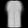<figcaption id="posterior-code">Decoded sample</figcaption></figure>
</div>
<p class="posterior-fixed">Fixed input → fixed μ and σ. The sampled z can change.</p>
</div>
::: {.fragment .vae-line}
The encoder describes a distribution; the decoder receives one point from it.
:::
<p class="vae-source">Actual course experiment · Fashion-MNIST · d = 2 · separate 10-epoch VAE run · first validation item of each named class; 8 fixed-seed draws each. Recorded decoder means.</p>

::: {.notes}
Before clicking, ask students to predict which items can change: input, mean, spread, code, decoded image, network weights. Click Next posterior draw several times. The input, encoder outputs, and weights remain fixed. The moving point is a new recorded posterior draw, and the right-hand image is its actual decoded mean. Depending on the example, changes may be subtle or include distorted details; do not imply that every draw is equally faithful. The contours represent Mahalanobis radii 1 and 2 of a diagonal Gaussian, not hard boundaries or 68%/95% joint probability regions. The plotted axes are the actual two latent coordinates, with equal scale across inputs. This is an explicitly labeled local zoom: each axis runs from that image’s mean minus 0.30 to its mean plus 0.30. The full prior comparison later restores the global view.

Switch the observed image. Now the same encoder weights produce different means and spreads. Class names only label the chosen inputs; class labels were not supplied to the unsupervised model. The selection rule was fixed before viewing results: the first validation item of classes T-shirt/top, Trouser, and Ankle boot. This is an illustrative mechanism demonstration, not a representative reconstruction benchmark. All eight seeded draws for every input are retained.

Click Decode mu instead. This is a deterministic plug-in reconstruction. It is neither a fresh posterior draw nor generally the expected decoded image: for a nonlinear decoder, decoding the mean need not equal averaging decoded samples. Next posterior draw resumes the saved draw sequence. The page uses local prerecorded assets, with no inference or training in the browser. The new checkpoint follows section 1's architecture and protocol but is a separate run; do not claim pixel-identical results to section 1. Loss details, software version, seeds, exact indices, and checkpoint hash are in the manifest and generation script.

The posterior spread describes uncertainty over latent codes under this fitted approximation; it is not a class probability, a direct blur control, or Bayesian uncertainty about the network's weights.
:::

## Read the distribution before drawing a code {#gaussian-exercise .vae-s2}

<p class="vae-gaussian-definition">$q_\phi(z\mid x)=\mathcal N\!\left(\mu(x),\operatorname{diag}(\sigma^2(x))\right)$</p>
<p class="vae-task">For one image: $\mu=(1,-0.5)$ and $\sigma=(0.25,1)$.<br>Which coordinate varies more? Give each mean ± one standard deviation interval.</p>
<div class="vae-gaussian-plot">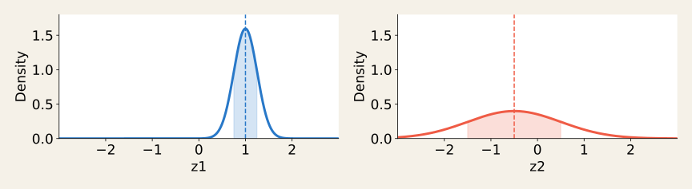</div>
<div class="exercise-pause"><span>PAUSE</span><b>60 seconds</b><small>Read location and width separately; compare spread, not peak height.</small></div>
<div class="fragment exercise-solution posterior-solution"><span class="solution-label">WORKED SOLUTION</span><p>$z_1: [0.75,1.25]$ &nbsp; · &nbsp; $z_2: [-1.5,0.5]$</p><p>$z_2$ has 4× the standard deviation and 16× the variance.</p><p>Each interval contains about 68% of its marginal Gaussian; neither is a hard limit.</p></div>
<p class="vae-source">Course-made numerical illustration, not fitted values. “Diagonal” assumes conditional independence of coordinates for this fixed image.</p>

::: {.notes}
Tie the formula to the previous experiment: mu locates the cloud and sigma controls its spread along each coordinate. Define diag explicitly: the covariance matrix has sigma_1 squared and sigma_2 squared on its diagonal, with zero off-diagonal entries. For this Gaussian approximation that means the coordinates are independent conditional on a fixed x. It does not imply that the coordinates of all encoded images are independent after mixing over the dataset. Nor is a diagonal Gaussian the only possible variational family.

The plots deliberately share horizontal and vertical limits, so students can compare widths honestly. Peak height is probability density, not probability; the area under either full curve is one. Retrieve this prerequisite briefly rather than reteaching Gaussian probability. The displayed example is chosen for transparent arithmetic, not claimed to come from the model.

After the pause, reveal the interval endpoints, then discuss the spread ratio. The wider coordinate has standard deviation 1 versus 0.25, hence four times the standard deviation; squaring gives a variance ratio of sixteen. Each one-dimensional interval has about 68.27% probability. Both coordinates lying within their respective intervals has about 0.6827 squared, or 46.6%, under conditional independence. A two-dimensional radius-one ellipse is a different region again. Avoid reusing the marginal 68% statement as a description of the ellipse in the live plot.

This is distribution interpretation, not reparameterization practice; numerical draws and the gradient path belong to section 4.
:::

## Two heads describe the Gaussian {#encoder-code .vae-s2}

<div class="posterior-code-layout">
<div class="posterior-shapes">
<h3>For a batch of 32 images</h3>
<p>Shared features<br><b>h: [32, 128]</b></p>
<p>Two parameter heads<br><b>μ: [32, 2]</b><br><b>log σ²: [32, 2]</b></p>
<p class="fragment" data-fragment-index="1">One draw per image<br><b>z: [32, 2]</b></p>
</div>
<div class="light-code-editor"><div class="editor-bar"><span>PYTORCH · ENCODER CONTRACT</span><strong>d = 2</strong></div><pre><code><span class="py-kw">class</span> GaussianEncoder(nn.Module):
    <span class="py-kw">def</span> __init__(self):
        super().__init__()
        self.features = nn.Sequential(
            nn.Flatten(),
            nn.Linear(784, 256), nn.ReLU(),
            nn.Linear(256, 128), nn.ReLU())
        self.mu = nn.Linear(128, 2)
        self.logvar = nn.Linear(128, 2)

    <span class="py-kw">def</span> forward(self, x):
        h = self.features(x)
        <span class="py-kw">return</span> self.mu(h), self.logvar(h)
<span class="fragment" data-fragment-index="1">
mu, logvar = encoder(x)
sigma = (0.5 * logvar).exp()
q = torch.distributions.Normal(mu, sigma)
z = q.sample()  <span class="py-comment-inline"># forward draw only</span></span></code></pre></div>
</div>
<p class="fragment vae-line" data-fragment-index="2">$\ell=\log\sigma^2 \;\Rightarrow\; \sigma=\exp(\ell/2)>0$<br>The decoder still takes two coordinates. Gradients through sampling: section 04.</p>
<p class="vae-source">Architecture matches the recorded experiment. <a href="https://docs.pytorch.org/docs/stable/distributions.html#normal">PyTorch Normal</a> takes standard deviation as <code>scale</code>, not variance.</p>

::: {.notes}
Trace the two branches from the first slide into self.mu and self.logvar. The two Linear modules each have their own learned weights and biases, while the preceding features are shared. Instantiate encoder = GaussianEncoder() after importing torch and nn; x is a batch with shape [32, 1, 28, 28]. The two returned arrays contain four numbers per image, but they describe a distribution over two-dimensional z. Batch size and latent dimension have different meanings.

Why log variance? Each linear head can output any real number. Representing log variance lets us recover a strictly positive variance by exponentiation. Since sigma squared = exp(logvar), the standard deviation is exp(logvar/2). As a quick check, logvar = 0 means sigma = 1, not zero; logvar = log(0.0625) gives sigma = 0.25 as in the exercise. This representation supports positivity; it is not an automatic numerical-stability guarantee for arbitrarily large outputs.

Normal(mu, sigma) constructs scalar Normal distributions with batch shape [32, 2]. Sampling yields [32, 2], and the independent coordinate draws implement the diagonal Gaussian. When evaluating joint log density later, sum over the latent axis or wrap Normal in Independent(..., 1). Do not yet introduce a likelihood loss from this code.

The visible q.sample() is intentionally a forward-only demonstration. It does not provide the pathwise gradient required for encoder training. It is not a training recipe; section 4 will derive the differentiable transformation and connect it to rsample(). The current experiment's training script already implements that infrastructure. Section 5 will assemble the full trainable VAE. Keep these distinctions explicit so students do not copy sample() into a loss and silently cut encoder gradients.
:::

## Which distribution supplies the code? {#prior-versus-posterior .vae-s2}

<div class="posterior-roles">
<div><span>AN IMAGE IS OBSERVED</span><p>$z\sim q_\phi(z\mid x)$</p><small>Its encoder predicts μ(x), σ(x).</small></div>
<div><span>NO IMAGE IS SUPPLIED</span><p>$z\sim p(z)=\mathcal N(0,I)$</p><small>A fixed prior supplies a new code.</small></div>
</div>
<div class="course-centered-figure posterior-comparison"><figure>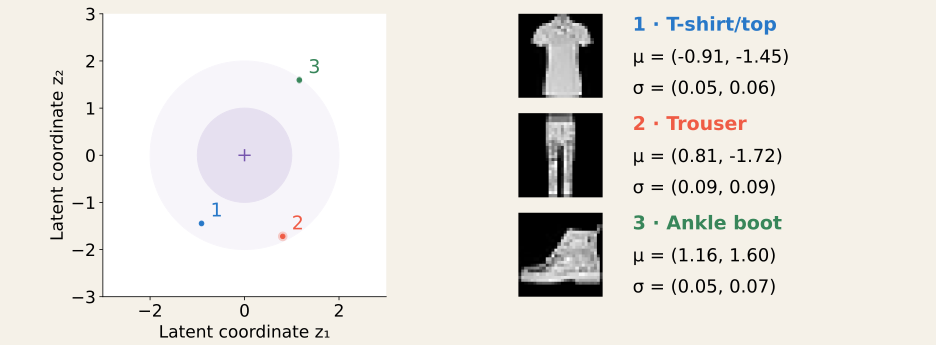<figcaption><span>SAME LATENT SPACE · SAME TRAINED DECODER</span><strong>Colored: three image-conditioned distributions. Purple: the shared prior.</strong><small>Why might good reconstructions alone leave prior samples unreliable?</small><small class="course-caption-source">Actual encoder parameters from the three demonstration inputs · contours are Mahalanobis radii, not probability cutoffs. Prior chosen by the modeler.</small></figcaption></figure></div>
<p class="fragment vae-line">We need informative codes for each image <em>and</em> a usable prior-to-decoder path. → Section 03</p>

::: {.notes}
Use the same three images students just explored. Each colored point is an actual predicted mean and its ellipse has semi-axes given by that image's two predicted standard deviations. The shared prior remains centered at zero with unit scale. The posterior parameters vary with the image; the prior does not receive that image. In this example the prior is a modeling choice, not the arithmetic average of the three colored distributions.

This is one latent space with one trained decoder. During reconstruction, an observed image provides an input-conditioned approximate posterior from which we can draw. During unconditional generation, no observed image is required, so we draw from the prior. The exact model posterior p_theta(z|x), approximated by q_phi, is a third object; do not confuse it with the prior p(z). The small set of ellipses is not a map of all training codes, a coverage measurement, or evidence that the aggregated posterior exactly equals the prior.

Ask the final question before advancing. Students have already seen an AE reconstruct and then fail at some arbitrary codes. A probabilistic encoder alone does not enforce useful decoding wherever the prior places mass. Conversely, if every image had an identical q, the latent draw would convey no information about which input was observed. Section 3 will turn those competing demands into an objective. Keep KL divergence, the ELBO, and posterior collapse derivations for their planned sections.

Do not claim the displayed run learned without regularization: it was trained with the full VAE objective as documented. We use its measured parameters to make the roles concrete, then ask what training must encourage. These are illustrative examples, not a controlled ablation.
:::

# 03 · Learning to reconstruct—and to sample {#section-3 .section-slide .vae-section .vae-section-three data-section-progress="3 / 6" data-background-color="#17212b"}

::: {.notes}
This section is the loss part of our data–hypothesis–loss–optimization–evaluation frame. Allow roughly 20 minutes with the demonstrations and pause. We already have data, a probabilistic encoder, and a generative decoder. Now we must decide what training should reward. Follow a controlled ablation, score several reconstructions of one image, inspect the prior penalty, combine the costs, and finally explain why this particular combination bounds the evidence. Section 4 will solve the remaining optimization problem: how to differentiate through the draw.
:::

## Good reconstruction. Useful prior samples? {#loss-ablation .vae-s3}

<div class="loss-ablation-layout" id="loss-ablation-lab">
<div class="loss-ablation-controls"><label for="loss-model">Training objective</label><select id="loss-model"><option value="recon">Reconstruction only</option><option value="vae">Reconstruction + prior penalty</option></select><p>Same architecture, initialization,<br>data order, and 10 epochs.</p><p>Same inputs and latent noise<br>when comparing outputs.</p><div class="fragment" data-fragment-index="1"><p>Validation reconstruction cost<br><strong id="loss-rec-score">…</strong></p><small>Pixel-summed soft-target BCE.<br>Mean over 1,024 images × 8 draws.<br>Lower is better for this score.</small></div></div>
<div class="course-centered-figure loss-ablation-figure"><figure>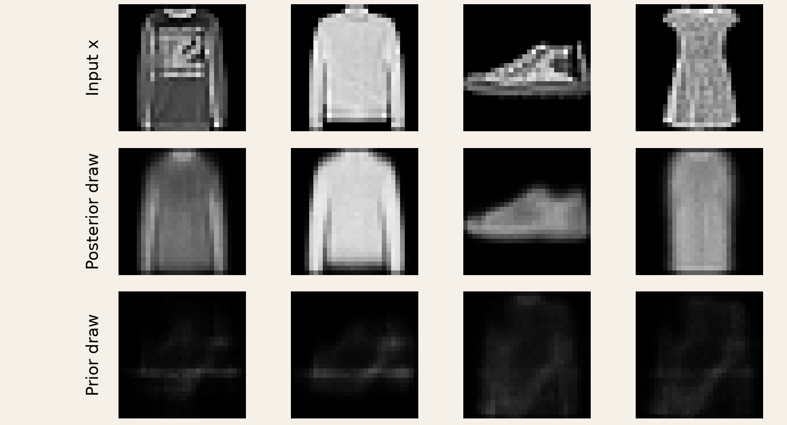<figcaption><span>INSPECT BOTH OUTPUT PATHS</span><strong>Switch the objective. Which row changes most?</strong><small>First four validation images and first four seeded prior draws; illustrative, not a quality ranking.</small><small class="course-caption-source">Course ablation · Fashion-MNIST · same d = 2 MLP · decoder means · one training seed per condition.</small></figcaption></figure></div>
</div>
<p class="fragment vae-line" data-fragment-index="2">Reconstructing from $q_\phi(z\mid x)$ does not by itself train useful decoding from $p(z)$.</p>

::: {.notes}
Start with the reconstruction-only condition. This is the probabilistic encoder architecture from section 2, trained without its KL term, not the deterministic MSE autoencoder from section 1. Ask students to inspect the middle row and then the bottom row before switching the selector. The top row is fixed. The middle row uses the same standard-normal noise per input but transforms it with the parameters produced by each model; the bottom row uses exactly the same prior codes for both decoders. After switching, the trained weights differ. Do not say that only the code changes in this experiment.

We control the architecture, initialization seed 113, seed-41 train/validation split, minibatch order, Adam at 0.001, batch size 256, ten epochs, reconstruction surrogate, and sampling noise. The sole deliberate objective change is adding KL(q(z|x)||N(0,I)) with coefficient one. The regularized run is the section-2 checkpoint, verified by its saved hash; the unregularized run follows its exact training loop with a zero coefficient. Finite numerical differences and a single training seed limit generalization. Images are selected by index, not by visual success.

Reveal the held-out reconstruction score after students inspect the images. It is the mean summed-pixel BCE with grayscale targets, estimated using eight posterior draws per image over the first 1,024 validation examples. It is not a prior-sample quality metric. A model can score better at reconstruction and still produce less useful prior samples. The few displayed samples establish a concrete failure mode, not distribution coverage, memorization behavior, or a universal ranking. Do not overstate any one unattractive sample.

For grayscale targets, this conventional BCE is a soft-target surrogate. A Bernoulli model gives an exact likelihood for binary pixels; a continuous-image likelihood would need a suitable normalized distribution. We retain the existing experiment and label this distinction instead of quietly interpreting its scores as exact grayscale negative log likelihoods.
:::

## Score the image across possible codes {#expected-reconstruction .vae-s3}

<p class="vae-task">One observed image. Three posterior draws. Which score should training trust?</p>
<div class="reconstruction-draws" id="reconstruction-draws">
<figure><figcaption>Fixed target $x$</figcaption></figure>
<figure>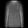<figcaption>Draw 1<br><b id="rec-cost-0">…</b></figcaption></figure>
<figure>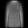<figcaption>Draw 2<br><b id="rec-cost-1">…</b></figcaption></figure>
<figure>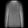<figcaption>Draw 3<br><b id="rec-cost-2">…</b></figcaption></figure>
</div>
<div class="fragment reconstruction-expectation">
<p>$R(x)=\mathbb E_{z\sim q_\phi(z\mid x)}[-\log p_\theta(x\mid z)]$</p>
<p>Average the cost over draws—not the images before scoring.</p>
<p id="rec-average">Three-draw estimate: loading…</p>
</div>
<p class="fragment vae-line">Give the observed image high likelihood under codes its encoder proposes.</p>
<p class="vae-source">Actual section-2 VAE · first validation image · first 3 fixed-seed draws. Shown costs use summed-pixel soft-target BCE; the equation states the probabilistic objective.</p>

::: {.notes}
Ask whether we should take the best reconstruction, use only the mean code, or average costs over draws. The expectation answers the actual training demand: codes drawn from this image's q should explain the observed image. Taking the minimum would ignore poor outcomes; decoding the mean would not evaluate spread. For a nonlinear decoder, scoring the decoded mean, averaging decoded images and then scoring, and averaging per-draw scores are generally different operations.

Define negative log likelihood through a concrete binary-pixel example if students need retrieval: when the observed pixel is one, a Bernoulli probability of 0.9 costs -log(0.9) ≈ 0.105 nats, while 0.1 costs ≈ 2.303. High probability on the observation means low cost. For independent Bernoulli pixels, sum the pixel costs; with a fixed-variance Gaussian observation model, negative log likelihood becomes a scaled squared error plus a constant. Thus the decoder's observation model determines the reconstruction loss. Neither BCE nor MSE is a universal VAE requirement.

In this grayscale experiment, the measured scores use the usual soft-target BCE surrogate. They illustrate the average-over-latents mechanism, not an exact likelihood for continuous grayscale observations. The displayed arithmetic averages three measured scalar costs. In general, R-hat = (1/L) sum_l [-log p_theta(x|z_l)] with independent z_l drawn from q_phi(z|x). A single draw per image is a common stochastic training estimate; it does not turn q into a deterministic point. More draws reduce Monte Carlo noise for a fixed model and image, but do not guarantee better trained models.

All three reconstructions use the fixed regularized checkpoint. Changes can be subtle because its inferred distributions are narrow; the different measured costs show that the outcomes need not coincide. The uncertainty here concerns z under q, not resampling decoder weights. How to differentiate this expectation is the next section's question.
:::

## What does the prior penalty actually penalize? {#kl-explorer .vae-s3}

<div class="kl-explorer" id="kl-explorer">
<div class="kl-controls"><p>One latent coordinate</p><label for="kl-mu">Mean μ <output id="kl-mu-value">1.00</output></label><input id="kl-mu" type="range" min="-2" max="2" step="0.05" value="1"><label for="kl-sigma">Spread σ <output id="kl-sigma-value">0.50</output></label><input id="kl-sigma" type="range" min="0.2" max="2" step="0.05" value="0.5"><button id="kl-match" type="button">Match the prior</button><p>Can moving the mean fix<br>a spread mismatch?</p></div>
<svg id="kl-curves" viewBox="0 0 850 360" role="img" aria-label="Gaussian density curves for the adjustable approximate posterior and fixed standard normal prior, on common axes."></svg>
</div>
<div class="fragment kl-definition">
<p>$K(x)=D_{\mathrm{KL}}\!\left(q_\phi(z\mid x)\,\|\,p(z)\right)=\mathbb E_q\!\left[\log\frac{q(z\mid x)}{p(z)}\right]$</p>
<div class="kl-costs"><div><span>MEAN COST · ½ μ²</span><strong id="kl-mean-cost">…</strong></div><b>+</b><div><span>SPREAD COST · ½ (σ² − 1 − log σ²)</span><strong id="kl-spread-cost">…</strong></div><b>=</b><div><span>KL · NATS</span><strong id="kl-total">…</strong></div></div>
</div>
<p class="fragment vae-line">Zero at μ = 0, σ = 1. Narrower is not always better. For diagonal $q$, add the coordinate costs.</p>
<p class="vae-source">Exact Gaussian calculation, not model inference. <a href="https://arxiv.org/abs/1312.6114">Kingma &amp; Welling (2014), Appendix B</a>. KL averages a log density ratio under q; it is not symmetric.</p>

::: {.notes}
Before revealing the formula, let students move the mean and standard deviation. The orange Gaussian is q for one observed image; the purple reference is the chosen prior N(0,1). Both plots share fixed axes. Their peaks are densities, not point probabilities. Ask which controls are needed to make the curves coincide. Try mu = 0 with sigma = 0.2, then sigma = 2: centering alone does not match the prior, and making every posterior as narrow as possible does not minimize this penalty. The button sets mu = 0 and sigma = 1 without changing model weights because this is an analytic illustration, not a training simulation.

Reveal the direction: KL(q||p) averages log(q/p) over q's draws. It is nonnegative as an expectation, although the pointwise log ratio may be negative in some regions. It is neither a symmetric distance nor the area between the two plotted curves. Under this Gaussian assumption the penalty is 0.5[mu² + sigma² - 1 - log(sigma²)]. Derive its terms orally or on the board by taking E_q[log q - log p]: E_q[(z-mu)²]/sigma² = 1 and E_q[z²] = mu² + sigma². The normalization terms contribute -log sigma; regrouping gives the displayed mean and spread costs. For independent Gaussian coordinates, log densities add, so sum these expressions over j.

Use two checks: (mu,sigma)=(2,1) gives 2 nats; (0,0.5) gives (0.25 - 1 - log 0.25)/2 ≈ 0.318 nats. The default (1,0.5) combines 0.5 and 0.318 to give 0.818. Negative mean and positive mean of equal magnitude have the same cost. Sigma approaching zero or becoming very large is expensive. Numeric log variances are an implementation choice; they do not change which distributions are compared.

Minimizing this term alone would set every image's q to the same prior, removing information about the particular image from z. Reconstruction supplies the competing demand. The per-image KL does not merely align a histogram of encoder means, nor does it guarantee that the dataset's aggregated posterior equals the prior. Keep the full posterior-collapse discussion for the evaluation section.
:::

## Which proposal earns the lower total cost? {#vae-loss-exercise .vae-s3}

<p class="loss-objective">Minimize $J(x)=\underbrace{R(x)}_{\text{reconstruct}}+\underbrace{K(x)}_{\text{prior penalty}}$</p>
<p class="vae-task">Two proposals for one image; $p(z)=\mathcal N(0,I)$, $d=2$.<br>Average the three reconstruction costs, calculate KL, then choose the lower total.</p>
<table class="loss-exercise-table"><thead><tr><th>Proposal</th><th>Three reconstruction costs</th><th>μ</th><th>σ</th></tr></thead><tbody><tr><td>A</td><td>4, 5, 6</td><td>(1, 0)</td><td>(0.5, 1)</td></tr><tr><td>B</td><td>5, 6, 7</td><td>(0, 0)</td><td>(1, 1)</td></tr></tbody></table>
<p class="loss-exercise-hint">$K=\tfrac12\sum_j(\mu_j^2+\sigma_j^2-1-\log\sigma_j^2)$ &nbsp; · &nbsp; $\log(0.25)\approx-1.386$</p>
<div class="exercise-pause"><span>PAUSE</span><b>90 seconds</b><small>Use pixel-summed costs per image; round the final totals to 0.01.</small></div>
<div class="fragment exercise-solution loss-worked"><span class="solution-label">WORKED SOLUTION</span><p><strong>A:</strong> $R=5$, $K=\tfrac12(1+0.25-1+1.386)=0.818$ → $J\approx5.82$.</p><p><strong>B:</strong> $R=6$, $K=0$ → $J=6.00$.</p><p>A wins: its reconstruction gain of 1 exceeds its extra KL cost of 0.818.</p></div>
<p class="vae-source">Illustrative costs in nats per image, not Fashion-MNIST measurements. Coefficient 1 on KL gives the standard negative-ELBO objective when R is a valid expected negative log likelihood.</p>

::: {.notes}
This exercise puts a price on the tradeoff rather than simply asking whether regularization is good. Explicitly state that the three numbers are per-draw reconstruction costs after summing over the image, and that their mean estimates R. We compare two candidate per-image distribution/decoder outcomes; the numbers are hand chosen to isolate arithmetic. We are not estimating the true marginal likelihood of either candidate from this table.

The second coordinate contributes zero KL for both proposals. In A the first coordinate contributes 0.5 times [1 + 0.25 - 1 - log(0.25)] = 0.818147. In B both coordinates match the standard normal, giving zero. Thus the estimated total for A is 5.818147 versus 6 for B. A proposal can be preferred even though its posterior does not exactly match the prior. Minimizing KL alone would choose B, ignoring its poorer reconstructions.

The losses are sums over pixels and latent coordinates, then averaged over Monte Carlo draws and, during training, over images. Dividing only the reconstruction term by 784 would silently change the relative weighting, not merely the displayed units. A shared multiplication of the whole loss leaves its minimizer unchanged, whereas independent reductions can change the model being optimized. Implementation of consistent reductions belongs to section 5.

We use coefficient one because the next slide will derive this combination from the evidence bound. A deliberately different coefficient defines a modified objective and deserves its own interpretation; do not introduce a beta-VAE detour here. This exercise uses a finite-draw estimate: the bound applies to the expectation, and a noisy Monte Carlo realization is not guaranteed to bound the exact log evidence on every draw.
:::

## Why this sum? It bounds the evidence {#elbo-evidence .vae-s3}

<div class="elbo-example"><div><span>EXACT TOY MODEL · observed x = 1</span><p>Two possible latent states, A and B.</p><table><thead><tr><th>z</th><th>p(z)</th><th>p(x = 1 ∣ z)</th></tr></thead><tbody><tr><td>A</td><td>0.5</td><td>0.8</td></tr><tr><td>B</td><td>0.5</td><td>0.2</td></tr></tbody></table><p>$p(x)=0.5(0.8)+0.5(0.2)=0.5$</p><small>Here the evidence is exactly computable.<br>For a neural decoder, the latent integral usually is not.</small></div><div class="elbo-budget"><label for="elbo-q">Encoder proposal q(A ∣ x): <output id="elbo-q-value">0.50</output></label><input id="elbo-q" type="range" min="0.05" max="0.95" step="0.01" value="0.5"><svg id="elbo-bars" viewBox="0 0 650 285" role="img" aria-label="Exact toy costs: reconstruction plus prior KL is at least negative log evidence. The gap changes as the encoder proposal changes."></svg><p id="elbo-numbers" aria-live="polite">Computing exact costs…</p><button id="elbo-exact" type="button">Use the exact posterior</button></div></div>
<div class="fragment elbo-identity"><p>$\underbrace{\log p_\theta(x)}_{\text{log evidence}}=\underbrace{-R(x)-K(x)}_{\text{ELBO}}+\underbrace{D_{\mathrm{KL}}(q_\phi(z\mid x)\,\|\,p_\theta(z\mid x))}_{\text{nonnegative gap}}$</p><p>Minimize $R+K$ ⇔ maximize the <strong>evidence lower bound</strong>.</p></div>
<p class="fragment vae-line">The training penalty compares q with the <em>prior</em>; the bound’s gap compares q with the <em>posterior</em>.</p>
<p class="vae-source">Course-made discrete example; exact sums, not Monte Carlo. <a href="https://arxiv.org/abs/1312.6114">Kingma &amp; Welling (2014), §2.2, Eqs. 1–3</a>. The identity assumes a valid normalized observation likelihood.</p>

::: {.notes}
Switch briefly to a tiny exact generative model so students can see what is inaccessible in the neural-network case. This is not another Fashion-MNIST run, and its categorical q does not use the Gaussian KL formula from the previous slide. The observed binary value is x = 1. A and B have equal prior probability; they predict this observation with likelihoods 0.8 and 0.2. Summing the two joint probabilities gives evidence 0.5. Its negative log is 0.693147 nats.

Move the encoder proposal q(A|x)=w while keeping the generative model fixed. Here R = -w log(0.8) -(1-w)log(0.2), K = w log(2w)+(1-w)log(2(1-w)). The upper bar stacks those costs; the lower reference is the exact negative log evidence. At w = 0.5, R = 0.916291, K = 0, and the gap is 0.223144. At w = 0.8, R = 0.500402 and K = 0.192745, so their sum equals 0.693147. Notice that the best q has a nonzero KL to the prior. At w = 0.95, reconstruction cost is even lower but total cost increases again. Students can test why chasing only reconstruction or only prior matching misses the best combined answer.

Derive the exact posterior from the visible joint probabilities: p(A|x)=0.4/0.5=0.8 and p(B|x)=0.1/0.5=0.2. The button sets this distribution. Reveal the identity after students notice the bar cannot go below the reference. Start from Bayes: log p_theta(z|x) = log p_theta(x|z)+log p(z)-log p_theta(x). Substitute into E_q[log q-log p_theta(z|x)]. The result is R + K + log p_theta(x). Rearranging gives the displayed identity; nonnegativity of KL makes -R-K a lower bound on log evidence. This is the evidence LOWER bound, although the positive loss R+K is an UPPER bound on negative log evidence. The graph intentionally shows positive costs to maintain the minimization convention from the exercise.

Name the two KLs separately. The computable prior penalty KL(q||p(z)) is part of the loss. The generally intractable posterior gap KL(q||p_theta(z|x)) explains why it is a bound. We do not train by evaluating the exact posterior gap. The bound is tight when q equals the true model posterior; a restricted diagonal Gaussian and a shared encoder may not achieve that. With theta fixed, maximizing the bound improves the variational approximation in this KL direction. Joint training also changes theta, so both evidence and posterior move. A better ELBO need not produce sharper images or guarantee distributional coverage.

The identity requires a proper likelihood. The preceding grayscale experiment uses a clearly labeled BCE surrogate, so its measured score is not automatically an exact evidence bound for continuous grayscale images. For valid likelihoods the bound concerns the expectation over q; a one-sample estimate may cross the exact evidence through sampling noise. All values in this toy are exact finite sums, and logs are natural, giving nats.

Close with the remaining computational question: we can calculate a per-draw reconstruction cost and an analytic Gaussian KL, but how can a random latent draw transmit a useful gradient to mu and sigma? That question motivates section 4 without deriving the reparameterization trick here.
:::

# 04 · Backpropagating through a random draw {#section-4 .section-slide .vae-section .vae-section-four data-section-progress="4 / 6" data-background-color="#17212b"}

::: {.notes}
Allow about 15 minutes including the worked exercise. Students already know the chain rule and autograd; retrieve those ideas through an actual missing-gradient result rather than reteaching differentiation. Focus on the reconstruction path. The Gaussian KL already has an analytic differentiable expression. Four slides move from a failing program to a graph students can manipulate, a numerical backward pass, and the working implementation.
:::

## The decoder learns. Does the encoder? {#sampling-break .vae-s4}

<div class="reparam-code-layout">
<div class="reparam-probe"><p>A tiny decoder:<br>$\hat x=az$, target $x=2$.</p><p>Backpropagate the<br><strong>reconstruction cost only.</strong></p><div class="fragment" data-fragment-index="1"><span class="vae-path-label">ACTUAL AUTOGRAD RESULT</span><dl><dt>Decoder a.grad</dt><dd>−0.2505</dd><dt>Encoder μ.grad</dt><dd>None</dd><dt>Encoder logvar.grad</dt><dd>None</dd></dl></div></div>
<div class="light-code-editor"><div class="editor-bar"><span>PYTORCH · TRACE THE MISSING PATH</span><strong>CPU · seed 7</strong></div><pre><code>torch.manual_seed(7)
mu = torch.tensor([1.], requires_grad=True)
logvar = torch.tensor([0.], requires_grad=True)
a = torch.tensor([2.], requires_grad=True)

sigma = (0.5 * logvar).exp()
q = torch.distributions.Normal(mu, sigma)
z = q.sample()

x_hat = a * z
rec = 0.5 * (x_hat - 2).square().mean()
rec.backward()

<span class="fragment" data-fragment-index="1">print(a.grad, mu.grad, logvar.grad)
<span class="py-output"># tensor([-0.2505]) None None</span></span></code></pre></div>
</div>
<p class="fragment vae-line" data-fragment-index="2">Here <code>sample()</code> returns z without a gradient path to μ or σ.</p>
<p class="vae-source">Executed course probe · PyTorch 2.13, CPU. <a href="https://docs.pytorch.org/docs/stable/distributions.html#pathwise-derivative">PyTorch distributions: pathwise derivatives</a>. None means no accumulated gradient, not a measured zero derivative.</p>

::: {.notes}
Ask students to predict which of the three leaf tensors receives a reconstruction gradient before revealing the result. Mu and logvar stand in for the encoder's outputs, so we make them leaves to inspect their gradients directly. In a full encoder they are typically non-leaf outputs; use retain_grad if inspecting those directly, or inspect the encoder parameters instead. The scalar a is a trainable decoder weight. We seed the draw only to reproduce the classroom result; resetting a fixed seed every training iteration is not the intended training procedure.

The decoder can differentiate its loss with respect to a while treating z as a supplied constant. However, Normal.sample() creates no pathwise autograd connection from z to mu and sigma. Thus the reconstruction term cannot teach the encoder which distribution parameters would yield more useful codes. This is a property of this sampling API and this gradient estimator, not a theorem that expectations involving randomness cannot be differentiated. Score-function estimators exist; they are outside this section's scope.

We isolate the reconstruction loss intentionally. If we added the analytic KL term, the encoder could receive KL gradients even with sample(), obscuring the missing reconstruction path. Training might appear to run while the encoder mainly learns to match the prior. A loss decreasing or some nonzero encoder gradient is not sufficient to prove the reconstruction path is correct. None is different from zero: here no path accumulated a derivative at all.

For the recorded draw, z = 0.853204906 and rec = 0.043097600. The decoder gradient is (a*z - 2)*z = -0.250492603. The complete executable check is stored with the lecture; no browser model execution is implied.
:::

## Draw noise, then transform it {#reparameterization-graph .vae-s4}

<div class="reparam-controls" id="reparam-lab"><label for="rp-mu">μ <output id="rp-mu-value">1.00</output><input id="rp-mu" type="range" min="-1" max="2" step="0.05" value="1"></label><label for="rp-sigma">σ <output id="rp-sigma-value">0.50</output><input id="rp-sigma" type="range" min="0.25" max="1.5" step="0.05" value="0.5"></label><button id="rp-next" type="button">Next recorded ε →</button><button id="rp-example" type="button">Worked value ε = −1</button></div>
<p class="reparam-noise" id="rp-noise-status">ε ∼ N(0, I), independent of the encoder; held fixed while moving μ or σ.</p>
<svg class="reparam-graph" viewBox="0 0 1200 320" role="img" aria-label="Reparameterized computation graph. Independent noise epsilon multiplies sigma, then mu is added to produce z. Both learned parameters connect to the result through ordinary arithmetic.">
<defs><marker id="rp-arrow" markerWidth="8" markerHeight="8" refX="7" refY="4" orient="auto"><path d="M0 0 L8 4 L0 8 Z" fill="#657079"/></marker></defs>
<g fill="none" stroke="#657079" stroke-width="2.5" marker-end="url(#rp-arrow)"><path d="M240 145 H334"/><path d="M375 70 V105"/><path d="M416 145 H709"/><path d="M600 224 V203 H750 V186"/><path d="M791 145 H919"/></g>
<g fill="#dceeff" stroke="#2878c8" stroke-width="2"><rect x="80" y="110" width="150" height="70" rx="8"/><rect x="525" y="234" width="150" height="70" rx="8"/><rect x="930" y="110" width="180" height="70" rx="8"/></g>
<rect x="300" y="0" width="150" height="60" rx="8" fill="#edf0f3" stroke="#657079" stroke-width="2"/>
<g fill="#e9e2f3" stroke="#7655ad" stroke-width="3"><circle cx="375" cy="145" r="30"/><circle cx="750" cy="145" r="30"/></g>
<g text-anchor="middle" dominant-baseline="middle" fill="#17212b" font-family="sans-serif" font-size="26"><text id="rp-sigma-node" x="155" y="146">σ = 0.500</text><text id="rp-eps-node" x="375" y="30">ε = …</text><text id="rp-mu-node" x="600" y="270">μ = 1.000</text><text id="rp-z-node" x="1020" y="146">z = …</text><text x="375" y="145" font-size="38">×</text><text x="750" y="145" font-size="38">+</text></g>
<g font-family="sans-serif" font-size="21" fill="#657079"><text x="475" y="50">Draw independently; no gradient through the RNG.</text><text x="850" y="260">○ × multiply &nbsp; ○ + add</text></g>
</svg>
<div class="fragment reparam-rule"><p>$z=\mu+\sigma\odot\epsilon,\quad\epsilon\sim\mathcal N(0,I)$</p><p>$\mathbb E[z]=\mu,\quad\operatorname{Var}(z_j)=\sigma_j^2$ &nbsp; · &nbsp; same diagonal Gaussian.</p></div>
<p class="fragment vae-line">For this draw: $\partial z_j/\partial\mu_j=1$, &nbsp; $\partial z_j/\partial\sigma_j=\epsilon_j$.</p>
<p class="vae-source">Course-made scalar graph; × and + are elementwise in a vector VAE. Recorded standard-normal draws, seed 73; ε = −1 is a separate teaching value. <a href="https://arxiv.org/abs/1312.6114">Kingma &amp; Welling (2014), §2.4</a>.</p>

::: {.notes}
Begin with the diagram and move mu. With epsilon and sigma fixed, the output shifts by exactly the same amount. Next move sigma while holding mu and epsilon fixed. For a negative epsilon the point moves in the opposite direction; for a positive epsilon it moves with sigma. The first recorded noise value happens to be small, so use Next recorded epsilon to reach larger positive and negative draws, or the explicitly labeled worked value -1. Every switch preserves mu and sigma. Eight real standard-normal draws from a fixed seed are available; the -1 button chooses a pedagogical value rather than claiming it was that seeded draw.

The diagram uses data rectangles and operation circles; the × and + icons are defined once in the legend. The random-number generator supplies epsilon before the differentiable arithmetic. The drawn value is treated as a constant for this backward pass. The trainable distribution parameters remain connected to z. The demo is arithmetic, not a model being retrained. All values update immediately and the recorded draw stays fixed when sliders move.

After students inspect the movement, reveal the expression and check its distribution. An affine transformation of a Gaussian remains Gaussian. E[epsilon]=0 gives E[z]=mu; Var(epsilon_j)=1 gives Var(z_j)=sigma_j². Independent standard-normal coordinates yield diagonal covariance after elementwise scaling. Matching mean and variance alone would not characterize an arbitrary distribution, so explicitly use the Gaussian affine-transformation fact. Sigma remains positive through the log-variance parameterization from section 2.

Reveal the local derivatives only after observing the movement. They are derivatives with the realized noise fixed. Noise itself does not receive a trainable gradient. For a differentiable reconstruction function f, R = E_epsilon[f(mu_phi(x)+sigma_phi(x)*epsilon)] has a base distribution independent of phi. Under the usual differentiation/interchange regularity assumptions, we may average gradients through this transformation to estimate the gradient of the expectation. A single draw is noisy; it does not give the exact expected gradient. Fresh independent noise is normally sampled on each training forward pass, not frozen throughout training.

The general reparameterization idea extends beyond Gaussians when an appropriate differentiable transformation exists. Do not imply that this affine formula applies unchanged to arbitrary or discrete distributions. We only need the diagonal Gaussian VAE here.
:::

## Follow one draw backward {#reparameterization-exercise .vae-s4}

<p class="vae-task">Given μ = 1, σ = 0.5, ε = −1. Decoder: $\hat x=2z$. Target: $x=2$.<br>Use $\ell=\tfrac12(\hat x-2)^2$. Find $z$, $\ell$, $\partial\ell/\partial\mu$, and $\partial\ell/\partial\sigma$.</p>
<div class="reparam-workflow"><div><span>DRAW HELD FIXED</span><strong>ε = −1</strong></div><b>→</b><div><span>TRANSFORM</span><strong>z = 1 + 0.5 ε</strong></div><b>→</b><div><span>DECODE</span><strong>x̂ = 2z</strong></div><b>→</b><div><span>SCORE</span><strong>½ (x̂ − 2)²</strong></div></div>
<p class="reparam-chain">$\displaystyle\frac{\partial\ell}{\partial z}=(\hat x-2)\,2$ &nbsp; · &nbsp; $\displaystyle\frac{\partial z}{\partial\mu}=1$ &nbsp; · &nbsp; $\displaystyle\frac{\partial z}{\partial\sigma}=\epsilon$</p>
<div class="exercise-pause"><span>PAUSE</span><b>90 seconds</b><small>Keep ε fixed. Use the sign to predict which way gradient descent moves μ and σ.</small></div>
<div class="fragment exercise-solution reparam-solution"><span class="solution-label">WORKED SOLUTION</span><p>$z=0.5$, $\hat x=1$, $\ell=0.5$; &nbsp; $\partial\ell/\partial z=-2$.</p><p>$\partial\ell/\partial\mu=-2$; &nbsp; $\partial\ell/\partial\sigma=(-2)(-1)=2$.</p><p>A small descent step raises μ and lowers σ. For this negative ε, both raise z toward the target.</p></div>
<p class="fragment exercise-extension">The encoder predicts log variance $v$. Since $\sigma=e^{v/2}$, $\partial\ell/\partial v=2(0.5\sigma)=0.5$.</p>
<p class="vae-source">Illustrative scalar decoder; reconstruction path only. Verified with PyTorch autograd and fixed-noise finite differences. The sampled direction is not necessarily the expected-loss direction.</p>

::: {.notes}
The graph from the previous slide is now a particular sampled path. Retrieve the chain rule through the displayed derivatives rather than reteaching it. The forward path gives z=1+0.5*(-1)=0.5, x_hat=1, and half squared error 0.5. The upstream derivative into z is (1-2)*2=-2. Multiply by dz/dmu=1 for -2 and dz/dsigma=-1 for +2. Gradient descent subtracts each gradient, so a small step increases mu and decreases sigma. For this fixed negative epsilon, both changes increase z and x_hat, reducing the sampled error locally.

If students think the sigma derivative must be positive because sigma is positive, vary epsilon's sign in the preceding demo. The derivative depends on both the upstream reconstruction error and the sampled noise. Do not generalize this one draw into a claim that shrinking every posterior improves the expected reconstruction objective.

The optional final reveal traces the parameter the actual encoder outputs: v=log sigma², so dsigma/dv=sigma/2. Thus dℓ/dv=(dℓ/dsigma)*(sigma/2)=2*0.25=0.5. We are not updating sigma directly in the implemented VAE. The exponential transformation keeps sigma positive while allowing unconstrained v.

These are reconstruction gradients only. The KL term contributes additional analytic gradients. For reference in this scalar setting, dK/dmu=mu and dK/dv=(exp(v)-1)/2, but keep those additional calculations in narration unless asked; this exercise diagnoses whether students can follow the stochastic reconstruction path. A finite-difference check must reuse the same epsilon in both perturbed evaluations, otherwise it mixes a parameter perturbation with Monte Carlo noise.
:::

## Same draw. Now the gradient reaches the encoder {#reparameterization-code .vae-s4}

<div class="reparam-code-layout">
<div class="reparam-probe"><p>Same seed and inputs.<br>Same z = <strong>0.8532</strong>.<br>Same loss = <strong>0.0431</strong>.</p><div class="fragment" data-fragment-index="1"><span class="vae-path-label">ACTUAL AUTOGRAD RESULT</span><dl><dt>μ.grad</dt><dd>−0.5872</dd><dt>logvar.grad</dt><dd>0.0431</dd><dt>a.grad</dt><dd>−0.2505</dd></dl></div></div>
<div class="light-code-editor"><div class="editor-bar"><span>PYTORCH · REPLACE THE DRAW</span><strong>same setup as before</strong></div><pre><code>sigma = (0.5 * logvar).exp()
eps = torch.randn_like(mu)
z = mu + sigma * eps

x_hat = a * z
rec = 0.5 * (x_hat - 2).square().mean()
rec.backward()
<span class="fragment" data-fragment-index="1">
print(mu.grad, logvar.grad, a.grad)
<span class="py-output"># tensor([-0.5872]) tensor([0.0431])
# tensor([-0.2505])</span></span>
<span class="fragment" data-fragment-index="2">
<span class="py-comment-inline"># Equivalent Gaussian sampling API:</span>
z = torch.distributions.Normal(
    mu, sigma).rsample()</span></code></pre></div>
</div>
<p class="fragment vae-line" data-fragment-index="2">Fresh noise each forward pass; ordinary backpropagation through μ + σ ⊙ ε.</p>
<p class="vae-source">Executed CPU probe, seed 7, fresh leaf tensors in each run. Manual transformation and <code>Normal.rsample()</code> give matching values and gradients. <a href="https://docs.pytorch.org/docs/stable/distributions.html#pathwise-derivative">PyTorch pathwise derivative API</a>.</p>

::: {.notes}
Restore the same setup from the first slide with fresh mu, logvar, and a leaves and reset the seed once for the comparison. Change only the sampling expression. The observed numerical z and loss match the detached-sampling run in this tested CPU setup, while reconstruction gradients now reach the distribution parameters. Decoder a's gradient is unchanged. This separates changing the sampling distribution from changing how the sampled value is represented in the differentiation graph.

The final API line is an alternative to the manual eps/z lines, not a second required sample after backward. When comparing outputs exactly, reset the seed and rebuild the graph for each independent run. The equivalence of the distributions and the pathwise mechanism matters generally; bitwise agreement of separately executed calls is not guaranteed across devices, versions, or generator consumption patterns. Do not detach mu, sigma, or z, convert them to Python scalars in the training path, or put the forward pass under no_grad.

Normal.rsample() implements reparameterized sampling for this distribution. Not all distributions support rsample; check their support instead of assuming every random operation provides a pathwise gradient. In the real encoder, gradients continue from mu and logvar to shared feature-extractor weights by the chain rule. Epsilon ordinarily has requires_grad=False; we do not optimize the noise or the RNG seed.

For a batch, mu, logvar, eps, and z all have shape [B,d]. randn_like supplies a standard-normal value at every element; this is elementwise multiplication, not a matrix product. The reconstruction loss is estimated from the draw, and the analytic Gaussian KL is added separately. Section 5 will combine this sampling step with the actual decoder, consistently reduced losses, and an optimizer update. We have solved the sampling gradient mechanism here without expanding into the entire training loop.
:::

# 05 · Building and training a VAE {#section-5 .section-slide .vae-section .vae-section-five data-section-progress="5 / 6" data-background-color="#17212b"}

::: {.notes}
This section assembles the mechanisms already taught into a working program. Keep the explanation concrete after the conceptual work of sections 3–4. Use the GaussianEncoder from section 2, the reparameterization from section 4, and the two loss terms from section 3. Students should leave able to identify tensor shapes, reduce the losses correctly, perform an optimizer step, and distinguish three inference paths. Allow about 15 minutes including the reduction exercise and output inspection. Imports and the complete runnable program are available through the schedule; slides foreground the new contract rather than boilerplate.
:::

## Assemble the pieces we already understand {#vae-assembly .vae-s5}

<div class="posterior-code-layout">
<div class="posterior-shapes"><h3>Trace one batch</h3><p>Images<br><b>x: [32, 1, 28, 28]</b></p><p>Section 02 encoder<br><b>μ, logvar: [32, 2]</b></p><p class="fragment" data-fragment-index="1">One draw per image<br><b>z: [32, 2]</b></p><p class="fragment" data-fragment-index="1">Decoder means<br><b>x̂: [32, 1, 28, 28]</b></p></div>
<div class="light-code-editor"><div class="editor-bar"><span>PYTORCH · COMPLETE VAE MODULE</span><strong>d = 2</strong></div><pre><code><span class="py-kw">class</span> VAE(nn.Module):
    <span class="py-kw">def</span> __init__(self):
        super().__init__()
        self.encoder = GaussianEncoder()
        self.decoder = nn.Sequential(
            nn.Linear(2, 128), nn.ReLU(),
            nn.Linear(128, 256), nn.ReLU(),
            nn.Linear(256, 784), nn.Sigmoid(),
            nn.Unflatten(1, (1, 28, 28)))
<span class="fragment" data-fragment-index="1">
    <span class="py-kw">def</span> forward(self, x):
        mu, logvar = self.encoder(x)
        sigma = (0.5 * logvar).exp()
        z = mu + sigma * torch.randn_like(mu)
        <span class="py-kw">return</span> self.decoder(z), mu, logvar</span></code></pre></div>
</div>
<p class="fragment vae-line" data-fragment-index="2">Return the reconstruction <em>and</em> the distribution parameters: the loss needs both.</p>
<p class="vae-source">Course implementation · same layer architecture as the recorded Fashion-MNIST experiments. GaussianEncoder is defined in section 02 and in the <a href="assets/vae_training.py">runnable script</a>.</p>

::: {.notes}
Point back to the architecture comparison, then map the existing modules directly to this class. GaussianEncoder is exactly the two-head module from section 2: flatten, 784→256→128 with ReLUs, followed by separate two-dimensional mean and log-variance heads. The decoder mirrors the widths and emits 784 sigmoid values before restoring the image axes. Inputs are grayscale tensors in [0,1]. The output is a decoder mean image, not a sampled binary pixel array.

Reveal forward only after tracing the constructor. The encoder produces two parameter tensors, then the sampling transform makes one code per image. The sampled code still has dimension two, not four. Return x_hat, mu, and logvar so the training loop can compute both reconstruction and analytic KL costs without running the encoder again. Calling forward again would draw new noise and create a different stochastic computation.

The batch size 32 is an example, not hardcoded. The module supports a variable leading batch dimension, including the smaller final minibatch. The experiment training batch size was 256. Students already know nn.Module, Sequential, and forward; spend time on data flow, not Python class syntax.

This implementation preserves the established sigmoid-plus-BCE teaching model. A logits-based decoder paired with BCEWithLogitsLoss is a common numerically stable alternative, but requires changing both output and loss consistently. Do not silently remove Sigmoid while continuing to call probability-form BCE. Because targets here are grayscale, BCE remains the explicitly labeled soft-target surrogate rather than an exact continuous-image likelihood.
:::

## Sum within an image; average across images {#vae-reductions .vae-s5}

<div class="training-loss-layout">
<div><h3>Two illustrative images</h3><table class="training-cost-table"><thead><tr><th>Image</th><th>R</th><th>K</th></tr></thead><tbody><tr><td>1</td><td>2</td><td>0.5</td></tr><tr><td>2</td><td>4</td><td>1.5</td></tr></tbody></table><p>R already sums the pixels.<br>K already sums latent coordinates.</p><p><strong>What scalar should<br>this batch return?</strong></p></div>
<div class="light-code-editor"><div class="editor-bar"><span>PYTORCH · ONE COST PER IMAGE FIRST</span><strong>then one batch mean</strong></div><pre><code><span class="py-kw">def</span> vae_loss(x_hat, x, mu, logvar):
    pixel_cost = F.binary_cross_entropy(
        x_hat, x, reduction='none')
    rec = pixel_cost.flatten(1).sum(1)

    kl = 0.5 * (
        mu.square() + logvar.exp() - 1 - logvar
    ).sum(1)

    loss = (rec + kl).mean()
    <span class="py-kw">return</span> loss, rec.mean(), kl.mean()</code></pre></div>
</div>
<div class="exercise-pause"><span>PAUSE</span><b>45 seconds</b><small>Compute the scalar. Would duplicating both images change it?</small></div>
<div class="fragment exercise-solution training-loss-solution"><span class="solution-label">WORKED SOLUTION</span><p>$J=\big[(2+0.5)+(4+1.5)\big]/2=4$.</p><p>Duplicating the batch keeps the mean at 4. It must not double the loss.</p></div>
<p class="vae-source">Illustrative costs, not measured data. In the program: pixels [B,1,28,28] → R [B]; latent coordinates [B,2] → K [B] → scalar. F is torch.nn.functional.</p>

::: {.notes}
Make the axes concrete before arithmetic. reduction='none' preserves every pixel's BCE cost. flatten(1) merges only the non-batch axes to [B,784], and sum(1) produces one reconstruction cost per image. The elementwise Gaussian expression starts as [B,2]; sum(1) produces one KL cost per image. Adding the two [B] vectors pairs costs from the same image; mean then averages over images.

The two-image exercise gives per-image totals 2.5 and 5.5, averaging to 4. Duplicating the same already computed forward outputs gives [2.5,5.5,2.5,5.5], also averaging to 4. We hold outputs fixed for this invariance check. A fresh stochastic forward pass can change the numerical Monte Carlo estimate even when the inputs are duplicated; that is a sampling change, not a reduction error. The executable checks duplicate x_hat, x, mu, and logvar together to isolate the reduction semantics.

A common bug uses default mean BCE across batch AND pixels, but sums KL over latent coordinates and averages only over the batch. Relative to this objective, that divides reconstruction by 784 while leaving KL unchanged, effectively emphasizing KL by a factor of 784. Averaging both terms over the same batch is not enough; their internal reductions must also match the intended per-image objective. A global constant rescaling of the whole loss differs from changing the relative weights.

Return the differentiable total plus the two scalar components so the loop can log them separately. Calling item() before backward on the total would discard the tensor graph. For epoch reporting, accumulate each batch mean times its batch size, then divide by the number of images, so a small final minibatch receives the appropriate weight.

The code assumes matching reconstruction and target shapes and valid [0,1] values. The source script tests scalar shape, finiteness, reduction equivalence to summed BCE divided by batch size, and duplicate-batch invariance. It also separately checks that reconstruction gradients reach both encoder heads, rather than relying on KL gradients to mask a detached sampling path.
:::

## One batch now updates the whole model {#vae-training-step .vae-s5}

<div class="posterior-code-layout">
<div class="training-step-evidence"><span class="vae-path-label">ACTUAL 32-IMAGE CHECK</span><p>Before the first update</p><dl><dt>Reconstruction</dt><dd>545.7927</dd><dt>KL</dt><dd>0.0070</dd><dt>Total</dt><dd>545.7997</dd></dl><div class="fragment" data-fragment-index="1"><p>Reconstruction reaches<br><strong>both encoder heads.</strong></p><p>All parameter tensors<br><strong>changed after the step.</strong></p></div></div>
<div class="light-code-editor"><div class="editor-bar"><span>PYTORCH · FOR EACH MINIBATCH</span><strong>familiar optimizer contract</strong></div><pre><code>model = VAE()
optimizer = torch.optim.Adam(
    model.parameters(), lr=1e-3)

<span class="py-kw">def</span> train_step(model, optimizer, x):
    model.train()
    optimizer.zero_grad(set_to_none=True)
    x_hat, mu, logvar = model(x)
    loss, rec, kl = vae_loss(
        x_hat, x, mu, logvar)
<span class="fragment" data-fragment-index="1">
    loss.backward()
    optimizer.step()
    <span class="py-kw">return</span> loss.item(), rec.item(), kl.item()</span></code></pre></div>
</div>
<p class="fragment vae-line" data-fragment-index="2">Log reconstruction and KL separately. A total alone can hide a missing learning path.</p>
<p class="vae-source">Executed check · first 32 images in the seed-41 training split · initialization 113, noise 811 · one Adam step. These are initial batch costs, not trained-model quality scores.</p>

::: {.notes}
Trace the now-complete program in order. Construct the model and optimizer once, outside the minibatch function; recreating Adam each batch would discard its accumulated state. zero_grad clears accumulated parameter gradients, forward draws fresh noise, the loss combines per-image reconstruction and KL, backward differentiates the same graph, and step updates both encoder and decoder weights. The returned Python numbers are for logging only and are extracted after backward.

The visible numbers come from an executed smoke check on the first 32 training-split images with a fresh model, not the ten-epoch checkpoint. The script's simpler module construction consumes initialization RNG differently from the earlier evidence generator's temporary Autoencoder construction, so the same initialization seed does not imply identical initial decoder weights across those implementations. Architecture and objective agree. We make no quality comparison between this one-step check and the trained evidence.

Two checks matter beyond seeing a finite loss: the reconstruction term by itself produces finite nonzero gradients for both encoder heads, and the optimizer step changes every parameter tensor in this probe. The measured head-weight gradient norms are approximately 0.5338 for mu and 0.9730 for logvar. These are diagnostic outcomes of this particular batch, not required target magnitudes or guarantees for every future model. They catch the detached-sampling mistake from section 4 that an encoder KL gradient alone could conceal.

In the full runnable script, iterate over the shuffled training loader for ten epochs, use the 50k/10k split already established, and weight logged batch means by batch size. Keep validation images outside optimizer updates. A training curve decreasing is useful but cannot establish prior-sample quality; the next slide opens the two output paths directly. Architecture design and optimizer theory are assumed prerequisites here.
:::

## Choose the path you actually want to inspect {#vae-inspection .vae-s5}

<div class="training-inspection-layout" id="training-inspection">
<div class="training-inspection-view"><label for="inspection-mode">Decoder input</label><select id="inspection-mode"><option value="mean">Encoder mean μ(x)</option><option value="posterior">Draw from q(z ∣ x)</option><option value="prior">Draw from p(z)</option></select><div class="inspection-input"><p id="inspection-input-label">Observed x<br>used by the encoder</p></div><p id="inspection-output-label">Deterministic mean-code reconstruction</p></div>
<div class="light-code-editor"><div class="editor-bar"><span>PYTORCH · FIXED TRAINED WEIGHTS</span><strong>three different questions</strong></div><pre><code>model.eval()
<span class="py-kw">with</span> torch.no_grad():
    mu, logvar = model.encoder(x)
    sigma = (0.5 * logvar).exp()

    <span id="inspection-code-mean">mean_image = model.decoder(mu)</span>

    <span id="inspection-code-posterior">z = mu + sigma * torch.randn_like(mu)
    posterior_image = model.decoder(z)</span>

    <span id="inspection-code-prior">z_prior = torch.randn_like(mu)
    generated_image = model.decoder(z_prior)</span></code></pre><div class="fragment training-inspection-note"><p><code>eval()</code> does not remove explicit random draws.<br><code>no_grad()</code> disables gradient recording.</p></div></div>
</div>
<p class="fragment vae-line">Decode μ to repeat one reconstruction; draw from the prior to generate without an image.</p>
<p class="vae-source">Recorded outputs from the section-2 checkpoint · same decoder in all three paths · first selected validation T-shirt, first recorded posterior/prior draws. Browser switches local images; code shows the corresponding operations.</p>

::: {.notes}
Use the selector to compare three output paths through the same trained decoder. The image supplied to the encoder stays visible as a reference. In prior mode the label explicitly says it is unused: the generation path does not need an observed x. The code shows all three paths together for comparison; a standalone prior-generation program needs only a latent batch with the desired shape, for example torch.randn(1,2,device=device), and the decoder. randn_like(mu) here reuses an already available tensor only to specify shape, dtype, and device, not to condition the prior on mu's numerical values.

The first mode decodes mu for a deterministic plug-in reconstruction in this MLP. It is not generally the expectation of decoded images. The second mode draws from the input-conditioned posterior and may give different reconstructions on repeated calls. The third mode draws from the fixed standard-normal prior, irrespective of the observed image. All displayed outputs are decoder means, with no additional pixel sampling. The source images and indices are documented in the section-2 manifest; these controls display recorded outputs rather than running the network in JavaScript.

The visible VAE.forward always draws noise, so model.eval() alone cannot make its reconstructions deterministic. eval() changes training/evaluation behavior for modules such as Dropout and BatchNorm; this particular MLP has neither. no_grad prevents graph recording and is appropriate for inspection, but does not change random-number generation or set module evaluation mode by itself. Both calls are commonly used together during inference for different reasons. Training must occur outside no_grad.

The code path is executed against the existing trained checkpoint by mapping its original encoder/head parameter names to this composed module, with decoder weights unchanged. That mapping is a teaching refactor, not a newly trained model. The sampled images need not match arbitrary unseeded reruns pixel for pixel. The inspector intentionally reuses the exact recorded draws from section 2.

We can now build, train, and inspect a VAE. Section 6 will evaluate the latent space and output limitations more carefully; a valid program and a few recognizable images are not yet a complete evaluation.
:::


# 06 · Sampling, interpolation, and limitations {#section-6 .section-slide .vae-section .vae-section-six data-section-progress="6 / 6" data-background-color="#17212b"}

## What happens between two encoded images? {#vae-latent-path .vae-s6}

<div class="posterior-toolbar"><label for="latent-path">Endpoints</label><select id="latent-path" disabled><option value="0">T-shirt → trouser</option><option value="1">T-shirt → ankle boot</option></select><span>Same decoder · no new noise</span></div>
<div class="latent-path-layout">
<div><svg id="latent-path-map" viewBox="0 0 580 445" role="img" aria-label="Actual two-dimensional posterior means for 1,024 validation images, with a straight interpolation path and moving code marker."></svg><p class="latent-map-key">Blue: T-shirt · green: trouser · pink: boot<br>Gray: other classes · labels used only for display</p></div>
<div class="latent-path-view"><div class="latent-endpoints"><figure>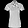<figcaption>Input A</figcaption></figure><p>z(t) = (1 − t) μ<sub>A</sub> + t μ<sub>B</sub></p><figure>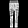<figcaption>Input B</figcaption></figure></div>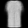<label for="latent-t">Position t = <output id="latent-t-value">0.00</output></label><input id="latent-t" type="range" min="0" max="20" step="1" value="0" disabled><p id="latent-z">Loading recorded latent path…</p></div>
</div>
<p class="fragment vae-line">Continuous pixels do not guarantee meaningful objects all along the path.</p>
<p class="vae-source">Course experiment · unchanged section-2 checkpoint · first validation T-shirt, trouser, and ankle boot · 21 recorded positions per path. Map: actual μ coordinates, no projection. Fashion-MNIST <a href="https://github.com/zalandoresearch/fashion-mnist">Xiao et al. (2017)</a>; latent exploration <a href="https://arxiv.org/abs/1312.6114">Kingma &amp; Welling (2014)</a>.</p>

::: {.notes}
Ask students to predict the middle before moving the slider. Trace the point on the map and the changing decoded image together. Begin with T-shirt to trouser, then compare the path to a boot. Endpoints are the first validation examples of these three classes, selected by the same rule as section 2; no visual-quality filtering is applied. All intermediate outputs are retained. At t=0 and t=1 we decode the endpoint means, so even these outputs need not equal the original thumbnails.

The map contains the first 1,024 validation posterior means. It is a map of mu, not posterior draws or a density plot of the prior. Labels color the display only; the VAE never trained on them. Overlap is allowed, and the axes are coordinates, not named semantic factors. The SVG view clips coordinates outside the labeled -4 to 4 window and reports their count. The displayed path stays in this window.

The browser loads 21 saved outputs and their exact latent coordinates; it performs no network inference. Decoder weights stay fixed and no new epsilon is drawn during interpolation. This isolates the effect of changing z. The straight interpolation of two posterior means is not itself a random draw from the prior; it must not be counted as an unconditional generation-quality evaluation.

The decoder uses continuous operations, so its pixel outputs change continuously with z. Recognition of an object is a different property: a smooth path can pass through ambiguous shapes. No semantic disentanglement or class-consistent transition is guaranteed by the VAE loss. Do not call the interpolated images actual examples from the data manifold solely because the endpoints are encoded observations.
:::

## Inspect the draws you did not get to choose {#vae-sample-audit .vae-s6}

<div class="latent-prior-grid">
<figure>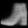<figcaption>01</figcaption></figure><figure>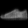<figcaption>02</figcaption></figure><figure>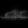<figcaption>03</figcaption></figure><figure>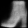<figcaption>04</figcaption></figure><figure>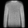<figcaption>05</figcaption></figure><figure>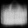<figcaption>06</figcaption></figure><figure><figcaption>07</figcaption></figure><figure>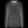<figcaption>08</figcaption></figure><figure>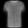<figcaption>09</figcaption></figure><figure>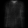<figcaption>10</figcaption></figure><figure>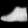<figcaption>11</figcaption></figure><figure>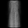<figcaption>12</figcaption></figure><figure>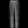<figcaption>13</figcaption></figure><figure>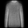<figcaption>14</figcaption></figure><figure>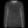<figcaption>15</figcaption></figure><figure>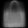<figcaption>16</figcaption></figure>
</div>
<p class="vae-line">Sixteen consecutive prior draws. Which shapes are convincing—and which are ambiguous?</p>
<div class="latent-gallery-reading fragment"><div><strong>Soft edges</strong><p>These are decoder mean pixels. Inspect detail, not just the outline.</p></div><div><strong>Uneven appearances</strong><p>A few recognizable shapes do not establish coverage.</p></div><div><strong>Keep the failures</strong><p>Use fixed, unfiltered draws when comparing checkpoints.</p></div></div>
<p class="vae-source">Actual outputs · same two-dimensional MLP, ten epochs · first 16 N(0,I) draws, seed 619 · no selection by appearance · decoder means, not sampled pixels. Course experiment on Fashion-MNIST <a href="https://github.com/zalandoresearch/fashion-mnist">Xiao et al. (2017)</a>.</p>

::: {.notes}
Give students time to scan every tile before revealing the reading guide. The numbered positions make it possible to refer to an ambiguous sample without silently replacing it. These sixteen draws are a reproducible small gallery, not a representative quality estimate or a class-balance measurement. They all come from the same section-2 checkpoint used for interpolation and the next diagnostic. This avoids confusing changes in weights with different viewing operations.

Many mean images have soft contours and little fine detail. The visible model combines a two-dimensional bottleneck, a modest MLP, ten epochs of training, and a pixelwise BCE surrogate. Do not attribute every defect to a universal property of VAEs, or claim this small experiment establishes state-of-the-art limits. A pixelwise predicted mean can average unresolved alternatives; the current experiment does not isolate that explanation from capacity, latent dimension, or optimization. Sampling Bernoulli pixels instead would add binary pixel noise; it is not evidence of recovered object detail, and grayscale BCE was already identified as a surrogate.

For a controlled comparison, hold the validation set and prior codes fixed, inspect the reconstruction and KL components separately, and repeat the experiment across seeds before making a general ranking. Section 3 already compared the reconstruction/regularization tradeoff under controlled training conditions; this slide adds an audit of outputs, not another uncontrolled beta comparison. A lower training objective alone does not establish perceptual quality, diversity, or novelty.

Generation without an input does not prove non-memorization. The nearest-neighbor comparison from section 1 is one limited check; pixel distance alone cannot establish originality. More samples and class-wise inspection can reveal omissions, but these labels are evaluation aids rather than training targets. Preserve the distinction between qualitative evidence and a population-level claim.
:::

## Does the decoder use the image’s code? {#vae-latent-use .vae-s6}

<div class="latent-diagnostic-layout"><div class="latent-probe-grid">
<span>Observed x</span>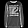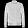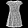<span>Paired code</span>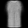<span>Reassigned</span>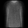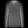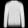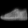
</div><div class="latent-probe-reading"><p>Keep the weights and the decoded samples.<br><strong>Reassign each code to another image.</strong></p><p class="latent-probe-question">What should happen to reconstruction cost?</p><div class="fragment"><h3>1,024 held-out images · 8 draws each</h3><div class="latent-score"><span>Paired</span><i style="width:28.38%"></i><b>255.4</b></div><div class="latent-score"><span>Reassigned</span><i style="width:92.95%"></i><b>836.6</b></div><p class="latent-probe-unit">Pixel-summed BCE / image · lower is better<br>Same scale, zero origin · mean KL = 6.23</p><p><strong>The pairing matters in this model.</strong></p></div></div></div>
<div class="fragment latent-collapse-line"><strong>Posterior collapse:</strong> q(z ∣ x) ≈ p(z), with little image information in z.<br>Near-zero KL + little effect from reassignment is a warning sign.</div>
<p class="vae-source">Measured intervention, not a second trained model · first four validation cases shown, first posterior draw · cyclic code reassignment over 1,024 images · seed 620. Collapse reference: <a href="https://aclanthology.org/K16-1002/">Bowman et al. (2016), §3.1</a>.</p>

::: {.notes}
First compare each observed input with its paired reconstruction. Then compare the same target with a reconstruction decoded from a different image's code. The weights and set of decoded outputs are identical; only the matching changes. This rules out changes in model capacity or training quality as the reason for the difference. The shown rows are the first four validation images and the first posterior draw. Reassignment is a cyclic roll by one across the full 1,024-image probe, not a permutation restricted to these four thumbnails.

The measured reconstruction cost averages eight seeded posterior draws per image, summing BCE over pixels and averaging over draws and images. It rises from 255.4250 to 836.5840 when pairing is broken. The unmodified model's mean analytic Gaussian KL is 6.2336 nats per image. The soft-target grayscale BCE is the same surrogate used throughout; these are not likelihood estimates for a continuous-image distribution. The bars have a common zero-based scale ending at 900.

The intervention establishes that image-specific codes help reconstruct their own images in this tested checkpoint. It does not establish perceptual quality, semantic disentanglement, or perfect use of every latent coordinate. It is evidence against complete loss of image-specific latent information here, not proof against every partial-collapse phenomenon.

Now name the failure that the diagnostic could reveal. If q(z|x) equals p(z) for every x, drawing z conveys no information about which input was encoded. In familiar posterior-collapse failures the decoder learns to ignore z and the KL approaches zero. Bowman et al. describe this behavior for sequence VAEs with powerful decoders; we cite that failure mechanism without treating their language-model experiment as this Fashion-MNIST result. In an unconditional independent-pixel decoder such as ours, ignoring z would remove the only image-specific input and give the same predicted mean for every code.

Neither a small KL value alone nor a reassignment test alone is a complete diagnosis. Compare components and sensitivity together, over adequate data and seeds. Positive KL may partly reflect an aggregate mismatch rather than useful image information. This checkpoint has a large reassignment penalty, so do not label its blurry samples as posterior collapse. No new remedies or model families are needed to close this lecture.
:::

## Close the loop: generate without an input {#vae-closing .vae-s6}

<p class="vae-task">You have a trained VAE. Produce <strong>32 new 28 × 28 images</strong>, with no observed x.</p>
<div class="latent-closing-questions"><div><span>01 · CODE SOURCE</span><p>Where do the<br>32 codes come from?</p></div><div><span>02 · EXECUTION PATH</span><p>Which trained modules<br>must run?</p></div><div><span>03 · EVIDENCE</span><p>What would you inspect<br>before claiming success?</p></div></div>
<div class="exercise-pause"><span>PAUSE</span><b>60 seconds</b><small>Trace the path and give one limitation of your proposed quality check.</small></div>
<div class="fragment exercise-solution latent-closing-solution"><span class="solution-label">WORKED SOLUTION</span><div class="latent-closing-flow"><div><strong>z ∼ N(0, I)</strong><p>[32, 2]</p></div><b>→</b><div><strong>Fixed decoder</strong><p>Encoder is not needed</p></div><b>→</b><div><strong>32 mean images</strong><p>[32, 1, 28, 28]</p></div></div><p>Inspect unfiltered prior draws and failures; a small gallery cannot establish coverage or novelty.</p></div>
<div class="fragment latent-closing-takeaway"><strong>Training made this path possible:</strong><br>reconstruction + KL, optimized through z = μ + σ ⊙ ε.</div>
<p class="vae-source">Synthesis of the trained course model · these outputs are decoder means; observation sampling is a separate step. Variational training and generation: <a href="https://arxiv.org/abs/1312.6114">Kingma &amp; Welling (2014)</a>.</p>

::: {.notes}
This is a transfer task using the mechanisms already taught, not a new architecture. The trained model has two latent coordinates, so create a standard-normal tensor [32,2] on the model's device and pass it through the fixed decoder under evaluation/no_grad. No image or encoder is needed to execute this generation path. The result is 32 decoder mean images with shape [32,1,28,28]. Draw again to get different codes while keeping learned weights fixed.

A defensible evaluation answer names an actual check and its limit. A fixed-seed, unfiltered prior gallery exposes obvious failures but cannot prove coverage or novelty. Held-out reconstruction costs check another important behavior but are not a direct generation-quality score. A latent-reassignment diagnostic tests image-specific information use but cannot certify realism. Pixel nearest neighbors flag obvious resemblance without proving non-memorization. Accept any accurately scoped answer instead of demanding one metric.

After the worked solution, connect the result to training. The encoder supplied image-conditioned distributions, the decoder learned from their samples, reconstruction preserved useful information, KL encouraged compatibility with the prior, and reparameterization enabled gradients through the sampled code. Adam updated both networks. At generation time we retain the learned decoder and replace the image-conditioned code source by the prior.

Return verbally to the five-part frame: Fashion-MNIST data; a latent-variable encoder/decoder hypothesis; reconstruction plus KL loss; reparameterized gradient optimization; and separate evidence for reconstruction, latent use, and generation. Close with the sampling path on screen. Do not add diffusion, adversarial training, or collapse remedies to this conclusion.
:::
