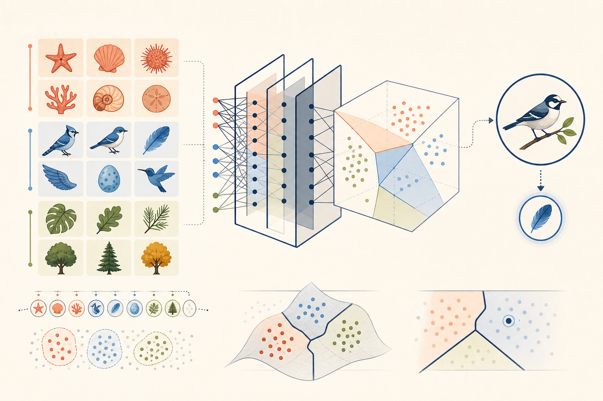
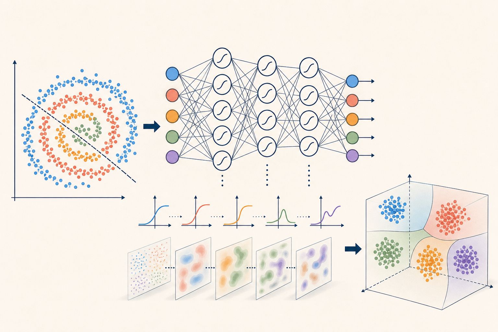

:::{.notes-index-lead}
These notes are written as a connected textbook rather than lecture transcripts. Each chapter develops one central idea through intuition, mathematics, small experiments, and questions you should be able to answer yourself.
:::

## Part I · Foundations

:::{.chapter-list}
:::{.chapter-entry .available .foundations}
01

:::{.chapter-copy}
### [What Does It Mean to Learn?](notes/01-what-is-learning/index.qmd)

[{fig-alt="Preview of Chapter 1: examples, learned class regions, and prediction."}](notes/01-what-is-learning/index.qmd)
:::

Read chapter →
:::
:::

## Part II · Neural Networks from Scratch

:::{.chapter-list}
:::{.chapter-entry .available .neural-networks}
02

:::{.chapter-copy}
### [From Linear Classifiers to Neural Networks](notes/02-neurons-mlps/index.qmd)

[{fig-alt="Preview of Chapter 2: nonlinear layers transforming data into separable features."}](notes/02-neurons-mlps/index.qmd)
:::

Read chapter →
:::
:::

:::{.notes-coming}
More chapters will appear here as the course develops.
:::
