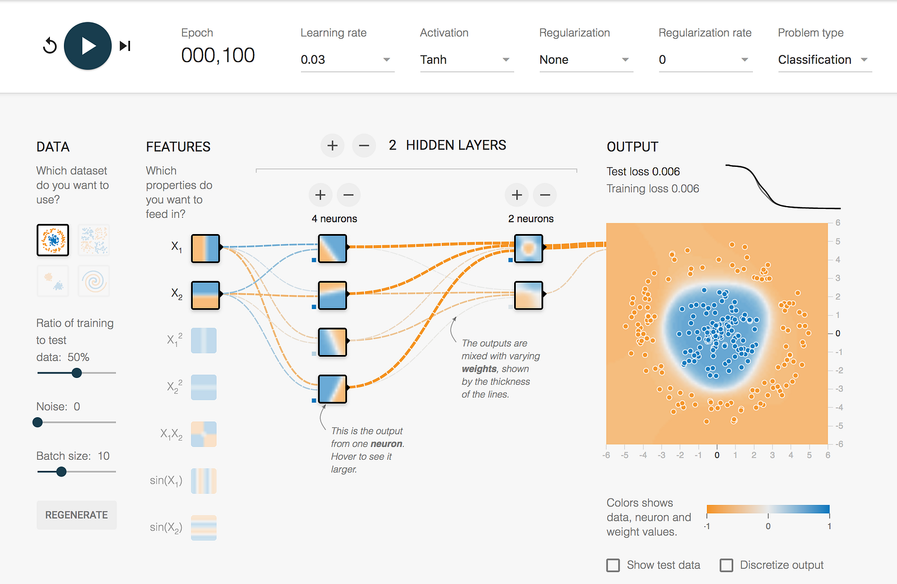
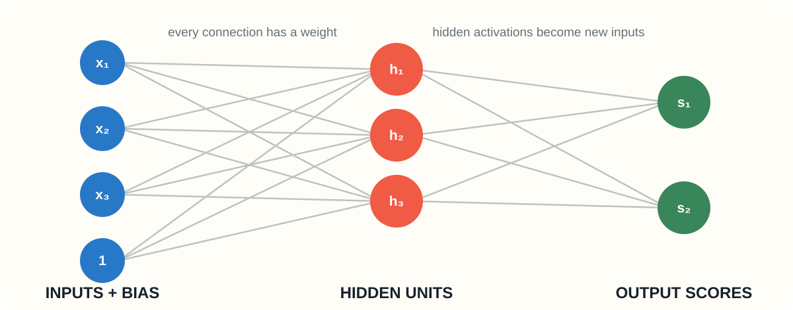
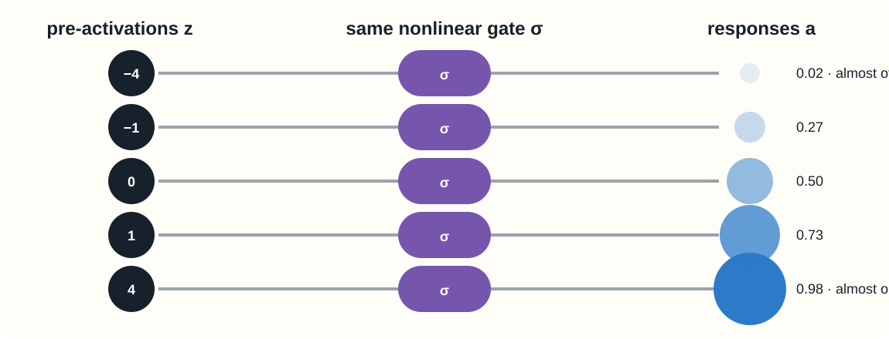
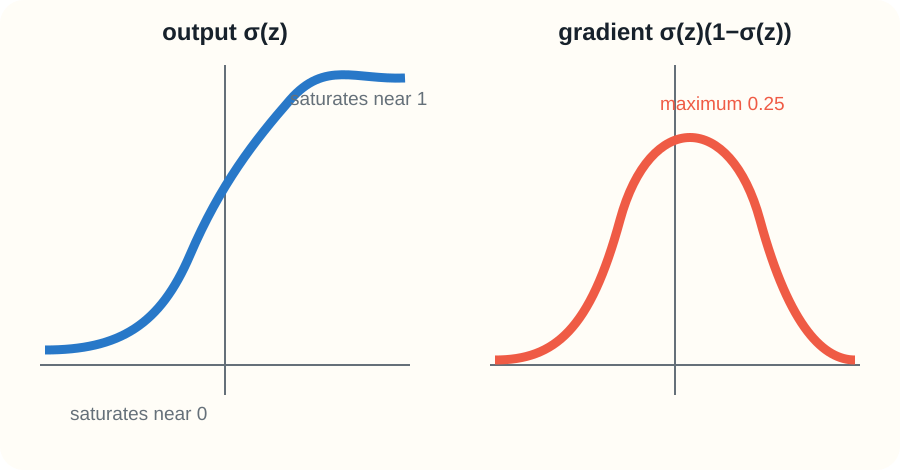
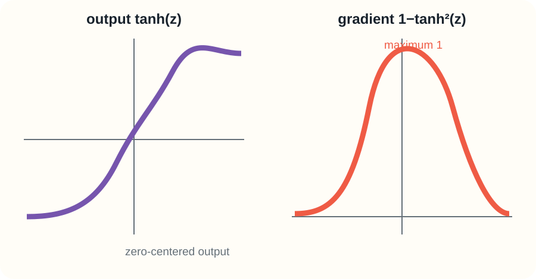
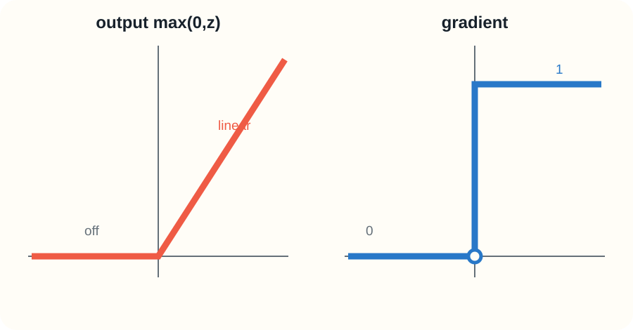
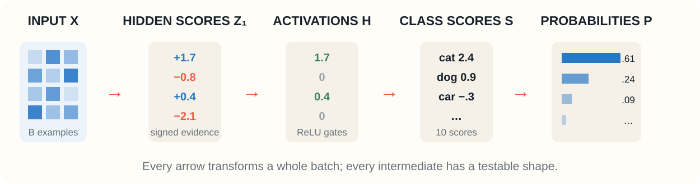
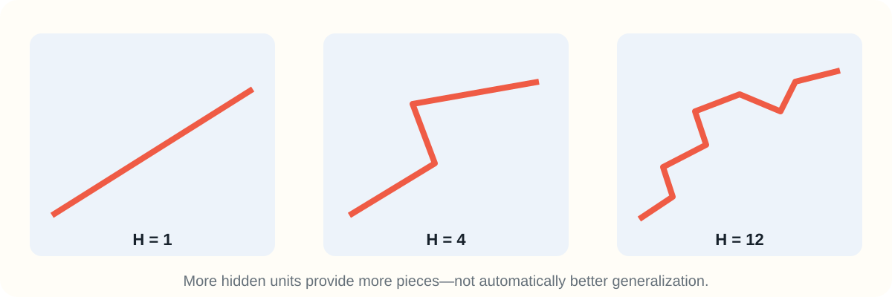
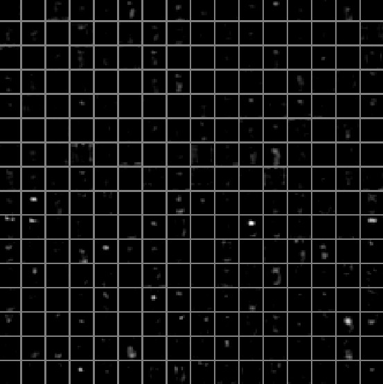

:::{.chapter-opening}
:::{.chapter-kicker}
PART II · NEURAL NETWORKS FROM SCRATCH
:::

:::{.chapter-cover}
{fig-alt="A visual overview of a multilayer neural network transforming concentric data into a separable hidden representation."}
:::

The answer is not “add many matrices.” Several affine maps in succession still collapse into one affine map. A neural network gains expressive power by placing a **nonlinear activation** between learned affine transformations.
:::

:::{.learning-objectives}
### By the end of this chapter, you should be able to {.unnumbered .unlisted}

1. Describe a neuron as an affine score followed by an activation.
2. Explain geometrically why a single linear classifier fails on nonlinear data.
3. Compute sigmoid, tanh, and ReLU outputs and derivatives.
4. Write the forward pass of a two-layer multilayer perceptron using matrices.
5. Check every parameter and intermediate tensor shape.
6. Explain how hidden activations form a learned representation.
7. Implement a self-contained NumPy forward pass and prediction method.
:::

## From a linear score to a neuron

Chapter 1 introduced the multiclass linear classifier

$$
S=XW+b.
$$

For a batch of $N$ examples with $D$ input features and $K$ classes,

$$
X\in\mathbb R^{N\times D},\qquad
W\in\mathbb R^{D\times K},\qquad
b\in\mathbb R^{K},\qquad
S\in\mathbb R^{N\times K}.
$$

Each column of $W$ defines one class score. This model is efficient, but each pairwise decision boundary is a hyperplane. No amount of training can make one hyperplane wrap around a curved or disconnected class.

![A linear boundary cannot separate the intertwined spiral classes, while a small neural network can construct a nonlinear partition. The drawing is based on the Stanford CS231n spiral case study [@cs231nnotes].](../../lectures/02-neurons-mlps/assets/spiral-boundaries.svg){#fig-spiral-boundaries width=92%}

The [TensorFlow Playground](https://playground.tensorflow.org/) makes this limitation visible. Select the concentric-circle dataset, first train a linear model, and then add a hidden layer. The hidden layer can transform the input before the final linear decision.

{#fig-playground width=90%}

### The computation performed by one neuron

A neuron receives an input vector $x\in\mathbb R^D$, computes a weighted sum plus a bias,

$$
z=w^\top x+b,
$$

and applies an activation function $\phi$:

$$
h=\phi(z).
$$

{#fig-dense-neuron width=88%}

The weights control orientation, the bias controls translation, and the activation controls the form of the response. Before the activation, the equation

$$
w^\top x+b=0
$$

defines a hyperplane. The signed value $z=w^\top x+b$ indicates on which side of that hyperplane the input lies and how strongly it matches the neuron's learned direction.

![A neuron first creates a linear boundary and then converts signed distance-like scores into responses. Course schematic; the biological-neuron analogy commonly used in neural-network introductions is also illustrated by Stanford CS231n [@cs231nnotes].](../../lectures/02-neurons-mlps/assets/neuron-boundary.svg){#fig-neuron-boundary width=82%}

The neuron picture is useful, but the biological analogy should not be taken literally. Artificial neurons are differentiable computational units inspired only loosely by biological cells. Their practical importance comes from composition, matrix computation, and optimization—not biological fidelity [@goodfellow2016deep].

### Why nonlinearities are necessary

Suppose we stack two affine transformations without an activation:

$$
f(x)=(xW_1+b_1)W_2+b_2.
$$

Expanding gives

$$
f(x)=x(W_1W_2)+(b_1W_2+b_2).
$$

Define $W'=W_1W_2$ and $b'=b_1W_2+b_2$. Then

$$
f(x)=xW'+b',
$$

which is still one affine transformation. Ten affine layers without nonlinearities have the same structural limitation.

:::{.key-idea}
**Depth alone does not create nonlinear behavior.** The activation prevents successive layers from collapsing into a single affine map.
:::

{#fig-neuron-gates width=94%}

## Activation functions

An activation function should be understood through four views: its formula, its output curve, its derivative, and the optimization behavior produced by that derivative.

### Sigmoid

The logistic sigmoid is

$$
\sigma(z)=\frac{1}{1+e^{-z}}.
$$

Its derivative can be expressed using its own output:

$$
\sigma'(z)=\sigma(z)(1-\sigma(z)).
$$

{#fig-sigmoid width=88%}

Sigmoid maps every real number into $(0,1)$, so it is natural for the output of a binary probabilistic classifier. As a hidden activation, however, it has two important weaknesses:

- it is not zero-centered;
- it saturates for large positive or negative inputs, where its derivative is nearly zero.

When many saturated units are composed, gradients passed backward through their derivatives can shrink severely. We will formalize this phenomenon when deriving backpropagation.

### Hyperbolic tangent

The hyperbolic tangent is

$$
\tanh(z)=\frac{e^z-e^{-z}}{e^z+e^{-z}},
$$

with derivative

$$
\frac{d}{dz}\tanh(z)=1-\tanh^2(z).
$$

{#fig-tanh width=88%}

Tanh maps to $(-1,1)$ and is zero-centered, which often makes its hidden activations easier to work with than sigmoid outputs. It nevertheless saturates, and its derivative also approaches zero when $|z|$ is large.

### Rectified linear unit

The rectified linear unit, or ReLU, is

$$
\operatorname{ReLU}(z)=\max(0,z).
$$

Away from zero, its derivative is

$$
\operatorname{ReLU}'(z)=
\begin{cases}
0,&z<0,\\
1,&z>0.
\end{cases}
$$

At $z=0$ the mathematical derivative is undefined; implementations choose a conventional subgradient, commonly zero.

{#fig-relu width=88%}

ReLU is computationally simple, does not saturate on its positive side, and often produces sparse activations. A unit can nevertheless become inactive for every training example if updates leave all its pre-activations negative—the “dying ReLU” problem. Variants such as leaky ReLU keep a small negative slope.

| Activation | Range | Largest derivative | Main strength | Main weakness |
|---|---:|---:|---|---|
| Sigmoid | $(0,1)$ | $0.25$ | Probability-like output | Saturation; not zero-centered |
| Tanh | $(-1,1)$ | $1$ | Zero-centered | Saturation |
| ReLU | $[0,\infty)$ | $1$ | Simple; positive side does not saturate | Zero gradient on negative side |

:::{.margin-question}
**Practice before reading the solution**

Apply ReLU elementwise to

$$
z=[-2.0,\,-0.1,\,0,\,1.4,\,3.0].
$$

Which entries can pass a nonzero local gradient? Pause for one minute.

<details><summary>Reveal the solution</summary>

$$
\operatorname{ReLU}(z)=[0,0,0,1.4,3.0].
$$

The entries at $1.4$ and $3.0$ have local derivative one. Negative entries have derivative zero. At exactly zero, our implementation will use derivative zero.
</details>
:::

### A controlled activation experiment

In TensorFlow Playground, keep the dataset, train/validation split, architecture, learning rate, and number of training steps fixed. Change only the activation among sigmoid, tanh, and ReLU. Then inspect:

1. how rapidly the training loss falls;
2. the boundary each model learns;
3. which hidden units become nearly constant;
4. whether the outcome changes when training is restarted.

This is not a benchmark. It is a controlled experiment for connecting the shapes in Figures @fig-sigmoid–@fig-relu to learning behavior. One run is not sufficient evidence because initialization and stochastic sampling can change the result.

## Building a two-layer network

A **layer** collects many neurons and evaluates them in parallel. Let the input dimension be $D$, the hidden width be $H$, and the number of output classes be $K$.

![A fully connected neural network with one hidden layer. Every input connects to every hidden unit, and every hidden unit connects to every output. Stanford CS231n [@cs231nnotes].](../../lectures/02-neurons-mlps/assets/cs231n-neural-net2.jpeg){#fig-cs231n-network width=68%}

For a batch $X\in\mathbb R^{N\times D}$, define the forward pass as

$$
\begin{aligned}
Z_1 &= XW_1+b_1,\\
H_1 &= \operatorname{ReLU}(Z_1),\\
S &= H_1W_2+b_2.
\end{aligned}
$$

Here $Z_1$ contains the **pre-activations**, $H_1$ contains the hidden activations, and $S$ contains the class scores. We do not apply ReLU to $S$: the loss needs unrestricted class scores.

{#fig-forward-pass width=100%}

### Shape bookkeeping

The shapes reveal whether each matrix product is valid:

| Object | Shape | Meaning |
|---|---:|---|
| $X$ | $N\times D$ | batch of $N$ examples |
| $W_1$ | $D\times H$ | input-to-hidden weights |
| $b_1$ | $H$ | one bias per hidden unit |
| $Z_1,H_1$ | $N\times H$ | one hidden representation per example |
| $W_2$ | $H\times K$ | hidden-to-output weights |
| $b_2$ | $K$ | one bias per class |
| $S$ | $N\times K$ | one class-score vector per example |

Bias vectors are broadcast across the $N$ rows. Broadcasting does not create a separate learned bias for each example; every example uses the same $b_1$ and $b_2$.

:::{.margin-question}
**Shape exercise**

Let $N=64$, $D=3072$, $H=100$, and $K=10$. Determine the shapes of all parameters and intermediates before revealing the answer.

<details><summary>Reveal the solution</summary>

$$
\begin{aligned}
X &: (64,3072), & W_1 &: (3072,100), & b_1 &: (100),\\
Z_1,H_1 &: (64,100), & W_2 &: (100,10), & b_2 &: (10),\\
S &: (64,10).&&
\end{aligned}
$$
</details>
:::

### Counting parameters

The number of learned scalar parameters is

$$
P=(DH+H)+(HK+K).
$$

For $D=3072$, $H=100$, and $K=10$,

$$
P=3072(100)+100+100(10)+10=308{,}310.
$$

If the hidden width doubles to $H=200$, the hidden activations double in width and both weight matrices grow:

$$
P=3072(200)+200+200(10)+10=616{,}610.
$$

The count is almost doubled because the dominant terms $DH$ and $HK$ are linear in $H$. Greater width creates more features and capacity, but also increases computation, memory use, and the opportunity to overfit.

## Hidden representations

The vector

$$
h(x)=\operatorname{ReLU}(xW_1+b_1)\in\mathbb R^H
$$

is a new description of the input. Instead of asking the final layer to classify raw pixels, we ask it to classify learned features. Training adjusts $W_1$ and $b_1$ so that useful distinctions become easier in this hidden coordinate system [@bengio2013representation].

![A t-SNE projection of AlexNet fc7 feature vectors. Each thumbnail represents one high-dimensional activation vector; images with similar learned representations appear nearby in the two-dimensional projection. Source: Stanford CS231n [@cs231nnotes].](../../lectures/02-neurons-mlps/assets/cs231n-cnn-tsne.jpeg){#fig-cnn-tsne width=100%}

A two-dimensional projection is evidence, not a literal picture of the hidden space. The original vectors have thousands of components, and a projection necessarily distorts some distances. Still, the neighborhoods show that the learned coordinates capture substantial visual structure.

### Filters and feature maps are different objects

A **filter** is a learned parameter. A **feature map** is the response produced when that filter is applied to a particular input. Confusing them is like confusing the weight vector $w$ with the activation $\phi(w^\top x+b)$.

| Learned AlexNet conv1 filters | Their activation maps for one cat image |
|---|---|
|  |  |

AlexNet was a landmark large-scale convolutional classifier [@krizhevsky2012imagenet]. We will study convolution later; here the visualizations make a general principle concrete: hidden units are reusable detectors, and an image is represented by the pattern of their responses.

### A representation is a pattern of activations

Meaning is usually distributed across many hidden units. Two cats need not activate exactly the same units with exactly the same magnitudes, but their activation vectors may be more similar to one another than to a truck's vector.

![Image patches that maximally activate selected AlexNet pool5 units. The white values report activation magnitudes, making clear that a representation contains graded numerical responses rather than only on/off symbols. Source: Stanford CS231n [@cs231nnotes].](../../lectures/02-neurons-mlps/assets/alexnet-pool5-max-activations.jpeg){#fig-pool5-values width=100%}

The examples in Figure @fig-pool5-values should not be interpreted as proof that each unit has one clean human-readable meaning. A unit may respond to several correlated visual structures, and a concept can be distributed over many units. The important object for the next layer is the complete activation vector.

### Width and depth play different roles

Increasing width gives a layer more units with which to construct a piecewise-linear transformation. This can produce a more intricate boundary, but the extra capacity can fit noise as well as signal.

{#fig-width width=90%}

Depth repeatedly transforms one representation into another. Early learned responses often capture local contrasts and orientations; deeper responses can become more selective because they compose earlier features.

| Early AlexNet layer: conv1 | Deeper AlexNet layer: conv5 |
|---|---|
|  |  |

These images do not imply that every network learns the same fixed hierarchy. They illustrate what this trained model learned. Architecture, task, data, and optimization all influence the resulting representation.

## Implementing the forward pass in NumPy

Keeping the first implementation self-contained makes the relationship between equations, arrays, and object-oriented code explicit.

```{.python}
import numpy as np

class TwoLayerNet:
    def __init__(self, input_dim, hidden_dim, n_classes, seed=0):
        rng = np.random.default_rng(seed)
        scale = 1e-2

        self.W1 = scale * rng.standard_normal((input_dim, hidden_dim))
        self.b1 = np.zeros(hidden_dim)
        self.W2 = scale * rng.standard_normal((hidden_dim, n_classes))
        self.b2 = np.zeros(n_classes)

    def forward(self, X):
        z1 = X @ self.W1 + self.b1
        h1 = np.maximum(0.0, z1)
        scores = h1 @ self.W2 + self.b2

        cache = {"X": X, "z1": z1, "h1": h1}
        return scores, cache

    def predict(self, X):
        scores, _ = self.forward(X)
        return np.argmax(scores, axis=1)
```

The class is only an organizational container. `self.W1` means that the array belongs to this network instance and remains available across method calls. `forward` uses those stored parameters; it does not import a second hidden implementation from elsewhere.

The cache is unnecessary for prediction, but it records the intermediate values that backpropagation will need. Returning it now makes the data flow explicit.

### Defensive shape checks

Silent broadcasting mistakes can produce an array with a plausible shape while implementing the wrong computation. During development, assert the contract:

```{.python}
def checked_forward(model, X):
    assert X.ndim == 2
    assert X.shape[1] == model.W1.shape[0]
    assert model.b1.shape == (model.W1.shape[1],)
    assert model.W2.shape[0] == model.W1.shape[1]

    scores, cache = model.forward(X)

    assert cache["z1"].shape == (X.shape[0], model.W1.shape[1])
    assert cache["h1"].shape == cache["z1"].shape
    assert scores.shape == (X.shape[0], model.W2.shape[1])
    return scores, cache
```

### Sanity checks before training

Before trusting a loss curve, verify simple invariants:

1. `scores.shape` must be $(N,K)$.
2. Every ReLU activation must be nonnegative.
3. `predict(X)` must return $N$ integer class indices.
4. Identical input rows must produce identical score rows in evaluation mode.
5. With very small random weights, initial class scores should be near one another.

If the initial model assigns roughly equal probability to each of $K$ classes, the expected softmax loss is approximately

$$
-\log\left(\frac1K\right)=\log K.
$$

For $K=10$, this is about $2.303$. A dramatically different initial loss is a useful signal to inspect shapes, labels, numerical stability, and initialization before writing any optimization code.

## What the forward pass does not yet solve

The network can now produce scores, but its random hidden features are not useful yet. Learning still requires:

$$
\text{scores}
\longrightarrow
\text{loss}
\longrightarrow
\text{gradients}
\longrightarrow
\text{parameter update}.
$$

Backpropagation is the efficient procedure that computes how the loss changes with every parameter in this composed function [@rumelhart1986backprop]. The next chapters will derive that procedure and then study optimization in depth.

:::{.key-idea}
The forward pass is a chain of explicit transformations. Backpropagation does not replace this chain; it traverses the same computation in reverse using the chain rule.
:::

## Summary

- A neuron computes an affine pre-activation $z=w^\top x+b$ and a nonlinear activation $h=\phi(z)$.
- Stacking affine transformations without an activation still produces one affine transformation.
- Sigmoid and tanh saturate; ReLU is simple and non-saturating on its positive side but can become inactive.
- A two-layer classifier computes $Z_1=XW_1+b_1$, $H_1=\operatorname{ReLU}(Z_1)$, and $S=H_1W_2+b_2$.
- Hidden activations are learned feature vectors. Their geometry can make classes easier for the final linear layer to separate.
- Filters are learned parameters; feature maps are input-dependent activations.
- Width supplies more features within a layer, while depth composes successive representations.
- Shapes and simple numerical invariants should be checked before training.

## Reading and practice

:::{.reading-list}
:::{.reading-item .required}
<span class="reading-icon">📄</span>

### Required · Stanford CS231n: Neural Networks Part 1 {.unnumbered .unlisted}

[Read the notes](https://cs231n.github.io/neural-networks-1/) for the class-score viewpoint, neural-network architecture, activation functions, and biological analogy [@cs231nnotes].
:::

:::{.reading-item .required}
<span class="reading-icon">📖</span>

### Required · Deep Learning, Chapter 6 {.unnumbered .unlisted}

[Read Deep Feedforward Networks](https://www.deeplearningbook.org/contents/mlp.html), especially the motivation for hidden units, architecture design, and gradient-based learning [@goodfellow2016deep].
:::

:::{.reading-item}
<span class="reading-icon">🔎</span>

### Visual exploration · What ConvNets learn {.unnumbered .unlisted}

[Explore the CS231n visualizations](https://cs231n.github.io/understanding-cnn/) used in this chapter. Distinguish filters, activation maps, maximally activating inputs, and feature-space projections.
:::

:::{.reading-item}
<span class="reading-icon">🧪</span>

### Practice · TensorFlow Playground {.unnumbered .unlisted}

[Open the playground](https://playground.tensorflow.org/). Hold all settings constant while comparing linear, sigmoid, tanh, and ReLU networks on the circle and spiral datasets.
:::
:::

## References {.unnumbered}

::: {#refs}
:::
