:::{.chapter-opening}
:::{.chapter-kicker}
PART II · NEURAL NETWORKS FROM SCRATCH
:::

:::{.chapter-cover}
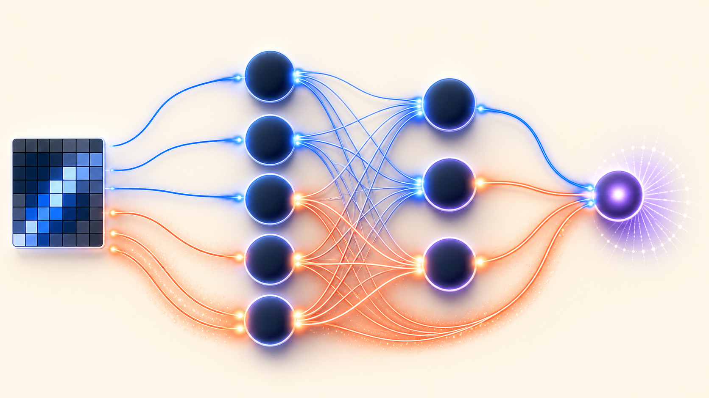{fig-alt="A neural network with blue forward paths and coral backward paths connecting an input grid to a scalar objective."}
:::

A network can produce a prediction and a loss without knowing how any parameter contributed to the result. Backpropagation answers the missing question: **if the loss changed, which earlier values were responsible, in which direction, and by how much?**
:::

:::{.learning-objectives}
### By the end of this chapter, you should be able to {.unnumbered .unlisted}

1. Explain backpropagation as credit assignment on a computation graph.
2. Apply the chain rule through a sequence of scalar operations.
3. Add gradient contributions when a value reaches the loss through several paths.
4. Derive backward rules for a linear layer, common activations, and classification losses.
5. Trace the complete backward pass of a two-layer binary classifier.
6. Explain how reverse-mode automatic differentiation executes local backward rules.
7. Interpret gradient signs, magnitudes, and layerwise flow without yet choosing an optimizer.
:::

## Credit assignment

Consider a binary classifier that confidently predicts “dog” for a cat image. The final loss is one number, but the computation that produced it involved every input feature, weight, bias, activation, and intermediate representation. Changing only the loss does not tell us where the error came from.

The **credit-assignment problem** is to distribute responsibility for the final loss across the values that produced it. For a parameter $w$, the derivative

$$
\frac{\partial\mathcal L}{\partial w}
$$

measures the local sensitivity of the loss to that parameter. Its sign indicates direction; its magnitude indicates strength.

Backpropagation is an efficient procedure for computing these sensitivities. It is the reverse-mode chain rule organized around a computation graph [@rumelhart1986backprop].

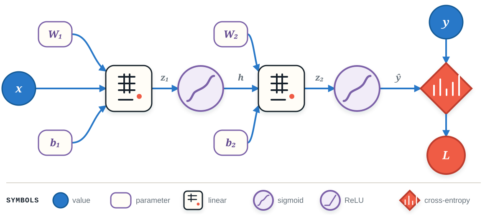{#fig-symbol-language width=100%}

The graph separates two ideas:

- **identity:** short labels such as $x$, $W_1$, $h$, and $hat y$ name values;
- **operation:** stable symbols identify affine maps, activations, and losses without filling every node with prose.

## Begin with one variable

### A derivative is local sensitivity

For a scalar function $y=f(x)$, the derivative at $x$ is the limiting ratio

$$
\frac{dy}{dx}
=\lim_{\Delta x\to0}
\frac{f(x+\Delta x)-f(x)}{\Delta x}.
$$

A derivative is a local promise: for a sufficiently small change,

$$
\Delta y\approx \frac{dy}{dx}\Delta x.
$$

The sign tells us whether $y$ locally rises or falls as $x$ increases. The magnitude tells us how sensitive $y$ is to that change.

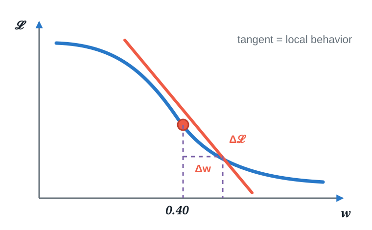{#fig-local-sensitivity width=82%}

### One long expression, several small operations

Take the expression

$$
\mathcal L(x)=\left[(x^2+1)^3-2\right]^2,\qquad x=1.
$$

Direct differentiation gives

$$
\frac{d\mathcal L}{dx}
=2\big[(x^2+1)^3-2\big]\,3(x^2+1)^2\,2x,
$$

and therefore

$$
\left.\frac{d\mathcal L}{dx}\right|_{x=1}=288.
$$

This is correct, but the nested algebra hides the reusable structure. Introduce intermediate values instead:

$$
a=x^2,\qquad b=a+1,\qquad c=b^3,\qquad d=c-2,\qquad \mathcal L=d^2.
$$

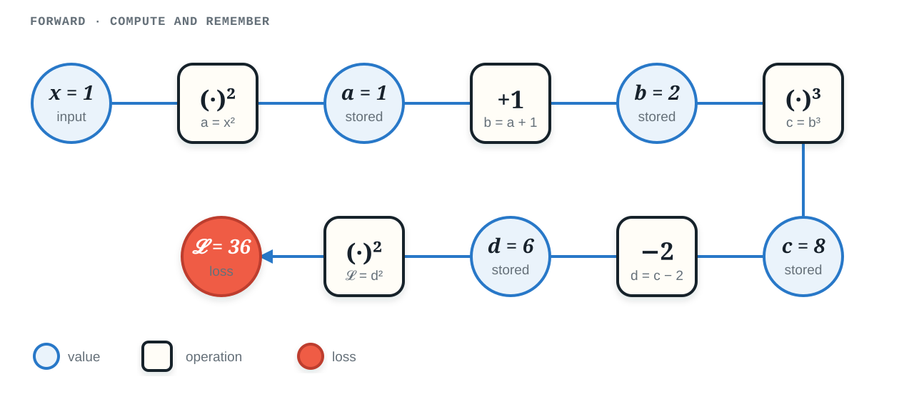{#fig-scalar-forward width=100%}

Each operation now knows one local derivative:

$$
\frac{da}{dx}=2x,\qquad
\frac{db}{da}=1,\qquad
\frac{dc}{db}=3b^2,\qquad
\frac{dd}{dc}=1,\qquad
\frac{d\mathcal L}{dd}=2d.
$$

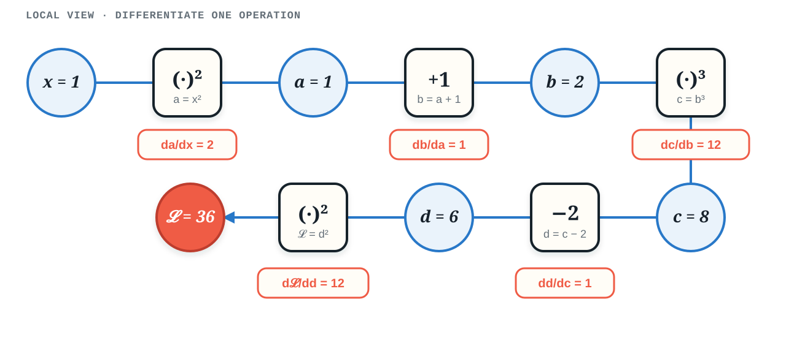{#fig-scalar-local width=100%}

### Backward messages

Seed the final scalar with

$$
\frac{d\mathcal L}{d\mathcal L}=1.
$$

Then move right to left. At every operation,

$$
\boxed{\text{outgoing message}
=\text{incoming message}\times\text{local derivative}.}
$$

For the example,

$$
\begin{aligned}
\frac{d\mathcal L}{dd} &= 1\cdot2d=12,\\
\frac{d\mathcal L}{dc} &= 12\cdot1=12,\\
\frac{d\mathcal L}{db} &= 12\cdot3b^2=144,\\
\frac{d\mathcal L}{da} &= 144\cdot1=144,\\
\frac{d\mathcal L}{dx} &= 144\cdot2x=288.
\end{aligned}
$$

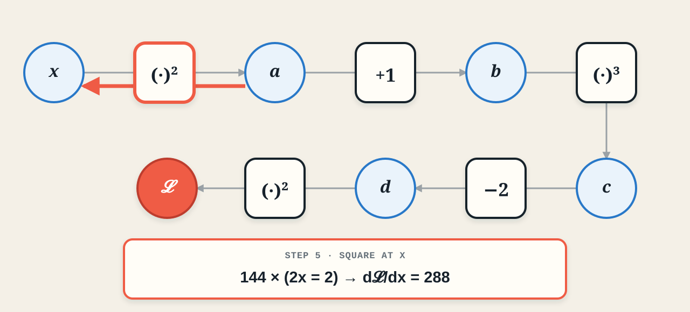{#fig-scalar-backward width=100%}

The result matches direct algebra, but the computation was assembled from local rules. This is the mechanism that scales.

### Practice: draw first, differentiate second

For one sigmoid neuron,

$$
z=wx+b,\qquad \hat y=\sigma(z),\qquad
\mathcal L=\frac12(\hat y-y)^2,
$$

with $x=2$, $w=1$, $b=-1$, and $y=1$:

1. Draw the computation graph.
2. Compute the stored forward values.
3. Backpropagate to $w$, $b$, and $x$.

:::{.content-visible when-format="html"}
<details><summary>Show the graph and solution</summary>

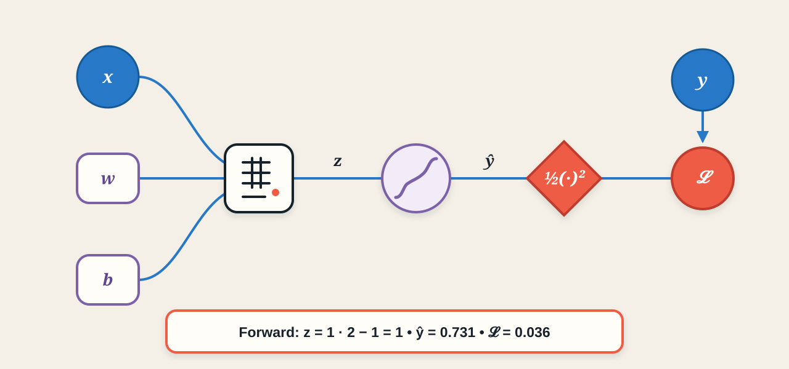{width=100%}

The forward values are $z=1$, $\hat y\approx0.731$, and $\mathcal L\approx0.036$. The backward messages are

$$
g_{\hat y}=\hat y-y\approx-0.269,\qquad
g_z=g_{\hat y}\hat y(1-\hat y)\approx-0.0529,
$$

so

$$
\frac{\partial\mathcal L}{\partial w}=g_zx\approx-0.1058,\qquad
\frac{\partial\mathcal L}{\partial b}=g_z\approx-0.0529,\qquad
\frac{\partial\mathcal L}{\partial x}=g_zw\approx-0.0529.
$$
</details>
:::

:::{.content-visible when-format="pdf"}
:::{.callout-note}
## Worked solution

The graph and forward values are shown in @fig-neuron-practice-pdf. Backpropagation gives $g_{\hat y}\approx-0.269$, $g_z\approx-0.0529$, $\partial\mathcal L/\partial w\approx-0.1058$, and equal gradients of approximately $-0.0529$ for $b$ and $x$.

{#fig-neuron-practice-pdf width=100%}
:::
:::

## Several paths: add the contributions

Suppose $f$ depends on $x$ and $y$, while both $x$ and $y$ depend on $t$. Then $t$ reaches $f$ through two paths:

$$
\boxed{
\frac{df}{dt}
=\frac{\partial f}{\partial x}\frac{dx}{dt}
+\frac{\partial f}{\partial y}\frac{dy}{dt}.}
$$

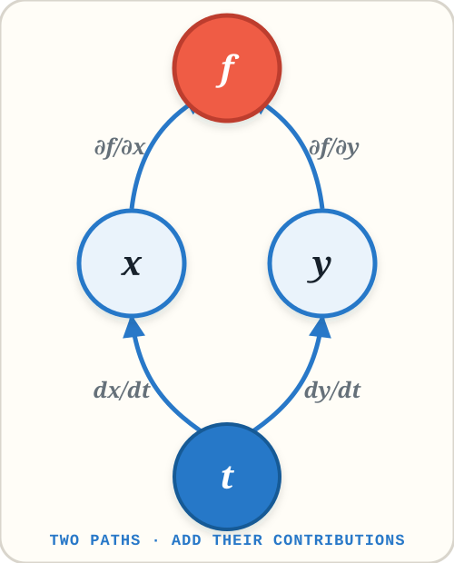{#fig-two-path-rule width=48%}

For

$$
f(x,y)=y+e^{xy},\qquad x(t)=\cos t,\qquad y(t)=t^2,
$$

the local derivatives are

$$
\frac{\partial f}{\partial x}=ye^{xy},\qquad
\frac{\partial f}{\partial y}=1+xe^{xy},\qquad
\frac{dx}{dt}=-\sin t,\qquad
\frac{dy}{dt}=2t.
$$

Therefore

$$
\frac{df}{dt}
=-t^2e^{t^2\cos t}\sin t
+2t\left(1+\cos t\,e^{t^2\cos t}\right).
$$

The plus sign is structural: when several paths connect a value to the loss, backpropagation adds their messages.

### Regularization creates another path

For

$$
\mathcal L_{\text{total}}
=\mathcal L_{\text{data}}+\frac{\lambda}{2}w^2,
$$

the weight reaches the total loss through the prediction and through the penalty.

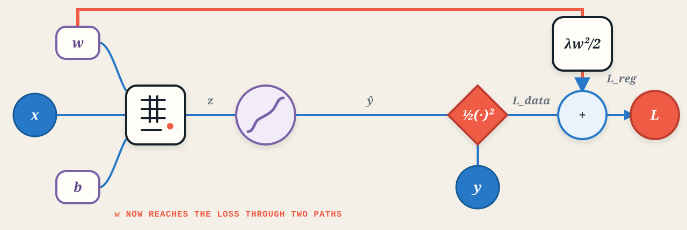{#fig-regularization-path width=100%}

Hence

$$
\frac{\partial\mathcal L_{\text{total}}}{\partial w}
=\frac{\partial\mathcal L_{\text{data}}}{\partial w}+\lambda w.
$$

Using the preceding neuron example with $\lambda=0.1$ and $w=1$ gives

$$
-0.1058+0.1=-0.0058.
$$

The regularizer did not replace the data gradient. It contributed another message.

## From one neuron to a linear layer

Consider a four-input, three-output affine layer followed by a scalar loss. Focus first on

$$
h_1=w_{11}x_1+w_{12}x_2+w_{13}x_3+w_{14}x_4+b_1.
$$

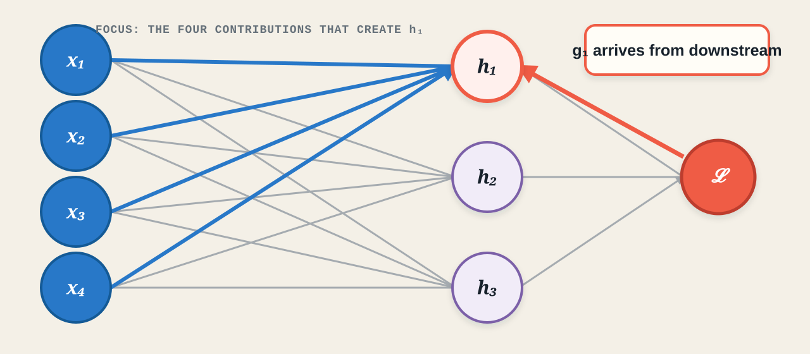{#fig-linear-layer-focus width=100%}

Let

$$
g_1=\frac{\partial\mathcal L}{\partial h_1}.
$$

The messages sent by $h_1$ are

$$
\frac{\partial\mathcal L}{\partial w_{1j}}=g_1x_j,\qquad
\left.\frac{\partial\mathcal L}{\partial x_j}\right|_{h_1}=g_1w_{1j},\qquad
\frac{\partial\mathcal L}{\partial b_1}=g_1.
$$

The input $x_j$ is used by all three output neurons, so it adds three contributions:

$$
\frac{\partial\mathcal L}{\partial x_j}
=\sum_{i=1}^{3}\frac{\partial\mathcal L}{\partial h_i}w_{ij}.
$$

### Matrix form

For

$$
\mathbf h=W\mathbf x+\mathbf b,
$$

with incoming gradient $\mathbf g_h=\partial\mathcal L/\partial\mathbf h$, the linear-layer rules are

$$
\boxed{\frac{\partial\mathcal L}{\partial\mathbf x}=W^\top\mathbf g_h},
\qquad
\boxed{\frac{\partial\mathcal L}{\partial W}=\mathbf g_h\mathbf x^\top},
\qquad
\boxed{\frac{\partial\mathcal L}{\partial\mathbf b}=\mathbf g_h}.
$$

The dimensions explain the forms:

- transpose to send one accumulated message to each input;
- outer product to create one gradient for every weight;
- copy the incoming vector because each bias has local derivative one.

## Backpropagation as message passing

In the forward graph, the **parents** of a node produced its value and its **children** consumed it. Backpropagation reverses this direction.

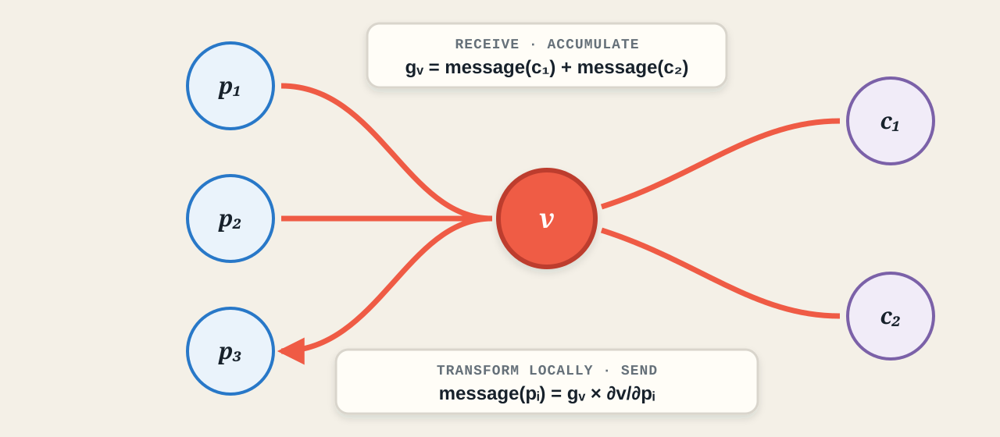{#fig-message-passing width=100%}

At a node $v$:

1. receive messages from every child;
2. add them to form $g_v$;
3. for each parent $p_i$, compute

$$
\operatorname{message}(p_i)=g_v\frac{\partial v}{\partial p_i};
$$

4. add that message to the parent's gradient accumulator.

This language unifies scalar calculus, matrix layers, and automatic differentiation.

## A backward-rule toolbox

Let $g_y$ denote the gradient arriving at a block's output. The following rules are worth recognizing:

| Block | Forward | Backward message |
|---|---|---|
| Linear | $\mathbf y=W\mathbf x+\mathbf b$ | $\mathbf g_x=W^\top\mathbf g_y$, $\nabla_W\mathcal L=\mathbf g_y\mathbf x^\top$, $\nabla_b\mathcal L=\mathbf g_y$ |
| Sigmoid | $y=\sigma(x)$ | $g_x=g_y\,y(1-y)$ |
| Tanh | $y=\tanh(x)$ | $g_x=g_y(1-y^2)$ |
| ReLU | $y=\max(0,x)$ | $g_x=g_y\mathbf1[x>0]$ |
| Softmax | $p_i=e^{z_i}/\sum_j e^{z_j}$ | $\mathbf g_z=\mathbf p\odot(\mathbf g_p-\mathbf p^\top\mathbf g_p)$ |
| Cross-entropy | $\mathcal L=-\sum_i y_i\log p_i$ | $\mathbf g_p=-\mathbf y/\mathbf p$ |

Two fused shortcuts occur constantly in classifiers:

$$
\boxed{\text{softmax + cross-entropy: }\mathbf g_z=\mathbf p-\mathbf y}
$$

and

$$
\boxed{\text{sigmoid + binary cross-entropy: }g_z=\hat y-y.}
$$

Softmax differs from sigmoid, tanh, and ReLU because its outputs interact: changing one logit changes every probability.

## Complete two-layer binary classifier

For a hidden sigmoid layer and sigmoid binary output,

$$
\begin{aligned}
\mathbf z_1 &= W_1\mathbf x+\mathbf b_1,\\
\mathbf h &= \sigma(\mathbf z_1),\\
z_2 &= W_2\mathbf h+b_2,\\
\hat y &= \sigma(z_2),\\
\mathcal L &= -[y\log\hat y+(1-y)\log(1-\hat y)].
\end{aligned}
$$

The backward pass is

$$
\begin{aligned}
g_{z_2} &= \hat y-y,\\
\nabla_{W_2}\mathcal L &= g_{z_2}\mathbf h^\top,
&\nabla_{b_2}\mathcal L &= g_{z_2},\\
\mathbf g_h &= W_2^\top g_{z_2},\\
\mathbf g_{z_1} &= \mathbf g_h\odot\mathbf h\odot(1-\mathbf h),\\
\nabla_{W_1}\mathcal L &= \mathbf g_{z_1}\mathbf x^\top,
&\nabla_{\mathbf b_1}\mathcal L &= \mathbf g_{z_1},\\
\mathbf g_x &= W_1^\top\mathbf g_{z_1}.
\end{aligned}
$$

The [complete companion derivation](two-layer-derivation.qmd) expands every step, checks all tensor shapes, explains the stable sigmoid–BCE simplification, and covers mini-batches. A [PDF version](two-layer-derivation.pdf) is available for offline study.

## Automatic differentiation

Automatic differentiation does not replace the chain rule. It records enough information during the forward pass to execute these local rules automatically in reverse order.

Karpathy's micrograd is a deliberately small scalar reverse-mode autodiff engine. It builds a dynamic directed acyclic graph and provides a PyTorch-like `Value` interface suitable for study.

```{.python}
from micrograd.engine import Value

x = Value(1.0)
a = x**2
b = a + 1
c = b**3
d = c - 2
L = d**2

L.backward()
assert x.grad == 288.0
```

Each `Value` stores conceptually:

| Property | Purpose |
|---|---|
| `data` | forward value |
| `grad` | accumulated gradient messages |
| `_prev` | parent nodes |
| `_op` | operation that created the value |
| `_backward` | operation-specific local backward rule |

For example,

```{.python}
x, y, z = Value(2.0), Value(3.0), Value(1.0)
a = x * y       # data=6,  _op='*',   _prev={x, y}
b = a + z       # data=7,  _op='+',   _prev={a, z}
L = b ** 2      # data=49, _op='**2', _prev={b}
```

Calling `backward()` seeds `L.grad = 1`, computes a topological ordering, and visits the nodes in reverse. The central update is

```{.python}
parent.grad += node.grad * local_derivative
```

The `+=` is essential. Assignment would erase previous contributions whenever a value is reused through several paths. The coding session will implement this `Value` abstraction from scratch; no framework machinery is required.

## What gradients reveal

A gradient should be interpreted before it is used:

- **Sign:** which local direction raises the loss?
- **Magnitude:** how sensitive is the loss to a small change?
- **Near zero:** possible local irrelevance, saturation, or cancellation between paths.

A near-zero gradient is a clue, not a complete diagnosis. Forward activations and the graph structure provide the missing context.

Across layers, gradient magnitudes can reveal qualitative patterns:

- **healthy flow:** earlier layers continue to receive measurable messages;
- **vanishing gradients:** repeated small local derivatives progressively shrink messages;
- **exploding gradients:** repeated large transformations progressively amplify them.

Gradients expose symptoms. Initialization, architecture, normalization, and optimization determine what to do about them in later chapters.

## Backpropagation in five moves

1. **Compute forward:** store the values needed by local rules.
2. **Seed the loss:** set $g_{\mathcal L}=1$.
3. **Move backward:** visit nodes in reverse topological order.
4. **Transform locally:** incoming gradient times local derivative.
5. **Add paths:** accumulate every contribution; never overwrite.

:::{.callout-important}
## The whole idea

**Receive messages. Add them. Apply the local rule. Send messages to parents.**
:::

## Exercises

### Exercise 1: shared paths

Let

$$
u=xy,\qquad v=x+y,\qquad \mathcal L=u^2+v^2.
$$

Draw the graph and compute $\partial\mathcal L/\partial x$ and $\partial\mathcal L/\partial y$ at $x=2$, $y=3$. Identify where messages must be added.

:::{.content-visible when-format="html"}
<details><summary>Show solution</summary>

The two paths give

$$
\frac{\partial\mathcal L}{\partial x}=2u\,y+2v=2(6)(3)+2(5)=46,
$$

$$
\frac{\partial\mathcal L}{\partial y}=2u\,x+2v=2(6)(2)+2(5)=34.
$$
</details>
:::

:::{.content-visible when-format="pdf"}
:::{.callout-note}
## Solution

$\partial\mathcal L/\partial x=2u\,y+2v=46$ and $\partial\mathcal L/\partial y=2u\,x+2v=34$. Each variable reaches the loss through both $u$ and $v$, so the two path contributions add.
:::
:::

### Exercise 2: linear-layer shapes

Suppose $W\in\mathbb R^{5\times3}$, $\mathbf x\in\mathbb R^3$, and $\mathbf h=W\mathbf x+\mathbf b$. If $\mathbf g_h\in\mathbb R^5$, state the expression and shape of the gradients with respect to $W$, $\mathbf b$, and $\mathbf x$.

:::{.content-visible when-format="html"}
<details><summary>Show solution</summary>

$$
\nabla_W\mathcal L=\mathbf g_h\mathbf x^\top\in\mathbb R^{5\times3},
\quad
\nabla_{\mathbf b}\mathcal L=\mathbf g_h\in\mathbb R^5,
\quad
\mathbf g_x=W^\top\mathbf g_h\in\mathbb R^3.
$$
</details>
:::

:::{.content-visible when-format="pdf"}
:::{.callout-note}
## Solution

$\nabla_W\mathcal L=\mathbf g_h\mathbf x^\top\in\mathbb R^{5\times3}$, $\nabla_{\mathbf b}\mathcal L=\mathbf g_h\in\mathbb R^5$, and $\mathbf g_x=W^\top\mathbf g_h\in\mathbb R^3$.
:::
:::

### Exercise 3: accumulation bug

A student implements

```{.python}
parent.grad = node.grad * local_derivative
```

instead of using `+=`. Give the smallest computation graph for which this produces a wrong result, and explain which message is lost.

:::{.content-visible when-format="html"}
<details><summary>Show solution</summary>

Use $\mathcal L=x+x$. Both addition inputs refer to the same `Value`. The correct derivative is $2$, but assignment stores one contribution of $1$ and overwrites the other. Accumulation produces $1+1=2$.
</details>
:::

:::{.content-visible when-format="pdf"}
:::{.callout-note}
## Solution

For $\mathcal L=x+x$, both addition inputs refer to the same `Value`. Assignment leaves a gradient of $1$; accumulation correctly produces $1+1=2$.
:::
:::

## Further reading

- Rumelhart, Hinton, and Williams introduced the influential modern presentation of learning representations through back-propagated errors [@rumelhart1986backprop].
- Roger Grosse's [CSC321 Lecture 6](https://www.cs.toronto.edu/~rgrosse/courses/csc321_2017/slides/lec6.pdf) develops the same scalar-to-network progression used in this chapter.
- Stanford CS231n's [Backpropagation, Intuitions](https://cs231n.github.io/optimization-2/) emphasizes computation graphs, local gradients, and reusable gate patterns.
- Karpathy's [micrograd](https://github.com/karpathy/micrograd) is a compact reference implementation of scalar reverse-mode autodiff.
