:::{.chapter-opening}
:::{.chapter-kicker}
PART III · OPTIMIZATION AND GENERALIZATION
:::

:::{.chapter-cover}
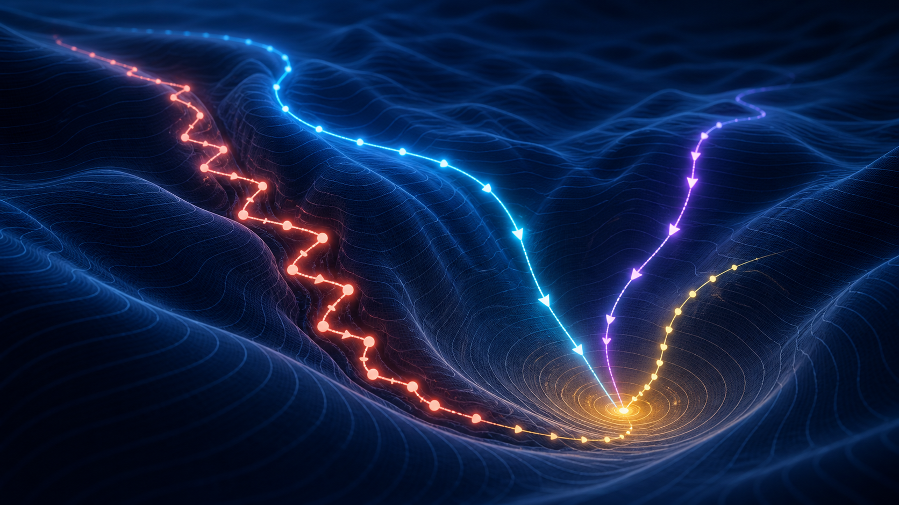{fig-alt="A dark three-dimensional loss landscape with coral, cyan, violet, and gold optimization trajectories descending through different terrain."}
:::

Backpropagation computes how the loss changes with every parameter. It does not decide what to do with that information. **Optimization is the rule that turns local gradient evidence into a trajectory through parameter space.**
:::

:::{.learning-objectives}
### By the end of this chapter, you should be able to {.unnumbered .unlisted}

1. Interpret a parameter setting as a point on a loss landscape.
2. Separate the direction and step-size decisions in gradient descent.
3. Explain failures caused by ravines, plateaus, noise, and curvature.
4. Derive classical momentum and explain Nesterov look-ahead.
5. Compare AdaGrad, RMSProp, and Adam by the state they store.
6. Distinguish stochastic, minibatch, and full-batch gradient regimes.
7. Diagnose training runs from aligned loss, learning-rate, and gradient traces.
:::

## From a model to a landscape

Consider the same two-parameter binary classifier used in the lecture:

$$
z=w_1x_1+w_2x_2,\qquad \hat y=\sigma(z),\qquad
\theta=\begin{bmatrix}w_1\\w_2\end{bmatrix}.
$$

Each choice of $(w_1,w_2)$ defines a complete classifier. It produces predictions on the training set and therefore receives one loss:

$$
(w_1,w_2)\longmapsto \mathcal L(w_1,w_2).
$$

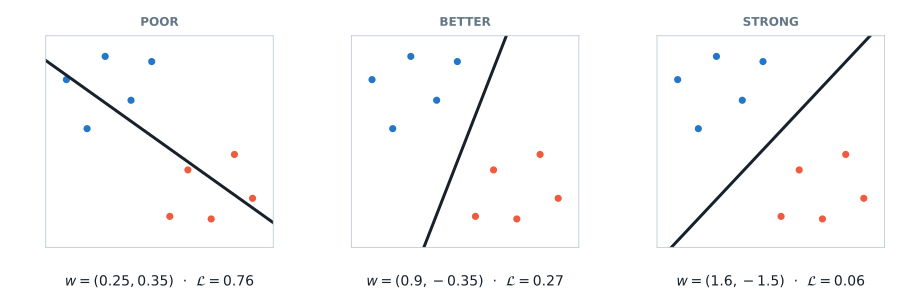{#fig-boundary-candidates width=100%}

A **loss landscape** is simply the loss evaluated across parameter settings. For two parameters we can draw it exactly as contours or height. A real network with $P$ parameters lives in $P$ dimensions; a published two-dimensional landscape is normally a slice through that space, not the complete object.

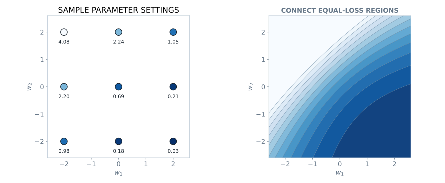{#fig-landscape-construction width=100%}

The optimizer never sees the complete map. At step $t$, it has the current parameters, a loss estimate, and a local gradient:

$$
\theta_t,\qquad \mathcal L(\theta_t),\qquad
g_t=\nabla_\theta\mathcal L(\theta_t).
$$

Its task is to choose the next point.

## Gradient descent: direction and distance

For the scalar loss

$$
\mathcal L(w)=(w-1)^2,\qquad w_t=3,
$$

the derivative is $\nabla_w\mathcal L(3)=4$. A positive derivative says that increasing $w$ raises the loss locally, so decreasing $w$ lowers it.

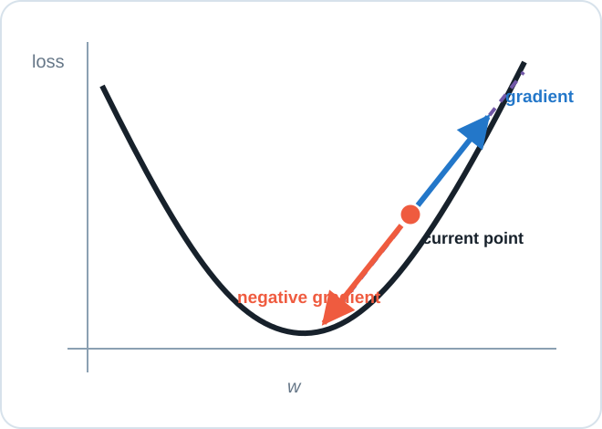{#fig-local-slope width=75%}

In several dimensions, the gradient is the direction of steepest infinitesimal increase under the usual Euclidean geometry. Gradient descent moves in the opposite direction:

$$
\boxed{\theta_{t+1}=\theta_t-\eta\nabla_\theta\mathcal L(\theta_t).}
$$ {#eq-gradient-descent}

This rule contains two decisions:

- $-\nabla_\theta\mathcal L$ chooses a **local direction**;
- the learning rate $\eta>0$ chooses the **distance** traveled.

The word *local* matters. The gradient predicts improvement for an infinitesimal move. A finite step can cross a valley and increase the loss.

### Practice: execute one update

Given

$$
\theta_t=\begin{bmatrix}0.25\\0.35\end{bmatrix},\qquad
g_t=\begin{bmatrix}0.40\\-0.20\end{bmatrix},\qquad \eta=0.5,
$$

compute $\theta_{t+1}$ and state how each parameter moves.

:::{.content-visible when-format="html"}

Show the worked solution

$$
\theta_{t+1}
=\begin{bmatrix}0.25\\0.35\end{bmatrix}
-0.5\begin{bmatrix}0.40\\-0.20\end{bmatrix}
=\begin{bmatrix}0.05\\0.45\end{bmatrix}.
$$

Thus $w_1$ decreases by $0.20$, while subtracting the negative second gradient increases $w_2$ by $0.10$.

:::

:::{.content-visible when-format="pdf"}
:::{.callout-note}
## Worked solution

$\theta_{t+1}=[0.05,0.45]^\top$. The first parameter decreases by $0.20$ and the second increases by $0.10$ because its gradient component is negative.
:::
:::

### Learning-rate regimes

The following paths use the same landscape, starting point, and update rule. Only $\eta$ changes.

:::{.content-visible when-format="html"}
:::{.columns}
:::{.column width="33%"}
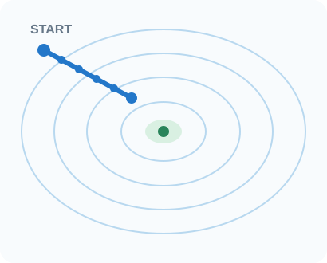{width=100%}
:::
:::{.column width="33%"}
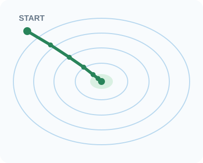{width=100%}
:::
:::{.column width="33%"}
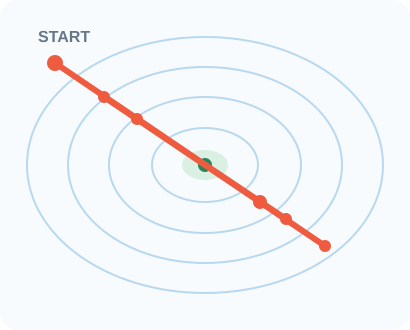{width=100%}
:::
:::
:::

:::{.content-visible when-format="pdf"}
{width=46%}
{width=46%}
{width=46%}
:::

Small is not *wrong*: it trades time for conservative movement. Large is not automatically *fast*: oscillation or divergence may prevent useful progress.

## Three gradient regimes

Let a training set contain $N$ examples and let $B_t$ be the examples used at update $t$.

| Regime | Batch size | Gradient | Main tradeoff |
|---|---:|---|---|
| Stochastic gradient descent | $|B_t|=1$ | one-example estimate | very noisy, very frequent updates |
| Minibatch SGD | $1<|B_t|<N$ | subset estimate | efficient parallel work with moderate noise |
| Full-batch gradient descent | $|B_t|=N$ | exact finite-dataset gradient | expensive updates, low sampling variation |

In deep learning, **SGD usually means minibatch SGD**, even though the strict stochastic case uses one example. The word *batch* is ambiguous; say *minibatch* or *full batch*.

The minibatch gradient

$$
g_t=\nabla_\theta\mathcal L_{B_t}(\theta_t)
$$

is an estimate of the full-training-set gradient. Different minibatches produce different estimates at the same parameter point.

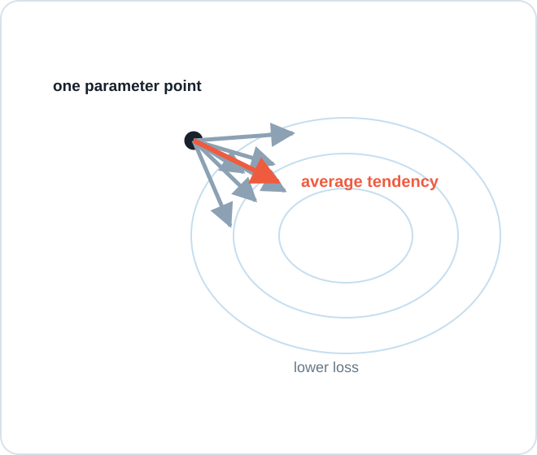{#fig-minibatch-noise width=70%}

Larger minibatches usually reduce gradient variance, but they cost more computation per update and change hardware and generalization tradeoffs. “Exact dataset gradient” also does not mean the unknown population gradient is known.

## Difficult terrain

### Ravines and unequal curvature

A ravine is steep across one direction and shallow along another. The across-valley gradient dominates, flips sign on the opposite wall, and produces a zig-zag.

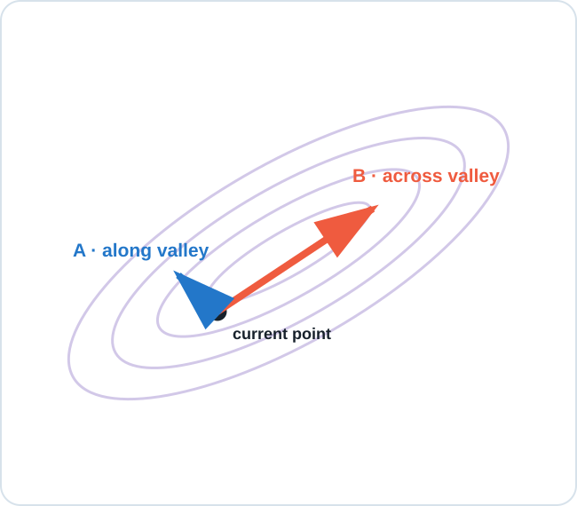{#fig-ravine-components width=72%}

Reducing $\eta$ suppresses bouncing, but also slows progress along the shallow direction. One scalar learning rate must compromise between incompatible scales.

### Plateaus and small gradients

A small gradient is not sufficient evidence that training has succeeded.

:::{.content-visible when-format="html"}
:::{.columns}
:::{.column width="50%"}
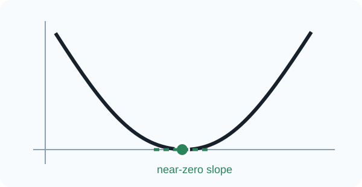{width=100%}
:::
:::{.column width="50%"}
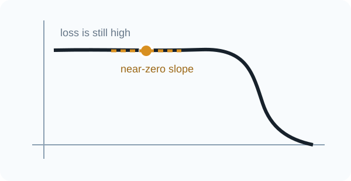{width=100%}
:::
:::
:::

:::{.content-visible when-format="pdf"}
{width=74%}

{width=74%}
:::

Use the loss level and recent trajectory together with $\lVert g_t\rVert$. In high-dimensional networks, saddle-like regions provide another reason for weak local gradients.

### Curvature changes the safe step

The same learning rate can be safe on a gentle quadratic and overshoot on a sharper one.

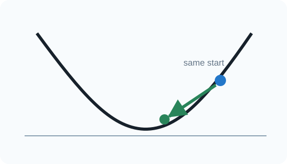{width=48%}
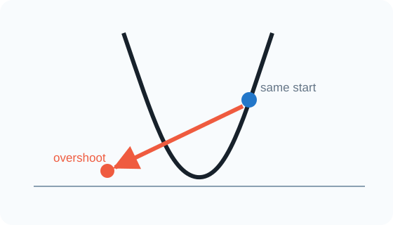{width=48%}

The practical conclusion is not that curvature must be computed exactly. It is that a useful step scale can differ across directions and change during training.

## Momentum: remember consistent directions

Plain gradient descent is memoryless. Classical momentum stores a running gradient direction:

$$
v_{t+1}=\beta v_t+g_t,\qquad
\theta_{t+1}=\theta_t-\eta v_{t+1},\qquad 0\leq\beta<1.
$$ {#eq-classical-momentum}

Consistent components reinforce; alternating components cancel. This is why momentum can damp ravine oscillation while accumulating progress along the valley.

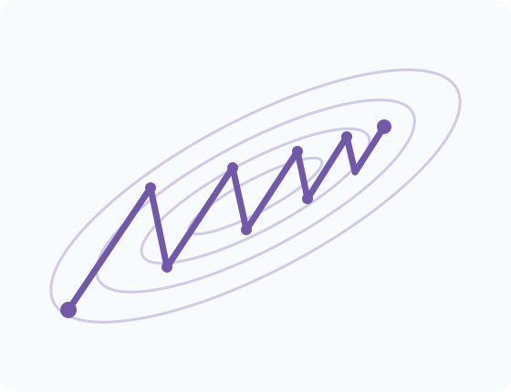{width=48%}
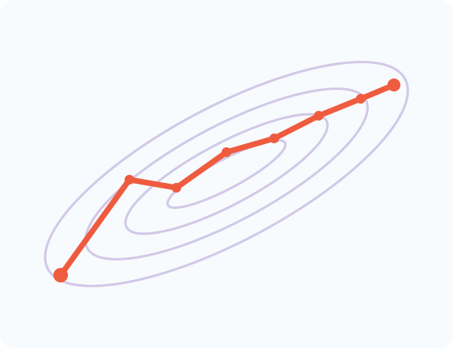{width=48%}

Larger $\beta$ preserves history longer. This smooths noise and strengthens persistence, but makes the optimizer slower to respond when the useful direction changes. Some references use

$$
v_{t+1}=\beta v_t+(1-\beta)g_t.
$$

The stored variable then has a different scale; the memory idea is unchanged.

### Practice: update momentum state

Let

$$
\theta_t=\begin{bmatrix}1.00\\-0.50\end{bmatrix},\quad
v_t=\begin{bmatrix}0.60\\-0.20\end{bmatrix},\quad
g_t=\begin{bmatrix}0.20\\0.40\end{bmatrix},\quad
\beta=0.9,\quad\eta=0.1.
$$

Compute $v_{t+1}$ and $\theta_{t+1}$.

:::{.content-visible when-format="html"}

Show the worked solution

$$
v_{t+1}=0.9v_t+g_t
=\begin{bmatrix}0.74\\0.22\end{bmatrix},\qquad
\theta_{t+1}=\theta_t-0.1v_{t+1}
=\begin{bmatrix}0.926\\-0.522\end{bmatrix}.
$$

:::

:::{.content-visible when-format="pdf"}
:::{.callout-note}
## Worked solution

$v_{t+1}=[0.74,0.22]^\top$, followed by $\theta_{t+1}=[0.926,-0.522]^\top$.
:::
:::

### Nesterov look-ahead

Nesterov momentum evaluates the new gradient where stored momentum is about to take the parameters:

$$
\theta_t^{\mathrm{look}}=\theta_t-\eta\beta v_t,
$$

$$
v_{t+1}=\beta v_t+\nabla\mathcal L(\theta_t^{\mathrm{look}}),\qquad
\theta_{t+1}=\theta_t-\eta v_{t+1}.
$$

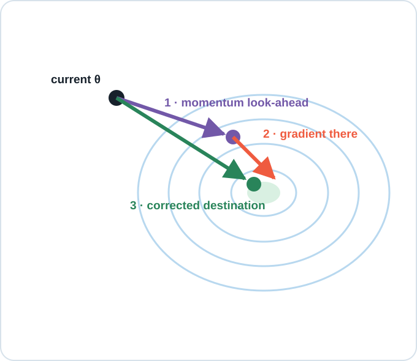{#fig-nesterov width=72%}

Equivalent formulas appear because implementations store and scale velocity differently. The conceptual distinction is stable: **look where momentum is taking you, then correct using evidence there**.

## Adaptive coordinate-wise scaling

Momentum remembers direction, but a global $\eta$ still scales every coordinate equally. Adaptive methods store a separate magnitude estimate for every parameter.

### AdaGrad

AdaGrad accumulates squared gradients [@duchi2011adagrad]:

$$
s_t=s_{t-1}+g_t\odot g_t,\qquad
\theta_{t+1}=\theta_t-
\frac{\eta}{\sqrt{s_t}+\varepsilon}\odot g_t.
$$

All operations are element-wise. Squaring removes sign because $s_t$ measures scale, not direction. Repeatedly large coordinates develop larger denominators and smaller effective steps.

AdaGrad’s strength is also its limitation: $s_t$ can only increase, so $\eta/\sqrt{s_t}$ can only decrease. Early large gradients can permanently suppress later updates.

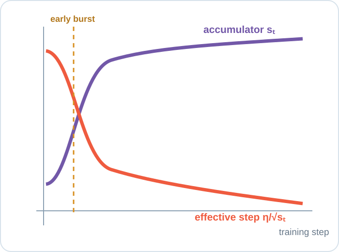{#fig-adagrad-decay width=75%}

### RMSProp

RMSProp replaces the permanent sum with an exponentially weighted moving average [@tieleman2012rmsprop]:

$$
s_t=\rho s_{t-1}+(1-\rho)g_t\odot g_t,\qquad
\theta_{t+1}=\theta_t-
\frac{\eta}{\sqrt{s_t}+\varepsilon}\odot g_t.
$$

Old squared gradients fade, allowing the coordinate scale to adapt when the recent regime changes.

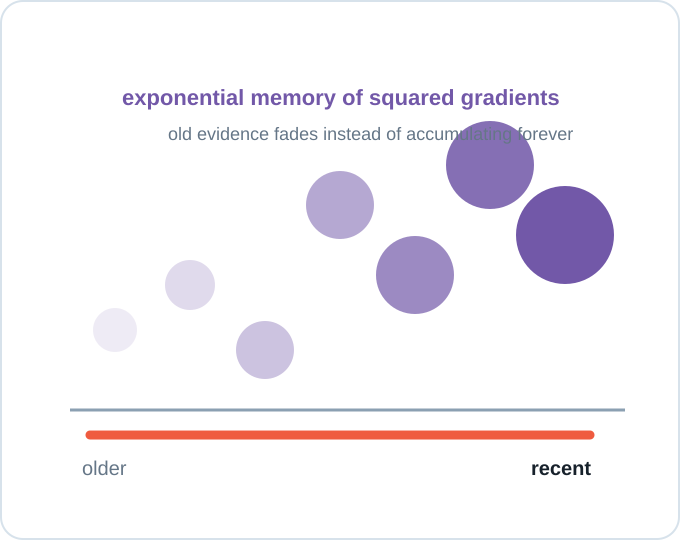{#fig-rmsprop-memory width=72%}

### Adam

Adam combines two exponential memories [@kingma2015adam]:

$$
m_t=\beta_1m_{t-1}+(1-\beta_1)g_t,\qquad
v_t=\beta_2v_{t-1}+(1-\beta_2)g_t^2.
$$

Here $m_t$ stores direction and $v_t$ stores squared-gradient scale. The symbol $v$ is overloaded: it is **not** the classical-momentum velocity used earlier. Because both states start at zero, Adam applies bias corrections

$$
\hat m_t=\frac{m_t}{1-\beta_1^t},\qquad
\hat v_t=\frac{v_t}{1-\beta_2^t},
$$

then updates

$$
\theta_{t+1}=\theta_t-\eta
\frac{\hat m_t}{\sqrt{\hat v_t}+\varepsilon}.
$$

| Optimizer | Direction memory | Scale memory | Main tradeoff |
|---|---|---|---|
| Gradient descent | none | none | simple, one global scale |
| Momentum | yes | none | steadier path, can overshoot turns |
| AdaGrad | none | all past squares | effective steps may decay too far |
| RMSProp | none | recent squares | adaptive scale without direction memory |
| Adam | yes | recent squares | convenient strong baseline with more state |

This table organizes information, not a universal ranking. Adam still requires a suitable learning rate and careful evaluation.

## Learning-rate schedules

A schedule changes the global learning rate over training while the optimizer defines how the current gradient and stored state become an update.

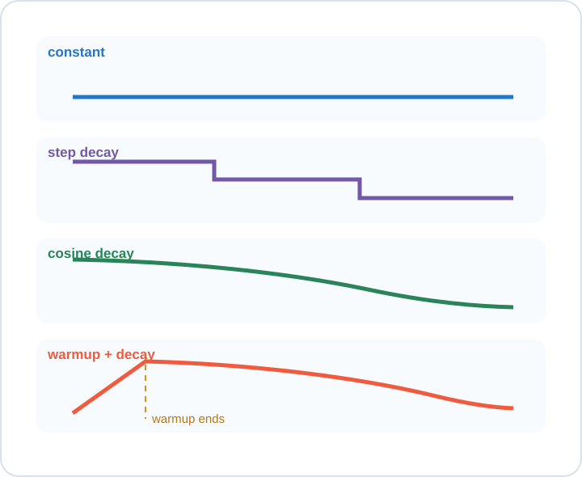{#fig-lr-schedules width=75%}

- **Constant:** useful for a controlled baseline.
- **Step decay:** reduces the rate at chosen milestones.
- **Cosine decay:** decreases smoothly toward a small final rate.
- **Warmup plus decay:** approaches the target rate gradually when early updates are fragile, then refines with decay.

No schedule is automatically best. The recurring rationale is coarse early movement followed by finer late adjustment.

## Read the training run

Training produces aligned traces. Interpret them together:

- training loss: is optimization improving its objective?
- validation loss: does improvement generalize?
- learning rate: what global step scale was applied?
- gradient norm: was the local signal weak, ordinary, or explosive?

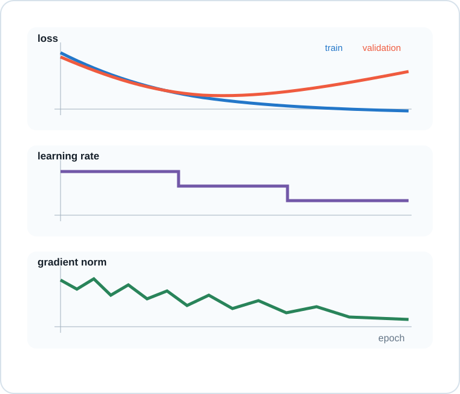{#fig-training-dashboard width=80%}

| Visible evidence | First hypothesis | Next controlled test |
|---|---|---|
| Loss decreases painfully slowly | step scale may be too small | increase $\eta$ modestly; hold other factors fixed |
| Loss oscillates or becomes non-finite | steps or gradients may be too large | lower $\eta$; inspect gradient norm and numerics |
| Loss is high and gradients are near zero | plateau, saturation, or dead path | inspect activations and initialization |
| Training improves while validation worsens | overfitting | retain best checkpoint; test regularization |

### Practice: optimization failure or overfitting?

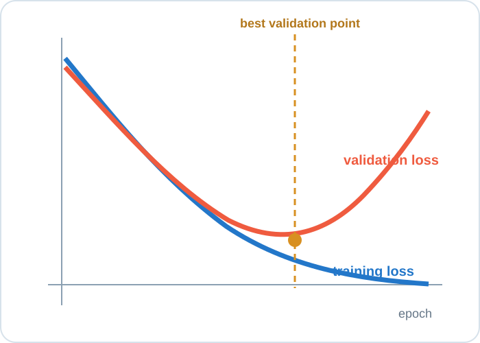{#fig-overfit-diagnosis width=72%}

Choose the best diagnosis: learning rate too small, learning rate too large, or overfitting.

:::{.content-visible when-format="html"}

Show the diagnosis

This is **overfitting**. Optimization continues to improve the training objective, while generalization worsens after the validation minimum. Keep the best validation checkpoint, then consider regularization, augmentation, more data, or earlier stopping.

:::

:::{.content-visible when-format="pdf"}
:::{.callout-note}
## Diagnosis

The primary symptom is overfitting: training loss falls while validation loss rises. Retain the best validation checkpoint and test a generalization intervention.
:::
:::

## A durable optimization routine

1. Establish a simple baseline with recorded hyperparameters and seeds.
2. Inspect aligned training, validation, learning-rate, and gradient traces.
3. Form a hypothesis from visible evidence.
4. Change one factor and rerun under comparable conditions.
5. Judge the result with held-out evaluation, not training loss alone.

Optimization sits inside the five-part learning frame:

$$
\text{data}\rightarrow\text{hypothesis}\rightarrow\text{loss}
\rightarrow\boxed{\text{optimization}}\rightarrow\text{evaluation}.
$$

An optimizer is not a magic model chooser. It is a rule for turning local evidence into a training trajectory.
