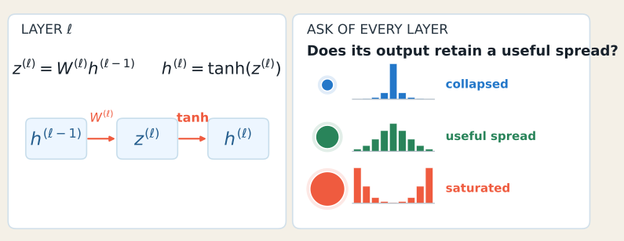
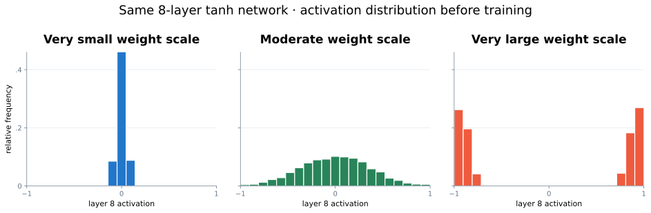
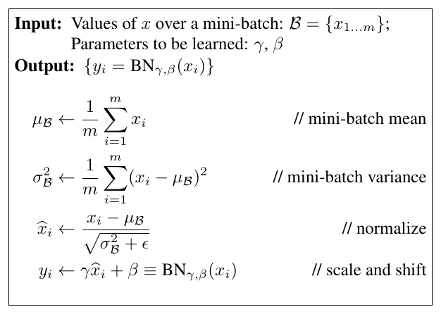

:::{.chapter-opening}
:::{.chapter-kicker}
PART III · OPTIMIZATION AND GENERALIZATION
:::

:::{.chapter-cover}
{fig-alt="A deep blue neural network receives turbulent colored signals, transforms them through stable hidden layers, and emits one controlled output."}
:::

A network can be expressive, differentiable, and paired with a good optimizer—and still train badly. **Reliable training is a systems problem:** signal scale, update scale, regularization, validation evidence, and the behavior of stochastic layers must agree.
:::

:::{.learning-objectives}
### By the end of this chapter, you should be able to {.unnumbered .unlisted}

1. Explain why initialization scale compounds through depth.
2. Derive Xavier and He variance rules from a preservation objective.
3. Distinguish BatchNorm's training and evaluation behavior.
4. Explain what regularization changes in the learning problem.
5. Derive inverted dropout scaling from an expectation constraint.
6. Implement dropout correctly with NumPy and an explicit mode switch.
7. Formalize early stopping with a best checkpoint, tolerance, and patience.
8. Combine these mechanisms into a coherent training recipe.
:::

## A concrete failure before the remedies

Consider a six-layer ReLU image classifier. The architecture is large enough to fit the training set, backpropagation is correct, and minibatch SGD reduces the training loss. Yet three symptoms appear:

- early activations collapse or explode as they cross the network;
- optimization is sensitive to the first few updates;
- training accuracy keeps rising after validation performance peaks.

These are not one problem. They involve different parts of the five-part learning frame:

| Observation | Part of the system | Question |
|---|---|---|
| Signals change scale with depth | hypothesis and parameterization | How should weights begin? |
| Hidden distributions drift during training | hypothesis and optimization | Can a layer control its input scale? |
| Training and validation diverge | evaluation | Which fitted solution should we prefer? |
| A stochastic layer changes predictions | hypothesis and evaluation | What must happen at evaluation time? |
| Validation progress ends before the budget | optimization and evaluation | Which checkpoint should we deploy? |

The rest of the chapter answers these questions one mechanism at a time.

## Initialization: preserve useful signal scale

### Why depth amplifies a local scaling mistake

For one linear unit with fan-in $n$,

$$
z=\sum_{i=1}^{n}w_i x_i.
$$

Assume initially that the inputs and weights are independent, centered, and identically distributed across coordinates. Then

$$
\operatorname{Var}(z)
=\sum_{i=1}^{n}\operatorname{Var}(w_i x_i)
=n\operatorname{Var}(w)\operatorname{Var}(x).
$$ {#eq-forward-variance}

The multiplier

$$
r=n\operatorname{Var}(w)
$$

controls the layer-to-layer scale. If $r<1$, repeated layers suppress signal; if $r>1$, they amplify it. In a simplified depth-$L$ linear chain,

$$
\operatorname{Var}(h^{(L)})\approx r^L\operatorname{Var}(x).
$$

A modest local mismatch therefore becomes an exponential depth effect.

{#fig-depth-rescaling width=90%}

The same reasoning applies backward. Gradients are multiplied by transposed weight matrices and activation derivatives. Initialization cannot guarantee perfect behavior, but it can avoid beginning in an obviously hostile scale regime.

### Xavier initialization

For activations that are approximately centered and symmetric, preserving forward variance suggests

$$
n_{\mathrm{in}}\operatorname{Var}(w)\approx 1.
$$

Preserving backward variance gives a corresponding condition involving $n_{\mathrm{out}}$. Glorot and Bengio compromise between the two [@glorot2010understanding]:

$$
\boxed{\operatorname{Var}(w)=\frac{2}{n_{\mathrm{in}}+n_{\mathrm{out}}}.}
$$ {#eq-xavier}

Common samplers with this variance are

$$
w\sim\mathcal N\!\left(0,\frac{2}{n_{\mathrm{in}}+n_{\mathrm{out}}}\right)
$$

or

$$
w\sim\mathcal U\!\left[-\sqrt{\frac{6}{n_{\mathrm{in}}+n_{\mathrm{out}}}},
\sqrt{\frac{6}{n_{\mathrm{in}}+n_{\mathrm{out}}}}\right].
$$

The distribution family is less important than the variance and its compatibility with the activation.

### He initialization for ReLU

ReLU removes the negative half of a symmetric pre-activation distribution. Under the usual approximation, this roughly halves the propagated second moment. Preserving scale therefore asks the weights to compensate by a factor of two [@he2015delving]:

$$
\boxed{\operatorname{Var}(w)=\frac{2}{n_{\mathrm{in}}}.}
$$ {#eq-he}

Equivalently,

$$
w\sim\mathcal N\!\left(0,\frac{2}{n_{\mathrm{in}}}\right),
\qquad \operatorname{Std}(w)=\sqrt{\frac{2}{n_{\mathrm{in}}}}.
$$

{#fig-init-histograms width=100%}

### Practical initialization decisions

| Activation or layer | Useful default | Reason |
|---|---|---|
| Linear or tanh-like hidden layer | Xavier/Glorot | balances fan-in and fan-out scale |
| ReLU or close relative | He/Kaiming | compensates for rectification |
| Bias | zero or a small task-motivated value | symmetry is already broken by random weights |
| Normalization scale $\gamma$ | one | begins as an identity scaling |
| Normalization shift $\beta$ | zero | begins without an offset |

These are defaults, not laws. Residual branches, gated networks, very deep architectures, and nonstandard activations may need specialized parameterizations.

### Practice: diagnose a variance multiplier

A ReLU network uses $n_{\mathrm{in}}=256$ and initializes weights with variance $1/256$.

1. What is the linear-layer multiplier $n_{\mathrm{in}}\operatorname{Var}(w)$?
2. After ReLU removes roughly half the second moment, what multiplier remains?
3. Which variance corrects it?

:::{.content-visible when-format="html"}
<details><summary>Show the worked solution</summary>

The linear multiplier is $256(1/256)=1$. After ReLU, the approximate multiplier is $1/2$, so signal shrinks with depth. Choosing $\operatorname{Var}(w)=2/256$ makes the post-ReLU multiplier approximately $(1/2)256(2/256)=1$.
</details>
:::

:::{.content-visible when-format="pdf"}
:::{.callout-note}
## Worked solution

The linear multiplier is $1$, but the approximate post-ReLU multiplier is $1/2$. He variance $2/256$ restores it to approximately $1$.
:::
:::

## Batch normalization: normalize, then learn the scale back

For one feature and a minibatch $B$ of size $m$, BatchNorm computes [@ioffe2015batch]

$$
\mu_B=\frac{1}{m}\sum_{i=1}^{m}x_i,
\qquad
\sigma_B^2=\frac{1}{m}\sum_{i=1}^{m}(x_i-\mu_B)^2,
$$

$$
\hat x_i=\frac{x_i-\mu_B}{\sqrt{\sigma_B^2+\varepsilon}},
\qquad
y_i=\gamma\hat x_i+\beta.
$$ {#eq-batchnorm}

Normalization controls the immediate location and scale. The learned $\gamma$ and $\beta$ preserve expressivity: the layer can recover a useful scale and offset instead of being forced to remain standardized.

{#fig-bn-algorithm width=72%}

### Training and evaluation are different programs

During training, BatchNorm uses the current minibatch statistics and updates running estimates:

$$
\mu_{\mathrm{run}}\leftarrow (1-\alpha)\mu_{\mathrm{run}}+\alpha\mu_B,
$$

$$
\sigma^2_{\mathrm{run}}\leftarrow
(1-\alpha)\sigma^2_{\mathrm{run}}+\alpha\sigma_B^2.
$$

During evaluation, it uses the stored running statistics:

$$
\hat x=\frac{x-\mu_{\mathrm{run}}}
{\sqrt{\sigma^2_{\mathrm{run}}+\varepsilon}}.
$$

This distinction has two consequences:

1. evaluation predictions should not depend on which other examples share the batch;
2. switching the whole model to evaluation mode is part of correctness, not an optional speed setting.

### Where BatchNorm is placed

A common block is

$$
z=W h+b,\qquad \tilde z=\operatorname{BN}(z),\qquad h'=\phi(\tilde z).
$$

When BatchNorm immediately follows a linear transformation, the bias $b$ is often redundant because BatchNorm subtracts a mean and supplies its own learned shift $\beta$.

### What BatchNorm helps—and what it does not prove

The original explanation emphasized reduced *internal covariate shift*. Later controlled experiments showed that artificially reintroducing distribution drift does not remove most of BatchNorm's optimization benefit. Santurkar et al. found evidence that BatchNorm smooths the optimization landscape and makes gradients more predictive [@santurkar2018how].

The careful conclusion is:

> BatchNorm often improves optimization, but stable activation distributions alone are not a complete causal explanation.

BatchNorm also has limitations:

- very small batches provide noisy statistics;
- train/eval state must be managed correctly;
- distributed training raises the question of whether statistics are local or synchronized;
- recurrent, sequence, and per-example settings may prefer normalization that does not depend on the batch.

Layer normalization normalizes features within each example [@ba2016layer], GroupNorm normalizes channel groups [@wu2018group], and RMSNorm controls root-mean-square scale without subtracting a mean [@zhang2019rmsnorm]. These alternatives are especially useful when reliable batch statistics are unavailable.

## Generalization: training fit does not choose the deployed model

An overparameterized classifier can fit the training set in many ways. Low training error alone does not identify which decision boundary will perform well on new examples. This is why memorization experiments are important: large networks can fit random labels even though those labels contain no useful population rule [@zhang2017understanding].

Regularization expresses a preference among solutions that fit the data. A common objective is

$$
\boxed{J(\theta)=\mathcal L_{\mathrm{data}}(\theta)+\lambda\Omega(\theta).}
$$ {#eq-regularized-objective}

The data term asks for fit. The penalty or training mechanism asks for a particular kind of solution.

| Mechanism | Where the preference enters | Typical effect |
|---|---|---|
| L2 penalty / weight decay | parameter update | discourages large weights |
| data augmentation | training distribution | asks predictions to respect transformations |
| dropout | hidden representation | prevents fixed co-adaptation paths |
| early stopping | checkpoint selection | limits how long the model adapts to training-specific detail |

### L2 regularization and weight decay

For SGD, adding

$$
\Omega(\theta)=\frac12\lVert\theta\rVert_2^2
$$

gives

$$
\theta_{t+1}
=\theta_t-\eta(\nabla\mathcal L(\theta_t)+\lambda\theta_t)
=(1-\eta\lambda)\theta_t-\eta\nabla\mathcal L(\theta_t).
$$

Thus L2 regularization and multiplicative weight decay coincide for plain SGD. They need not coincide for adaptive optimizers, where gradient coordinates are rescaled; decoupled weight decay applies shrinkage separately from that rescaling.

## Dropout: random subnetworks with preserved expectation

Let $p$ be the drop probability and $q=1-p$ the keep probability. For each activation $x_j$, sample

$$
m_j\sim\operatorname{Bernoulli}(q).
$$

Naive masking gives $m_jx_j$. Assuming the mask is independent of the activation,

$$
\mathbb E[m_jx_j]
=\mathbb E[m_j]\mathbb E[x_j]
=q\mathbb E[x_j].
$$

The expected activation has shrunk. Ask for a correction $c$ that preserves the mean:

$$
\mathbb E[c,m_jx_j]=\mathbb E[x_j].
$$

Because $\mathbb E[m_j]=q$,

$$
cq=1\quad\Longrightarrow\quad c=\frac1q.
$$

This produces **inverted dropout** [@srivastava2014dropout]:

$$
\boxed{y_j=\frac{m_jx_j}{q}\quad\text{during training}.}
$$ {#eq-inverted-dropout}

At evaluation time,

$$
\boxed{y_j=x_j.}
$$

No mask is sampled and no extra scaling is applied. The correction was already performed during training.

### A concrete mask

Take

$$
x=[2,4,6,8],\qquad p=0.5,qquad q=0.5,qquad m=[1,0,1,0].
$$

Then

$$
x\odot m=[2,0,6,0],
$$

and inverted scaling gives

$$
\frac{x\odot m}{q}=[4,0,12,0].
$$

The one realized vector is not equal to $x$. Preservation is an expectation statement across masks:

$$
\mathbb E_m\left[\frac{x\odot m}{q}\right]=x.
$$

### NumPy implementation

```{python}
import numpy as np

def dropout(x, p, training, rng):
    """Elementwise inverted dropout."""
    if not 0.0 <= p < 1.0:
        raise ValueError("p must be in [0, 1)")

    if not training or p == 0.0:
        return x

    q = 1.0 - p
    mask = rng.random(x.shape) < q
    return x * mask / q
```

Randomness is passed in rather than recreated inside the function. This makes experiments reproducible while still producing a new mask on every call.

Useful tests check properties rather than one arbitrary random outcome:

```{python}
rng = np.random.default_rng(7)
x = np.array([2.0, 4.0, 6.0, 8.0])

samples = np.stack([
    dropout(x, p=0.5, training=True, rng=rng)
    for _ in range(100_000)
])

assert np.allclose(samples.mean(axis=0), x, atol=0.1)
assert np.array_equal(dropout(x, 0.5, False, rng), x)
```

### Practice: repair unscaled dropout

A layer drops activations with probability $p=0.25$ but forgets inverted scaling.

1. What fraction of the expected activation remains?
2. What training-time scale repairs it?
3. What should evaluation do?

:::{.content-visible when-format="html"}
<details><summary>Show the worked solution</summary>

$q=1-p=0.75$, so naive masking preserves $75\%$ of the expected activation. Multiply retained activations by $1/q=4/3$ during training. Evaluation returns the activation unchanged and samples no mask.
</details>
:::

:::{.content-visible when-format="pdf"}
:::{.callout-note}
## Worked solution

$q=0.75$, the correction is $1/q=4/3$, and evaluation is the identity map.
:::
:::

## Early stopping: a validation-driven controller

Early stopping treats the validation trajectory as evidence for checkpoint selection rather than waiting for the training loss to stop decreasing [@prechelt1998early].

Let

$$
s_t=\mathcal L_{\mathrm{val}}(\theta_t)
$$

be the monitored validation loss at epoch $t$. Store the best score $s^*$, the corresponding parameters $\theta^*$, and a wait counter $w$.

An improvement with tolerance $\delta\ge0$ occurs when

$$
s_t<s^*-\delta.
$$

The controller is

$$
\begin{cases}
s^*\leftarrow s_t,\quad \theta^*\leftarrow\theta_t,\quad w\leftarrow0,
&\text{if improved},\\[3pt]
w\leftarrow w+1,&\text{otherwise}.
\end{cases}
$$

With patience $P$,

$$
w\ge P\quad\Longrightarrow\quad
\text{stop and restore }\theta^*.
$$

The distinction between **stop** and **keep the last state** is essential. Validation at the stopping epoch is normally worse than at the saved checkpoint.

```{python}
best_score = np.inf
best_weights = None
wait = 0

for epoch in range(max_epochs):
    train_one_epoch()
    score = validation_loss()

    if score < best_score - min_delta:
        best_score = score
        best_weights = copy_weights()
        wait = 0
    else:
        wait += 1

    if wait >= patience:
        break

restore_weights(best_weights)
```

Patience protects against noisy single-epoch reversals. It does not prove that no later improvement could occur. Validation data also remain model-selection data: repeatedly adapting decisions to the same validation set can itself overfit that set.

## Learning-rate schedules and warmup

Warmup raises the learning rate gradually over the first $W$ epochs:

$$
\eta_t=\eta_0\frac{t}{W},\qquad 0\le t<W.
$$

It limits destructive first updates while activations and optimizer state are settling. After warmup, a main schedule takes over.

| Schedule after warmup | Rule for $t\ge W$ | Shape |
|---|---|---|
| constant | $\eta_t=\eta_0$ | hold the peak rate |
| step decay | $\eta_t=\eta_0\gamma^{\lfloor(t-W)/S\rfloor}$ | discrete milestone drops |
| exponential | $\eta_t=\eta_0e^{-k(t-W)}$ | constant proportional decay |
| cosine | $\eta_t=\eta_{\min}+\frac{\eta_0-\eta_{\min}}2\left(1+\cos\frac{\pi(t-W)}{T-W}\right)$ | gentle start and landing |

Warmup and decay solve different timing problems. Warmup controls the dangerous beginning; decay reduces update noise as training approaches a useful solution.

## Integrated case study: one coherent recipe

Return to the six-layer ReLU image classifier.

1. **He initialization** matches the rectifying activation and preserves a useful starting scale.
2. **BatchNorm** controls intermediate scale and improves optimization predictability.
3. **Warmup followed by cosine decay** stabilizes early steps and later refinement.
4. **Weight decay and dropout** express preferences beyond training fit.
5. **Early stopping** selects and restores the best validation checkpoint.

These mechanisms are not interchangeable. Replacing poor initialization with stronger dropout does not repair the first forward pass. Early stopping does not stabilize an exploding gradient. BatchNorm does not decide which checkpoint generalizes best.

:::{.callout-important}
## Reliable training is compatibility

The goal is not to enable every available technique. Diagnose the failure mode, change the corresponding part of the system, and verify its effect with aligned training evidence.
:::

### Reproduce the comparison in PyTorch

The lecture's final loss curves were schematic. The accompanying experiment turns that claim into a testable ablation on Fashion-MNIST: it trains the same six-layer ReLU classifier with the same split, random seed, optimizer, and epoch budget while progressively adding He initialization, BatchNorm, dropout, and the complete controlled recipe.

[Download `compare_training_recipes.py`](../../lectures/05-training-reliably/compare_training_recipes.py){.btn .btn-primary download="compare_training_recipes.py"}

The five runs are:

1. deliberately poor initialization, without BatchNorm or dropout;
2. He initialization only;
3. He initialization with BatchNorm;
4. He initialization, BatchNorm, and dropout;
5. the complete recipe with weight decay, warmup, cosine decay, and early stopping.

If an existing uv environment already contains PyTorch, TorchVision, Matplotlib, and NumPy, invoke its interpreter directly:

```bash
/path/to/existing/.venv/bin/python compare_training_recipes.py --quick
```

Alternatively, point uv to that environment while running from the `quarto-site` directory:

```bash
UV_PROJECT_ENVIRONMENT=/path/to/existing/.venv \
  uv run python lectures/05-training-reliably/compare_training_recipes.py --quick
```

Remove `--quick` for the full 30-epoch experiment, or choose another budget:

```bash
/path/to/existing/.venv/bin/python compare_training_recipes.py --epochs 40
```

The program writes `training-results/training_comparison.png` and the underlying epoch-level measurements to `training-results/training_comparison.csv`. The plot uses a logarithmic loss axis so an unstable baseline does not flatten the controlled curves visually.

:::{.callout-tip}
## Read this as an ablation, not a leaderboard

Compare adjacent curves to ask what changed. Dropout can make *training* loss decrease more slowly while improving *validation* loss; that is regularization doing its job, not an optimization failure. Because BatchNorm and dropout have different training and evaluation behavior, the script calls `model.train()` during updates and `model.eval()` during validation.
:::

### A practical diagnostic checklist

Before a long run, verify:

- activation and gradient distributions remain finite across depth;
- the initialization matches the activation family;
- every stateful or stochastic layer has explicit train/eval behavior;
- training and validation metrics are logged on aligned epochs;
- the best checkpoint is saved independently of the last checkpoint;
- random number generators and seeds are controlled where reproducibility matters;
- the learning-rate trace is logged, not inferred from configuration;
- regularization strength is selected using validation evidence rather than training loss.

## Further directions

Several modern tools extend the same control panel without changing the conceptual foundation:

- **Sharpness-aware minimization** optimizes loss in a neighborhood of the current weights and can improve generalization, at additional computational cost [@foret2021sam].
- **Lion** is a sign-based momentum optimizer with one state tensor per parameter, but it requires learning-rate and weight-decay retuning [@chen2023lion].
- **Schedule-free optimization** combines optimization and iterate averaging without requiring a predetermined stopping horizon [@defazio2024schedulefree].
- **Mixed precision** reduces memory traffic and arithmetic cost while protecting sensitive quantities with higher precision [@micikevicius2018mixed].
- **Activation checkpointing** trades recomputation for lower activation memory [@chen2016sublinear].
- **Gradient accumulation** adds gradients over micro-batches before one optimizer step, increasing effective batch size without storing the full batch at once.

These are directions for later implementation work, not universal upgrades. First identify whether the bottleneck is optimization, generalization, memory, numerical range, or throughput.

## Chapter summary

1. Initialization is a scale choice whose effect compounds through depth.
2. Xavier balances fan-in and fan-out; He compensates for ReLU rectification.
3. BatchNorm learns an affine transformation after normalization and uses different statistics in training and evaluation.
4. Regularization adds a preference among fitting solutions.
5. Inverted dropout divides retained activations by $q=1-p$ during training so evaluation can be the identity.
6. Early stopping stores the best validation checkpoint and restores it after patience is exhausted.
7. Warmup and decay control different phases of the update trajectory.
8. Reliable training comes from compatible choices supported by diagnostic evidence.
