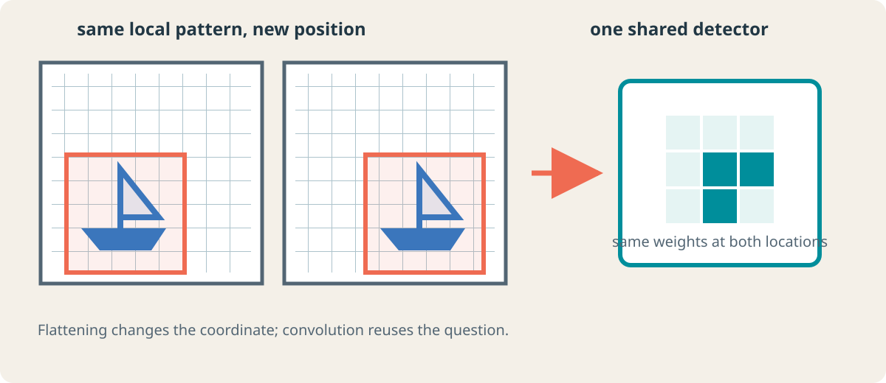
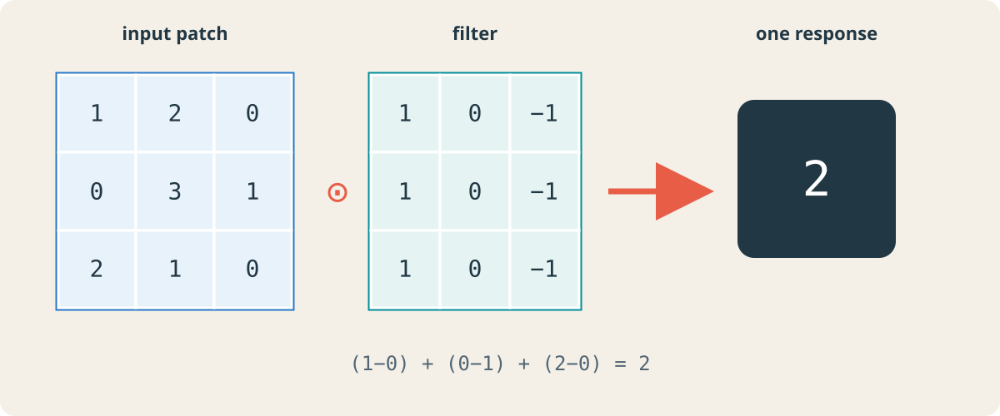
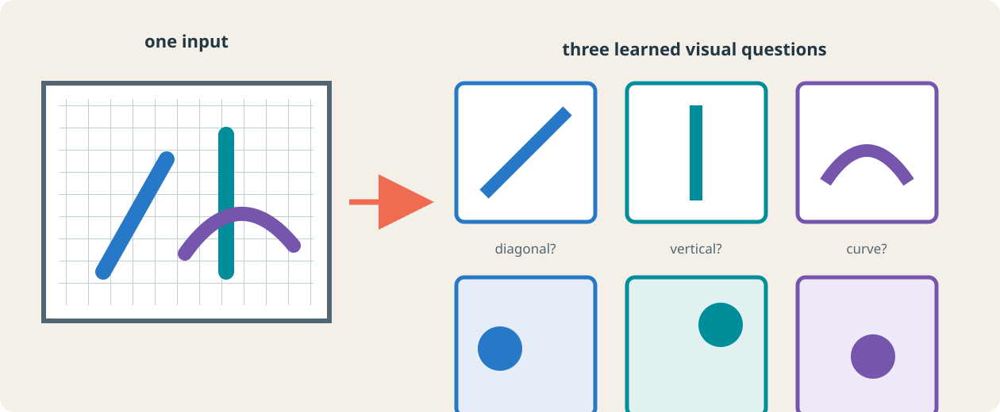
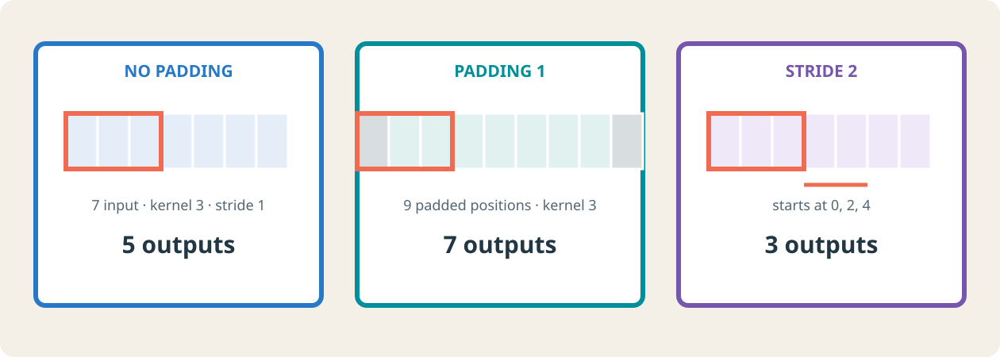
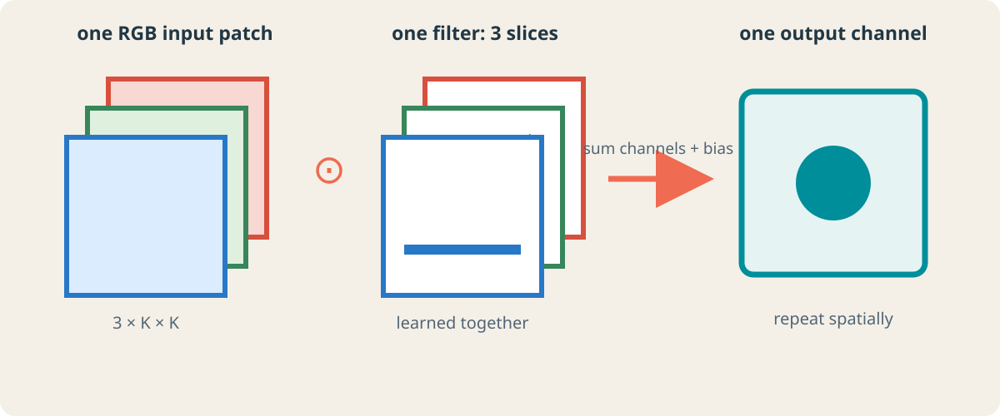
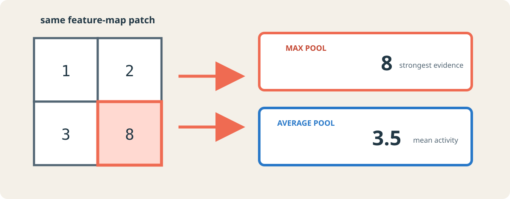
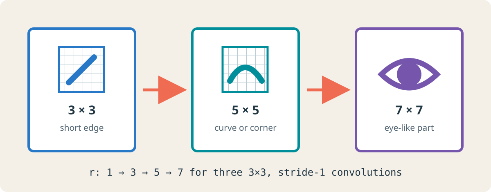
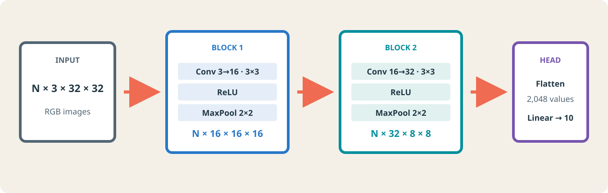

:::{.chapter-opening}
:::{.chapter-kicker}
PART V · LEARNING FROM IMAGES
:::

:::{.chapter-cover}
{fig-alt="A dark visual pipeline from a local image grid through shared responses to an eye-like composed feature."}
:::

An image classifier should recognize a boat whether it appears on the left or right of the image. A fully connected network *can* learn both cases, but its architecture gives it no reason to reuse the same detector at both locations. **A convolutional neural network builds that reuse into the hypothesis:** it applies one learned local operation across the spatial grid, then composes the resulting evidence across depth.
:::

:::{.learning-objectives}
### By the end of this chapter, you should be able to {.unnumbered .unlisted}

1. Explain why image structure motivates local connectivity and shared weights.
2. Compute one convolution response and an entire output shape.
3. Distinguish spatial dimensions from channel dimensions.
4. Count the parameters in a convolutional layer.
5. Explain what max, average, and global average pooling preserve and discard.
6. Calculate a theoretical receptive field through convolution and pooling.
7. Translate a tensor-shape argument into a complete PyTorch CNN.
8. Read a printed PyTorch model as a sequence of representation changes.
:::

# The concrete problem: classify an object wherever it appears

Suppose an RGB image has shape `(3, 32, 32)`. Flattening turns it into a vector of length $3\cdot32\cdot32=3072$. A dense hidden unit then learns an independent weight for every channel and position:

$$
h_j=\phi\!\left(\sum_{c=1}^{3}\sum_{u=1}^{32}\sum_{v=1}^{32}
W_{j,c,u,v}x_{c,u,v}+b_j\right).
$$

If the unit learns that a particular arrangement of pixels at the upper left is useful, nothing in this parameterization says that the same arrangement at the lower right should use the same weights. The network may learn that relation from data, but it pays separately for every position.

Convolution introduces three linked design choices:

| Observation about images | Architectural choice | Consequence |
|---|---|---|
| Nearby pixels often form useful small patterns | Local connectivity | One unit reads a small patch rather than the full image. |
| The same pattern may appear in many locations | Shared weights | One filter is reused across the image. |
| Useful patterns differ | Multiple learned filters | A layer produces multiple feature maps. |

{#fig-spatial-reuse fig-alt="Two grid images contain the same boat at different positions and point to one shared local detector." width=100%}

These are inductive biases, not guarantees. Convolution is exactly equivariant to translations only under compatible boundary and sampling conditions; pooling, stride, padding, and later aggregation modify that behavior. Biological studies of local receptive fields helped establish a language for hierarchical visual processing [@hubel1962receptive]. The engineering path to trainable systems includes the neocognitron [@fukushima1980neocognitron] and gradient-trained convolutional networks for document recognition [@lecun1998gradient]. Modern large-scale recognition made the same principles visible at a different scale [@krizhevsky2012imagenet].

## Parameter efficiency is a consequence, not the primary definition

A dense map from 3,072 inputs to 64 hidden units owns

$$
64(3072+1)=196{,}672
$$

parameters. A convolution with 64 filters of size $3\times3$ over three input channels owns

$$
64(3\cdot3\cdot3+1)=1{,}792.
$$

The convolution is cheaper because it is a different hypothesis: each output reads locally, and the same local weights are shared at every position. Fewer parameters are useful, but the spatial reuse is the central idea.

# The convolution operation

## One patch produces one number

For a single-channel image $X$ and a $K_h\times K_w$ filter $W$, a valid cross-correlation response at output position $(i,j)$ is

$$
Y_{i,j}=b+\sum_{a=0}^{K_h-1}\sum_{b'=0}^{K_w-1}
W_{a,b'}X_{i+a,j+b'}.
$$

Deep-learning libraries commonly call this operation *convolution* even though the filter is not reversed as it is in the mathematical definition of discrete convolution. Because the weights are learned, the distinction does not reduce model expressivity, but it matters when comparing formulas.

{#fig-convolution-worked fig-alt="A worked convolution: input patch times a three by three filter produces the scalar value two." width=100%}

In @fig-convolution-worked, the filter gives positive weight to the left column, zero to the center, and negative weight to the right. Its response is large when intensities change across that direction. The same nine weights are then moved to the next input location.

:::{.callout-important}
## What is learned?

The model does not normally receive a hand-designed edge filter. Training adjusts every filter coefficient and bias by gradient descent. Edge-like or color-contrast filters often emerge in early layers because they are useful for the classification loss, not because the architecture labels them as edges [@krizhevsky2012imagenet; @zeiler2014visualizing].
:::

## Sliding creates a feature map

At every legal spatial position:

1. select the local input patch;
2. multiply it elementwise by the same filter;
3. sum the products and add the bias;
4. store the scalar at the corresponding output position.

The grid of responses is a **feature map**. It preserves *where* the learned pattern matched. Bright or large activations do not mean that a complete object has been found; they mean that the filter's current numerical pattern matched strongly at those positions.

{#fig-feature-map-bank fig-alt="An input containing diagonal, vertical, and curved structures produces three distinct feature maps from three filters." width=100%}

In @fig-feature-map-bank, the colored dots mark strong responses, not categorical decisions. A real learned filter is numerical and generally responds by degree. The output channel count is three because the layer contains three filters.

## Convolution is a linear operation; activation supplies nonlinearity

Before an activation function, convolution is linear in its input. A typical block therefore separates two roles:

```python
block = nn.Sequential(
    nn.Conv2d(3, 16, kernel_size=3, padding=1),
    nn.ReLU(),
)
```

`Conv2d` learns local affine detectors. `ReLU` applies $\max(0,z)$ independently to every response. ReLU does not change `(N, C, H, W)` and owns no parameters, but without nonlinearities a stack of convolutions would collapse into one linear transformation away from boundary effects.

# Output geometry: shape, padding, and stride

## Count filter starts, not input pixels

For one spatial dimension with input size $W$, kernel size $K$, zero-padding $P$, dilation $D$, and stride $S$, the output width is

$$
W_{\mathrm{out}}
=
\left\lfloor
\frac{W+2P-D(K-1)-1}{S}+1
\right\rfloor.
$$

With dilation one this becomes

$$
W_{\mathrm{out}}
=
\left\lfloor\frac{W+2P-K}{S}\right\rfloor+1.
$$

The formula answers a concrete counting question: after padding, how many kernel starting positions fit if starts are separated by $S$ pixels?

### Worked shape decision

Let an input be `(N, 3, 32, 32)` and choose 16 filters with $K=3$, $P=1$, and $S=1$.

$$
H_{\mathrm{out}}=W_{\mathrm{out}}
=\left\lfloor\frac{32+2-3}{1}\right\rfloor+1=32.
$$

The output is `(N, 16, 32, 32)`. Padding preserved spatial size; the number of filters set the output-channel count.

### What each control means

- **Kernel size** controls the local window used by one output.
- **Padding** controls access to the image boundary and often preserves resolution.
- **Stride** controls the spacing between filter starts and therefore subsampling.
- **Dilation** spaces the kernel taps apart, increasing their span without adding coefficients.

{#fig-geometry-controls fig-alt="Three one-dimensional convolution diagrams compare no padding, padding one, and stride two." width=100%}

The three cases in @fig-geometry-controls isolate one control at a time. This is more reliable than memorizing that convolution “shrinks” or that padding “keeps size”: use the legal starting positions for the exact configuration.

:::{.callout-warning}
## “Same padding” is a design intention, not one universal integer

For an odd kernel, stride one, and dilation one, $P=(K-1)/2$ preserves size. With even kernels, larger strides, or dilation, the required padding may be asymmetric or depend on the framework's convention. Predict the desired output, then verify the exact API behavior.
:::

## Exercise: predict before executing

An input has shape `(N, 8, 15, 21)`. A convolution uses 20 filters, a $5\times3$ kernel, padding `(2, 1)`, and stride `(2, 1)`.

1. Compute the output height.
2. Compute the output width.
3. State the full output shape.

<details>
<summary>Worked solution</summary>

For height, $H=15$, $K_h=5$, $P_h=2$, and $S_h=2$:

$$
H_{\mathrm{out}}=\left\lfloor\frac{15+4-5}{2}\right\rfloor+1=8.
$$

For width, $W=21$, $K_w=3$, $P_w=1$, and $S_w=1$:

$$
W_{\mathrm{out}}=\left\lfloor\frac{21+2-3}{1}\right\rfloor+1=21.
$$

Twenty filters create twenty output channels, so the output is `(N, 20, 8, 21)`.
</details>

# Channels and feature maps

## A filter spans every input channel

For input shape `(N, C_in, H, W)`, one two-dimensional convolution filter has shape

$$
(C_{\mathrm{in}}, K_h, K_w).
$$

It receives a local patch from **all** input channels, multiplies each channel slice by its own weights, sums across channels and space, and produces one scalar. A bank of $C_{\mathrm{out}}$ filters produces $C_{\mathrm{out}}$ feature maps.

{#fig-channel-mixing fig-alt="Red, green, and blue image patches meet three filter slices and combine into one output response." width=100%}

The complete weight tensor therefore has shape

$$
(C_{\mathrm{out}}, C_{\mathrm{in}}, K_h, K_w).
$$

For a standard convolution with one bias per output channel, the learnable parameter count is

$$
C_{\mathrm{out}}\left(C_{\mathrm{in}}K_hK_w+1\right).
$$

Notice what does **not** appear: input height and width. Increasing image resolution creates more filter applications, but it does not create more shared filter coefficients.

## Worked parameter count

```python
conv = nn.Conv2d(
    in_channels=3,
    out_channels=16,
    kernel_size=3,
    padding=1,
)
```

Each of the 16 filters contains $3\cdot3\cdot3=27$ weights and one bias:

$$
16(27+1)=448.
$$

The layer maps `(N, 3, H, W)` to `(N, 16, H, W)` because padding one preserves spatial size.

:::{.callout-note}
## Keep two channel rules separate

- `in_channels` determines the depth of every filter.
- `out_channels` determines how many distinct filters—and therefore feature maps—the layer learns.
:::

# Pooling: deciding what spatial detail to keep

Pooling summarizes local responses independently in each channel. It normally owns no learned weights and does not mix channels.

## Max and average pooling ask different questions

For the patch

$$
\begin{bmatrix}1&2\\3&8\end{bmatrix},
$$

max pooling returns $8$: “Was there a strong detection in this window?” Average pooling returns $3.5$: “How active was this window on average?” Neither summary is universally best.

{#fig-pooling-comparison fig-alt="A two by two patch containing one, two, three, and eight branches to max and average pooling outputs." width=100%}

With a $2\times2$ kernel and stride two, an even spatial dimension is halved:

```python
pool = nn.MaxPool2d(kernel_size=2, stride=2)

x = torch.randn(64, 16, 32, 32)
y = pool(x)
print(y.shape)  # torch.Size([64, 16, 16, 16])
```

The batch size and channel count are unchanged. Spatial precision is reduced, which lowers the cost of later layers but discards exact location information.

## Global average pooling

Global average pooling replaces every $H\times W$ feature map by one mean:

$$
z_c=\frac{1}{HW}\sum_{i=1}^{H}\sum_{j=1}^{W}X_{c,i,j}.
$$

Thus `(N, C, H, W)` becomes `(N, C, 1, 1)`, or `(N, C)` after flattening. This produces a compact classifier input and avoids a large dense layer tied to one fixed spatial resolution.

```python
gap = nn.AdaptiveAvgPool2d(output_size=(1, 1))
```

“Adaptive” means the module chooses the pooling regions needed to reach the requested output size. It does not mean that the pooling operation learns parameters.

# Receptive fields and feature composition

## Depth expands what one unit can use

The **theoretical receptive field** of a unit is the region of the original input that can influence it. A first-layer $3\times3$ unit can use only a small patch. A later unit combines nearby earlier responses, so its input footprint is larger.

{#fig-receptive-fields fig-alt="Three cards show a short edge with a three by three receptive field, a curve with five by five, and an eye-like part with seven by seven." width=100%}

@fig-receptive-fields shows a possible learned hierarchy, not a fixed dictionary. Depth gives later units the *capacity* to combine evidence over a larger region; the data and optimization determine which features are actually learned. Visualizations of trained networks provide empirical examples of such hierarchies [@zeiler2014visualizing], while representation-learning reviews discuss why distributed features need not correspond to one clean human concept per unit [@bengio2013representation].

## General receptive-field recurrence

Track two quantities at layer $\ell$:

- $r_\ell$: receptive-field size measured in input pixels;
- $j_\ell$: the input-space jump between adjacent outputs.

Starting with $r_0=j_0=1$, a layer with kernel $k_\ell$, stride $s_\ell$, and dilation $d_\ell$ obeys

$$
j_\ell=j_{\ell-1}s_\ell,
$$

$$
r_\ell=r_{\ell-1}+(k_\ell-1)d_\ell j_{\ell-1}.
$$

Padding changes the alignment and boundary coverage, but not this theoretical field size.

### Convolution, pooling, convolution

Consider `Conv3(stride=1) → Pool2(stride=2) → Conv3(stride=1)`:

| Operation | $j$ | $r$ | Interpretation |
|---|---:|---:|---|
| input | 1 | 1 | one pixel |
| Conv $3\times3$, stride 1 | 1 | 3 | neighboring outputs are one input pixel apart |
| Pool $2\times2$, stride 2 | 2 | 4 | adjacent pooled outputs jump two input pixels |
| Conv $3\times3$, stride 1 | 2 | 8 | three positions spaced by two span eight input pixels |

Pooling grows the receptive field and increases the jump. The next convolution therefore expands its field faster in input coordinates.

:::{.callout-important}
## Theoretical is not effective

The theoretical field identifies which pixels *can* influence a unit. Their actual influence is generally uneven. Luo et al. showed that the effective receptive field often occupies only part of the theoretical field and tends to concentrate near its center [@luo2016effective]. Do not interpret every pixel inside the theoretical boundary as equally important.
:::

# From shape reasoning to a PyTorch classifier

We now build a classifier for RGB images of shape `(N, 3, 32, 32)`. Each convolution uses a $3\times3$ kernel with padding one; each max pool halves the spatial size.

{#fig-cnn-pipeline fig-alt="A shape pipeline from N by 3 by 32 by 32 through two convolutional blocks to ten class scores." width=100%}

## Declare the modules

```python
import torch
from torch import nn


class SmallCNN(nn.Module):
    def __init__(self, num_classes=10):
        super().__init__()

        self.features = nn.Sequential(
            nn.Conv2d(3, 16, kernel_size=3, padding=1),
            nn.ReLU(),
            nn.MaxPool2d(kernel_size=2),
            nn.Conv2d(16, 32, kernel_size=3, padding=1),
            nn.ReLU(),
            nn.MaxPool2d(kernel_size=2),
        )

        self.classifier = nn.Linear(32 * 8 * 8, num_classes)

    def forward(self, x):
        x = self.features(x)
        x = torch.flatten(x, start_dim=1)
        return self.classifier(x)
```

The number `32 * 8 * 8` is not discovered by trial and error. It follows from the shape contract in @fig-cnn-pipeline:

$$
32\times32\xrightarrow{\text{pool}}16\times16
\xrightarrow{\text{pool}}8\times8.
$$

The second block produces 32 channels, hence $32\cdot8\cdot8=2048$ features per image.

`torch.flatten(x, start_dim=1)` preserves dimension zero, the batch. Flattening from dimension zero would merge examples and break the classifier interface.

## Verify without replacing the argument

```python
model = SmallCNN()
x = torch.randn(64, 3, 32, 32)
logits = model(x)

print(logits.shape)
# torch.Size([64, 10])
```

A synthetic batch is an inexpensive interface test. It confirms the calculation, but should not replace it: when a shape is wrong, the calculation tells you which operation changed it unexpectedly.

## Read the printed model

```text
SmallCNN(
  (features): Sequential(
    (0): Conv2d(3, 16, kernel_size=(3, 3), padding=(1, 1))
    (1): ReLU()
    (2): MaxPool2d(kernel_size=2, stride=2)
    (3): Conv2d(16, 32, kernel_size=(3, 3), padding=(1, 1))
    (4): ReLU()
    (5): MaxPool2d(kernel_size=2, stride=2)
  )
  (classifier): Linear(in_features=2048, out_features=10)
)
```

The representation exposes ownership and composition:

- `features` owns an ordered chain of spatial operations;
- indices `(0)` through `(5)` are child modules inside that `Sequential`;
- convolution and linear layers own parameters;
- ReLU and max pooling own no learned parameters;
- the printed structure does not show intermediate tensor shapes, so those must still be reasoned about or inspected during execution.

## Parameter audit

| Layer | Calculation | Parameters |
|---|---:|---:|
| Conv 1, $3\to16$, $3\times3$ | $16(3\cdot3\cdot3+1)$ | 448 |
| Conv 2, $16\to32$, $3\times3$ | $32(16\cdot3\cdot3+1)$ | 4,640 |
| Linear, $2048\to10$ | $10(2048+1)$ | 20,490 |
| **Total** | | **25,578** |

The small classifier head owns most of the parameters. Replacing flattening with global average pooling would reduce the classifier input from 2,048 to 32, but it would also discard spatial layout. That is an architectural trade, not an automatic improvement.

## Exercise: design a resolution-independent head

Modify `SmallCNN` so it can accept different input heights and widths. Preserve 32 channels after the feature extractor and produce ten logits.

<details>
<summary>Worked solution</summary>

```python
class FlexibleCNN(nn.Module):
    def __init__(self, num_classes=10):
        super().__init__()
        self.features = nn.Sequential(
            nn.Conv2d(3, 16, 3, padding=1),
            nn.ReLU(),
            nn.MaxPool2d(2),
            nn.Conv2d(16, 32, 3, padding=1),
            nn.ReLU(),
            nn.MaxPool2d(2),
        )
        self.pool = nn.AdaptiveAvgPool2d((1, 1))
        self.classifier = nn.Linear(32, num_classes)

    def forward(self, x):
        x = self.features(x)
        x = self.pool(x)
        x = torch.flatten(x, start_dim=1)
        return self.classifier(x)
```

Adaptive global pooling turns any remaining spatial grid into one value per channel. The classifier therefore always receives 32 features. The tradeoff is that exact spatial arrangement is removed before classification.
</details>

# AlexNet as a reading exercise

AlexNet contains five convolutional layers followed by three learned classifier layers and uses ReLU activations and max pooling [@krizhevsky2012imagenet]. Its historical scale and GPU-specific split make the original diagram visually dense, but it is written in the same language developed here:

1. track `(N, C, H, W)`;
2. identify kernel, padding, and stride;
3. separate learned operations from parameter-free transformations;
4. locate the transition from spatial maps to a feature vector;
5. compute the classifier input from the final feature shape.

The durable skill is not memorizing one architecture. It is being able to reconstruct the representation change performed by any listed sequence of convolution, activation, pooling, flattening, and linear layers.

# Summary checklist

When reading or designing a CNN, ask:

1. **Data:** What do the channel and spatial axes mean?
2. **Hypothesis:** Which filters are shared, and where are nonlinearities placed?
3. **Geometry:** What are `(C, H, W)` after every operation?
4. **Parameters:** Which modules own weights, and how many?
5. **Information:** What does pooling preserve, and what does it discard?
6. **Context:** How large is each unit's receptive field in input pixels?
7. **Classifier:** Where does the spatial representation become a vector or global summary?
8. **Evaluation:** Does the output provide one raw score per class for every example?

# Further reading {.unnumbered}

- LeCun et al. give the classic end-to-end account of gradient-trained convolutional systems for document recognition [@lecun1998gradient].
- Krizhevsky, Sutskever, and Hinton show the large-scale ImageNet case that motivated the lecture's final reading exercise [@krizhevsky2012imagenet].
- Zeiler and Fergus develop visual tools for inspecting what intermediate convolutional features respond to [@zeiler2014visualizing].
- Luo et al. distinguish theoretical from effective receptive fields [@luo2016effective].
- The official [PyTorch `Conv2d` documentation](https://docs.pytorch.org/docs/stable/generated/torch.nn.Conv2d.html), [`MaxPool2d` documentation](https://docs.pytorch.org/docs/stable/generated/torch.nn.MaxPool2d.html), and [`AdaptiveAvgPool2d` documentation](https://docs.pytorch.org/docs/stable/generated/torch.nn.AdaptiveAvgPool2d.html) define the exact executable contracts used here.
