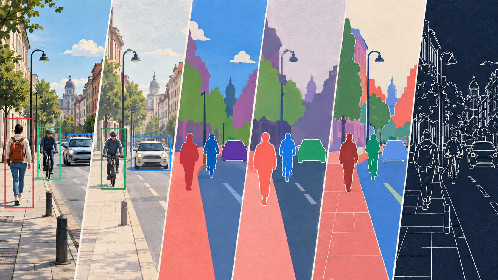
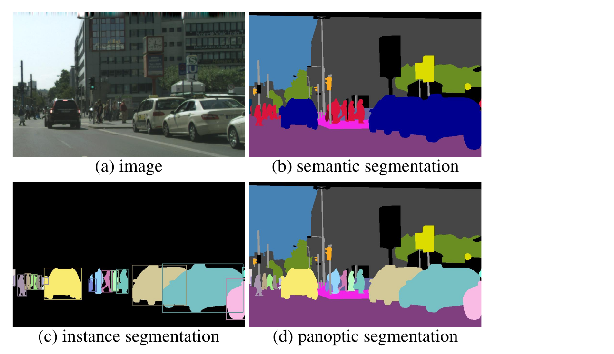
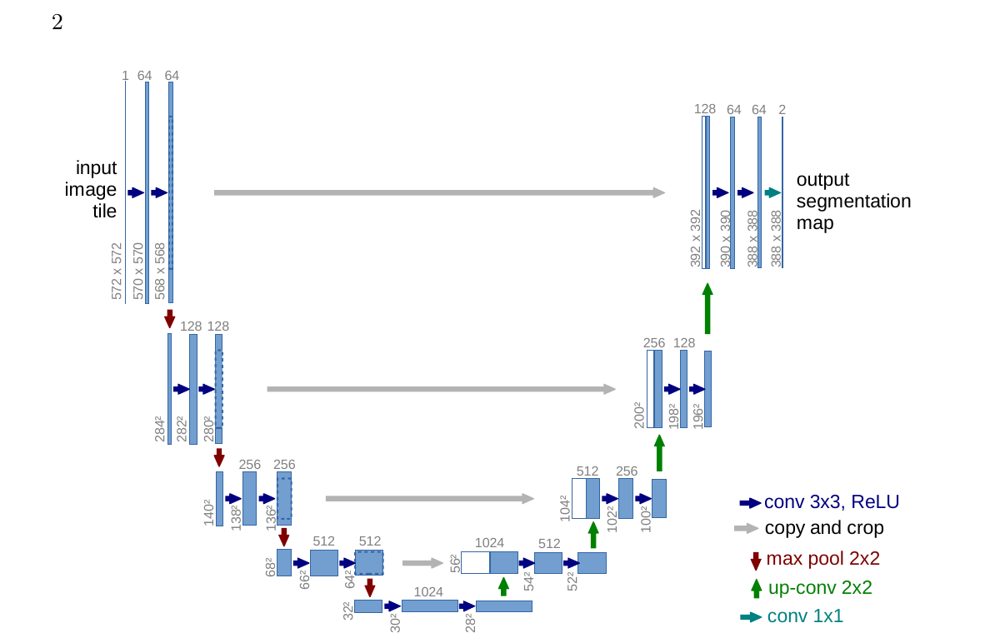
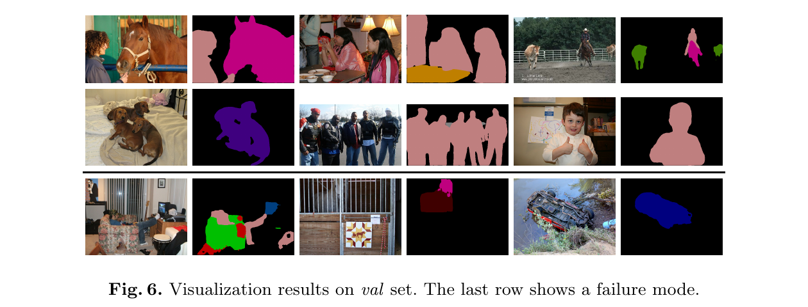
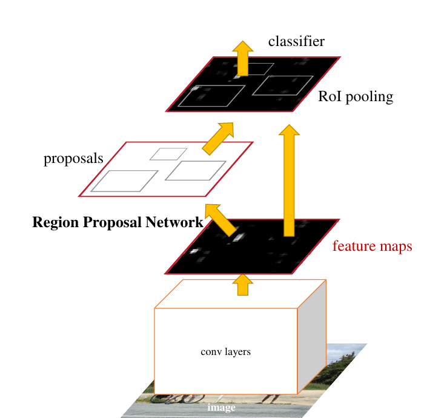
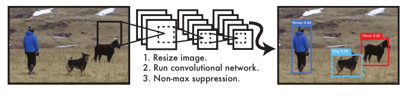
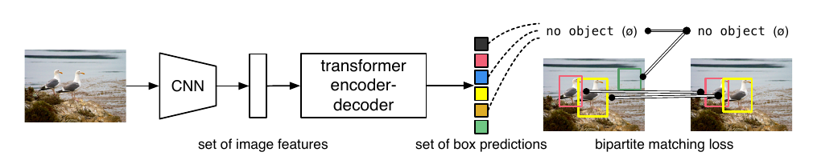
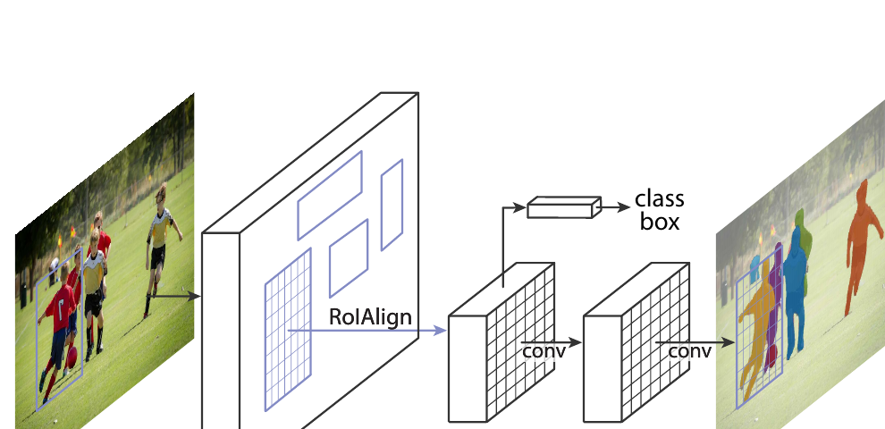
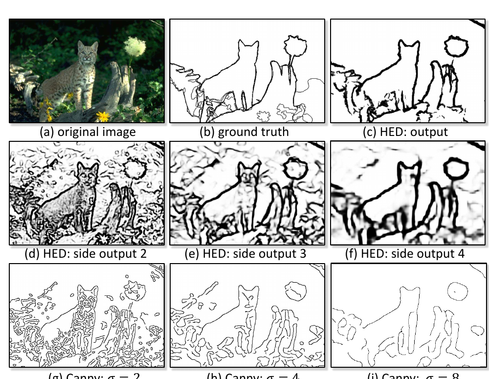

:::{.chapter-opening}
:::{.chapter-kicker}
PART V · LEARNING FROM IMAGES
:::

:::{.chapter-cover}
{fig-alt="A continuous urban street scene transitions from a natural image with object boxes through colored semantic and instance regions to a dark edge map."}
:::

An image-level classifier can correctly say “street scene” while remaining silent about the questions that make the prediction useful: **Where is each cyclist? Which pixels are road? Do two touching pedestrians belong to one instance or two? Where does the sidewalk boundary run?**

This chapter studies tasks whose outputs preserve spatial structure. The unifying principle is simple: first specify the smallest output that supports the intended decision; only then choose a model family, training target, and evaluation measure.
:::

:::{.learning-objectives}
### By the end of this chapter, you should be able to {.unnumbered .unlisted}

1. Distinguish classification, detection, semantic segmentation, instance segmentation, panoptic segmentation, and edge detection by their output contracts.
2. Explain why dense prediction must combine semantic context with spatial precision.
3. Trace the information paths in FCN, U-Net, and DeepLabv3+.
4. Explain proposals, one-stage dense prediction, set prediction, matching, and non-maximum suppression.
5. Derive intersection over union and mean IoU from concrete predictions.
6. Explain how Mask R-CNN extends detection and why ROIAlign matters.
7. Distinguish local intensity edges from learned perceptual boundaries.
8. Choose a suitable output, model family, and evaluation measure from an application specification.
:::

# Start with the required prediction

Consider one urban photograph containing a car, two cyclists, a pedestrian, buildings, road, sidewalk, and sky. The pixels are identical in every row below; only the required answer changes.

| Question | Smallest sufficient output | What is intentionally absent? |
|---|---|---|
| Is a cyclist present? | One image-level label or probability | location, count, shape |
| Where is every cyclist? | A set of labeled boxes | exact silhouettes |
| Which pixels are road? | One class label per pixel | object identity |
| How many cyclists are present, and which pixels belong to each? | One mask per cyclist | labels for uncountable background regions |
| Explain every pixel and preserve the identity of countable objects | One panoptic scene partition | overlapping assignments |
| Where does appearance change rapidly? | An edge-strength map | object class and identity |

The distinction is not cosmetic. It changes every part of the learning problem:

| Five-part frame | Spatial-prediction consequence |
|---|---|
| **Data** | Labels may be boxes, class maps, instance masks, or boundary traces. |
| **Hypothesis** | The model must emit a compatible grid or variable-size set. |
| **Loss** | Training must compare the same structures, often after an assignment step. |
| **Optimization** | Dense outputs increase memory and create severe class imbalance. |
| **Evaluation** | Classification accuracy cannot judge localization or boundary quality. |

Cityscapes illustrates the annotation burden. Its authors collected urban video from 50 cities and released 5,000 images with fine pixel-level annotations plus 20,000 with coarse annotations [@cordts2016cityscapes]. A box is cheaper to annotate than a precise mask; a panoptic partition is richer still. Asking for more structure has a real data cost.

## Three meanings of “segment the image”

**Semantic segmentation** assigns a class to every pixel. All pixels labeled `person` share one category even when they belong to different people.

**Instance segmentation** returns a separate mask for each countable object. Two touching people remain distinguishable because identity is part of the output.

**Panoptic segmentation** partitions the complete image. Countable **things** such as people and cars receive both category and instance identity; amorphous **stuff** such as road and sky receives a category but not an arbitrary instance number [@kirillov2019panoptic].

{#fig-panoptic-contract fig-alt="A street photograph and three annotations show semantic categories, separate object instances, and a complete panoptic partition." width=100%}

@fig-panoptic-contract makes two independent questions visible:

1. **Coverage:** must every pixel receive an explanation?
2. **Identity:** must different objects of the same category remain separate?

Semantic segmentation provides coverage without identity. Instance segmentation provides identity for things without necessarily covering stuff. Panoptic segmentation requires both.

# Semantic segmentation: classification at every pixel

Let an input batch have shape `(N, 3, H, W)` and suppose there are $K$ semantic classes. A segmentation model emits logits

$$
Z\in\mathbb{R}^{N\times K\times H\times W}.
$$

At pixel $(i,j)$, the vector $Z_{:,i,j}$ is a $K$-class classification problem. The predicted map is

$$
\hat y_{i,j}=\arg\max_k Z_{k,i,j}.
$$

For a target class map $y\in\{0,\ldots,K-1\}^{H\times W}$, pixel-wise cross-entropy is commonly averaged over valid pixels:

$$
\mathcal L_{seg}=-\frac{1}{|\Omega|}\sum_{(i,j)\in\Omega}
\log p(y_{i,j}\mid x,i,j).
$$

$\Omega$ excludes ignored or unlabeled pixels. The loss is familiar classification loss, but its spatial repetition creates new difficulties: adjacent pixels are correlated, large classes contribute many more terms, and small objects may occupy only a few cells.

```python
import torch
from torch.nn import functional as F

logits = torch.randn(4, 19, 256, 512)   # N, K, H, W
target = torch.randint(0, 19, (4, 256, 512))
loss = F.cross_entropy(logits, target, ignore_index=255)
prediction = logits.argmax(dim=1)       # N, H, W
```

The tensor contract matters: `cross_entropy` expects the class axis before the spatial axes, while the integer target omits that class axis.

## The context–precision tension

A classifier usually reduces spatial resolution. After five stride-two operations, a $224\times224$ input becomes a $7\times7$ feature map. Each deep location sees broad context, which helps distinguish a pedestrian from a narrow signpost, but a seven-cell grid cannot precisely trace fingers, bicycle spokes, or a thin curb.

Upsampling a coarse prediction changes its size, not its information. If several boundary positions collapsed into the same deep cell, interpolation cannot infer which original position was correct. Dense architectures therefore need two complementary resources:

- **deep, coarse features** for semantic context;
- **shallow, fine features** for localization.

## FCN: keep a spatial output

Fully Convolutional Networks replaced a classifier's dense head with spatial operations and trained the network end to end from pixels to pixels [@long2015fcn]. The central move is architectural: do not collapse the feature grid into one vector. Produce a coarse class-score grid, upsample it, and combine deep semantic features with shallower spatial features through skip connections.

The paper describes the tension directly: global information answers *what*, while local information answers *where*. Its FCN-32s, FCN-16s, and FCN-8s variants progressively fuse finer features. The names refer to the effective output stride before final upsampling, not to the number of layers.

## U-Net: a symmetric path back to resolution

U-Net makes the recovery path explicit [@ronneberger2015unet]. Its encoder repeatedly builds context while reducing resolution. Its decoder upsamples and combines the result with features copied from the corresponding encoder level.

{#fig-unet-paper fig-alt="Original U-Net diagram with a contracting encoder, expanding decoder, and horizontal skip connections." width=96%}

The skip connection does not merely make optimization easier. It transfers localization evidence that would otherwise have to pass through the bottleneck. The decoder learns to combine two different descriptions of the same region:

- encoder features: precise location, weaker semantics;
- decoder features: stronger semantics, coarser location.

The 2015 architecture used valid convolutions, so feature maps shrank and encoder features were cropped before concatenation. Many modern implementations use padding and concatenate equal-sized grids directly. The transferable principle is the multi-resolution information path, not the historical crop.

:::{.callout-note}
## Addition and concatenation make different promises

A residual addition assumes two tensors describe compatible features with equal shape. A U-Net concatenation preserves both feature sets as separate channels and lets later convolutions learn how to mix them. Concatenation increases channel count and memory; it does not automatically guarantee that fine detail will be used.
:::

## DeepLab: enlarge context without another stride

An atrous, or dilated, convolution spaces its kernel samples apart. In one dimension, a kernel of size $k$ with dilation $d$ has effective size

$$
k_{eff}=k+(k-1)(d-1).
$$

For $k=3$ and $d=2$, three learned positions cover an effective width of five. The parameter count is unchanged; the sampled field becomes wider. Atrous Spatial Pyramid Pooling applies several dilation rates in parallel so the prediction can use context at multiple scales.

DeepLabv3+ combines this multi-scale encoder with a decoder that recovers sharper boundaries [@chen2018deeplabv3plus]. In the paper's Cityscapes experiment, the reported test score was 82.1% mIoU under its stated setting. That is a historical paper result, not a universal score for the architecture.

{#fig-deeplab-results fig-alt="Street-scene photographs are paired with DeepLabv3+ semantic predictions; the last row contains failure cases." width=100%}

Read @fig-deeplab-results diagnostically. Large surfaces and many object silhouettes are accurate, but thin structures, occlusion, rare appearances, and ambiguous boundaries remain difficult. A visually plausible color map is not sufficient evidence; we need a metric.

## Intersection over union and mean IoU

For a class $c$, define the predicted pixel set $P_c$ and target set $G_c$. Their intersection over union is

$$
\operatorname{IoU}_c=\frac{|P_c\cap G_c|}{|P_c\cup G_c|}
=\frac{TP_c}{TP_c+FP_c+FN_c}.
$$ {#eq-iou}

True negatives do not appear. In a road scene, most pixels may be “not pedestrian”; counting those easy negatives would make a poor pedestrian mask look deceptively strong.

**Worked example.** A target car occupies 120 pixels. The model marks 140 pixels as car, and 100 pixels overlap the target. Then

$$
|P\cup G|=140+120-100=160,
\qquad \operatorname{IoU}=\frac{100}{160}=0.625.
$$

The 40 extra pixels and 20 missed pixels both enlarge the union without enlarging the intersection.

Mean IoU gives every evaluated class equal weight:

$$
\operatorname{mIoU}=\frac{1}{K}\sum_{c=1}^{K}\operatorname{IoU}_c.
$$

If road, car, and pedestrian IoUs are $0.90$, $0.60$, and $0.30$, then mIoU is $0.60$. The large road region cannot numerically hide weak pedestrian performance. Dataset protocols still matter: they define ignored labels, absent classes, and whether scores are averaged over images or accumulated over the dataset.

# Object detection: predict a set of localized objects

A detector returns a variable-size set

$$
\hat{\mathcal Y}=\{(\hat b_i,\hat c_i,\hat s_i)\}_{i=1}^{M},
$$

where $\hat b_i$ is a box, $\hat c_i$ a class, and $\hat s_i$ a confidence score. Unlike segmentation, there is no natural “object number 1” at a fixed tensor position. Output order should not change the meaning of the set.

## Boxes are geometric claims

A box may be stored as corner coordinates $(x_{min},y_{min},x_{max},y_{max})$ or center-size coordinates $(c_x,c_y,w,h)$. Conventions must also specify whether coordinates are pixels or normalized values and how boundary pixels are counted.

Box IoU uses the same set principle as mask IoU, but the sets are rectangular areas. Suppose a $100\times80$ target box overlaps a $120\times70$ prediction over an $80\times60$ rectangle. Then

$$
A_G=8000,\quad A_P=8400,\quad A_I=4800,
$$

$$
\operatorname{IoU}=\frac{4800}{8000+8400-4800}
=\frac{4800}{11600}\approx0.414.
$$

The class can be correct while localization is poor. Detection evaluation must judge both.

## Why one object creates many candidates

Dense detectors evaluate many spatial positions, scales, or candidate boxes. Several candidates can surround the same car. During training, the system needs a rule assigning candidates to targets. During inference, it needs a rule for turning overlapping candidates into final detections.

**Non-maximum suppression (NMS)** is a common inference rule:

1. sort candidates by confidence;
2. keep the highest-scoring box;
3. suppress lower-scoring boxes whose IoU with it exceeds a threshold;
4. repeat with the remaining candidates.

NMS is not a classifier and is usually not learned. A low suppression threshold removes duplicates aggressively but may erase two nearby objects. A high threshold preserves nearby objects but may leave duplicates.

## Two-stage detection: propose, then inspect

Faster R-CNN gives different modules different responsibilities [@ren2015fasterrcnn]. A shared CNN first computes one feature map for the image. A Region Proposal Network predicts likely object regions and objectness scores. Region features are then pooled into a fixed spatial size and passed to a head that classifies and refines each proposal.

{#fig-faster-rcnn fig-alt="An image passes through shared convolutional layers; one branch proposes regions and another classifies pooled proposal features." width=90%}

The proposal stage should favor recall: missing an object leaves the second stage nothing to inspect. The second stage can spend more computation on fewer regions. “Two-stage” describes this allocation of work; it does not guarantee greater accuracy in every deployment.

## One-stage detection: predict densely in one pass

The original YOLO formulation predicted boxes and class probabilities directly from the full image in one network evaluation [@redmon2016yolo]. This unified design made the speed–accuracy trade-off concrete and helped establish one-stage detection as a major family.

{#fig-yolo fig-alt="YOLO pipeline from resized image through one convolutional network to thresholded detections and non-maximum suppression." width=78%}

Modern one-stage detectors differ substantially from the 2016 model, but the durable structural choice remains: distribute classification and localization predictions densely rather than running a substantial per-proposal head.

## Set prediction: supervise unique assignments

DETR treats detection explicitly as set prediction [@carion2020detr]. It maintains a fixed number $Q$ of output slots. A transformer produces one class distribution and box per slot. Because the target objects have no canonical order, training solves a one-to-one bipartite matching between predictions and ground truth.

{#fig-detr fig-alt="DETR architecture and bipartite matching connect a set of predicted boxes to ground-truth objects, with unmatched slots assigned no object." width=100%}

If the matching is $\sigma$, a simplified objective has the form

$$
\mathcal L=\sum_{j=1}^{N}
\left[\mathcal L_{class}(y_j,\hat y_{\sigma(j)})
+\lambda\mathcal L_{box}(b_j,\hat b_{\sigma(j)})\right]
+\sum_{q\ \text{unmatched}}\mathcal L_{class}(\varnothing,\hat y_q).
$$

Every target owns one matched prediction; unmatched slots learn the valid class “no object.” The assignment resolves duplicate responsibility during training and lets the original system avoid NMS. The conceptual change is the supervision of an unordered set, not merely the use of a transformer.

## Precision, recall, and average precision

For one class and one IoU threshold, a prediction is a true positive when it matches an unused ground-truth object with sufficient IoU. A duplicate prediction of an already matched object is a false positive. An unmatched ground-truth object is a false negative.

$$
\operatorname{precision}=\frac{TP}{TP+FP},
\qquad
\operatorname{recall}=\frac{TP}{TP+FN}.
$$

Sort detections by confidence and lower the acceptance threshold. Recall usually rises because more objects are recovered, while false positives may reduce precision. **Average precision (AP)** summarizes the resulting precision–recall curve. Benchmarks such as COCO report averages across categories and multiple IoU thresholds; stricter thresholds reward more precise boxes.

:::{.callout-warning}
## “mAP” is incomplete without the protocol

PASCAL VOC and COCO use different category sets, IoU conventions, and averaging rules. A number called mAP is not interpretable without naming the dataset and protocol. Never compare two reported values merely because both are percentages.
:::

# Instance and panoptic segmentation

Semantic segmentation cannot reliably count touching people: the output contains the category `person`, not an identity variable. Connected components are not a general repair because occlusion can split one object while contact can join two.

## Mask R-CNN: add a mask question to each region

Mask R-CNN extends Faster R-CNN with a parallel mask branch for every selected region [@he2017maskrcnn]. The class and box heads ask *what object is this and where is its extent?* The mask head asks *which pixels inside this region belong to it?*

{#fig-mask-rcnn fig-alt="A region of interest feeds parallel classification, bounding-box regression, and per-instance mask branches." width=88%}

The mask branch predicts one small binary mask per class for each region. During training, only the channel corresponding to the target class contributes to the mask loss. This decouples category competition from mask shape: the classification head chooses the category, while the selected mask channel learns the silhouette.

## Why ROIAlign matters

ROI pooling converts differently sized regions into a fixed-size feature grid, but rounding region boundaries to integer feature coordinates introduces spatial misalignment. Classification may tolerate a one-cell shift; a pixel mask exposes it.

ROIAlign samples at fractional coordinates and uses bilinear interpolation. For a point $(x,y)$ between four feature values, it computes a distance-weighted combination rather than rounding to one cell. Mask R-CNN's ablations showed that this small geometric correction was especially important for stricter mask localization [@he2017maskrcnn].

The broader lesson is reusable: when the target is spatially precise, every resizing, stride, crop, and coordinate convention becomes part of the model's contract.

## Panoptic segmentation: one coherent scene

Panoptic segmentation requires exactly one semantic label at every pixel and one instance identifier for every thing pixel [@kirillov2019panoptic]. A model or post-processing stage must reconcile overlapping instance masks with a semantic background map. The final output cannot assign one pixel simultaneously to two cars or leave a road hole unexplained.

Panoptic Quality decomposes into segmentation quality and recognition quality:

$$
PQ=\underbrace{\frac{\sum_{(p,g)\in TP}\operatorname{IoU}(p,g)}{|TP|}}_{SQ}
\times
\underbrace{\frac{|TP|}{|TP|+\tfrac12|FP|+\tfrac12|FN|}}_{RQ}.
$$

$SQ$ asks how well matched regions overlap. $RQ$ penalizes missing and spurious regions. The factorization prevents excellent boundaries on a few easy objects from hiding failures to recognize the rest of the scene.

# Edge detection: local change versus perceptual boundary

An edge map assigns a strength to every pixel, indicating rapid local image change. A strong edge may coincide with an object boundary, but it may also arise from a shadow, painted stripe, texture, specular highlight, or illumination change.

## Derivatives turn transitions into peaks

For a one-dimensional intensity signal $I(x)$, constant regions have derivative near zero, while a dark-to-bright transition creates a positive peak. A centered discrete difference is

$$
\frac{dI}{dx}\approx\frac{I(x+1)-I(x-1)}{2}.
$$

In two dimensions, the gradient is

$$
\nabla I=(G_x,G_y),\qquad
G=\sqrt{G_x^2+G_y^2},\qquad
\theta=\operatorname{atan2}(G_y,G_x).
$$

The gradient direction points toward fastest intensity increase and is perpendicular to the visible edge. A vertical boundary therefore produces a strong horizontal derivative.

Sobel kernels estimate both components while smoothing slightly in the perpendicular direction:

$$
S_x=\begin{bmatrix}-1&0&1\\-2&0&2\\-1&0&1\end{bmatrix},
\qquad
S_y=\begin{bmatrix}-1&-2&-1\\0&0&0\\1&2&1\end{bmatrix}.
$$

## Canny is a pipeline, not one filter

Canny derived an edge detector around three goals: good detection, good localization, and a single response to one edge [@canny1986computational]. The practical pipeline assigns a responsibility to each stage:

1. **Gaussian smoothing** reduces high-frequency noise before differentiation amplifies it.
2. **Gradient estimation** measures strength and direction.
3. **Non-maximum suppression** keeps a local maximum across the gradient direction, thinning a broad ridge.
4. **Double thresholding and hysteresis** seed contours with strong responses and retain weak responses only when connected to a strong edge.

{#fig-canny-real fig-alt="Six panels show a real photograph transformed through all major stages of the Canny edge detector." width=100%}

A low threshold preserves faint boundaries but admits texture and noise. A high threshold gives a cleaner map but breaks low-contrast contours. Hysteresis uses connectivity to make a better decision than either threshold alone, but its scale and thresholds remain application choices.

## Learned boundaries ask a different question

The Berkeley segmentation benchmark collected multiple human segmentations of natural images, making perceptual boundary agreement measurable [@arbelaez2011contour]. HED reframed boundary prediction as deeply supervised image-to-image learning with side outputs at several CNN depths [@xie2015hed].

{#fig-hed-evidence fig-alt="A cat photograph is compared with human boundaries, HED outputs at several depths, and Canny results at three scales." width=92%}

@fig-hed-evidence exposes the mechanism. A shallow side output responds to fine texture. Deeper outputs use larger receptive fields and become coarser and more global. Fusion combines these scales. Canny's smoothing parameter instead creates a direct trade-off: small scale preserves clutter; large scale removes clutter and legitimate detail together.

The comparison should not be overstated. HED learns the annotation policy of its dataset; it does not discover a universal definition of “meaningful boundary.” Domain shift, annotation disagreement, and rare structures remain relevant.

## Boundary evaluation

Exact pixel equality is too strict when two traces differ by one pixel. Boundary benchmarks therefore match predicted and ground-truth edge pixels within a localization tolerance, then compute precision and recall. A threshold on the edge-strength map produces one operating point; sweeping it produces a precision–recall curve.

The HED paper reports ODS (one threshold optimized for the dataset), OIS (a best threshold per image), and AP (area-style summary of precision and recall) [@xie2015hed]. These measure different capabilities. A large gap between OIS and ODS suggests that the best threshold varies substantially across images.

# Choosing the task, model, and metric together

The architecture name should be the last decision, not the first.

| Required decision | Smallest sufficient output | Representative family | Evaluation evidence |
|---|---|---|---|
| Flag whether a helmet appears | image label | CNN classifier | accuracy, precision/recall |
| Count and locate every helmet | labeled box set | Faster R-CNN, one-stage detector, DETR | AP across IoU thresholds |
| Measure total road area | semantic class map | FCN, U-Net, DeepLab | road IoU, class-wise mIoU |
| Count cyclists and measure each silhouette | instance masks | Mask R-CNN-style instance segmentation | matched mask AP/IoU |
| Explain the complete traffic scene | panoptic partition | joint semantic–instance system | PQ, SQ, RQ |
| Trace material transitions for metrology | edge map | Canny or learned boundary detector | boundary precision–recall |

A richer output is not automatically better. If a decision only requires an image-level alarm, collecting pixel masks may waste annotation effort. Conversely, if occupied area matters, boxes systematically include background and are insufficient even when their AP is high.

## Failure analysis should follow the contract

When a result is wrong, ask which contract failed:

- **Recognition:** correct location, wrong class.
- **Localization:** correct class, box or mask poorly aligned.
- **Coverage:** unlabeled holes or missing stuff regions.
- **Identity:** two objects merged or one object split.
- **Assignment:** duplicate predictions claim one target.
- **Boundary selection:** texture kept while meaningful contour is missed.

These categories lead to different repairs. A stronger classifier does not fix quantized mask alignment. Lowering a detector threshold may recover missed objects but increase duplicates. Increasing image resolution may help small objects while increasing memory and latency.

# Exercises

## Exercise 1: select the output contract

**Given:** A traffic camera must count each cyclist and measure the exact road area occupied by each cyclist.

**Task:** Choose the smallest sufficient output type, one suitable evaluation strategy, and one representative model family.

<details>
<summary>Worked solution</summary>

Use **instance segmentation**. One mask per cyclist preserves identity for counting and pixels for occupied area. Semantic segmentation can merge touching cyclists; detection boxes preserve identity but include background.

Evaluate by matching predicted instances to ground-truth cyclists, penalizing missed and duplicate instances, then measuring mask overlap. A Mask R-CNN-style system is one representative family.
</details>

## Exercise 2: compute mask IoU

**Given:** A target pedestrian mask contains 80 pixels. A predicted mask contains 100 pixels. Their intersection contains 60 pixels.

**Task:** Compute IoU and identify the false-positive and false-negative pixel counts.

<details>
<summary>Worked solution</summary>

The prediction contains $100-60=40$ false-positive pixels. The target contains $80-60=20$ false-negative pixels. The union is

$$
60+40+20=120,
$$

so

$$
\operatorname{IoU}=60/120=0.5.
$$
</details>

## Exercise 3: reason about non-maximum suppression

**Given:** Three car detections have scores $0.95$, $0.82$, and $0.60$. Their pairwise IoUs are $0.76$ between the first and second, $0.18$ between the first and third, and $0.20$ between the second and third. NMS uses threshold $0.50$.

**Task:** Which detections remain?

<details>
<summary>Worked solution</summary>

Keep the $0.95$ box first. Suppress the $0.82$ box because its IoU with the kept box is $0.76>0.50$. Keep the $0.60$ box because its IoU with the first box is only $0.18$. The result contains the $0.95$ and $0.60$ detections.

This arithmetic alone cannot tell whether the third box is a second car or a false positive; NMS only reasons from scores and overlap.
</details>

## Exercise 4: separate edge orientation from gradient direction

**Given:** An image is dark on the left and bright on the right, with a vertical transition between them.

**Task:** Which Sobel component dominates, and which way does the gradient point?

<details>
<summary>Worked solution</summary>

$|G_x|$ dominates because intensity changes along the horizontal $x$ direction. The gradient points from dark to bright—toward the right under this sign convention. The visible edge is vertical and perpendicular to that gradient.
</details>

# Chapter summary

1. Spatial tasks differ first by output structure: label, box set, class map, instance masks, panoptic partition, or edge map.
2. Semantic segmentation must combine broad context with fine spatial evidence; FCN, U-Net, and DeepLab embody different mechanisms for doing so.
3. Detection must resolve a variable-size unordered set. Proposal systems, dense one-stage systems, and set-prediction systems allocate that responsibility differently.
4. Instance segmentation adds identity-preserving masks; panoptic segmentation additionally demands complete, non-overlapping scene coverage.
5. IoU measures spatial agreement. mIoU balances semantic classes, AP couples recognition with localization, and PQ couples recognition with region quality.
6. Classical edges are local appearance transitions. Learned boundaries use annotated examples and context to select which transitions matter.
7. The correct workflow is **decision → output contract → annotation → model/loss → evaluation**, not architecture name first.

# Primary resources

- [Fully Convolutional Networks for Semantic Segmentation](https://openaccess.thecvf.com/content_cvpr_2015/html/Long_Fully_Convolutional_Networks_2015_CVPR_paper.html)
- [U-Net: Convolutional Networks for Biomedical Image Segmentation](https://arxiv.org/abs/1505.04597)
- [DeepLabv3+: Encoder-Decoder with Atrous Separable Convolution](https://openaccess.thecvf.com/content_ECCV_2018/html/Liang-Chieh_Chen_Encoder-Decoder_with_Atrous_ECCV_2018_paper.html)
- [Faster R-CNN](https://papers.nips.cc/paper/2015/hash/14bfa6bb14875e45bba028a21ed38046-Abstract.html)
- [You Only Look Once](https://openaccess.thecvf.com/content_cvpr_2016/html/Redmon_You_Only_Look_CVPR_2016_paper.html)
- [End-to-End Object Detection with Transformers](https://arxiv.org/abs/2005.12872)
- [Mask R-CNN](https://openaccess.thecvf.com/content_iccv_2017/html/He_Mask_R-CNN_ICCV_2017_paper.html)
- [Panoptic Segmentation](https://openaccess.thecvf.com/content_CVPR_2019/html/Kirillov_Panoptic_Segmentation_CVPR_2019_paper.html)
- [A Computational Approach to Edge Detection](https://doi.org/10.1109/TPAMI.1986.4767851)
- [Holistically-Nested Edge Detection](https://openaccess.thecvf.com/content_iccv_2015/html/Xie_Holistically-Nested_Edge_Detection_ICCV_2015_paper.html)
