:::{.chapter-opening}
:::{.chapter-kicker}
PART VI · GENERATIVE REPRESENTATION LEARNING
:::

:::{.chapter-cover}
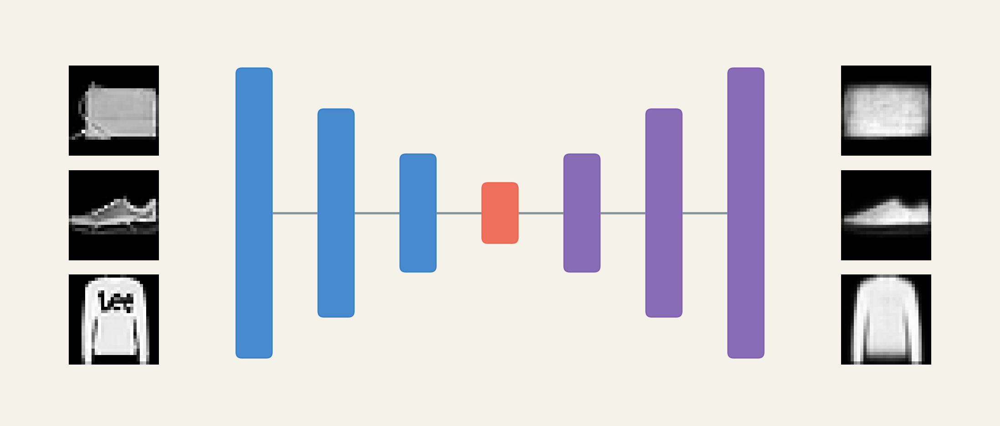{fig-alt="Three garment images connected through narrowing blue state bars, a small orange code, and expanding purple states to three reconstructions."}
:::

Suppose we already have an image. Instead of asking a network for its label, ask it to reproduce the image after passing through a small intermediate representation. At first this sounds pointless: a copy operation would be perfect. The useful question appears only when copying is restricted. **What must the model preserve to make a good reconstruction, and what can it afford to lose?**

This chapter follows the lecture's six sections. We begin with the same cat photograph, build the encoder–decoder contract, examine the measured Fashion-MNIST bottleneck experiment, inspect latent neighborhoods and interpolations, and use reconstruction for denoising and anomaly scoring. Finally we decode locations between observed codes to understand why a reconstruction model is not automatically a reliable generator.

[Lecture](../../lectures/10-autoencoders-latent-representations/index.html) · [Run the bottleneck experiment in Colab](https://colab.research.google.com/github/anassBelcaid/deeplearning-course/blob/main/quarto-site/lectures/10-autoencoders-latent-representations/assets/latent_sweep_colab.ipynb) · [Annotated readings](#reading-path)
:::

## Learning goals {.unnumbered}

By the end, you should be able to trace the architecture and tensor shapes of an autoencoder; derive and interpret its reconstruction objective; distinguish a coordinate bottleneck from a storage guarantee; evaluate a latent representation through examples and measurements; specify the denoising input–target pair; calibrate a reconstruction-based anomaly score; and explain what ordinary reconstruction leaves unspecified about generation.

# Reconstructing before generating

## Begin with an image we already have

{width=70% fig-alt="Two cats on a couch, used to ask which visual details a small representation should preserve."}

Imagine resizing this image to $64\times64$ RGB pixels. It contains $D=64\cdot64\cdot3=12{,}288$ scalar values. A reconstruction network must return another array of those dimensions. The target is the image itself; no human needs to annotate a category for this training pair.

If the network can simply route every input coordinate to its corresponding output, zero error is achievable without learning reusable structure. The identity map $r(x)=x$ solves the copying task. To make the intermediate representation interesting, we restrict the route. One choice is to require all information to pass through a vector $z\in\mathbb R^d$ with $d\ll D$.

For the cats, broad couch colors and the positions of two bodies may be reconstructable from relatively few coordinates. Fine fur texture, whiskers, and irregular background details compete for the remaining capacity. This is a prediction to test, not a promise that the model understands “cat.” The loss rewards pixel prediction; it may prioritize a large background region over a small feature essential to a human observer.

The target is derived from the input, so this is commonly described as self-supervised learning, historically also grouped under unsupervised representation learning. Absence of class labels does not mean absence of supervision: every target pixel supplies an error signal.

| Part of the learning problem | Our reconstruction example |
|---|---|
| Data | Images scaled consistently; each image supplies its own target |
| Hypothesis | An encoder followed by a decoder |
| Loss | Discrepancy between image and predicted reconstruction |
| Optimization | Joint training of both networks through backpropagation |
| Evaluation | Held-out error, image inspection, and usefulness of the code for a specified task |

## Turn visual discrepancy into a learning signal

Write $\hat x$ for the prediction and flatten image coordinates only for notation. Our experiments use mean squared error per pixel:

$$
\ell(x,\hat x)=\frac1D\sum_{j=1}^D(x_j-\hat x_j)^2.
$$

For a tiny grayscale example, let $x=(0,1,1,0)$ and $\hat x=(0.1,0.8,0.6,0.2)$. The squared errors are $(0.01,0.04,0.16,0.04)$, so $\ell=0.25/4=0.0625$. The third pixel contributes most to the error. The derivative with respect to a prediction is

$$
\frac{\partial\ell}{\partial\hat x_j}=\frac2D(\hat x_j-x_j).
$$

At the third pixel it equals $-0.2$, encouraging gradient descent to increase the prediction toward $1$. Backpropagation carries that correction through the decoder and encoder. Both are trained toward one objective.

A useful connection to probability comes from assuming independent Gaussian observation noise with fixed variance: $p(x\mid z)=\mathcal N(g_\phi(z),\sigma^2I)$. Its negative log likelihood is a constant plus $\|x-g_\phi(z)\|^2/(2\sigma^2)$. Thus squared-error fitting corresponds to fitting a Gaussian mean under this assumption. This interpretation does not turn the whole autoencoder into a generative model; we have not specified how to sample $z$.

### Pixel agreement is not semantic agreement

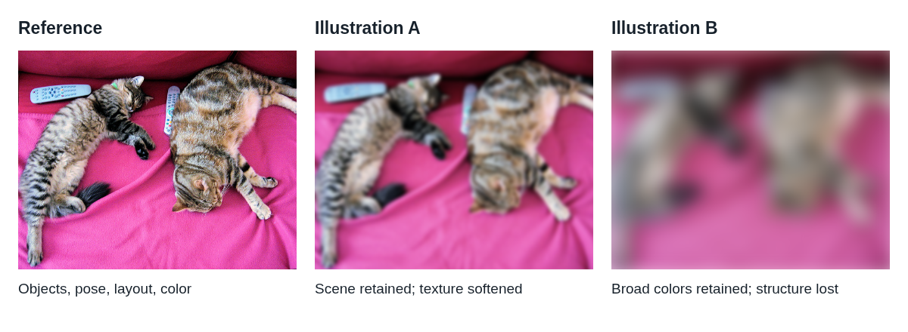{fig-alt="The same cat photograph displayed unfiltered, mildly blurred, and strongly blurred."}

A one-pixel shift may preserve a cat's identity while changing many pixel comparisons. Conversely, a blurred prediction can score reasonably under MSE while losing important details. If two target appearances are both plausible given the code, predicting their average can reduce squared error. We derive this averaging effect later when discussing denoising.

Output activation and target convention must agree. Sigmoid predictions lie in $[0,1]$ and are compatible with the scaled pixels here. Standardized targets can be negative and usually need an unrestricted output. Binary cross entropy is appropriate to a Bernoulli observation model; a floating-point image in $[0,1]$ is not automatically binary data. The choice must follow the interpretation of the target, rather than the presence of a sigmoid alone.

### Exercise: what will survive? {.unnumbered}

For the cat photograph compressed to $32$ coordinates, predict which features will be easier to preserve: broad couch color, the two bodies' positions, individual whiskers, or exact fur texture. Explain your reasoning in terms of repeated structure and loss contributions.

::: {.content-visible when-format="pdf"}
*Pause and write your prediction before reading the interpretation below.*

\vspace{1em}
:::

<details>
<summary>Worked interpretation</summary>

\nopagebreak[4]

Broad color and approximate layout are plausible priorities because they influence many pixels and can often be described with a small number of factors. Exact texture and whisker placement need finer information. However, the answer depends on training data, architecture, and loss: an image-specific detail can dominate error, and a low-dimensional code can still memorize a finite training set. Inspect held-out reconstructions before claiming a semantic hierarchy.

</details>

# The autoencoder contract

## Two learned functions with different roles

The encoder and decoder implement

$$
z=f_\theta(x),\qquad \hat x=g_\phi(z),\qquad
f_\theta:\mathbb R^D\to\mathbb R^d,\quad
g_\phi:\mathbb R^d\to\mathbb R^D.
$$

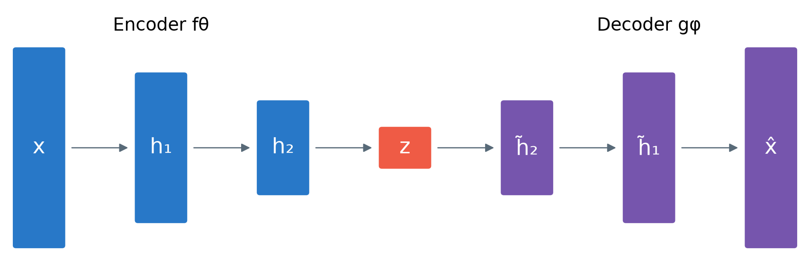{#fig-hourglass fig-alt="Input x passes through progressively shorter encoder states to z, then taller decoder states produce x hat."}

This is a computation diagram, not yet a probabilistic graphical model. An arrow means a function transforms a state. No probability distribution or conditional-independence statement follows merely from drawing $x\to z\to\hat x$. Those additional modeling commitments will matter in the VAE chapter.

The decoder reverses the progression of shapes, but need not invert the encoder algebraically. If two images produce the same code, a deterministic decoder cannot recover both exactly. Its reconstruction is the output favored by the learned task and data. Symmetric widths are convenient rather than compulsory; convolutional states can also preserve spatial axes inside the bottleneck.

Compare this with the CNN classifier you already know:

| Shared beginning | Final module | Required answer |
|---|---|---|
| Image $\to$ CNN features $\to$ representation | Classification head | $K$ class scores |
| Image $\to$ CNN features $\to$ representation | Reconstruction decoder | An image-shaped prediction |

The architecture changes because the target changes. An image classifier can discard detail irrelevant to a label; a pixel reconstruction objective continues to penalize discarded detail even if it does not help classification.

## Map the architecture into executable code

The lecture's smallest example is $784\to128\to32\to128\to784$. For a PyTorch batch, the complete route is $(N,1,28,28)\to(N,784)\to(N,32)\to(N,784)\to(N,1,28,28)$.

```{.python}
import torch
from torch import nn

class Autoencoder(nn.Module):
    def __init__(self, d=32):
        super().__init__()
        self.encoder = nn.Sequential(
            nn.Flatten(start_dim=1),
            nn.Linear(784, 128), nn.ReLU(),
            nn.Linear(128, d),
        )
        self.decoder = nn.Sequential(
            nn.Linear(d, 128), nn.ReLU(),
            nn.Linear(128, 784), nn.Sigmoid(),
            nn.Unflatten(1, (1, 28, 28)),
        )

    def forward(self, x):
        return self.decoder(self.encoder(x))

model = Autoencoder(d=32)
optimizer = torch.optim.Adam(model.parameters(), lr=1e-3)

def train_batch(images):
    model.train()
    optimizer.zero_grad(set_to_none=True)
    reconstructed = model(images)
    assert reconstructed.shape == images.shape
    loss = (reconstructed - images).square().mean()
    loss.backward()
    optimizer.step()
    return loss.item()
```

Flattening starts after the batch axis. A linear latent layer allows signed coordinates; the sigmoid is applied to reconstructed pixels. The shape assertion catches an omitted `Unflatten` before an accidental broadcast creates an unintended loss. The optimizer sees parameters from both modules. Detaching $z$ before the decoder would prevent reconstruction gradients from training the encoder.

### Exercise: trace shapes and count parameters {.unnumbered}

For a batch of $16$ images and $d=32$, write every tensor shape. Then count the trainable parameters, including biases, in the four linear layers.

::: {.content-visible when-format="pdf"}
*Pause and complete the shapes and counts before reading the solution below.*

\vspace{1em}
:::

<details>
<summary>Worked solution</summary>

\nopagebreak[4]

The shapes are $(16,1,28,28)$, $(16,784)$, $(16,128)$, $(16,32)$, $(16,128)$, $(16,784)$, and finally $(16,1,28,28)$. ReLU and sigmoid do not change shape. A linear layer from $a$ to $b$ has $ab+b$ parameters. The four counts are $100{,}480$, $4{,}128$, $4{,}224$, and $101{,}136$, totaling $209{,}968$. Flatten and Unflatten have no learned parameters. A small code does not imply a small model.

</details>

# Learning through a bottleneck

## A restriction creates pressure, not a semantic guarantee

An undercomplete autoencoder has $d<D$. This limits the number of continuous coordinates transmitted along the prescribed path. It does not by itself enforce a useful representation. A sufficiently expressive model can assign distinct codes to finitely many training images and learn to decode them, while generalizing poorly. Shortcut paths around $z$ can also weaken the intended bottleneck.

The coordinate ratio for Fashion-MNIST at $d=32$ is $32/784\approx0.0408$: about $4.08\%$ as many coordinates, or $24.5$ input coordinates per code coordinate. This is **not a measured file-compression ratio**. A 784-byte uint8 image compared with 32 float32 values gives $784/128\approx6.13$ before metadata, quantization, decoder storage, or entropy coding. Infinite-precision real numbers would make a literal bit-budget interpretation still less appropriate. A useful compressor requires specifying precision, code format, model cost, and reconstruction quality.

## The controlled latent-width experiment

The lecture trains seven MLPs on Fashion-MNIST [@xiao2017fashion]. The experimental architecture is slightly deeper than the minimal teaching code:

$$784\to256\to128\to d\to128\to256\to784.$$

Hidden layers use ReLU, the output uses sigmoid, and each model trains for six epochs on 60,000 images with Adam at $10^{-3}$ and batch size 256. The seed is 17. Evaluation uses the 10,000-image test split. Width varies over $d\in\{2,4,8,16,32,64,128\}$; the other architectural widths and training settings stay fixed.

This is a controlled classroom comparison, not a multi-seed benchmark. Changing $d$ also changes the number of parameters connected to the code, and random initialization arrays differ in shape. The script reuses a shuffled loader whose generator state advances, so batch order is not identical across models. The experiment isolates the main architectural intervention while leaving stochastic variation that repeated runs would need to quantify.

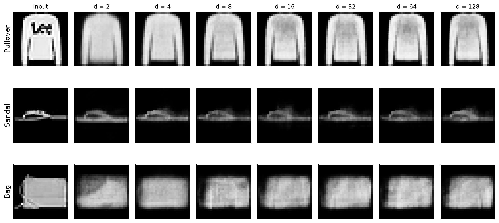{#fig-width-gallery fig-alt="Rows of pullover, sandal, and bag reconstructions at dimensions 2 through 128 beside the originals."}

Look first at a single row. The gross outline often emerges before fine detail, but improvements need not occur at every step. Then compare rows: a setting that preserves one garment's silhouette may still lose a bag handle or a thin sandal strap. A few attractive examples are insufficient to choose the code width.

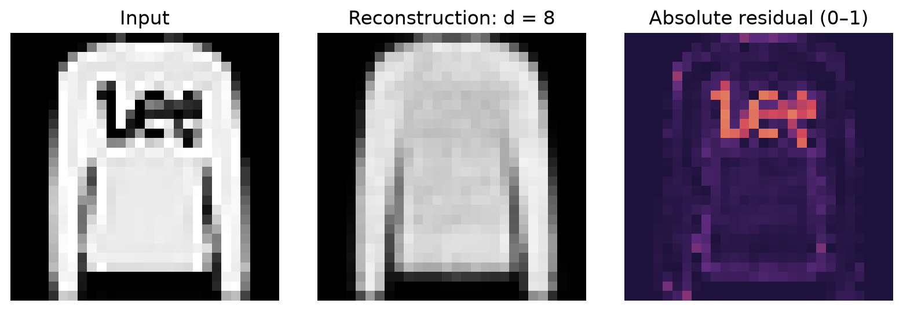{fig-alt="Original pullover, its reconstruction, and a colored residual map emphasizing lost detail."}

Residual maps reveal where the score comes from. The colored map displays absolute error $|x_j-\hat x_j|$, whereas the scalar MSE squares those errors and averages them. Use the same color scale across comparisons: rescaling every map separately would make different error magnitudes look deceptively alike. The [interactive width explorer](../../lectures/10-autoencoders-latent-representations/index.html#/hold-everything-fixedchange-only-d) retains all ten class examples and seven dimensions.

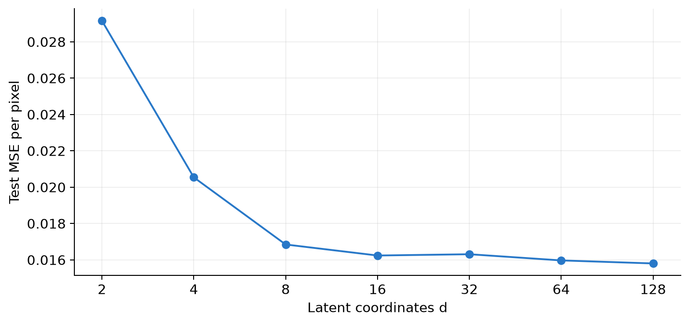{#fig-width-curve fig-alt="Error falls sharply from dimension 2 to 8 then flattens near 0.016, with a small increase at 32."}

| Code dimension | Test MSE |
|---:|---:|
| 2 | 0.0291551 |
| 4 | 0.0205394 |
| 8 | 0.0168457 |
| 16 | 0.0162394 |
| 32 | 0.0163097 |
| 64 | 0.0159695 |
| 128 | 0.0158035 |

From $d=2$ to $8$, error drops by about $42.2\%$. From $8$ to $128$, sixteen times as many coordinates reduce error by only about $6.2\%$. Dimension 32 is slightly worse than 16 in this run. A larger function class can offer a lower achievable optimum without guaranteeing a better result after finite stochastic training.

### Exercise: choose from evidence {.unnumbered}

Suppose you want a compact code for inspecting garment shape. Choose a provisional $d$ from this evidence and state what additional check you would require before deployment.

::: {.content-visible when-format="pdf"}
*Pause and justify your choice before reading the interpretation below.*

\vspace{1em}
:::

<details>
<summary>Worked interpretation</summary>

\nopagebreak[4]

Dimension 8 is a defensible starting point near the bend in the curve; 16 is also reasonable if its visual improvements matter. Neither is universally optimal. Compare representative and difficult validation examples, repeat training across seeds, and evaluate the downstream task. Reserve the test set for the final evaluation. The published lecture sweep is exploratory test-set evidence, so repeatedly selecting settings from it would compromise an untouched final test.

</details>

## Why the linear case connects to PCA

The classical dimensionality-reduction perspective motivates autoencoders [@hinton2006reducing]. To see a tractable special case, center the data and use a linear encoder and decoder with squared error. If $U\in\mathbb R^{D\times d}$ has orthonormal columns, set $z=U^\top x$ and $\hat x=UU^\top x$. With covariance $\Sigma=\mathbb E[xx^\top]$,

$$
\mathbb E\|x-UU^\top x\|^2
=\operatorname{tr}(\Sigma)-\operatorname{tr}(U^\top\Sigma U).
$$

Minimizing reconstruction error therefore maximizes retained variance. The optimal subspace is spanned by leading covariance eigenvectors. An unconstrained linear encoder–decoder factorization can represent that projection without giving uniquely identified PCA coordinates: invertible changes of basis inside $z$ leave the reconstruction unchanged.

For a numerical example, suppose $\Sigma=\operatorname{diag}(9,1)$ and $d=1$. Keeping the first coordinate leaves expected squared error $1$; keeping the second leaves error $9$. A nonlinear autoencoder can represent curved structures beyond a single linear subspace, but then optimization, capacity, and validation become more complicated. “Nonlinear” is additional expressive freedom, not an automatic improvement.

# Reading the latent space

## Inspect geometry before interpreting labels

For this section, the lecture separately trains a $d=2$ model for 12 epochs with seed 29. It is not the two-dimensional checkpoint from the six-epoch sweep. The displayed sample contains the first 100 test examples of each class, totaling 1,000 images. These labels are used to construct and color the inspection sample, never as training targets for the autoencoder.

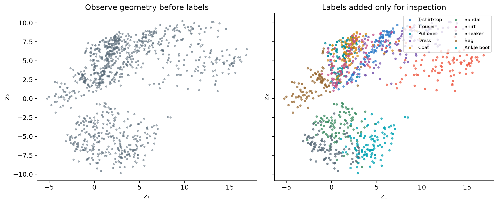{#fig-latent-map fig-alt="Two scatterplots show latent coordinates before and after coloring by garment class."}

This is the actual two-dimensional code, not a PCA or t-SNE projection of a larger representation. Each point represents a held-out image. In the [interactive lecture map](../../lectures/10-autoencoders-latent-representations/index.html#/explore-the-map-before-seeing-the-labels), selecting a point retrieves its original and reconstruction. Inspect dense areas, isolated examples, and transitions before attaching semantic explanations.

Class coloring reveals partial organization: distinct silhouettes often separate, while tops such as shirts, coats, and pullovers overlap. The encoder was rewarded for helping the decoder reproduce pixels. Shape information useful for that purpose can correlate with category, but class separation was not the objective. Do not read each coordinate as a named property such as “sleeve length”; rotated or rescaled codes can support equivalent reconstructions.

## Make similarity operational with nearest neighbors

For an anchor image $x_a$, retrieve examples minimizing $\|f_\theta(x_i)-f_\theta(x_a)\|_2$, excluding the anchor. This is a precise operation rather than an assertion that all close images mean the same thing.

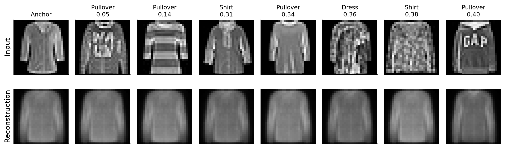{#fig-neighbors fig-alt="A shirt anchor followed by seven nearby encoded garments, with reconstructions below each input."}

Compare silhouette and brightness distribution before comparing class labels. Then compare each input with its reconstruction. Reconstructions can look more alike than the originals because the code has discarded distinguishing detail. A retrieval system should be judged against the application's meaning of similarity: finding a matching shape and finding the same product category are different goals.

There is also a coordinate caveat. For any invertible matrix $A$, replacing $f$ by $Af$ and $g$ by $g\circ A^{-1}$ preserves reconstruction. Yet a non-orthogonal $A$ changes Euclidean distances. Reconstruction alone does not uniquely determine a canonical latent metric. Normalization, a learned metric, or a task-specific objective may be needed before deploying retrieval.

## Decode paths between observed points

Choose two images and encode their endpoints $z_a$ and $z_b$. A straight path is

$$z(t)=(1-t)z_a+t z_b,\qquad \hat x(t)=g_\phi(z(t)),\quad 0\le t\le1.$$

At $t=0$ and $1$ we obtain reconstructions of the endpoints, not the original images. At $t=0.5$ the decoder receives their coordinate midpoint. This is not generally equal to averaging the images: $g((z_a+z_b)/2)$ need not equal $(g(z_a)+g(z_b))/2$ for a nonlinear decoder.

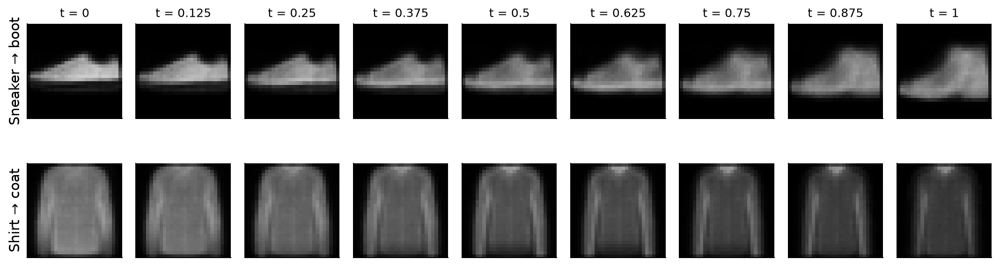{#fig-interpolation fig-alt="Two rows of nine decoded images show footwear and top-clothing interpolations."}

The footwear path changes ankle height and silhouette. The top-clothing path changes more subtly and contains ambiguity. Read these as observations, not proof that class overlap causes every blur. Blur can also arise from limited capacity, training, the output distribution, or the loss. A continuous decoder produces continuous pixel changes even through regions sparsely represented by data. Continuity alone does not prove realism.

# When reconstruction becomes useful

## Denoising changes the input–target pair

The clean-copy objective asks for $x\mapsto x$. A denoising objective instead supplies a corrupted input $\tilde x\sim q(\tilde x\mid x)$ and asks for the clean target $x$. The model must exploit predictable structure to recover information damaged by corruption. This is the key idea in denoising autoencoders [@vincent2008denoising; @vincent2010stacked].

In the course experiment, $\epsilon\sim\mathcal N(0,0.45^2I)$ and $\tilde x=\operatorname{clip}(x+\epsilon,0,1)$. Clipping is part of the actual procedure: near the boundaries, effective corruption is not an unbounded zero-mean Gaussian. A 16-dimensional model trains for six epochs, drawing fresh noise during training.

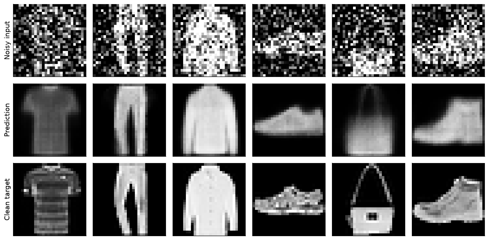{#fig-denoising fig-alt="Three rows show noisy garments, restored predictions, and clean originals."}

Across these six selected test examples, mean input MSE against the clean targets is about $0.1008$, and prediction MSE is about $0.0211$. These are gallery averages, not a reported estimate over the full test distribution. The bag is a useful counterexample to unqualified success: the network removes noise but also loses a distinctive handle and structural details.

The general objective is

$$
\min_{\theta,\phi}\ \mathbb E_{x,\tilde x\sim q(\cdot\mid x)}
\left[\frac1D\|x-g_\phi(f_\theta(\tilde x))\|^2\right].
$$

Only the corrupted image enters the network. The clean image enters the loss. Training against $\tilde x$ instead would reward reproducing the very noise we want removed.

```{.python}
# Replace the clean reconstruction step inside the training loop:
noisy = (images + 0.45 * torch.randn_like(images)).clamp(0, 1)
prediction = model(noisy)
loss = (prediction - images).square().mean()
```

## Why denoising can produce an average

Fix a corrupted observation $\tilde x=u$ and consider a possible prediction $a$. Let $m=\mathbb E[x\mid\tilde x=u]$. Expanding around $m$ gives

$$
\mathbb E[\|x-a\|^2\mid u]
=\mathbb E[\|x-m\|^2\mid u]+\|m-a\|^2.
$$

The cross term vanishes because $\mathbb E[x-m\mid u]=0$. The optimal unconstrained squared-error prediction is therefore the conditional mean $a=m$. If two different edge locations remain plausible, their mean can contain a soft double edge. A learned network approximates this solution subject to its capacity and training. This explains why reducing MSE and restoring visually sharp details are not identical tasks.

Denoising also should not be overinterpreted as guaranteed latent invariance. The composition $g\circ f$ can remove noise while $f$ still encodes some of it. If stable codes themselves matter, measure their response to corruption and use a suitable objective. A bottleneck constrains the route; corruption changes what must be inferred; neither alone certifies the desired downstream behavior.

## Reconstruction error as an anomaly signal

Now change the training distribution. The lecture's second model sees only sandals, sneakers, and ankle boots. After six epochs, it is evaluated on held-out footwear and garments from the other classes. A per-image score is

$$s(x)=\frac1{784}\|x-g_\phi(f_\theta(x))\|^2.$$

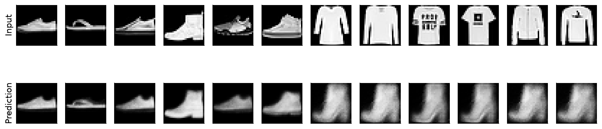{#fig-anomalies fig-alt="Footwear inputs reconstruct as footwear; six selected unfamiliar tops reconstruct into shoe-like shapes."}

The candidate pool consists of the first 40 test images per class: 120 footwear and 280 other images. Median scores are $0.01682$ and $0.08381$, respectively. The displayed unfamiliar examples are the six largest-error cases from this pool. They make the mechanism visible but cannot establish a detection rate or show the hardest anomalies. Familiar examples were selected at spaced score ranks. Report this selection when interpreting the gallery.

A large score says that this model reconstructs an input poorly. It does not identify why. A novel valid shoe, a change in camera conditions, or a defect can all raise it. Conversely, an unfamiliar but easily reconstructed input can receive a low score. Reconstruction-based detection is one possible approach; Deep SVDD provides a useful contrasting reading because it directly learns a compact normal-data representation [@ruff2018deep].

### Calibrating an alarm honestly

For deployment, separate normal training data, normal validation data for calibration, and an independent evaluation set. Given acceptable validation false-alarm rate $\alpha$, set

$$\tau=Q_{1-\alpha}(\{s(x):x\in\mathcal V_{\mathrm{normal}}\}),\qquad
\operatorname{alarm}(x)=\mathbf1[s(x)>\tau].$$

For $\alpha=0.05$, choose the empirical 95th percentile. This controls the observed calibration behavior approximately, subject to finite samples and quantile convention. It does not guarantee a 5% future false-alarm rate under distribution shift. Report false-positive and true-positive rates on independent evaluation examples, and examine precision at the expected prevalence of anomalies.

**Audit of the lecture's number:** the displayed threshold $0.03971$ was calculated from the 120 footwear candidates in the test-derived demonstration pool. It illustrates a percentile calculation; it is not an independently calibrated production threshold. The same pool supplied the gallery and summary statistics. Reproduce it to understand the lesson, then split calibration from evaluation for a valid performance study.

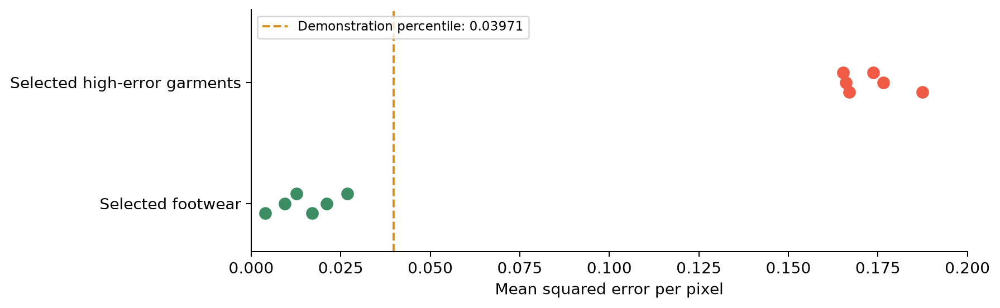{fig-alt="Footwear gallery scores below 0.03 and selected garment scores above 0.16 with a dashed threshold at 0.03971."}

The slides sometimes use $\|x-\hat x\|^2$ as shorthand. All numerical scores here and in the generation script are **means over 784 pixels**. If you use summed squared error, multiply the threshold by 784: $0.03971\times784\approx31.13$. Changing resolution or intensity scaling also changes the score convention.

### Exercise: set the alarm {.unnumbered}

A footwear system uses the demonstration threshold $0.03971$. A shoe receives MSE $0.045$ and an unfamiliar garment receives $0.030$. Which triggers an alarm, and what does the outcome teach us?

::: {.content-visible when-format="pdf"}
*Pause and classify both outcomes before reading the solution below.*

\vspace{1em}
:::

<details>
<summary>Worked solution</summary>

\nopagebreak[4]

The shoe triggers an alarm because $0.045>0.03971$; if it is legitimate normal footwear, this is a false positive. The garment passes because $0.030<0.03971$; relative to the specified normal family, this is a false negative. The score is a reconstruction discrepancy, not a semantic class detector. Raising the threshold tends to reduce false alarms while missing more anomalies. Application costs determine the tradeoff, and independent evaluation estimates it.

</details>

# Why sampling still fails

## The decoder accepts more codes than training constrains

Every vector in $\mathbb R^d$ has the correct shape for the decoder. Training, however, evaluates it mainly at codes $f_\theta(x)$ generated from the training examples. The objective does not request plausible outputs throughout a convenient rectangle or a standard Gaussian cloud.

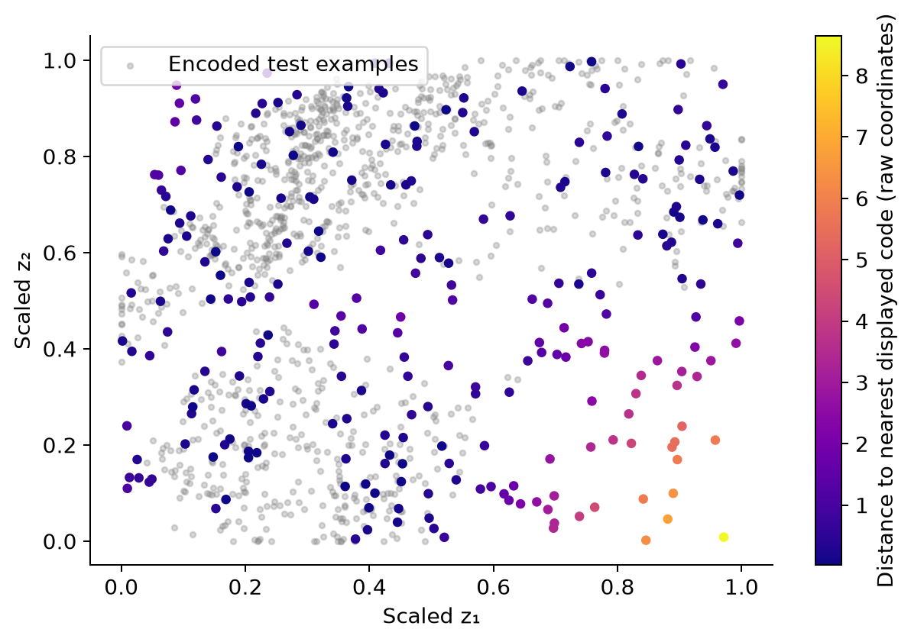{#fig-sampling-support fig-alt="Uniformly sampled latent points cover sparse areas around and between the encoded image cloud."}

The rectangle uses the 1st and 99th percentiles separately on each coordinate. Choosing it from encoded data is more informed than sampling an arbitrary scale, but it still fills gaps and gives equal area equal probability. The real encoded distribution is neither uniform nor necessarily rectangular.

Here “support” is a visual diagnostic based on finitely many held-out codes. A point far from this sample is not proven to be outside the training distribution's mathematical support; a point near one example is not proven to decode realistically. Coordinate distance also depends on parametrization. The figure raises a coverage question that reconstruction training leaves unanswered.

## Decode a whole grid

{width=78% #fig-atlas fig-alt="One hundred decoded grid positions show tops, trousers, footwear, and blurred transitions."}

Trace a row and then a column. There are recognizable garments, intermediate silhouettes, and faint or ambiguous shapes. Some distant regions still decode recognizable boots. That observation matters: the lesson is absence of a sampling guarantee, not that every unvisited coordinate must fail. Repetition, uneven class coverage, and implausible mixtures can all limit generation even when several isolated samples look acceptable.

{width=100% fig-alt="Eight decoded probes show varied nearby garments and four similar faraway boot-shaped outputs."}

## Why declaring a Gaussian after training is insufficient

Suppose we now draw $z\sim\mathcal N(0,I)$ and return $g_\phi(z)$. This is an executable sampling procedure, but no term in ordinary reconstruction training aligns encoded data with that Gaussian. Some samples may be plausible by chance; reliable quality and coverage do not follow.

An explicit counterexample makes this precise. Take a trained pair $(f,g)$ and define $f'(x)=10f(x)+100\mathbf1$ and $g'(z')=g((z'-100\mathbf1)/10)$. For every input, $g'(f'(x))=g(f(x))$. Reconstruction is identical, yet codes near the old origin have moved near 100. Standard-normal samples near zero now address entirely different decoder locations. Reconstruction alone cannot prefer the coordinate system that suits our arbitrary prior.

One can fit an additional density model to codes, and resampling observed codes can return reconstructions of known examples. These are additional modeling choices with their own generalization and diversity questions. The next chapter studies a training formulation that explicitly couples reconstruction with a latent distribution [@kingma2014vae]. Its machinery is not needed to understand the missing specification here.

### Exercise: identify the missing contract {.unnumbered}

A colleague reports excellent held-out reconstruction MSE and concludes that standard-normal sampling will produce realistic new images. Name the unsupported step, and propose an evaluation that would actually test the claim.

::: {.content-visible when-format="pdf"}
*Pause and identify the two code distributions before reading the solution below.*

\vspace{1em}
:::

<details>
<summary>Worked solution</summary>

\nopagebreak[4]

Held-out reconstruction feeds the decoder codes produced by the encoder. Standard-normal generation feeds a different code distribution, which the objective did not require the encoder to match. Evaluate independent prior draws for realism, diversity, and coverage, using a protocol suitable to the dataset and task; compare their latent distribution with encoded data as a diagnostic. A handful of hand-selected attractive outputs cannot establish the claim.

</details>

# Compose the mechanisms for a task

The lecture's conclusion can now be read as a design procedure. First specify the target and nuisance variables. Then choose the representation route and loss. Finally evaluate the behavior you want from the trained components.

| Task specification | Use of the learned components | Necessary evaluation |
|---|---|---|
| Reproduce garments from a compact code | $x\to f(x)\to g(f(x))$ | Held-out fidelity, difficult details, storage convention |
| Remove a specified corruption | Train $\tilde x\to x$ | Independent corruptions, retained detail, changed noise conditions |
| Retrieve similar garments | Distances between encoder outputs | Relevance under the application's definition of similarity |
| Flag inputs outside normal operation | Calibrated reconstruction score | False alarms, missed anomalies, prevalence, distribution shift |
| Generate new garments | A sampling distribution plus a decoder | Realism, diversity, coverage, and the distribution mismatch |

The code is useful only relative to these decisions. Good reconstruction can support several applications, but each requires its own evidence. The unresolved generative question is how to preserve reconstruction while arranging latent codes so that a specified sampling procedure reliably reaches meaningful outputs.

# Reproduce and extend the evidence

The lecture assets preserve measured values and generation scripts:

- [Latent-width training script](../../lectures/10-autoencoders-latent-representations/assets/build_latent_sweep.py) and [measured manifest](../../lectures/10-autoencoders-latent-representations/assets/latent-sweep/manifest.json): seven dimensions, seed 17, six epochs.
- [Latent-geometry script](../../lectures/10-autoencoders-latent-representations/assets/build_latent_geometry.py) and [manifest](../../lectures/10-autoencoders-latent-representations/assets/latent-geometry/manifest.json): separate 12-epoch, two-dimensional model, seed 29, balanced inspection subset.
- [Denoising and anomaly script](../../lectures/10-autoencoders-latent-representations/assets/build_useful_reconstruction.py) and [manifest](../../lectures/10-autoencoders-latent-representations/assets/useful-reconstruction/manifest.json): two distinct models, six epochs each, explicit noise and gallery selection.
- [Sampling script](../../lectures/10-autoencoders-latent-representations/assets/build_sampling_failure.py) and [manifest](../../lectures/10-autoencoders-latent-representations/assets/sampling-failure/manifest.json): 250 uniform probes and a 10×10 atlas from the saved geometry checkpoint.

For an extension, reserve a validation split, reset the batch-order generator for each width, repeat several seeds, and report mean and variability. Measure errors separately for garment classes and inspect the worst cases. Compare code-space neighbors with pixel-space neighbors using a fixed relevance criterion. For anomaly detection, construct independent calibration and evaluation splits before changing the threshold. These extensions test claims that a classroom gallery cannot settle.

# An annotated reading path {#reading-path}

Start with the conceptual overview, then read the original studies for their specific questions. Optional next-chapter material is marked explicitly.

1. **Conceptual companion:** Goodfellow, Bengio, and Courville, [Deep Learning, Chapter 14: Autoencoders](https://www.deeplearningbook.org/contents/autoencoders.html) [@goodfellow2016deep]. Read Sections 14.1–14.2 alongside bottleneck design. Use the distinction between undercomplete and regularized models to explain why dimensionality alone cannot guarantee useful features.
2. **Historical dimensionality reduction:** Hinton and Salakhutdinov (2006), [Reducing the Dimensionality of Data with Neural Networks](https://doi.org/10.1126/science.1127647) [@hinton2006reducing]. Ask what reconstruction-based low-dimensional codes offer beyond linear projections. Distinguish the historical training procedure from our modern Adam experiment.
3. **Original denoising idea:** Vincent et al. (2008), [Extracting and Composing Robust Features with Denoising Autoencoders](https://www.cs.toronto.edu/~larocheh/publications/icml-2008-denoising-autoencoders.pdf) [@vincent2008denoising]. Track exactly which object is corrupted and which remains the target. Explain how a corruption process changes the task.
4. **Deeper denoising study:** Vincent et al. (2010), [Stacked Denoising Autoencoders](https://www.jmlr.org/papers/v11/vincent10a.html) [@vincent2010stacked]. Read the experimental comparisons as evidence about representation quality, not merely image cleanup.
5. **Dataset provenance:** Xiao, Rasul, and Vollgraf (2017), [Fashion-MNIST](https://arxiv.org/abs/1708.07747) [@xiao2017fashion]. Check image dimensions, class definitions, and splits before interpreting our numbers.
6. **Alternative anomaly objective:** Ruff et al. (2018), [Deep One-Class Classification](https://proceedings.mlr.press/v80/ruff18a.html) [@ruff2018deep]. This is an optional comparison, not the method used in our gallery. Contrast its normal-data representation objective with reconstruction scoring.
7. **Bridge to the next chapter:** Kingma and Welling, [Auto-Encoding Variational Bayes](https://arxiv.org/abs/1312.6114) [@kingma2014vae]. For now, read the abstract and motivation. Return to its objective and gradient estimator after the VAE lecture.

# References {.unnumbered}

::: {#refs}
:::
