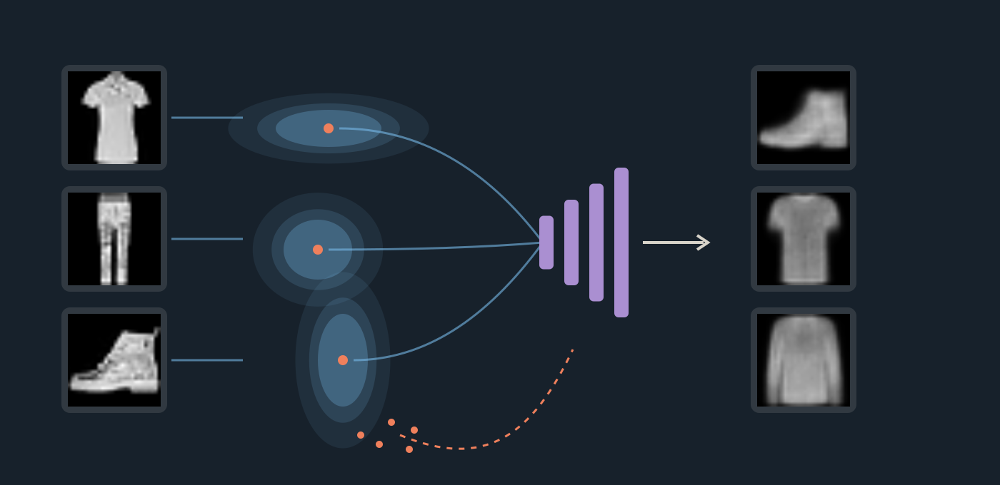

::: {.chapter-opening}
::: {.chapter-kicker}
PART VI · GENERATIVE REPRESENTATION LEARNING
:::
::: {.chapter-cover}
{fig-alt="Observed garments connect to Gaussian clouds; an independent prior path joins the shared decoder and produces actual model outputs."}
:::

An autoencoder reconstructs an image by first encoding it. Remove the image and the decoder has no prescribed starting point. A variational autoencoder supplies that missing contract: **draw a code from a known prior and decode it**, while learning from images through an approximate posterior.

These notes preserve all six sections of the approved lecture: its real model outputs, numerical exercises, gradient probes, implementation, and interactive experiments. They add the derivations and caveats that support the visual story. The [PDF technical review](index.pdf) is deliberately shorter: use it to revise the mathematical and programming contracts after working through this chapter.

[Lecture](../../lectures/11-variational-autoencoders/index.html) · [Runnable PyTorch model](../../lectures/11-variational-autoencoders/assets/vae_training.py) · [Experiment provenance](#experiment-provenance) · [Reading path](#reading-path)
:::

# From reconstruction to generation

## An input supplies a code, but not a sampling rule

The previous chapter's two-dimensional autoencoder has encoder $f$ and decoder $g$. For an observed image, $\hat x=g(f(x))$ is a complete computation. Its training objective scores those paired reconstructions; it does not specify a distribution from which to draw useful decoder inputs without an image.

{fig-alt="Eight held-out clothing images paired with their two-dimensional autoencoder reconstructions."}

Reconstructing a held-out image is generalization, but it still requires an input. To generate unconditionally we must supply a different source of codes. First consider sampling pixels directly.

{fig-alt="Real clothing above independently sampled pixel noise."}

A $28\times28$ array is not necessarily a plausible garment. Sleeves connect to torsos, shoes have coherent outlines, and background pixels occur together. Independent uniform pixels ignore these relationships. The issue is not randomness itself: we want a distribution that concentrates probability on structured images. Fashion-MNIST provides the concrete image distribution studied here [@xiao2017fashion].

## Test random codes in the ordinary autoencoder

A decoder already couples output pixels through a shared latent representation. Perhaps it can turn random codes into structure. The lecture tests this directly, using the first sixteen uniform draws inside the coordinate-wise 1st–99th percentile rectangle of 2,000 validation codes.

{fig-alt="Two-dimensional autoencoder scatter with sampled points inside a percentile rectangle."}

Predict which sampled locations are likely to produce useful images before inspecting the gallery.

{fig-alt="Sixteen unfiltered random-code autoencoder outputs."}

This is evidence about one model and one sampling proposal, not proof that every random AE code fails. The scatter is a finite validation sample, not a support boundary. An AE can be combined with a separately fitted latent density. Ordinary reconstruction training simply does not supply that density automatically.

## Specify the generative direction

A latent-variable model defines

$$
p_\theta(x,z)=p(z)p_\theta(x\mid z),\qquad
p_\theta(x)=\int p_\theta(x\mid z)p(z)\,dz.
$$

The prior supplies a sampling rule; the decoder learns a conditional observation distribution. Here $p(z)=\mathcal N(0,I_2)$. Generation follows $z\sim p(z)$, then $x\sim p_\theta(x\mid z)$. **The image is not an input to this path.** The decoder still had to learn from images [@kingma2014vae, §2.1].

```{mermaid}
flowchart LR
 P["Known prior p(z)"] --> Z["Sample z"] --> D["Learned decoder pθ(x|z)"] --> X["Image"]
```

Our galleries display the decoder's **mean pixel values**, not an additional observation-level sample. For a Bernoulli observation model those means are probabilities; drawing binary pixels is a separate operation. Fresh latent draws already change the displayed mean image.



The recorded preview has sixteen fixed-seed codes. Change the draw and observe what varies while the decoder remains fixed. This is not browser inference or training. It also is not a controlled AE–VAE quality comparison: the AE used six epochs and MSE; the preview VAE used ten epochs and the reconstruction-plus-KL surrogate developed below.

## Plausibility, diversity, and resemblance are different questions

{fig-alt="Generated means paired with nearest training images by pixel MSE."}

An unfamiliar output is not automatically novel. Pixel distance can miss perceptually similar copies, transformations can change MSE, and eight draws say little about rare behavior. This nearest-neighbor experiment is an auditable diagnostic, not proof against memorization. The manifest records the matching dataset indices and distances.

### Exercise: which path starts without an image?

Assume fixed trained networks and a deterministic decoder. Classify each path by whether it requires a newly supplied image and what limits its outputs: **A** encode a held-out image then decode; **B** draw from a finite bank of stored training codes then decode; **C** draw from a prior then decode. Pause for 90 seconds and separate “no new input” from “new latent locations.”

<details><summary>Worked solution</summary>

A needs an input and reconstructs that particular image. B needs no new image but only selects among a finite set of fixed decoded outputs. C also needs no image and can sample new latent locations, but useful outputs require compatibility between the prior and the learned decoder. A prior attached to an arbitrary decoder is not enough. The encoder's training role is the next question.

</details>

# From one code to a distribution

## Inference runs in the other direction

Generation starts with $z$; training data give us $x$. Which latent codes could explain a particular observed image? The model's posterior is

$$p_\theta(z\mid x)=\frac{p_\theta(x\mid z)p(z)}{p_\theta(x)}.$$

The marginal likelihood in its denominator generally requires an intractable latent integral. We therefore learn a tractable approximation $q_\phi(z\mid x)$, using shared encoder parameters $\phi$ across images. This is *amortized variational inference*: the encoder predicts the approximate posterior parameters in one forward pass rather than separately optimizing a variational distribution from scratch for every image.

```{mermaid}
flowchart LR
 X["Image x"] --> E["Shared encoder features"]
 E --> M["Mean μ(x)"]
 E --> V["Log variance v(x)"]
 M --> Q["qφ(z|x)"]
 V --> Q
 Q --> Z["Draw z"] --> D["Decoder"] --> R["Mean image"]
```

The ordinary AE maps $x$ to one point. The probabilistic encoder describes a distribution over possible codes, then a code is drawn. A two-dimensional Gaussian requires two means and two variances; those four parameters do **not** turn $z$ into a four-dimensional vector.

## Interpret location and spread through actual outputs

We use the diagonal Gaussian

$$q_\phi(z\mid x)=\mathcal N\!\left(\mu_\phi(x),\operatorname{diag}(\sigma_\phi^2(x))\right).$$

For a fixed image, diagonal covariance implies independent Gaussian coordinates. It does not imply that coordinates are independent after mixing the encoded distributions across many images. Nor does it claim the true model posterior is diagonal Gaussian.



Choose one of the first validation T-shirt, trouser, and boot examples. Repeated draws change $z$ and the decoded mean while the image, encoder, and decoder stay fixed. “Decode μ” uses the mean code; it does not average the displayed reconstructions. For a nonlinear decoder, $g_\theta(\mathbb E[z])$ is generally different from $\mathbb E[g_\theta(z)]$.

The T-shirt's measured mean is approximately $(-0.911,-1.446)$ and its standard deviations are $(0.0506,0.0573)$. The local map uses the same $\mu\pm0.30$ window for each example. Its radius-one and radius-two ellipses are Mahalanobis contours, not hard support boundaries or marginal 68%/95% probability intervals. A two-dimensional standard Gaussian has probability $1-e^{-r^2/2}$ inside radius $r$: about 39.3% and 86.5% for these two contours.

{fig-alt="Three image-conditioned Gaussians compared with radius-one and radius-two contours of a standard-normal prior."}

| Distribution | Depends on an observed image? | Role |
|---|---|---|
| $p(z)=\mathcal N(0,I)$ | No | Known source of codes for generation |
| $q_\phi(z\mid x)$ | Yes | Approximate posterior used to learn from or reconstruct an image |
| $p_\theta(z\mid x)$ | Yes | True model posterior; usually intractable |
| $p_\theta(x\mid z)$ | Depends on the code | Decoder's observation model |

### Exercise: read a diagonal Gaussian

For one image, let $\mu=(1,-0.5)$ and $\sigma=(0.25,1)$. Which coordinate varies more, and what are the two mean-plus/minus-one-standard-deviation intervals? Pause for 60 seconds; compare width rather than density height.

{fig-alt="A narrow Gaussian centered at one and a broader Gaussian centered at minus one half."}

<details><summary>Worked solution</summary>

The intervals are $[0.75,1.25]$ and $[-1.5,0.5]$. Coordinate two has four times the standard deviation and sixteen times the variance. Each marginal interval contains about 68.27% probability; both coordinates landing in their respective intervals has probability approximately $0.6827^2=46.6\%$. Neither interval is a hard limit. Density height is not probability: area under each complete curve is one.

</details>

## Map the distribution to a programming contract

The encoder shares a 784–256–128 feature extractor and has separate linear mean and log-variance heads. Write $v=\log\sigma^2$, so $\sigma=e^{v/2}$. Thus $v=0$ means standard deviation one, and $v=\log(0.0625)$ means standard deviation $0.25$. Exponentiation enforces positivity, but does not protect arbitrary large outputs from overflow.



For a batch of 32 images, features have shape `[32,128]`; `mu`, `logvar`, `sigma`, and a single latent draw have shape `[32,2]`. `Normal(mu, sigma)` takes **standard deviation**, not variance, as its scale. It has scalar Normal batch shape `[32,2]`; computing joint log density requires summing the latent axis or using `Independent(...,1)`.

The lecture first used `q.sample()` to inspect a forward draw. That is not the training recipe: it lacks the pathwise encoder gradient needed below. Distribution specification and differentiation behavior are separate contracts.

# Reconstruction, regularization, and the evidence bound

## First inspect the competing demands

The controlled ablation changes only the KL coefficient from zero to one, retaining architecture, initialization, data order, optimizer, ten-epoch budget, and evaluation noise. These are both probabilistic autoencoders; the zero-KL condition is not the earlier six-epoch deterministic AE.





| Condition | Held-out reconstruction cost | Mean KL to prior |
|---|---:|---:|
| Reconstruction only | 253.62 | 75.19 |
| Reconstruction + prior penalty | 255.48 | 6.23 |

Scores use the first 1,024 validation images and eight posterior draws each, summing reconstruction costs over pixels and averaging over draws and images. The reconstruction-only model scores slightly better on that component, but its code distribution is much less compatible with the chosen prior. The galleries ask us to inspect reconstruction and prior generation separately. One seed and a small gallery do not establish a general quality ranking.

## Average costs across possible codes

For a normalized observation likelihood define

$$R(x)=\mathbb E_{q_\phi(z\mid x)}[-\log p_\theta(x\mid z)].$$

With $L$ independent posterior draws, use the Monte Carlo estimate

$$\widehat R(x)=\frac1L\sum_{l=1}^{L}-\log p_\theta(x\mid z^{(l)}).$$

Score each decoded output against the same target **before** averaging. Scoring an averaged image answers a different question because the loss is nonlinear.



The first three recorded costs are 338.11, 341.37, and 339.67, averaging to approximately 339.72. These draws and costs belong to one fixed validation target; variation is sampling variation, not a change in weights.

For independent Bernoulli pixels with predicted means $\hat x_j$,

$$-\log p_\theta(x\mid z)=-\sum_{j=1}^{784}[x_j\log\hat x_j+(1-x_j)\log(1-\hat x_j)].$$

This is a proper binary-data likelihood when $x_j\in\{0,1\}$. Fashion-MNIST contains grayscale targets in $[0,1]$. The course uses this expression as a **soft-target BCE surrogate**; a floating-point target does not automatically define a normalized continuous observation likelihood. Consequently its measured reconstruction-plus-KL score must not be called an exact continuous-image evidence bound without an appropriate observation model.

## Derive the Gaussian prior penalty

For $p(z)=\mathcal N(0,I)$, define $K(x)=D_{\mathrm{KL}}(q_\phi(z\mid x)\|p(z))$. In one coordinate,

$$\log\frac{q(z)}{p(z)}=-\log\sigma-\frac{(z-\mu)^2}{2\sigma^2}+\frac{z^2}{2}.$$

Under $q$, $\mathbb E[(z-\mu)^2]=\sigma^2$ and $\mathbb E[z^2]=\mu^2+\sigma^2$. Taking the expectation and summing independent coordinates gives

$$K(x)=\frac12\sum_{j=1}^{d}\left(\mu_j^2+\sigma_j^2-1-\log\sigma_j^2\right)
=\frac12\sum_j(\mu_j^2+e^{v_j}-1-v_j).$$

The location contribution is $\mu_j^2/2$. The spread contribution is $\tfrac12(\sigma_j^2-1-\log\sigma_j^2)$, minimized at $\sigma_j=1$. Moving the mean cannot fix the spread term. Collapsing the variance to zero is penalized, not rewarded. This is the direction $\mathrm{KL}(q\|p)$ [@kingma2014vae, Appendix B].



At $\mu=1$, $\sigma=0.5$, the location cost is $0.5$ and spread cost is $0.318147$, totaling $0.818147$ nats. Matching the prior gives zero. This penalty acts on each image's distribution, not merely on a histogram of encoder means. It neither guarantees perfect aggregate prior matching nor requires every optimal posterior to equal the prior.

### Exercise: which proposal earns the lower total?

For $d=2$ and a standard-normal prior, compare A with reconstruction costs $(4,5,6)$, $\mu=(1,0)$, $\sigma=(0.5,1)$ against B with costs $(5,6,7)$, $\mu=(0,0)$, $\sigma=(1,1)$. Average the three per-draw costs, calculate KL, and minimize $J=R+K$. Pause for 90 seconds; use $\log0.25\approx-1.386$.

<details><summary>Worked solution</summary>

A has $R=5$ and $K=\tfrac12(1+0.25-1+1.386)=0.818$, giving $J\approx5.82$. B has $R=6$, $K=0$, and $J=6$. A wins because its reconstruction gain of one exceeds the extra KL cost. Minimizing KL alone would miss that tradeoff. These are illustrative per-image costs, not measured Fashion-MNIST scores.

</details>

## Why this particular sum? Derive the ELBO

Assume a valid normalized likelihood and suitable support/integrability. Bayes' rule gives

$$\log p_\theta(z\mid x)=\log p_\theta(x\mid z)+\log p(z)-\log p_\theta(x).$$

Substitute it into the posterior discrepancy:

$$\begin{aligned}
D_{\mathrm{KL}}(q_\phi(z\mid x)\|p_\theta(z\mid x))
&=\mathbb E_q[\log q_\phi(z\mid x)-\log p_\theta(z\mid x)]\\
&=K(x)+R(x)+\log p_\theta(x).
\end{aligned}$$

Therefore

$$\underbrace{R(x)+K(x)}_{J(x)}
=-\log p_\theta(x)+D_{\mathrm{KL}}(q_\phi(z\mid x)\|p_\theta(z\mid x)).$$

The nonnegative gap makes $J$ an **upper bound on negative log evidence**. Its negative is the **evidence lower bound**, $\mathcal L=-R-K\le\log p_\theta(x)$. We minimize $J$, or equivalently maximize $\mathcal L$ [@kingma2014vae, §2.2].

The two KLs have distinct jobs. The computable $\mathrm{KL}(q\|p(z))$ belongs to the objective. The generally intractable $\mathrm{KL}(q\|p_\theta(z\mid x))$ explains its gap from the evidence; we do not evaluate that gap during ordinary VAE training. The bound is tight if $q$ equals the true model posterior. A diagonal family and a shared encoder may prevent equality. With decoder parameters fixed, optimizing the bound improves the variational approximation; joint training also moves the decoder and its posterior.

### An exact model makes the bound visible

Let $z\in\{A,B\}$ with prior $(0.5,0.5)$, and let the likelihoods of observed $x=1$ be $(0.8,0.2)$. Then $p(x)=0.5$, $-\log p(x)=0.693147$, and Bayes' rule gives posterior $(0.8,0.2)$. For proposal $q=(w,1-w)$,

$$R=-w\log0.8-(1-w)\log0.2,\qquad
K=w\log(2w)+(1-w)\log(2(1-w)).$$



| $q(A\mid x)$ | $R$ | $K$ | $J$ | Posterior gap |
|---:|---:|---:|---:|---:|
| 0.5 | 0.916291 | 0 | 0.916291 | 0.223144 |
| 0.8 | 0.500402 | 0.192745 | 0.693147 | 0 |

The best proposal has nonzero KL **to the prior** but zero KL **to the true posterior**. Setting $w=0.95$ lowers reconstruction further while worsening the total. These are exact finite sums; a single Monte Carlo realization of a neural objective need not respect the bound numerically on every draw. A better ELBO also does not guarantee sharper images, novelty, or distributional coverage.

# Backpropagating through a random draw

## Separate forward sampling from the gradient estimator

Use a scalar decoder $\hat x=az$, target $x=2$, and reconstruction cost $\ell=\tfrac12(az-2)^2$. With seed 7, $\mu=1$, $v=0$, and $a=2$, `Normal(mu, sigma).sample()` produces $z\approx0.853205$. The decoder weight receives a gradient, but `mu.grad` and `logvar.grad` are `None`.



`None` means no accumulated derivative, not a measured zero. This API returns a draw without the pathwise connection to the distribution parameters. The experiment intentionally excludes KL: an encoder receiving KL gradients could otherwise mask the missing reconstruction path. In a real encoder, inspect parameter gradients or call `retain_grad()` on non-leaf outputs.

## Move randomness outside the learned transformation

Draw $\epsilon\sim\mathcal N(0,I)$ independently of encoder parameters and set

$$z=\mu_\phi(x)+\sigma_\phi(x)\odot\epsilon.$$

An affine transformation of a Gaussian is Gaussian. Its mean is $\mu$; the independent coordinates have variance $\sigma_j^2$. Thus the distribution is unchanged, while $z$ is now differentiable with respect to learned distribution parameters for fixed realized noise [@kingma2014vae, §2.4].



Move $\mu$ while holding noise fixed: $z$ shifts by the same amount. Move $\sigma$: the response changes sign with $\epsilon$. The demo's “worked value” selects $-1$ explicitly; it is not one of the eight seeded draws. For this backward pass,

$$\frac{\partial z_j}{\partial\mu_j}=1,\qquad
\frac{\partial z_j}{\partial\sigma_j}=\epsilon_j,\qquad
\frac{\partial z_j}{\partial v_j}=\frac12\sigma_j\epsilon_j.$$

For a differentiable reconstruction function $f_\theta$, the base distribution no longer depends on $\phi$:

$$\nabla_\phi\mathbb E_{\epsilon\sim\mathcal N(0,I)}[f_\theta(\mu_\phi+\sigma_\phi\odot\epsilon)]
=\mathbb E_\epsilon[\nabla_\phi f_\theta(\mu_\phi+\sigma_\phi\odot\epsilon)],$$

under the usual conditions permitting differentiation under the expectation. A draw gives a noisy gradient estimate, not the exact expected gradient. Fresh noise is normally used on each training forward pass; it is held fixed only when differentiating that realized computation or comparing finite differences. No trainable gradient is required through the random-number generator. This affine construction does not apply unchanged to arbitrary discrete distributions.

### Exercise: follow one draw backward

Given $\mu=1$, $\sigma=0.5$, $\epsilon=-1$, decoder $\hat x=2z$, target $2$, and $\ell=\tfrac12(\hat x-2)^2$, calculate $z$, $\ell$, and the gradients with respect to $\mu$ and $\sigma$. Pause for 90 seconds, keeping noise fixed.

<details><summary>Worked solution and log-variance extension</summary>

The forward values are $z=0.5$, $\hat x=1$, and $\ell=0.5$. The upstream derivative is $\partial\ell/\partial z=(1-2)2=-2$. Hence $\partial\ell/\partial\mu=-2$ and $\partial\ell/\partial\sigma=(-2)(-1)=2$. A small descent step raises $\mu$ and lowers $\sigma$; both raise $z$ for this negative draw.

Since $\sigma=e^{v/2}$, $\partial\ell/\partial v=2(\sigma/2)=0.5$. The implemented encoder predicts $v$, not $\sigma$ directly. KL contributes additional derivatives $\partial K/\partial\mu=\mu$ and $\partial K/\partial v=(e^v-1)/2$. The sampled reconstruction direction need not be the exact expected-loss direction. A finite-difference test must use the same noise at both perturbed parameter values.

</details>

## Verify the repaired path

Replace `sample()` with `mu + sigma * torch.randn_like(mu)`, or use `Normal(mu,sigma).rsample()` as an alternative. With fresh leaf tensors and the seed reset once for each comparison, the executed CPU probe gives:

| Draw mechanism | $z$ | Loss | $\mu$ gradient | $v$ gradient | $a$ gradient |
|---|---:|---:|---:|---:|---:|
| `sample()` | 0.853205 | 0.043098 | None | None | −0.250493 |
| Manual reparameterization | 0.853205 | 0.043098 | −0.587180 | 0.043098 | −0.250493 |
| `rsample()` | 0.853205 | 0.043098 | −0.587180 | 0.043098 | −0.250493 |

The forward distribution did not change; the gradient path did. Exact numerical agreement here is a recorded CPU check, not a promise across library versions, devices, or RNG consumption patterns. Avoid detaching the learned parameters or sampled code, converting the loss to a Python number before backward, or training under `no_grad`. The [executable gradient probe](../../lectures/11-variational-autoencoders/assets/check_reparameterization.py) also verifies fixed-noise finite differences. See the [official PyTorch pathwise-derivative documentation](https://docs.pytorch.org/docs/stable/distributions.html#pathwise-derivative).

# Building, training, and inspecting the VAE

## Assemble the same architecture

The decoder maps $2\to128\to256\to784$, with ReLU between hidden layers, sigmoid output, and reshape to `[B,1,28,28]`. The forward method returns the reconstruction and both encoder parameters because the objective needs all three.



| Stage | Tensor shape for $B=32$ |
|---|---|
| Image | `[32,1,28,28]` |
| Shared encoder features | `[32,128]` |
| Mean, log variance, noise, and code | `[32,2]` each |
| Decoder mean | `[32,1,28,28]` |
| Per-image reconstruction and KL | `[32]` each |
| Batch objective | Scalar |

## Reduce within an image, then across images



`reduction='none'` retains all pixel costs. `flatten(1).sum(1)` sums the non-batch axes; the KL sums only latent coordinates. Each term is now `[B]`, so their addition pairs costs for the same image. Only then take the batch mean.

Default mean BCE would average over both images and 784 pixels. If KL were still summed over coordinates and averaged over images, reconstruction would be divided by 784 while KL stayed unchanged—an unintended 784-fold relative increase in KL weight. A constant scaling of the whole objective is different from independently changing term reductions. For epoch logging, weight each batch mean by its batch size before averaging, so a smaller final minibatch is not overrepresented.

### Exercise: duplication and batch reduction

Two images have $(R,K)=(2,0.5)$ and $(4,1.5)$. Find the batch scalar and determine whether duplicating both already computed outputs changes it. Pause for 45 seconds.

<details><summary>Worked solution</summary>

$J=[(2+0.5)+(4+1.5)]/2=4$. Duplicating the cost pairs gives four totals $(2.5,5.5,2.5,5.5)$, still averaging to four. Hold outputs fixed for this test: a fresh stochastic forward pass can change a Monte Carlo estimate even when inputs repeat. The executable check duplicates reconstructions and Gaussian parameters along with the targets to isolate reduction semantics.

</details>

## One optimizer step updates both networks

Create the model and Adam optimizer once, outside the minibatch loop. Recreating Adam each batch would discard its accumulated state.



The executed 32-image smoke check, with initialization seed 113 and noise seed 811, records reconstruction 545.7927, KL 0.0070, and total 545.7997 **before the first update**. Reconstruction gradients alone reach both encoder heads (weight-gradient norms approximately 0.5338 and 0.9730); every parameter tensor changes after one step. These are diagnostic initial values, not trained quality targets.

The [runnable script](../../lectures/11-variational-autoencoders/assets/vae_training.py) includes the complete dataset split and training loop. It checks shapes, finiteness, reduction equivalence, duplication invariance, both reconstruction gradient paths, parameter updates, and stochastic evaluation forward passes. Rendering the site never trains a network. Example commands, after installing PyTorch/torchvision and placing Fashion-MNIST locally:

```bash
python vae_training.py --data /path/to/data --check
python vae_training.py --data /path/to/data --epochs 10 --output /tmp/course-vae.pt
```

The simpler composed constructor consumes initialization RNG differently from the original evidence generator, which constructed an extra temporary autoencoder. Equal seeds therefore do not mean identical initial weights across those implementations. The recorded visual evidence uses the original checkpoint, loaded by equivalent parameter-name mapping when needed.

## Choose the output path intentionally



```python
model.eval()
with torch.no_grad():
    mu, logvar = model.encoder(x)
    sigma = (0.5 * logvar).exp()
    mean_image = model.decoder(mu)
    posterior_image = model.decoder(mu + sigma * torch.randn_like(mu))
    z_prior = torch.randn(32, 2, device=next(model.parameters()).device)
    generated_images = model.decoder(z_prior)
```

Mean-code reconstruction is deterministic for this fixed MLP, but it is not generally the expected decoded image. Posterior draws depend on $x$; prior draws do not. The lecture's `randn_like(mu)` prior example reused only shape, dtype, and device, not numerical values from $\mu$. The standalone prior line above makes the lack of an image requirement explicit.

`eval()` changes the behavior of modules such as Dropout and BatchNorm; this MLP has neither. It does not suppress explicit `randn_like` calls. `no_grad()` disables graph recording, but does not set evaluation mode or stop randomness. The model's normal forward method still samples in evaluation mode. Distinguish these settings from deliberately choosing the mean-code path.

# Sampling, interpolation, and limitations

## Walk between encoded examples

For endpoint means $\mu_A,\mu_B$, interpolate

$$z(t)=(1-t)\mu_A+t\mu_B,\quad 0\le t\le1,$$

and decode each code with unchanged weights and no extra noise. The first validation T-shirt, trouser, and boot define two paths, each with all 21 recorded positions preserved.



The scatter shows actual means for the first 1,024 validation images, not posterior samples or a prior-density estimate. Labels color the display but did not train the VAE. Even endpoint decoded means need not equal the input thumbnails. A straight path between posterior means is not an unconditional prior sample and is not a representative generation evaluation.

The network's continuous operations produce continuous pixel values as the code moves. Recognition is a different property: the T-shirt-to-boot path passes through ambiguous shapes. Continuous pixels do not guarantee meaningful objects throughout the path. Axes are coordinates, not certified semantic attributes; the objective does not guarantee disentanglement.

## Keep the samples you did not select



These are the first sixteen standard-normal draws at seed 619, decoded by the same section-2 checkpoint. All outputs are retained. Inspect soft edges, ambiguity, variation, and absent appearances before making a claim. Sixteen images cannot establish class coverage, novelty, or a distribution-level quality ranking.

Pixelwise mean predictions can average unresolved alternatives, but this experiment does not isolate that cause from a two-dimensional bottleneck, modest MLP, or ten-epoch optimization budget. Do not present every defect as a universal VAE limitation. Sampling binary pixels would add pixel noise, not demonstrate recovered detail. For comparisons, hold evaluation inputs and prior codes fixed, report reconstruction and KL separately, and repeat across seeds before generalizing.

## Test whether image-specific codes matter

Keep the trained weights and decoded posterior samples fixed, but cyclically reassign each image's code to another image. This breaks the pairing while retaining the set of outputs.



| Probe on 1,024 held-out images, 8 draws each | Reconstruction cost |
|---|---:|
| Correct image/code pairing | 255.4250 |
| Cyclically reassigned pairing | 836.5840 |

The mean analytic KL is 6.2336. Costs use pixel sums followed by draw/image averages, with noise seed 620. The gallery shows the first four targets and first draw; reassignment occurs across all 1,024 images, not just the four thumbnails. This experiment differs slightly from the earlier reconstruction estimate because it uses different evaluation noise.

The large cost increase shows that image-specific codes help reconstruct their own images in this checkpoint. It does not certify semantic disentanglement, perceptual quality, or full use of every coordinate.

### Posterior collapse is a different failure

If $q_\phi(z\mid x)\approx p(z)$ for every image, a draw from $q$ carries little information about which image supplied it. A familiar failure has near-zero KL and a decoder that largely ignores $z$. Bowman et al. document this behavior for sequence VAEs with powerful decoders [@bowman2016generating, §3.1]; their language-model evidence is not a second trained Fashion-MNIST condition here.

For this unconditional independent-pixel decoder, ignoring its only image-specific input would give the same predicted mean for all codes. Near-zero KL together with little reassignment effect is a warning sign. Neither observation alone is a complete diagnosis; positive KL can reflect aggregate mismatch rather than useful information, and this test cannot exclude every partial-collapse phenomenon. The measured pairing penalty is evidence against complete loss of image-specific information here. **Blurry outputs do not by themselves diagnose posterior collapse.**

## Close the loop with a task specification

You have the trained VAE and no observed image. Produce 32 new $28\times28$ mean images. State the code source, the trained modules that must run, and an evaluation check together with its limitation. Pause for 60 seconds.

<details><summary>Worked solution</summary>

Draw $z\sim\mathcal N(0,I_2)$ with tensor shape `[32,2]` on the model's device. Run only the fixed decoder to obtain `[32,1,28,28]`. The encoder is not required for this generation path. Inspect fixed, unfiltered prior draws and failures; a small gallery cannot establish coverage or novelty. Held-out reconstruction checks a different behavior, latent reassignment tests information use, and pixel nearest neighbors only screen for certain forms of resemblance.

Training made the path possible: image-conditioned posterior samples taught the decoder, reconstruction preserved useful information, KL encouraged compatibility with the prior, and reparameterization connected reconstruction gradients to the encoder. Adam updated both networks. At generation time, replace the image-conditioned code source with the prior.

</details>

| Learning frame | What the complete VAE specifies |
|---|---|
| Data | Fashion-MNIST images; class labels only for interpreting evaluation |
| Hypothesis | A prior and decoder observation model, with a learned approximate posterior |
| Loss | Expected reconstruction plus prior KL; the likelihood caveat matters |
| Optimization | Reparameterized stochastic gradients and joint encoder/decoder updates |
| Evaluation | Separate checks of reconstruction, latent information use, and prior-generated outputs |

# Experiment provenance and reproducibility {#experiment-provenance}

The official Fashion-MNIST training set is split into 50,000 training and 10,000 validation images by a seed-41 permutation. Validation images never update weights. The demonstrations are intentionally small and two-dimensional so their geometry is inspectable. They are not competitive generative-model benchmarks.

| Evidence | Protocol and scope |
|---|---|
| Section 1 | Project 3 AE: 6 epochs, MSE; separate VAE preview: 10 epochs, BCE surrogate + KL. This comparison is motivational, not controlled. |
| Sections 2, 5 viewer, 6 | One unchanged 10-epoch checkpoint: initialization 113, Adam 0.001, batch 256. SHA-256 begins `07171c50244c10a8`. |
| Section 3 | Controlled zero-versus-one KL ablation; common training protocol and evaluation noise. First 1,024 held-out images × 8 draws. |
| Section 4 | Independent scalar CPU autograd probes, seed 7; eight graph noise values from seed 73; worked noise −1 is deliberately chosen. |
| Section 5 training check | Fresh composed model, initial seed 113/noise 811, first 32 training images. Not the trained checkpoint. |
| Section 6 | First examples by class; all 21 positions on each path; first 16 prior draws seed 619; reassignment probe seed 620. |

The section-1 manifest records PyTorch 2.14; the later checkpoint and probes record 2.13. Seeds alone cannot establish numerical identity across versions and construction orders. The [source README](../../lectures/11-variational-autoencoders/assets/README.md), saved manifests, and generation scripts retain exact seeds, indices, costs, software versions, selections, and checkpoint hashes. The site stores recorded outputs, not model checkpoints, and never invokes training during rendering.

[Generation evidence script](../../lectures/11-variational-autoencoders/assets/build_generation_evidence.py) · [Posterior evidence](../../lectures/11-variational-autoencoders/assets/build_posterior_evidence.py) · [Loss ablation](../../lectures/11-variational-autoencoders/assets/build_loss_evidence.py) · [Gradient checks](../../lectures/11-variational-autoencoders/assets/check_reparameterization.py) · [Runnable VAE](../../lectures/11-variational-autoencoders/assets/vae_training.py) · [Latent evidence](../../lectures/11-variational-autoencoders/assets/build_latent_evidence.py)

# An annotated reading path {#reading-path}

1. **Kingma and Welling, Auto-Encoding Variational Bayes** [@kingma2014vae]. Read §2.1 for the latent generative model, §2.2 for the evidence-bound identity, §2.4 for pathwise gradients, and Appendix B for diagonal-Gaussian KL. Match each derivation to the chapter's numerical examples before following the general algorithm.
2. **Fashion-MNIST** [@xiao2017fashion]. Use the dataset paper and repository to understand what the small grayscale experiment represents. Do not generalize its gallery quality to high-resolution generation.
3. **Bowman et al., Generating Sentences from a Continuous Space**, §3.1 [@bowman2016generating]. Read specifically for the posterior-collapse failure mechanism. The application and decoder differ from our experiment; we use it to interpret diagnostics, not to rank this image model.
4. **[PyTorch distributions](https://docs.pytorch.org/docs/stable/distributions.html#pathwise-derivative)**. Check `sample`, `rsample`, Normal scale, and batch/event semantics against the executable gradient probe. **[Module.eval](https://docs.pytorch.org/docs/stable/generated/torch.nn.Module.html#torch.nn.Module.eval)** and **[no_grad](https://docs.pytorch.org/docs/stable/generated/torch.no_grad.html)** describe separate inference controls.

## References {.unnumbered}

::: {#refs}
:::
