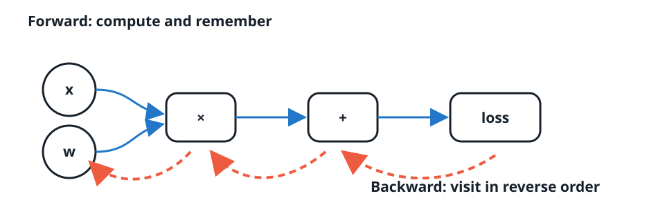

:::{.project-brief}
<strong>Duration:</strong> Two sessions × 1h30
<strong>Mode:</strong> Individual
<strong>Format:</strong> One progressive Jupyter notebook
<strong>Deliverable:</strong> Passing checks, trained classifier, and short reflection
:::

## The challenge

You have already used a neural network as a collection of forward transformations. Now you will build the missing mechanism: an engine that records a scalar computation, traverses it backward, and computes every required gradient.

The final result is deliberately concrete. Your own `Value`, `Neuron`, `Layer`, and `MLP` classes will train a nonlinear classifier on two interlocking moons. Dataset generation, plotting, the training loop, and reporting are provided. The mathematical machinery is yours.

## Open or download

[Open notebook](starter/autograd_from_scratch.ipynb){.btn .btn-primary}

<a class="btn btn-secondary" href="https://raw.githubusercontent.com/anassBelcaid/deeplearning/redesign/quarto-2026/quarto-site/projects/03-autograd/starter/autograd_from_scratch.ipynb" download="autograd_from_scratch.ipynb">Download the notebook</a>

[Open in Google Colab](https://colab.research.google.com/github/anassBelcaid/deeplearning/blob/redesign/quarto-2026/quarto-site/projects/03-autograd/starter/autograd_from_scratch.ipynb){.btn .btn-secondary}

## What does `_children` mean?

When an operation creates a new `Value`, the result remembers the input objects that produced it. `_children` is therefore not a list of numerical children. It is the set of immediate predecessor **objects** in the computation graph.

{fig-alt="Values a and b feed an addition that creates c. The c object stores a and b as its children." width="100%"}

This small piece of memory lets the engine reconstruct dependencies without a separate graph data structure. `_backward` stores the local rule associated with the operation; `grad` accumulates messages arriving through every downstream path.

## The backward algorithm

The forward pass computes values and creates edges. Backpropagation must process a node only after all nodes that use it have sent their gradient contributions. A reverse topological order guarantees exactly that.

{fig-alt="Forward evaluation proceeds toward the loss and the backward traversal proceeds from the loss to its ancestors." width="100%"}

## What you implement

1. Store scalar data, gradients, predecessors, and the creating operation.
2. Build graph-aware addition and multiplication.
3. Write local backward rules using gradient accumulation.
4. Add powers, subtraction, division, `exp`, `log`, `tanh`, `sigmoid`, and ReLU.
5. Construct a topological ordering and execute the complete backward pass.
6. Implement `Neuron`, `Layer`, and `MLP` composition.
7. Express binary cross-entropy using only your `Value` operations.

Every TODO is followed by a small public check. A numerical gradient check independently tests the complete engine before it is trusted inside a network.

## Two-session rhythm

| Session | Work | Checkpoint |
|---|---|---|
| **A · Build the engine** | graph memory, arithmetic, local rules, accumulation, reverse traversal | scalar checks and numerical gradients pass |
| **B · Make it learn** | neuron, layer, MLP, BCE, two-moons classifier | loss falls and the learned nonlinear boundary is visible |

## Provided infrastructure

The notebook supplies dataset generation, deterministic initialization hooks, graph inspection, numerical checking, plotting, the training harness, and decision-boundary visualization. Students write the mechanisms that define the model and its gradients; routine experimental plumbing remains readable but complete.

:::{.callout-important}
Restart the kernel and run every cell before submission. A final accuracy without the passing engine checks, implementation, and interpretation is incomplete.
:::

## References and inspiration

- [Karpathy’s micrograd](https://github.com/karpathy/micrograd) — the central inspiration for the scalar engine.
- [The spelled-out intro to neural networks and backpropagation](https://www.youtube.com/watch?v=VMj-3S1tku0) — Karpathy’s progressive construction.
- [CS231n backpropagation notes](https://cs231n.github.io/optimization-2/) — computation-graph and gradient-flow intuition.
