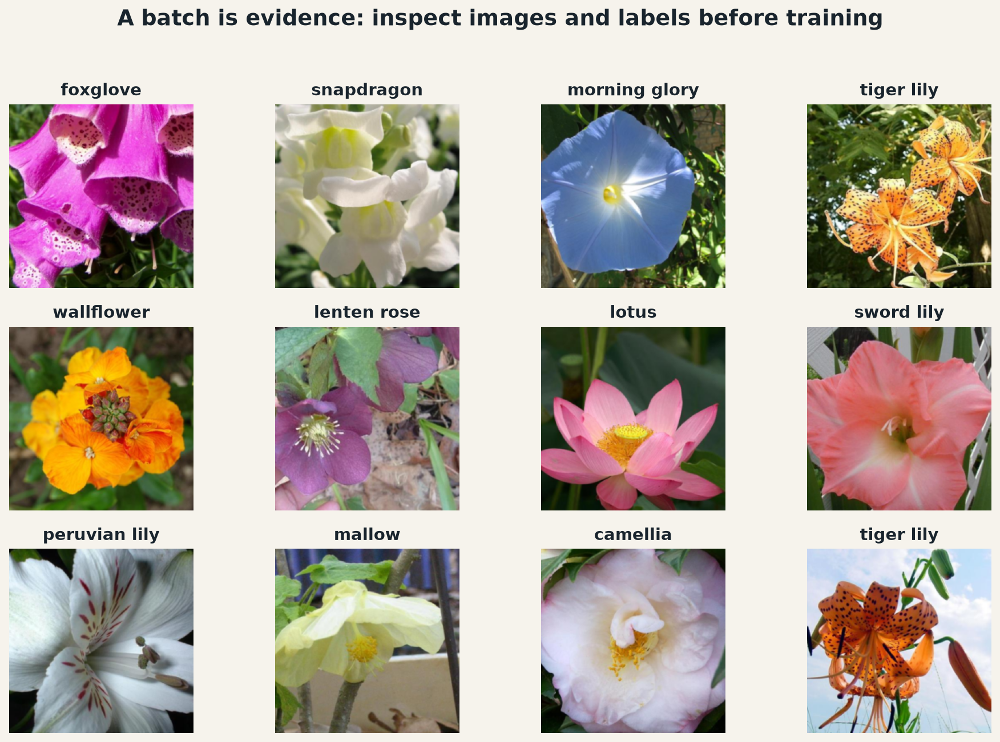

:::{.project-brief}
<span><strong>Duration:</strong> Two weeks</span>
<span><strong>Mode:</strong> Individual</span>
<span><strong>Format:</strong> Guided Jupyter notebook with immediate checks</span>
<span><strong>Deliverable:</strong> Executed notebook, comparison table, and evidence-based conclusion</span>
:::

## The problem

Oxford Flowers 102 asks a model to distinguish 102 flower categories from photographs with changes in scale, pose, lighting, and background. Keep its official `train`, `val`, and `test` splits unchanged: the purpose here is to study architecture, not sampling policy.

```{mermaid}
flowchart LR
  A[Flowers102] --> B[Dataset + transforms]
  B --> C[DataLoaders]
  C --> D[Visual batch audit]
  D --> E[Student VGG11]
  D --> F[DenseNet from components]
  E --> G[Verified comparison]
  F --> G
```

<a class="btn btn-primary" href="starter/flower_architectures.ipynb?download=1">Open notebook</a>

<a class="btn btn-secondary" href="/projects/05-flower-architectures/starter/flower_architectures.ipynb?download=1" download="flower_architectures.ipynb">Download notebook</a>

[Open in Google Colab](https://colab.research.google.com/github/anassBelcaid/deeplearning/blob/redesign/quarto-2026/quarto-site/projects/05-flower-architectures/starter/flower_architectures.ipynb){.btn .btn-secondary}

## Part 1 · Make the data visible

1. Define ImageNet-compatible training and evaluation transforms.
2. Instantiate the official Flowers102 splits with `torchvision.datasets.Flowers102`.
3. Build reproducible `DataLoader` objects.
4. Visualize a labeled batch and verify tensor shape, range, and class names.

The notebook shows the expected visual result. This is an audit: students should see the images the model receives before trusting a training loop.

{fig-alt="Twelve labeled flower photographs arranged in a three by four grid."}

## Part 2 · Reconstruct and reuse VGG11

Implement configuration A from the VGG paper, preserving TorchVision's module names and layer order. The checker verifies feature shapes, layer counts, parameter count, and every `state_dict` key. A correct implementation must then load the official weights with `strict=True` and reproduce the reference model's logits before its final layer is adapted to 102 classes.

## Part 3 · Build DenseNet one verified component at a time

```{mermaid}
flowchart LR
  X[Input features] --> L1[DenseLayer 1]
  X --> L2[DenseLayer 2]
  L1 --> L2
  L2 --> B[DenseBlock]
  B --> T[Transition]
  T --> N[CompactDenseNet]
  N --> P[Parameter audit + learning step]
```

Each implementation is checked before it becomes a dependency:

1. `DenseLayer`: bottleneck, new features, and concatenation;
2. `DenseBlock`: channel growth across a `ModuleList`;
3. `Transition`: compression and spatial downsampling;
4. `CompactDenseNet`: stem, alternating stages, global pooling, and classifier;
5. independent analytical parameter count and one real optimizer step.

## Evidence to submit

- all public checks passing after a fresh kernel restart;
- one readable Flowers102 batch visualization;
- proof that the student VGG11 accepts official weights strictly;
- DenseNet shape and parameter audits;
- training/validation curves for the adapted VGG and compact DenseNet;
- a comparison table and a short conclusion separating transfer learning, capacity, and generalization.

## Assessment

| Evidence | Weight |
|---|---:|
| Dataset, transforms, loaders, and batch audit | 15% |
| Exact VGG11 reconstruction and official-weight verification | 25% |
| DenseLayer, DenseBlock, and Transition | 25% |
| Complete DenseNet and independent parameter checker | 20% |
| Experiment quality and interpretation | 15% |

## Primary references

- [Oxford Visual Geometry Group · 102 Category Flower Dataset](https://www.robots.ox.ac.uk/~vgg/data/flowers/102/)
- [TorchVision · `Flowers102`](https://docs.pytorch.org/vision/stable/generated/torchvision.datasets.Flowers102.html)
- [Simonyan & Zisserman · Very Deep Convolutional Networks](https://arxiv.org/abs/1409.1556)
- [TorchVision · VGG source and weights](https://docs.pytorch.org/vision/stable/_modules/torchvision/models/vgg.html)
- [Huang et al. · Densely Connected Convolutional Networks](https://arxiv.org/abs/1608.06993)
- [TorchVision · DenseNet source](https://docs.pytorch.org/vision/stable/_modules/torchvision/models/densenet.html)
