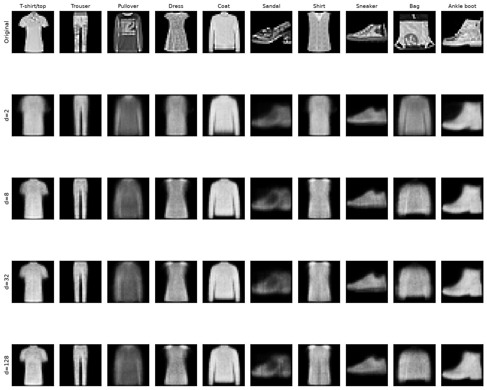
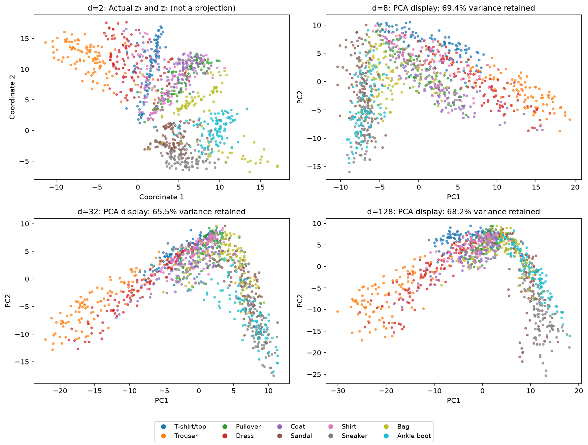
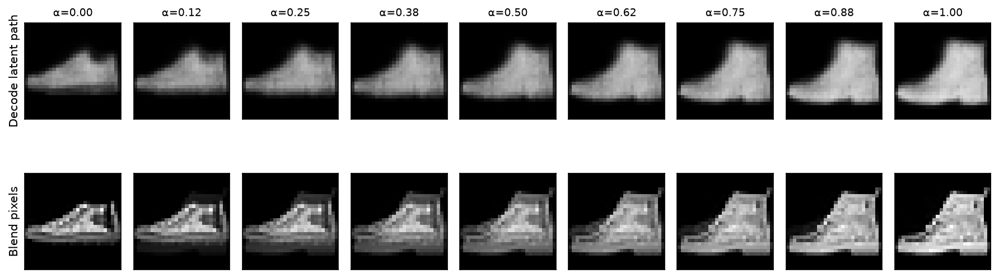

:::{.project-brief}
<span><strong>Dataset:</strong> Fashion-MNIST</span>
<span><strong>Framework:</strong> PyTorch, CPU or GPU</span>
<span><strong>Prerequisite:</strong> Chapter 10</span>
<span><strong>Deliverable:</strong> Executed notebook and visual report</span>
:::

## Your investigation

A shoe can survive compression while losing its laces. A pullover and a coat can become neighbors even though their labels differ. Two encoded garments can produce a smooth transition that passes through an implausible object. Your project is to make these effects visible, measure them, and explain them.

Train one autoencoder family on Fashion-MNIST [@xiao2017fashion], varying only the prescribed latent width and keeping the remaining architecture and training budget fixed. Investigate three questions: **what survives compression, which examples become neighbors, and what happens between two objects?**

[Read the notebook and expected results](reading.qmd){.btn .btn-primary}

<a class="btn btn-secondary" href="starter/latent_laboratory.ipynb?download=1" download="latent_laboratory.ipynb">Download student notebook</a>

[Open in Google Colab](https://colab.research.google.com/github/anassBelcaid/deeplearning-course/blob/main/quarto-site/projects/06-latent-laboratory/starter/latent_laboratory.ipynb){.btn .btn-secondary}

The reading version includes the same task sequence, code skeletons, public checks, and measured example outputs. The downloadable notebook embeds the expected figures so they remain available when opened locally or in Colab. Run your own experiments and submit your own outputs; matching the reference images pixel-for-pixel is not required.

## The model and experimental contract

```{mermaid}
flowchart LR
    X["Image batch<br>N × 1 × 28 × 28"] --> E["Encoder<br>784 → 256 → 128 → d"]
    E --> Z["Code<br>N × d"]
    Z --> D["Decoder<br>d → 128 → 256 → 784"]
    D --> R["Reconstruction<br>N × 1 × 28 × 28"]
```

This graph shows the information path. The `Autoencoder` object owns two `nn.Sequential` modules, `encoder` and `decoder`; each owns its parameters. `models[d]` holds a reference to a different trained autoencoder for each width. The notebook diagrams dataset references and batch flow before you implement the model.

Use ReLU in hidden layers, a linear latent layer, and Sigmoid at the output. Minimize mean squared error over every image and pixel. Class labels are used for inspection, never for reconstruction training.

| Setting | Required comparison |
|---|---|
| Latent widths | (d\in\{2,8,32,128\}) |
| Split | 50,000 training / 10,000 validation from the official training split |
| Final test | Official 10,000-image test split; evaluate your selected model once |
| Training | Six epochs for every width, Adam, learning rate (10^{-3}), batch size 256 |
| Reproducibility | Seed 41; fresh model, optimizer, and shuffled-loader generator per width |
| Inspection set | Fixed 1,000 validation examples, 100 per class |

Use one epoch while debugging, then run the full comparison at six. CPU is supported; a GPU is helpful. Training time varies by device. No marks depend on speed. Changing width also changes parameter count, which you must report rather than claim is held constant.

## Investigation 1 · What survives compression?

Implement the autoencoder, reconstruction loss, and dimension sweep. Compare the **same images** in every gallery row, plot validation learning curves and final error against (d), and discuss a visible failure as well as an improvement.

{fig-alt="Original Fashion-MNIST validation garments followed by reconstructions from four independent autoencoders."}

The expected trend is a large initial benefit followed by smaller gains, but strict monotonicity is not guaranteed. Finite training and different random parameter arrays can alter the ordering. Your explanation should connect the measurements to lost or recovered details.

Compare (d/784) as a coordinate fraction, then distinguish it from storage: 32 float32 coordinates occupy 128 bytes before metadata and decoder cost, whereas a raw uint8 image occupies 784 bytes. The project studies a representation bottleneck; it does not implement an image codec.

## Investigation 2 · What becomes a neighbor?

Plot actual coordinates for (d=2), then use provided PCA displays for higher-dimensional codes. Report how much variance each PCA display retains. Color by labels only after encoding.

{fig-alt="Four latent plots colored by garment class, distinguishing the actual two-dimensional code from PCA views."}

Implement nearest-neighbor retrieval using **all (d) coordinates**, not the two displayed coordinates. Choose two anchors from different classes, inspect their seven closest neighbors at (d=2) and (d=32), and compare visual similarity with label agreement. The notebook's anchor selector highlights those neighbors on the display and shows originals beside reconstructions.

PCA can hide differences. Independently trained codes can rotate and change scale. Avoid interpreting absolute axis directions or comparing raw distance magnitudes across models as if the coordinate systems were shared.

## Investigation 3 · What lies between two objects?

Implement

$$
z_\alpha=(1-\alpha)f_\theta(x)+\alpha f_\theta(y),\qquad
\hat x_\alpha=g_\phi(z_\alpha).
$$

Select one same-class pair and one different-class pair. Move the provided alpha slider, then export nine-step paths for (d=2) and your selected larger dimension. Place direct pixel blending, ((1-\alpha)x+\alpha y), beside the latent result.

{fig-alt="Nine alpha values comparing decoded latent interpolation with pixel blending between a sneaker and an ankle boot."}

Show the original endpoints separately. At alpha 0 and 1, the latent path gives **reconstructions** of the endpoints; the pixel path gives the original images. Identify two intermediate alpha values and describe what changes in silhouette or detail. A failed or ambiguous transition is useful evidence, not a reason to hide the result.

## Student work and provided infrastructure

| You implement | Provided and explained |
|---|---|
| Parameterized encoder, decoder, and forward pass | Dataset download, split, batch loaders |
| MSE loss with a shape check | Optimizer loop, held-out evaluation, checkpoint export |
| Independent dimension sweep | Plotting and comparison tables |
| Nearest neighbors in the full latent space | Encoding, PCA projection, anchor controls |
| Latent interpolation with tested endpoints | Alpha slider, pixel-blend baseline, figure export |

Each task has a public behavioral check. Passing shape tests is necessary but does not establish that a representation is useful. Your figures and written explanations supply that evidence.

## Submission and assessment

Submit the notebook after a fresh **Restart & Run All**, together with an approximately 2–4 page report. Include configuration and validation results, the two neighbor investigations, same-class and cross-class paths at two dimensions, a justified choice of (d), and its final test error. Cite any reused code or external material. Expected-result figures are reference evidence and do not replace your own outputs.

| Criterion | Weight |
|---|---:|
| Model, loss, shapes, and gradient checks | 20% |
| Independent sweep, fixed-image comparison, and validation reasoning | 25% |
| Actual/projection distinction and full-space neighbor investigation | 20% |
| Interpolation correctness, pixel baseline, and visual explanation | 25% |
| Reproducibility, final held-out evaluation, and stated limitations | 10% |

This assignment requires the mechanisms already taught in Chapter 10. It does not require VAEs, GANs, distribution matching, or implementation of PCA. Future lecture topics can be explored voluntarily but do not replace the three required investigations.

## Reading and reference evidence

- [Chapter 10 notes](../../notes/10-autoencoders-latent-representations/index.qmd): loss, bottlenecks, latent geometry, and sampling caveats.
- [Full reading notebook with expected results](reading.qmd): inspect the workflow before implementing it.
- [Recorded reference metrics](assets/expected/metrics.json): split, seed, software/device, per-epoch losses, and parameter counts.
- [Fashion-MNIST paper](https://arxiv.org/abs/1708.07747): dataset provenance [@xiao2017fashion].
- [Deep Learning, Chapter 14](https://www.deeplearningbook.org/contents/autoencoders.html): broader context [@goodfellow2016deep].

Reference figures are generated from the completed project implementation with the prescribed split, rather than copied from the lecture's different experiment. Small numerical differences across environments are expected. The reading notebook is rendered from stored results; building the site never downloads a dataset or trains a model.
